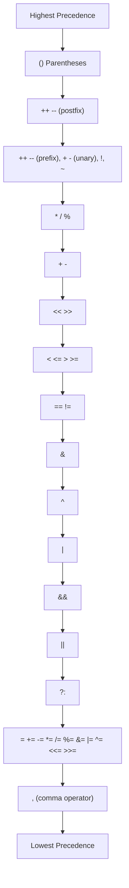

# Arduino Operators

## Introduction

Operators are special symbols that perform specific operations on one, two, or three operands and then return a result. In Arduino programming (based on C++), operators are essential tools that allow you to manipulate variables and values to create functional programs. Understanding operators is a fundamental step in mastering Arduino programming.

This guide will walk you through the various types of operators available in Arduino, how they work, and how to use them effectively in your projects.

## Types of Operators

Arduino programming supports several categories of operators:

<div className="operator-categories">

1. **Arithmetic Operators** - For performing basic mathematical operations
2. **Comparison Operators** - For comparing two values
3. **Logical Operators** - For performing logical AND, OR, and NOT operations
4. **Bitwise Operators** - For manipulating individual bits in a byte
5. **Compound Operators** - Shortcuts that combine an operation with assignment
6. **Miscellaneous Operators** - Special operators with unique functions

</div>

Let's explore each category in detail.

## Arithmetic Operators

Arithmetic operators perform basic mathematical operations on variables and values.

| Operator | Description        | Example |
|----------|--------------------|---------|
| `+`      | Addition           | `a + b` |
| `-`      | Subtraction        | `a - b` |
| `*`      | Multiplication     | `a * b` |
| `/`      | Division           | `a / b` |
| `%`      | Modulo (remainder) | `a % b` |

### Example: Basic Arithmetic

```cpp
int a = 10;
int b = 3;

int sum = a + b;        // 13
int difference = a - b; // 7
int product = a * b;    // 30
int quotient = a / b;   // 3 (integer division)
int remainder = a % b;  // 1
```

### Important Note on Integer Division

When dividing integers in Arduino, the result is also an integer, with the decimal part truncated (not rounded). If you need decimal precision, use the `float` data type:

```cpp
int a = 10;
int b = 3;
float decimalResult = (float)a / b;  // 3.333...
```

## Comparison Operators

Comparison operators compare two values and return either `true` (1) or `false` (0).

| Operator | Description              | Example  |
|----------|--------------------------|----------|
| `==`     | Equal to                 | `a == b` |
| `!=`     | Not equal to             | `a != b` |
| `<`      | Less than                | `a < b`  |
| `>`      | Greater than             | `a > b`  |
| `<=`     | Less than or equal to    | `a <= b` |
| `>=`     | Greater than or equal to | `a >= b` |

### Example: Comparison in Conditionals

```cpp
int temperature = 25;

if (temperature > 30) {
  digitalWrite(FAN_PIN, HIGH);  // Turn on the fan
} else if (temperature < 20) {
  digitalWrite(HEATER_PIN, HIGH);  // Turn on the heater
} else {
  // Temperature is comfortable, do nothing
  digitalWrite(FAN_PIN, LOW);
  digitalWrite(HEATER_PIN, LOW);
}
```

## Logical Operators

Logical operators work with boolean values and are often used in conditional statements.

| Operator | Description | Example    |
|----------|-------------|------------|
| `&&`     | Logical AND | `a && b`   |
| `\|\|`   | Logical OR  | `a \|\| b` |
| `!`      | Logical NOT | `!a`       |

### Example: Combining Conditions

```cpp
int temperature = 25;
int humidity = 70;

// Fan turns on if it's too hot OR too humid
if (temperature > 28 || humidity > 75) {
  digitalWrite(FAN_PIN, HIGH);
}

// Alarm only if it's both too hot AND too humid
if (temperature > 30 && humidity > 85) {
  digitalWrite(ALARM_PIN, HIGH);
}

// Invert a condition
bool isRaining = true;
if (!isRaining) {
  // This won't execute because isRaining is true
  // and !isRaining is false
}
```

## Bitwise Operators

Bitwise operators manipulate individual bits in an integer value. They're useful for tasks like controlling multiple outputs with fewer variables or reading multiple inputs efficiently.

| Operator | Description | Example  |
|----------|-------------|----------|
| `&`      | Bitwise AND | `a & b`  |
| `\|`     | Bitwise OR  | `a \| b` |
| `^`      | Bitwise XOR | `a ^ b`  |
| `~`      | Bitwise NOT | `~a`     |
| `<<`     | Left shift  | `a << n` |
| `>>`     | Right shift | `a >> n` |

### Example: Manipulating Individual Bits

```cpp
byte flags = 0;  // 00000000 in binary

// Set bit 0 (rightmost)
flags = flags | B00000001;  // Now flags = 00000001

// Set bit 3
flags = flags | B00001000;  // Now flags = 00001001

// Check if bit 3 is set
if (flags & B00001000) {
  // This will execute since bit 3 is set
}

// Clear bit 0
flags = flags & B11111110;  // Now flags = 00001000

// Toggle bit 4
flags = flags ^ B00010000;  // Now flags = 00011000

// Shift left by 1 (multiply by 2)
byte shifted = flags << 1;  // shifted = 00110000

// Shift right by 2 (divide by 4)
byte divided = flags >> 2;  // divided = 00000110
```

### Practical Use Case: Controlling Multiple LEDs

```cpp
// Initialize 8 LEDs with a single byte
byte ledStatus = B00000000;  // All LEDs off

// Turn on LED 3 and LED 5
ledStatus = ledStatus | B00010100;

// Output to pins (assuming LEDs on pins 0-7)
for (int i = 0; i < 8; i++) {
  digitalWrite(i, (ledStatus >> i) & 1);
}

// Another way to check for a specific LED
if (ledStatus & (1 << 3)) {
  // LED 3 is on
}
```

## Compound Assignment Operators

Compound operators combine an arithmetic or bitwise operation with assignment, making your code more concise.

| Operator | Equivalent to | Example   |
|----------|---------------|-----------|
| `+=`     | `a = a + b`   | `a += b`  |
| `-=`     | `a = a - b`   | `a -= b`  |
| `*=`     | `a = a * b`   | `a *= b`  |
| `/=`     | `a = a / b`   | `a /= b`  |
| `%=`     | `a = a % b`   | `a %= b`  |
| `&=`     | `a = a & b`   | `a &= b`  |
| `\|=`    | `a = a \| b`  | `a \|= b` |
| `^=`     | `a = a ^ b`   | `a ^= b`  |
| `<<=`    | `a = a << b`  | `a <<= b` |
| `>>=`    | `a = a >> b`  | `a >>= b` |

### Example: Using Compound Operators

```cpp
int count = 10;

// Increment count by 5
count += 5;  // count is now 15

// Divide count by 3
count /= 3;  // count is now 5

// Set bit 2 using compound bitwise OR
byte flags = B00000001;
flags |= B00000100;  // flags is now B00000101
```

## Increment and Decrement Operators

These operators increase or decrease a variable by 1.

| Operator | Description | Example        |
|----------|-------------|----------------|
| `++`     | Increment   | `a++` or `++a` |
| `--`     | Decrement   | `a--` or `--a` |

There's an important distinction between pre-increment (`++a`) and post-increment (`a++`):
- Pre-increment: The value is incremented first, then used in the expression
- Post-increment: The original value is used in the expression, then incremented

### Example: Pre vs Post Increment

```cpp
int a = 5;
int b = 5;

int resultA = ++a;  // a is incremented to 6, then assigned to resultA
// resultA = 6, a = 6

int resultB = b++;  // b (5) is assigned to resultB, then b is incremented
// resultB = 5, b = 6
```

### Using Increment in Arduino Loops

```cpp
// Reading multiple sensors connected to analog pins
const int NUM_SENSORS = 3;
int sensorValues[NUM_SENSORS];

for (int i = 0; i < NUM_SENSORS; i++) {
  sensorValues[i] = analogRead(A0 + i);
}
```

## Special Operators

Arduino programming also includes a few special operators for specific purposes.

### Conditional (Ternary) Operator

The conditional operator `? :` provides a shorthand way to write an if-else statement in a single line.

Syntax: `condition ? value_if_true : value_if_false`

```cpp
int temperature = 25;
String message = (temperature > 30) ? "Too hot" : "OK";

// Equivalent to:
String message;
if (temperature > 30) {
  message = "Too hot";
} else {
  message = "OK";
}
```

### sizeof Operator

The `sizeof` operator returns the size of a variable or data type in bytes.

```cpp
int myInt = 42;
byte myByte = 255;

Serial.print("Size of int: ");
Serial.println(sizeof(myInt));  // Outputs: 2 (on most Arduino boards)

Serial.print("Size of byte: ");
Serial.println(sizeof(myByte));  // Outputs: 1
```

## Operator Precedence

When multiple operators appear in an expression, they are evaluated according to their precedence. Operators with higher precedence are evaluated first.



### Using Parentheses for Clarity

Even when you understand operator precedence, it's often a good practice to use parentheses to make your code more readable and to ensure the operations happen in the order you intend.

```cpp
// Without parentheses - harder to read
int result = a + b * c - d / e;

// With parentheses - clearer intention
int result = (a + (b * c)) - (d / e);
```

## Real-World Application: Temperature Control System

Let's put these operators to use in a more complex example: a temperature control system for a greenhouse.

```cpp
const int TEMP_SENSOR = A0;
const int HEATER_PIN = 9;
const int FAN_PIN = 10;
const int ALARM_PIN = 11;

// Target temperature range
const float TARGET_MIN = 22.5;
const float TARGET_MAX = 26.0;

// Alarm thresholds
const float ALARM_LOW = 18.0;
const float ALARM_HIGH = 30.0;

void setup() {
  pinMode(HEATER_PIN, OUTPUT);
  pinMode(FAN_PIN, OUTPUT);
  pinMode(ALARM_PIN, OUTPUT);
  Serial.begin(9600);
}

void loop() {
  // Read temperature sensor (TMP36)
  int sensorValue = analogRead(TEMP_SENSOR);
  
  // Convert to celsius (for TMP36 sensor)
  float voltage = sensorValue * (5.0 / 1023.0);
  float tempC = (voltage - 0.5) * 100;
  
  // Control logic using various operators
  bool needHeating = tempC < TARGET_MIN;
  bool needCooling = tempC > TARGET_MAX;
  bool alarmCondition = (tempC <= ALARM_LOW) || (tempC >= ALARM_HIGH);
  
  // Determine intensity (0-255) based on how far from target
  int heatingIntensity = needHeating ? 
    constrain(map(tempC, TARGET_MIN, ALARM_LOW, 0, 255), 0, 255) : 0;
    
  int coolingIntensity = needCooling ? 
    constrain(map(tempC, TARGET_MAX, ALARM_HIGH, 0, 255), 0, 255) : 0;
  
  // Apply controls
  analogWrite(HEATER_PIN, heatingIntensity);
  analogWrite(FAN_PIN, coolingIntensity);
  digitalWrite(ALARM_PIN, alarmCondition ? HIGH : LOW);
  
  // Debug output
  Serial.print("Temp: ");
  Serial.print(tempC);
  Serial.print("°C | Heater: ");
  Serial.print(heatingIntensity);
  Serial.print(" | Fan: ");
  Serial.print(coolingIntensity);
  Serial.print(" | Alarm: ");
  Serial.println(alarmCondition ? "ON" : "OFF");
  
  delay(1000);  // Update once per second
}
```

This example demonstrates:
- Arithmetic operators to convert sensor readings
- Comparison operators in the control logic
- Logical operators to combine conditions
- The ternary operator for compact decision making
- Compound assignment and other operators within the control logic

## Summary

Operators are fundamental building blocks in Arduino programming that allow you to perform calculations, make decisions, and control program flow. Understanding how to use them effectively will significantly improve your ability to create sophisticated Arduino projects.

This guide covered:
- Arithmetic operators for mathematical operations
- Comparison operators for evaluating conditions
- Logical operators for combining boolean expressions
- Bitwise operators for manipulating individual bits
- Compound operators for more concise code
- Increment/decrement operators for changing values
- Special operators like the conditional operator and sizeof
- Operator precedence and how to use parentheses for clarity

## Practice Exercises

To solidify your understanding of Arduino operators, try these exercises:

1. **LED Binary Counter**: Create a program that counts in binary from 0 to 15 using 4 LEDs.
2. **Temperature Converter**: Build a program that reads a temperature sensor and converts between Celsius and Fahrenheit using arithmetic operators.
3. **Digital Lock**: Design a simple combination lock using bitwise operators to store and check the state of multiple input buttons.
4. **Motor Speed Controller**: Create a program that adjusts a motor's speed based on an analog input, using various operators for the control logic.
5. **LED Brightness Patterns**: Make a sequence of LED brightness patterns using compound operators and increment/decrement operators.

With a strong understanding of operators, you'll be better equipped to tackle more complex Arduino projects and write more efficient code.