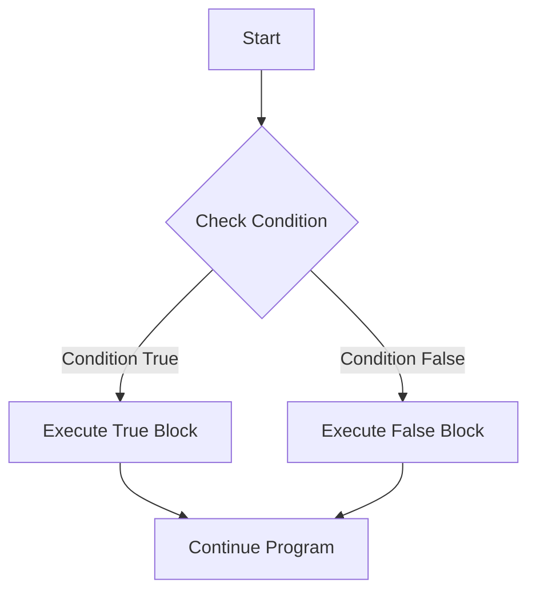

# Arduino Conditional Statements

## Introduction

Conditional statements are fundamental building blocks in programming that allow your Arduino to make decisions based on specific conditions. They enable your code to execute different sets of instructions depending on whether certain conditions are true or false. In this tutorial, we'll explore various conditional statements in Arduino programming and understand how to implement them effectively in your projects.

## Why Use Conditional Statements?

Imagine you're creating a temperature monitoring system. You might want your Arduino to:
- Turn on a fan when the temperature exceeds 30°C
- Display a warning message when the temperature exceeds 35°C
- Sound an alarm when the temperature exceeds 40°C

Without conditional statements, your Arduino would have no way to decide when to activate these different responses. Conditional statements give your Arduino the ability to make decisions, making your projects more interactive and responsive to their environment.

## Types of Conditional Statements in Arduino

Arduino supports several types of conditional statements:

1. `if` statement
2. `if-else` statement
3. `if-else if-else` statement
4. `switch-case` statement

Let's explore each of these in detail.

## The `if` Statement

The `if` statement is the simplest form of conditional statement. It executes a block of code only if the specified condition is true.

### Syntax

```cpp
if (condition) {
  // Code to execute if condition is true
}
```

### Example: LED Control

```cpp
const int ledPin = 13;  // LED connected to digital pin 13
const int buttonPin = 2;  // Push button connected to digital pin 2

void setup() {
  pinMode(ledPin, OUTPUT);  // Set LED pin as output
  pinMode(buttonPin, INPUT_PULLUP);  // Set button pin as input with internal pull-up resistor
}

void loop() {
  // Read the state of the button
  int buttonState = digitalRead(buttonPin);
  
  // If button is pressed (LOW due to INPUT_PULLUP)
  if (buttonState == LOW) {
    digitalWrite(ledPin, HIGH);  // Turn LED on
  }
  
  // The LED will remain off if the button is not pressed
}
```

In this example, the LED turns on only when the button is pressed. The code inside the `if` statement executes only when `buttonState` is `LOW` (indicating that the button is pressed).

## The `if-else` Statement

The `if-else` statement extends the `if` statement by providing an alternative block of code to execute when the condition is false.

### Syntax

```cpp
if (condition) {
  // Code to execute if condition is true
} else {
  // Code to execute if condition is false
}
```

### Example: Temperature Warning System

```cpp
const int temperatureSensorPin = A0;  // Temperature sensor connected to analog pin A0
const int ledPin = 13;  // LED connected to digital pin 13

void setup() {
  Serial.begin(9600);  // Initialize serial communication
  pinMode(ledPin, OUTPUT);  // Set LED pin as output
}

void loop() {
  // Read the analog value from the temperature sensor
  int sensorValue = analogRead(temperatureSensorPin);
  
  // Convert the analog value to temperature in Celsius
  float temperature = (sensorValue * 5.0 / 1023.0 - 0.5) * 100;
  
  Serial.print("Temperature: ");
  Serial.print(temperature);
  Serial.println(" °C");
  
  // Check if temperature exceeds threshold
  if (temperature > 30.0) {
    digitalWrite(ledPin, HIGH);  // Turn on warning LED
    Serial.println("Warning: Temperature is high!");
  } else {
    digitalWrite(ledPin, LOW);  // Turn off warning LED
    Serial.println("Temperature is normal.");
  }
  
  delay(1000);  // Wait for 1 second
}
```

In this example, the Arduino continuously monitors the temperature. If the temperature exceeds 30°C, it turns on a warning LED and prints a warning message. Otherwise, it keeps the LED off and prints a message indicating that the temperature is normal.

## The `if-else if-else` Statement

The `if-else if-else` statement allows you to check multiple conditions in sequence and execute different blocks of code accordingly.

### Syntax

```cpp
if (condition1) {
  // Code to execute if condition1 is true
} else if (condition2) {
  // Code to execute if condition1 is false and condition2 is true
} else {
  // Code to execute if both condition1 and condition2 are false
}
```

### Example: Traffic Light Controller

```cpp
const int redLedPin = 8;    // Red LED connected to digital pin 8
const int yellowLedPin = 9; // Yellow LED connected to digital pin 9
const int greenLedPin = 10; // Green LED connected to digital pin 10

void setup() {
  pinMode(redLedPin, OUTPUT);    // Set red LED pin as output
  pinMode(yellowLedPin, OUTPUT); // Set yellow LED pin as output
  pinMode(greenLedPin, OUTPUT);  // Set green LED pin as output
  
  Serial.begin(9600);  // Initialize serial communication
}

void loop() {
  // Traffic light sequence
  
  // Red light phase
  Serial.println("Traffic Light: RED - Stop!");
  digitalWrite(redLedPin, HIGH);
  digitalWrite(yellowLedPin, LOW);
  digitalWrite(greenLedPin, LOW);
  delay(5000);  // Red light for 5 seconds
  
  // Green light phase
  Serial.println("Traffic Light: GREEN - Go!");
  digitalWrite(redLedPin, LOW);
  digitalWrite(yellowLedPin, LOW);
  digitalWrite(greenLedPin, HIGH);
  delay(5000);  // Green light for 5 seconds
  
  // Yellow light phase
  Serial.println("Traffic Light: YELLOW - Prepare to stop!");
  digitalWrite(redLedPin, LOW);
  digitalWrite(yellowLedPin, HIGH);
  digitalWrite(greenLedPin, LOW);
  delay(2000);  // Yellow light for 2 seconds
}

// Function using if-else if-else to determine traffic light status
void checkTrafficLight(int time) {
  if (time < 5000) {
    Serial.println("Traffic Light Status: RED");
  } else if (time < 10000) {
    Serial.println("Traffic Light Status: GREEN");
  } else {
    Serial.println("Traffic Light Status: YELLOW");
  }
}
```

In this example, we've created a traffic light controller that cycles through red, green, and yellow lights. The `checkTrafficLight()` function demonstrates how to use `if-else if-else` statements to determine the current state of the traffic light based on elapsed time.

## The `switch-case` Statement

The `switch-case` statement provides an alternative way to check multiple conditions, especially when comparing a single variable against multiple possible values.

### Syntax

```cpp
switch (expression) {
  case value1:
    // Code to execute if expression equals value1
    break;
  case value2:
    // Code to execute if expression equals value2
    break;
  // More cases as needed
  default:
    // Code to execute if expression doesn't match any case
    break;
}
```

### Example: Multi-Mode LED Controller

```cpp
const int modeButtonPin = 2;  // Mode selection button
const int ledPin = 13;        // LED pin
int ledMode = 0;              // Current LED mode (0-3)

void setup() {
  pinMode(modeButtonPin, INPUT_PULLUP);
  pinMode(ledPin, OUTPUT);
  Serial.begin(9600);
  Serial.println("Multi-Mode LED Controller Started");
  Serial.println("Press the button to change modes");
}

void loop() {
  // Check if the mode button is pressed
  if (digitalRead(modeButtonPin) == LOW) {
    // Increment the mode and wrap around to 0 after reaching 3
    ledMode = (ledMode + 1) % 4;
    
    Serial.print("Switched to Mode: ");
    Serial.println(ledMode);
    
    delay(300);  // Debounce delay
  }
  
  // Control the LED based on the current mode
  switch (ledMode) {
    case 0:
      // Mode 0: LED off
      digitalWrite(ledPin, LOW);
      break;
    
    case 1:
      // Mode 1: LED on steadily
      digitalWrite(ledPin, HIGH);
      break;
    
    case 2:
      // Mode 2: LED blinking slowly
      digitalWrite(ledPin, HIGH);
      delay(500);
      digitalWrite(ledPin, LOW);
      delay(500);
      break;
    
    case 3:
      // Mode 3: LED blinking quickly
      digitalWrite(ledPin, HIGH);
      delay(100);
      digitalWrite(ledPin, LOW);
      delay(100);
      break;
    
    default:
      // This should never happen, but reset mode to 0 if it does
      ledMode = 0;
      break;
  }
}
```

In this example, we've created a system where pressing a button cycles through different LED modes. The `switch-case` statement controls how the LED behaves based on the current mode:
- Mode 0: LED off
- Mode 1: LED on steadily
- Mode 2: LED blinking slowly
- Mode 3: LED blinking quickly

## Comparison Operators in Conditional Statements

For a condition to be evaluated, you'll need to use comparison operators:

| Operator | Description | Example |
|----------|-------------|---------|
| `==` | Equal to | `if (x == 5)` |
| `!=` | Not equal to | `if (x != 5)` |
| `<` | Less than | `if (x < 5)` |
| `>` | Greater than | `if (x > 5)` |
| `<=` | Less than or equal to | `if (x <= 5)` |
| `>=` | Greater than or equal to | `if (x >= 5)` |

## Logical Operators for Complex Conditions

You can combine multiple conditions using logical operators:

| Operator | Description | Example |
|----------|-------------|---------|
| `&&` | Logical AND | `if (x > 0 && x < 10)` |
| `\|\|` | Logical OR | `if (x < 0 \|\| x > 10)` |
| `!` | Logical NOT | `if (!digitalRead(buttonPin))` |

### Example: Complex Condition with Logical Operators

```cpp
const int temperatureSensorPin = A0;
const int lightSensorPin = A1;
const int fanPin = 9;

void setup() {
  pinMode(fanPin, OUTPUT);
  Serial.begin(9600);
}

void loop() {
  // Read sensor values
  float temperature = readTemperature();
  int lightLevel = analogRead(lightSensorPin);
  
  Serial.print("Temperature: ");
  Serial.print(temperature);
  Serial.print("°C, Light level: ");
  Serial.println(lightLevel);
  
  // Turn on the fan if it's hot AND bright, or if it's very hot
  if ((temperature > 25 && lightLevel > 500) || temperature > 30) {
    digitalWrite(fanPin, HIGH);
    Serial.println("Fan: ON");
  } else {
    digitalWrite(fanPin, LOW);
    Serial.println("Fan: OFF");
  }
  
  delay(1000);
}

float readTemperature() {
  // Read the analog value from the temperature sensor
  int sensorValue = analogRead(temperatureSensorPin);
  
  // Convert the analog value to temperature in Celsius
  float temperature = (sensorValue * 5.0 / 1023.0 - 0.5) * 100;
  
  return temperature;
}
```

In this example, the fan turns on if either of these conditions is true:
1. The temperature is above 25°C AND the light level is above 500
2. The temperature is above 30°C (regardless of light level)

## Nested Conditional Statements

You can place conditional statements inside other conditional statements. These are called nested conditional statements.

### Example: Smart Home Control System

```cpp
const int temperatureSensorPin = A0;
const int motionSensorPin = 2;
const int lightSensorPin = A1;
const int lightPin = 9;
const int fanPin = 10;

void setup() {
  pinMode(motionSensorPin, INPUT);
  pinMode(lightPin, OUTPUT);
  pinMode(fanPin, OUTPUT);
  Serial.begin(9600);
}

void loop() {
  // Read sensor values
  float temperature = readTemperature();
  bool motionDetected = digitalRead(motionSensorPin);
  int lightLevel = analogRead(lightSensorPin);
  
  // First check if motion is detected
  if (motionDetected) {
    Serial.println("Motion detected!");
    
    // If motion detected, check the light level
    if (lightLevel < 300) {
      // It's dark and someone's there, turn on the light
      digitalWrite(lightPin, HIGH);
      Serial.println("Light turned ON (dark and motion detected)");
    } else {
      // It's bright enough, no need for light
      digitalWrite(lightPin, LOW);
      Serial.println("Light remains OFF (bright enough)");
    }
    
    // Also check temperature while someone is in the room
    if (temperature > 28) {
      // It's warm and someone's there, turn on the fan
      digitalWrite(fanPin, HIGH);
      Serial.println("Fan turned ON (warm and motion detected)");
    } else {
      // It's not warm enough, no need for fan
      digitalWrite(fanPin, LOW);
      Serial.println("Fan remains OFF (not warm enough)");
    }
  } else {
    // No motion detected, turn off devices to save energy
    digitalWrite(lightPin, LOW);
    digitalWrite(fanPin, LOW);
    Serial.println("No motion detected, all devices OFF");
  }
  
  delay(1000);
}

float readTemperature() {
  // Read the analog value from the temperature sensor
  int sensorValue = analogRead(temperatureSensorPin);
  
  // Convert the analog value to temperature in Celsius
  float temperature = (sensorValue * 5.0 / 1023.0 - 0.5) * 100;
  
  return temperature;
}
```

In this example, we use nested conditional statements to create a smart home control system that:
1. First checks if motion is detected
2. If motion is detected, it then checks:
   - Light level to determine if the lights should be on
   - Temperature to determine if the fan should be on
3. If no motion is detected, it turns off all devices to save energy

## Visualizing Conditional Flow

Let's visualize the flow of a conditional statement using a flowchart:



## Common Mistakes and How to Avoid Them

### 1. Using `=` Instead of `==` for Comparison

```cpp
// INCORRECT - This assigns 5 to x rather than comparing
if (x = 5) {
  // Code here will always execute because x = 5 returns 5, which is truthy
}

// CORRECT
if (x == 5) {
  // Code here will only execute if x is equal to 5
}
```

### 2. Forgetting Break Statements in Switch-Case

```cpp
switch (sensor) {
  case 1:
    digitalWrite(led1, HIGH);
    // No break here means execution will "fall through" to the next case
  case 2:
    digitalWrite(led2, HIGH);
    break;
}
```

Without the `break` statement after the first case, both LEDs will turn on when `sensor` is 1.

### 3. Incorrect Logical Operator Precedence

Remember that `&&` has higher precedence than `||`. Use parentheses to clarify your intent:

```cpp
// This may not work as expected
if (x > 10 || x < 5 && y > 20) {
  // This will execute if either:
  // 1. x > 10, or
  // 2. x < 5 AND y > 20
}

// This makes the intent clear
if ((x > 10 || x < 5) && y > 20) {
  // This will execute if:
  // (x > 10 OR x < 5) AND y > 20
}
```

## Practical Projects Using Conditional Statements

### Project 1: Automatic Night Light

```cpp
const int lightSensorPin = A0;  // Light sensor connected to analog pin A0
const int ledPin = 9;           // LED connected to digital pin 9

void setup() {
  pinMode(ledPin, OUTPUT);
  Serial.begin(9600);
}

void loop() {
  // Read the analog value from the light sensor
  int lightLevel = analogRead(lightSensorPin);
  
  Serial.print("Light level: ");
  Serial.println(lightLevel);
  
  // If light level is below threshold (darker environment)
  if (lightLevel < 300) {
    digitalWrite(ledPin, HIGH);  // Turn on LED
    Serial.println("Night light activated");
  } else {
    digitalWrite(ledPin, LOW);   // Turn off LED
    Serial.println("Night light deactivated");
  }
  
  delay(1000);  // Check light level every second
}
```

### Project 2: Temperature-Controlled Fan with Speed Adjustment

```cpp
const int temperatureSensorPin = A0;  // Temperature sensor connected to analog pin A0
const int fanPin = 9;                 // Fan connected to PWM pin 9 (through appropriate driver circuit)

void setup() {
  pinMode(fanPin, OUTPUT);
  Serial.begin(9600);
  Serial.println("Temperature-Controlled Fan System");
}

void loop() {
  // Read temperature
  float temperature = readTemperature();
  
  Serial.print("Temperature: ");
  Serial.print(temperature);
  Serial.println("°C");
  
  // Control fan based on temperature ranges
  if (temperature < 25) {
    // Below 25°C - Fan off
    analogWrite(fanPin, 0);
    Serial.println("Fan: OFF");
  } else if (temperature >= 25 && temperature < 28) {
    // Between 25-28°C - Fan at low speed
    analogWrite(fanPin, 85);  // ~33% duty cycle
    Serial.println("Fan: LOW speed");
  } else if (temperature >= 28 && temperature < 30) {
    // Between 28-30°C - Fan at medium speed
    analogWrite(fanPin, 170);  // ~66% duty cycle
    Serial.println("Fan: MEDIUM speed");
  } else {
    // Above 30°C - Fan at full speed
    analogWrite(fanPin, 255);  // 100% duty cycle
    Serial.println("Fan: FULL speed");
  }
  
  delay(2000);  // Check temperature every 2 seconds
}

float readTemperature() {
  // Read the analog value from the temperature sensor
  int sensorValue = analogRead(temperatureSensorPin);
  
  // Convert the analog value to temperature in Celsius (for LM35 sensor)
  float temperature = (sensorValue * 5.0 / 1023.0) * 100;
  
  return temperature;
}
```

## Summary

Conditional statements are essential components of Arduino programming that allow your projects to make decisions based on input conditions. In this tutorial, we've covered:

- The basic `if` statement for simple conditions
- The `if-else` statement for binary decisions
- The `if-else if-else` chain for multiple conditions
- The `switch-case` statement for multiple discrete values
- Comparison and logical operators for forming complex conditions
- Nested conditional statements for more sophisticated decision-making
- Common mistakes and how to avoid them
- Practical projects demonstrating real-world applications

By mastering conditional statements, you can create Arduino projects that respond intelligently to their environment, making your creations more interactive and useful.

## Exercises

To reinforce your understanding of conditional statements, try these exercises:

1. **LED Traffic Light**: Create a traffic light system with three LEDs (red, yellow, green) that follows a standard traffic light sequence.

2. **Smart Thermostat**: Build a temperature control system that adjusts an LED's brightness based on how far the current temperature is from a target temperature.

3. **Light-Following Robot**: Program an Arduino to control two motors based on readings from two light sensors, making the robot turn toward the brighter light source.

4. **Password System**: Create a simple password system using buttons where the correct sequence of button presses activates an LED.

5. **Weather Station**: Build a system that reports different weather conditions based on temperature and humidity readings, using different LED patterns to indicate different weather states.

## Additional Resources

- [Arduino Reference - if statement](https://www.arduino.cc/reference/en/language/structure/control-structure/if/)
- [Arduino Reference - switch case](https://www.arduino.cc/reference/en/language/structure/control-structure/switchcase/)
- [Arduino Reference - Comparison Operators](https://www.arduino.cc/reference/en/language/structure/boolean-operators/comparison-operators/)
- [Arduino Reference - Logical Operators](https://www.arduino.cc/reference/en/language/structure/boolean-operators/logicaloperators/)