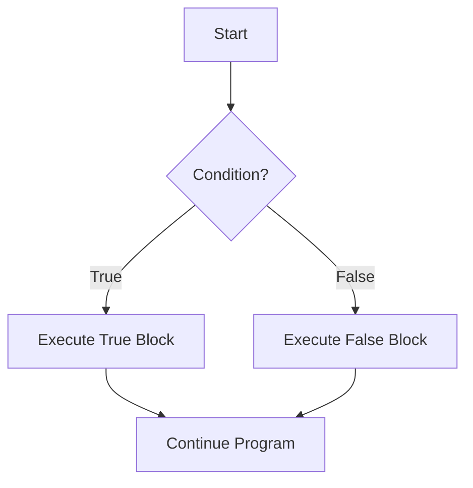
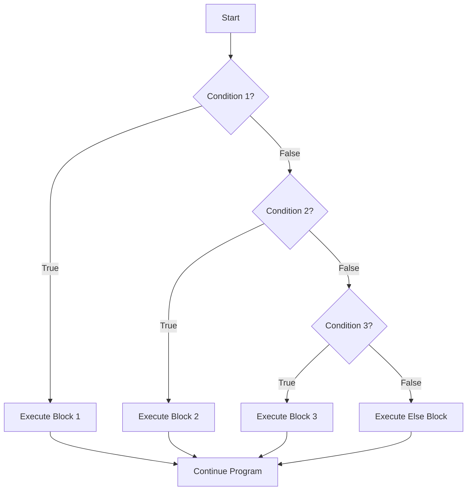

# Arduino If Else

## Introduction

In programming, we often need our devices to make decisions based on certain conditions. The "If-Else" statement is one of the fundamental building blocks of control flow in programming, allowing your Arduino to execute different code depending on whether a condition is true or false. 

Think of "If-Else" as teaching your Arduino to make decisions just like you would: "If it's raining, take an umbrella; otherwise, wear sunglasses." This tutorial will guide you through understanding and implementing conditional logic in your Arduino projects.

## Basic Syntax

The basic structure of an If-Else statement in Arduino looks like this:

```cpp
if (condition) {
  // Code to execute when condition is true
} else {
  // Code to execute when condition is false
}
```

Let's break this down:
- The `if` keyword starts the conditional statement
- The `condition` inside the parentheses is evaluated as either true or false
- The code inside the first set of curly braces `{}` runs only if the condition is true
- The `else` keyword introduces the alternative code block
- The code inside the second set of curly braces runs only if the condition is false

## Simple Example: LED Control

Let's start with a basic example of using an If-Else statement to control an LED based on a button press:

```cpp
const int buttonPin = 2;    // Button connected to pin 2
const int ledPin = 13;      // LED connected to pin 13

void setup() {
  pinMode(buttonPin, INPUT_PULLUP);  // Set button pin as input with pull-up resistor
  pinMode(ledPin, OUTPUT);           // Set LED pin as output
}

void loop() {
  // Read the state of the button
  int buttonState = digitalRead(buttonPin);
  
  // If button is pressed (LOW when using INPUT_PULLUP)
  if (buttonState == LOW) {
    digitalWrite(ledPin, HIGH);  // Turn LED on
  } else {
    digitalWrite(ledPin, LOW);   // Turn LED off
  }
}
```

In this example:
1. We define pins for a button and an LED
2. In the `loop()` function, we read the button state
3. If the button is pressed (LOW when using INPUT_PULLUP), the LED turns on
4. Otherwise (else), the LED stays off

## Comparison Operators

To create conditions, we use comparison operators:

| Operator | Description | Example |
|----------|-------------|---------|
| `==` | Equal to | `if (x == 5)` |
| `!=` | Not equal to | `if (x != 5)` |
| `<` | Less than | `if (x < 5)` |
| `>` | Greater than | `if (x > 5)` |
| `<=` | Less than or equal to | `if (x <= 5)` |
| `>=` | Greater than or equal to | `if (x >= 5)` |

## Example: Temperature Monitor

Here's a more practical example using a temperature sensor:

```cpp
const int tempSensorPin = A0;  // Temperature sensor connected to analog pin A0
const int ledPin = 13;         // LED connected to pin 13

void setup() {
  Serial.begin(9600);          // Initialize serial communication
  pinMode(ledPin, OUTPUT);     // Set LED pin as output
}

void loop() {
  // Read temperature sensor value
  int sensorValue = analogRead(tempSensorPin);
  
  // Convert the analog reading to voltage
  float voltage = sensorValue * (5.0 / 1023.0);
  
  // Convert voltage to temperature in Celsius (for a TMP36 sensor)
  float temperatureC = (voltage - 0.5) * 100;
  
  // Print the temperature
  Serial.print("Temperature: ");
  Serial.print(temperatureC);
  Serial.println(" °C");
  
  // If temperature is above 25°C, turn on the LED
  if (temperatureC > 25.0) {
    digitalWrite(ledPin, HIGH);  // Turn LED on
    Serial.println("Alert: Temperature is high!");
  } else {
    digitalWrite(ledPin, LOW);   // Turn LED off
    Serial.println("Temperature is normal.");
  }
  
  delay(1000);  // Wait for a second before the next reading
}
```

**Input:** Analog reading from temperature sensor  
**Output:**
```
Temperature: 23.5 °C
Temperature is normal.
Temperature: 24.2 °C
Temperature is normal.
Temperature: 26.7 °C
Alert: Temperature is high!
```

This example shows how to:
1. Read an analog sensor
2. Process the data to get temperature
3. Use an If-Else statement to decide whether to activate an alert

## Using If-Else-If

Sometimes you need to check multiple conditions in sequence. This is where the `else if` statement comes in:

```cpp
if (condition1) {
  // Code to execute when condition1 is true
} else if (condition2) {
  // Code to execute when condition1 is false but condition2 is true
} else if (condition3) {
  // Code to execute when condition1 and condition2 are false but condition3 is true
} else {
  // Code to execute when all conditions are false
}
```

## Example: Traffic Light Controller

Let's implement a simple traffic light controller:

```cpp
const int redPin = 11;
const int yellowPin = 12;
const int greenPin = 13;
unsigned long changeTime = 0;
int currentState = 0;  // 0=green, 1=yellow, 2=red

void setup() {
  pinMode(redPin, OUTPUT);
  pinMode(yellowPin, OUTPUT);
  pinMode(greenPin, OUTPUT);
  
  // Initially set the traffic light to green
  digitalWrite(greenPin, HIGH);
  digitalWrite(yellowPin, LOW);
  digitalWrite(redPin, LOW);
  
  changeTime = millis();  // Record the start time
}

void loop() {
  unsigned long currentTime = millis();
  
  // Check if it's time to change the light state
  if (currentState == 0 && currentTime - changeTime >= 5000) {
    // Change from green to yellow
    digitalWrite(greenPin, LOW);
    digitalWrite(yellowPin, HIGH);
    digitalWrite(redPin, LOW);
    currentState = 1;
    changeTime = currentTime;
  } else if (currentState == 1 && currentTime - changeTime >= 2000) {
    // Change from yellow to red
    digitalWrite(greenPin, LOW);
    digitalWrite(yellowPin, LOW);
    digitalWrite(redPin, HIGH);
    currentState = 2;
    changeTime = currentTime;
  } else if (currentState == 2 && currentTime - changeTime >= 5000) {
    // Change from red to green
    digitalWrite(greenPin, HIGH);
    digitalWrite(yellowPin, LOW);
    digitalWrite(redPin, LOW);
    currentState = 0;
    changeTime = currentTime;
  }
}
```

This example demonstrates:
1. Using multiple conditions with `else if` statements
2. Time-based decision making
3. State management using variables

## Flow Diagram

Here's a visual representation of how If-Else statements control program flow:



For If-Else-If:



## Nested If-Else Statements

You can also place If-Else statements inside other If-Else statements. These are called "nested" conditionals:

```cpp
if (outerCondition) {
  // Outer condition is true
  if (innerCondition) {
    // Both outer and inner conditions are true
  } else {
    // Outer condition is true, but inner condition is false
  }
} else {
  // Outer condition is false
  if (anotherCondition) {
    // Outer condition is false, but anotherCondition is true
  } else {
    // Both outer condition and anotherCondition are false
  }
}
```

## Example: Smart Plant Watering System

Here's a more complex example using nested If-Else statements:

```cpp
const int moistureSensorPin = A0;
const int lightSensorPin = A1;
const int pumpPin = 9;
const int ledPin = 13;

void setup() {
  Serial.begin(9600);
  pinMode(pumpPin, OUTPUT);
  pinMode(ledPin, OUTPUT);
}

void loop() {
  int moistureLevel = analogRead(moistureSensorPin);
  int lightLevel = analogRead(lightSensorPin);
  
  Serial.print("Moisture: ");
  Serial.print(moistureLevel);
  Serial.print(" | Light: ");
  Serial.println(lightLevel);
  
  // Water only if the soil is dry
  if (moistureLevel < 300) {
    // Nested condition: Check light level to decide watering strategy
    if (lightLevel > 700) {
      // It's bright, so water in short bursts to prevent evaporation
      Serial.println("Soil is dry and it's bright outside");
      digitalWrite(pumpPin, HIGH);  // Turn pump on
      delay(1000);                  // Water for 1 second
      digitalWrite(pumpPin, LOW);   // Turn pump off
      digitalWrite(ledPin, HIGH);   // Visual indicator
      delay(500);
      digitalWrite(ledPin, LOW);
    } else {
      // It's darker, so water for longer
      Serial.println("Soil is dry and it's not too bright");
      digitalWrite(pumpPin, HIGH);  // Turn pump on
      delay(3000);                  // Water for 3 seconds
      digitalWrite(pumpPin, LOW);   // Turn pump off
      digitalWrite(ledPin, HIGH);   // Visual indicator
      delay(500);
      digitalWrite(ledPin, LOW);
    }
  } else {
    // Soil is not dry, no need to water
    Serial.println("Soil moisture is adequate");
    digitalWrite(pumpPin, LOW);     // Ensure pump is off
  }
  
  delay(10000);  // Wait 10 seconds before next check
}
```

This example demonstrates:
1. Using multiple sensor inputs to make decisions
2. Nested If-Else statements for more complex logic
3. Taking different actions based on combinations of conditions

## Logical Operators

You can combine multiple conditions using logical operators:

| Operator | Description | Example |
|----------|-------------|---------|
| `&&` | AND (both conditions must be true) | `if (x > 0 && x < 10)` |
| `\|\|` | OR (at least one condition must be true) | `if (x < 0 \|\| x > 10)` |
| `!` | NOT (inverts the condition) | `if (!buttonPressed)` |

## Example: Multi-Condition Alarm System

```cpp
const int motionSensorPin = 2;
const int doorSensorPin = 3;
const int buzzerPin = 8;
const int ledPin = 13;
const int armSwitchPin = 4;

void setup() {
  Serial.begin(9600);
  pinMode(motionSensorPin, INPUT);
  pinMode(doorSensorPin, INPUT_PULLUP);  // Door sensor normally closed
  pinMode(armSwitchPin, INPUT_PULLUP);   // Arm switch with pull-up
  pinMode(buzzerPin, OUTPUT);
  pinMode(ledPin, OUTPUT);
}

void loop() {
  bool systemArmed = (digitalRead(armSwitchPin) == LOW);
  bool motionDetected = (digitalRead(motionSensorPin) == HIGH);
  bool doorOpen = (digitalRead(doorSensorPin) == LOW);
  
  // System armed AND (motion detected OR door open)
  if (systemArmed && (motionDetected || doorOpen)) {
    // Trigger the alarm
    Serial.println("ALARM: Intrusion detected!");
    digitalWrite(buzzerPin, HIGH);
    digitalWrite(ledPin, HIGH);
    delay(500);
    digitalWrite(buzzerPin, LOW);
    digitalWrite(ledPin, LOW);
    delay(500);
  } else {
    // System is disarmed or no intrusion detected
    digitalWrite(buzzerPin, LOW);
    
    if (systemArmed) {
      // System is armed but no intrusion - blink LED slowly
      digitalWrite(ledPin, HIGH);
      delay(1000);
      digitalWrite(ledPin, LOW);
      delay(1000);
    } else {
      // System is disarmed - LED off
      digitalWrite(ledPin, LOW);
    }
  }
}
```

This example shows:
1. Using logical operators to combine multiple conditions
2. Creating complex conditional logic for a security system
3. Different feedback based on system state

## The Ternary Operator: A Shorthand If-Else

Arduino also supports the ternary operator, which is a shorthand way to write simple If-Else statements:

```cpp
result = (condition) ? valueIfTrue : valueIfFalse;
```

## Example: Compact LED Brightness Control

```cpp
const int lightSensorPin = A0;
const int ledPin = 9;  // PWM pin for brightness control

void setup() {
  pinMode(ledPin, OUTPUT);
}

void loop() {
  int lightLevel = analogRead(lightSensorPin);
  
  // Use ternary operator to determine LED brightness
  // If light level is below 500, set brightness to 255 (maximum)
  // Otherwise, calculate a proportional brightness
  int brightness = (lightLevel < 500) ? 255 : map(lightLevel, 500, 1023, 255, 0);
  
  analogWrite(ledPin, brightness);
  delay(100);
}
```

This demonstrates how the ternary operator can make your code more concise while maintaining readability.

## Common Mistakes and Best Practices

### 1. Using = Instead of ==

One of the most common mistakes is using the assignment operator `=` instead of the equality operator `==`:

```cpp
// INCORRECT - This assigns 5 to x, always evaluates to true
if (x = 5) {
  // This will always execute!
}

// CORRECT - This checks if x equals 5
if (x == 5) {
  // This only executes when x equals 5
}
```

### 2. Forgetting Curly Braces

When an If or Else block contains only one statement, curly braces are optional but recommended:

```cpp
// Works, but not recommended
if (buttonPressed)
  digitalWrite(ledPin, HIGH);
else
  digitalWrite(ledPin, LOW);

// Better practice - always use curly braces
if (buttonPressed) {
  digitalWrite(ledPin, HIGH);
} else {
  digitalWrite(ledPin, LOW);
}
```

Using curly braces prevents bugs when you add more statements later.

### 3. Testing Floating-Point Values for Equality

Due to the way floating-point values are stored, comparing them directly for equality can be unreliable:

```cpp
// Not reliable
if (temperature == 25.0) {
  // This might not execute even when temperature is very close to 25.0
}

// Better approach
if (abs(temperature - 25.0) < 0.01) {
  // This will execute when temperature is within 0.01 of 25.0
}
```

## Real-World Project: Smart Thermostat

Let's put it all together with a more complex example - a simple smart thermostat:

```cpp
const int tempSensorPin = A0;
const int heaterPin = 9;
const int coolerPin = 10;
const int fanPin = 11;
const int modeButtonPin = 2;
const int tempUpPin = 3;
const int tempDownPin = 4;
const int statusLedPin = 13;

// System settings
int mode = 0;            // 0=off, 1=heat, 2=cool, 3=auto
float setTemp = 22.0;    // Target temperature in Celsius
float hysteresis = 0.5;  // Prevents rapid cycling

void setup() {
  Serial.begin(9600);
  pinMode(heaterPin, OUTPUT);
  pinMode(coolerPin, OUTPUT);
  pinMode(fanPin, OUTPUT);
  pinMode(modeButtonPin, INPUT_PULLUP);
  pinMode(tempUpPin, INPUT_PULLUP);
  pinMode(tempDownPin, INPUT_PULLUP);
  pinMode(statusLedPin, OUTPUT);
  
  // Initially everything off
  digitalWrite(heaterPin, LOW);
  digitalWrite(coolerPin, LOW);
  digitalWrite(fanPin, LOW);
  
  Serial.println("Smart Thermostat System");
  Serial.println("----------------------");
  printStatus();
}

void loop() {
  // Read current temperature
  float currentTemp = readTemperature();
  
  // Check for button presses
  checkButtons();
  
  // Control the HVAC based on mode and temperature
  if (mode == 0) {
    // System is off
    digitalWrite(heaterPin, LOW);
    digitalWrite(coolerPin, LOW);
    digitalWrite(fanPin, LOW);
  } else if (mode == 1) {
    // Heating mode
    if (currentTemp < setTemp - hysteresis) {
      // Too cold, turn on heater
      digitalWrite(heaterPin, HIGH);
      digitalWrite(fanPin, HIGH);
      digitalWrite(statusLedPin, HIGH);
    } else if (currentTemp > setTemp + hysteresis) {
      // Reached target temperature, turn off heater
      digitalWrite(heaterPin, LOW);
      // Keep fan running for a bit
      delay(5000);
      digitalWrite(fanPin, LOW);
      digitalWrite(statusLedPin, LOW);
    }
  } else if (mode == 2) {
    // Cooling mode
    if (currentTemp > setTemp + hysteresis) {
      // Too hot, turn on cooler
      digitalWrite(coolerPin, HIGH);
      digitalWrite(fanPin, HIGH);
      digitalWrite(statusLedPin, HIGH);
    } else if (currentTemp < setTemp - hysteresis) {
      // Reached target temperature, turn off cooler
      digitalWrite(coolerPin, LOW);
      // Keep fan running for a bit
      delay(5000);
      digitalWrite(fanPin, LOW);
      digitalWrite(statusLedPin, LOW);
    }
  } else if (mode == 3) {
    // Auto mode
    if (currentTemp > setTemp + hysteresis) {
      // Too hot, turn on cooling
      digitalWrite(heaterPin, LOW);
      digitalWrite(coolerPin, HIGH);
      digitalWrite(fanPin, HIGH);
      digitalWrite(statusLedPin, HIGH);
    } else if (currentTemp < setTemp - hysteresis) {
      // Too cold, turn on heating
      digitalWrite(coolerPin, LOW);
      digitalWrite(heaterPin, HIGH);
      digitalWrite(fanPin, HIGH);
      digitalWrite(statusLedPin, HIGH);
    } else {
      // Temperature is within acceptable range
      digitalWrite(heaterPin, LOW);
      digitalWrite(coolerPin, LOW);
      // Keep fan running for a bit if it was on
      if (digitalRead(fanPin) == HIGH) {
        delay(5000);
      }
      digitalWrite(fanPin, LOW);
      digitalWrite(statusLedPin, LOW);
    }
  }
  
  // Small delay to prevent rapid cycling
  delay(2000);
}

float readTemperature() {
  // Read sensor value
  int sensorValue = analogRead(tempSensorPin);
  
  // Convert to voltage
  float voltage = sensorValue * (5.0 / 1023.0);
  
  // Convert to temperature (for TMP36 sensor)
  float temperature = (voltage - 0.5) * 100;
  
  return temperature;
}

void checkButtons() {
  // Check mode button
  if (digitalRead(modeButtonPin) == LOW) {
    // Button pressed, change mode
    mode = (mode + 1) % 4;  // Cycle through 0,1,2,3
    
    // Feedback
    Serial.println("Mode changed!");
    printStatus();
    
    // Debounce
    delay(300);
  }
  
  // Check temperature up button
  if (digitalRead(tempUpPin) == LOW) {
    setTemp += 0.5;
    Serial.println("Temperature increased!");
    printStatus();
    delay(300);
  }
  
  // Check temperature down button
  if (digitalRead(tempDownPin) == LOW) {
    setTemp -= 0.5;
    Serial.println("Temperature decreased!");
    printStatus();
    delay(300);
  }
}

void printStatus() {
  Serial.print("Mode: ");
  switch (mode) {
    case 0:
      Serial.println("OFF");
      break;
    case 1:
      Serial.println("HEAT");
      break;
    case 2:
      Serial.println("COOL");
      break;
    case 3:
      Serial.println("AUTO");
      break;
  }
  
  Serial.print("Set Temperature: ");
  Serial.print(setTemp);
  Serial.println(" °C");
  
  Serial.print("Current Temperature: ");
  Serial.print(readTemperature());
  Serial.println(" °C");
  
  Serial.println("----------------------");
}
```

This comprehensive example demonstrates:
1. Using multiple if-else-if statements to control system modes
2. Nested if-else statements for temperature control
3. Using variables to store and modify system state
4. Combining multiple user inputs with sensor readings
5. Implementing hysteresis to prevent rapid cycling of equipment

## Summary

The If-Else statement is a fundamental tool in Arduino programming that allows your projects to make decisions and respond to different conditions. By checking whether a condition is true or false, your Arduino can execute different code blocks, making your projects interactive and responsive.

Key points to remember:
- The basic structure is `if (condition) { code } else { code }`
- You can chain multiple conditions using `else if`
- Conditions are created using comparison operators (`==`, `!=`, `<`, `>`, `<=`, `>=`)
- Multiple conditions can be combined with logical operators (`&&`, `||`, `!`)
- Nested If-Else statements allow for more complex decision-making
- The ternary operator provides a shorthand for simple If-Else statements

## Exercises for Practice

1. **LED Brightness Control**: Create a circuit with a potentiometer and an LED. Use If-Else statements to set different brightness levels based on the potentiometer reading.

2. **Digital Thermometer**: Build a temperature display that shows different messages based on temperature ranges (Cold, Cool, Warm, Hot).

3. **Password System**: Create a simple password entry system using buttons. Use If-Else statements to check if the correct sequence is pressed.

4. **Plant Monitoring System**: Use soil moisture and light sensors to determine when to water a plant and provide alerts based on different conditions.

5. **Traffic Light With Pedestrian Crossing**: Extend the traffic light example to include a pedestrian button that can interrupt the normal cycle.

## Additional Resources

- [Arduino Reference - If Statement](https://www.arduino.cc/reference/en/language/structure/control-structure/if/)
- [Arduino Reference - Comparison Operators](https://www.arduino.cc/reference/en/language/structure/boolean-operators/comparison-operators/)
- [Arduino Reference - Logical Operators](https://www.arduino.cc/reference/en/language/structure/boolean-operators/logicaloperators/)