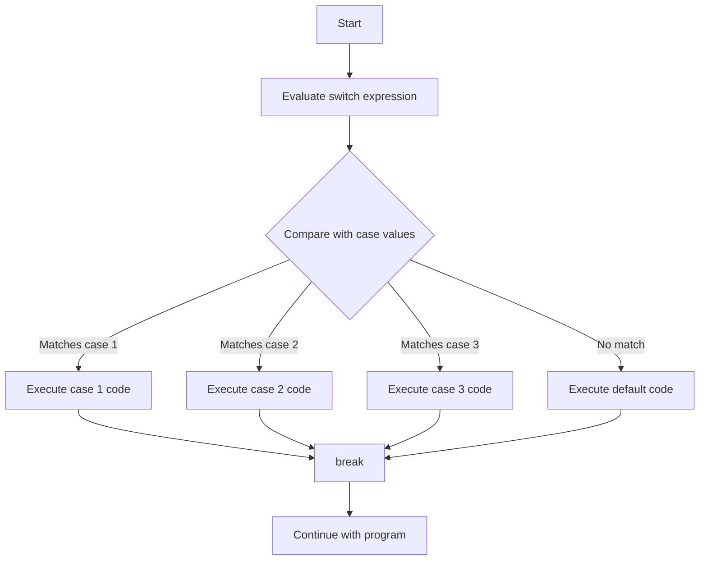

# Arduino Switch Case

## Introduction

The `switch case` statement is a powerful control flow structure in Arduino programming that allows you to select one of many code blocks to execute based on the value of a variable. It provides a cleaner and more efficient alternative to multiple `if-else` statements when you need to compare a variable against several possible values.

In this tutorial, we'll explore how to use `switch case` statements in Arduino, understand their syntax, and see practical examples that demonstrate their usefulness in real-world applications.

## Basic Syntax

The basic syntax of a `switch case` statement in Arduino is:

```cpp
switch (variable) {
  case value1:
    // code to execute if variable equals value1
    break;
  case value2:
    // code to execute if variable equals value2
    break;
  case value3:
    // code to execute if variable equals value3
    break;
  .
  .
  .
  default:
    // code to execute if variable doesn't match any case
    break;
}
```

Let's break down the key components:

- `switch (variable)`: Evaluates the variable to match against different cases.
- `case value`: Specifies a value to compare against the variable.
- `break`: Terminates the switch block. If omitted, execution will "fall through" to the next case.
- `default`: Optional section that executes when no case matches the variable.

## How Switch Case Works

When the Arduino encounters a `switch case` statement:

1. It evaluates the expression inside the parentheses once.
2. It compares the result with the values in each `case`.
3. If a match is found, it executes the code associated with that case.
4. The `break` statement exits the switch block.
5. If no match is found and a `default` section exists, it executes the default code.



## Basic Example: LED Control

Let's start with a simple example that uses a `switch case` statement to control an LED based on a button press counter:

```cpp
const int buttonPin = 2;    // Push button connected to pin 2
const int ledPin = 13;      // LED connected to pin 13
int buttonPresses = 0;      // Counter for button presses
int lastButtonState = HIGH; // Previous button state

void setup() {
  pinMode(buttonPin, INPUT_PULLUP);
  pinMode(ledPin, OUTPUT);
  Serial.begin(9600);
  Serial.println("LED Control Program Started");
}

void loop() {
  // Read the current button state
  int buttonState = digitalRead(buttonPin);
  
  // Check if button was pressed (LOW) and previously was not pressed (HIGH)
  if (buttonState == LOW && lastButtonState == HIGH) {
    // Increment counter and wrap around after 4
    buttonPresses = (buttonPresses + 1) % 5;
    
    // Use switch case to handle different button press counts
    switch (buttonPresses) {
      case 0:
        digitalWrite(ledPin, LOW);
        Serial.println("LED OFF");
        break;
      case 1:
        digitalWrite(ledPin, HIGH);
        Serial.println("LED ON");
        break;
      case 2:
        // Blink slowly
        digitalWrite(ledPin, HIGH);
        delay(500);
        digitalWrite(ledPin, LOW);
        delay(500);
        Serial.println("LED Blinking Slowly");
        break;
      case 3:
        // Blink quickly
        digitalWrite(ledPin, HIGH);
        delay(100);
        digitalWrite(ledPin, LOW);
        delay(100);
        Serial.println("LED Blinking Quickly");
        break;
      case 4:
        // Pulse (fade in and out)
        for (int i = 0; i < 255; i++) {
          analogWrite(ledPin, i);
          delay(5);
        }
        for (int i = 255; i >= 0; i--) {
          analogWrite(ledPin, i);
          delay(5);
        }
        Serial.println("LED Pulsing");
        break;
    }
  }
  
  // Save current button state for next comparison
  lastButtonState = buttonState;
}
```

### Example Output

When you run this program and press the button multiple times, you'll see the following output in the Serial Monitor:

```
LED Control Program Started
LED OFF
LED ON
LED Blinking Slowly
LED Blinking Quickly
LED Pulsing
LED OFF
...
```

## Fall-Through Behavior

One important aspect of `switch case` statements is the "fall-through" behavior that occurs when you omit the `break` statement. This can be useful when you want multiple cases to execute the same code:

```cpp
int sensorValue = analogRead(A0) / 200; // Read analog value and scale to 0-5

switch (sensorValue) {
  case 5:
    Serial.println("Level 5: Critical level reached!");
    // Fall through to case 4
  case 4:
    Serial.println("Level 4: Warning level exceeded!");
    // Fall through to case 3
  case 3:
    Serial.println("Level 3: Caution level reached!");
    digitalWrite(redLED, HIGH);   // Turn on red warning light
    break;
  case 2:
    Serial.println("Level 2: Normal operation");
    digitalWrite(greenLED, HIGH); // Turn on green status light
    break;
  case 1:
  case 0:
    Serial.println("Level 0-1: Low level detected");
    digitalWrite(blueLED, HIGH);  // Turn on blue indicator
    break;
  default:
    Serial.println("Invalid reading");
    break;
}
```

In this example, if `sensorValue` is 5, all messages for levels 5, 4, and 3 will be printed, and the red LED will be turned on.

## Practical Application: Multi-Mode Device Control

Let's look at a more complex example that demonstrates how `switch case` can be used in a real-world application to create a multi-mode device:

```cpp
const int modeButtonPin = 2;     // Button to change modes
const int actionButtonPin = 3;   // Button to perform action in current mode
const int ledPins[] = {9, 10, 11}; // RGB LED pins (R, G, B)

int currentMode = 0;             // Current operating mode
int lastModeButtonState = HIGH;  // Previous state of mode button
int lastActionButtonState = HIGH; // Previous state of action button

void setup() {
  pinMode(modeButtonPin, INPUT_PULLUP);
  pinMode(actionButtonPin, INPUT_PULLUP);
  
  for (int i = 0; i < 3; i++) {
    pinMode(ledPins[i], OUTPUT);
  }
  
  Serial.begin(9600);
  Serial.println("Multi-Mode Device Started");
  printCurrentMode();
}

void loop() {
  // Read button states
  int modeButtonState = digitalRead(modeButtonPin);
  int actionButtonState = digitalRead(actionButtonPin);
  
  // Check for mode button press
  if (modeButtonState == LOW && lastModeButtonState == HIGH) {
    // Change mode (cycle through 0-3)
    currentMode = (currentMode + 1) % 4;
    printCurrentMode();
    
    // Reset all LEDs when changing mode
    for (int i = 0; i < 3; i++) {
      digitalWrite(ledPins[i], LOW);
    }
  }
  
  // Check for action button press
  if (actionButtonState == LOW && lastActionButtonState == HIGH) {
    // Perform action based on current mode
    performAction();
  }
  
  // Update button states
  lastModeButtonState = modeButtonState;
  lastActionButtonState = actionButtonState;
  
  delay(50); // Small delay for button debouncing
}

void printCurrentMode() {
  Serial.print("Current Mode: ");
  
  switch (currentMode) {
    case 0:
      Serial.println("RGB Control");
      break;
    case 1:
      Serial.println("Light Show");
      break;
    case 2:
      Serial.println("SOS Signal");
      break;
    case 3:
      Serial.println("Brightness Control");
      break;
  }
}

void performAction() {
  Serial.print("Performing action in mode: ");
  
  switch (currentMode) {
    case 0: // RGB Control - Cycle through R, G, B
      static int rgbIndex = 0;
      
      // Reset all LEDs
      for (int i = 0; i < 3; i++) {
        digitalWrite(ledPins[i], LOW);
      }
      
      // Turn on one color
      digitalWrite(ledPins[rgbIndex], HIGH);
      
      // Print current color
      switch (rgbIndex) {
        case 0:
          Serial.println("Red");
          break;
        case 1:
          Serial.println("Green");
          break;
        case 2:
          Serial.println("Blue");
          break;
      }
      
      // Cycle to next color
      rgbIndex = (rgbIndex + 1) % 3;
      break;
      
    case 1: // Light Show - Run a sequence of patterns
      Serial.println("Light Show");
      runLightShow();
      break;
      
    case 2: // SOS Signal - Morse code SOS
      Serial.println("SOS Signal");
      runSOSSignal();
      break;
      
    case 3: // Brightness Control - Cycle through brightness levels
      static int brightness = 0;
      
      // Set brightness on all LEDs
      for (int i = 0; i < 3; i++) {
        analogWrite(ledPins[i], brightness);
      }
      
      // Print current brightness level
      Serial.print("Brightness: ");
      Serial.println(brightness);
      
      // Cycle through brightness levels (0, 64, 128, 192, 255)
      brightness = (brightness + 64) % 256;
      if (brightness == 0) brightness = 1; // Avoid completely off
      break;
  }
}

void runLightShow() {
  // Simple light show pattern
  for (int i = 0; i < 3; i++) {
    digitalWrite(ledPins[i], HIGH);
    delay(200);
    digitalWrite(ledPins[i], LOW);
  }
  
  for (int i = 2; i >= 0; i--) {
    digitalWrite(ledPins[i], HIGH);
    delay(200);
    digitalWrite(ledPins[i], LOW);
  }
  
  // Blink all LEDs
  for (int j = 0; j < 3; j++) {
    for (int i = 0; i < 3; i++) {
      digitalWrite(ledPins[i], HIGH);
    }
    delay(200);
    for (int i = 0; i < 3; i++) {
      digitalWrite(ledPins[i], LOW);
    }
    delay(200);
  }
}

void runSOSSignal() {
  // SOS in Morse Code (... --- ...)
  // S: Three short flashes
  for (int j = 0; j < 2; j++) { // Repeat SOS twice
    // S: Three short flashes
    for (int i = 0; i < 3; i++) {
      digitalWrite(ledPins[0], HIGH); // Use red LED for SOS
      delay(200);
      digitalWrite(ledPins[0], LOW);
      delay(200);
    }
    delay(300);
    
    // O: Three long flashes
    for (int i = 0; i < 3; i++) {
      digitalWrite(ledPins[0], HIGH);
      delay(600);
      digitalWrite(ledPins[0], LOW);
      delay(200);
    }
    delay(300);
    
    // S: Three short flashes again
    for (int i = 0; i < 3; i++) {
      digitalWrite(ledPins[0], HIGH);
      delay(200);
      digitalWrite(ledPins[0], LOW);
      delay(200);
    }
    
    delay(1000); // Pause between SOS signals
  }
}
```

This example creates a device with four different modes that can be cycled through with one button, while another button performs actions within the current mode. The `switch case` statements are used both to select the appropriate mode and to handle mode-specific actions.

## Limitations and Considerations

While `switch case` statements are powerful, they do have some limitations:

1. **Data Type Restrictions**: In Arduino C++, `switch` can only be used with integral data types (int, char, etc.). You cannot use it with floating-point values or strings.

2. **Case Values Must Be Constants**: The case values must be constant expressions evaluated at compile time.

```cpp
// This will NOT work:
int myVariable = 5;
switch (x) {
  case myVariable:  // ERROR: Not a constant expression
    // ...
    break;
}

// This will work:
const int myConstant = 5;
switch (x) {
  case myConstant:  // OK: myConstant is a constant
    // ...
    break;
}
```

3. **No Range Checking**: You cannot use ranges in case statements directly. Each case must be a specific value.

## Switch Case vs. If-Else If

When should you use `switch case` instead of `if-else if` chains?

**Use `switch case` when**:
- You're comparing a single variable against multiple constant values
- You have many conditions to check against
- Code readability and maintainability are priorities
- Performance matters (switch can be more efficient for many cases)

**Use `if-else if` when**:
- You need to evaluate different variables or expressions
- You need to check ranges rather than exact values
- You need to use non-integral types (floating point, strings)
- You need complex conditional logic

## Example: Switch Case vs. If-Else

Here's a comparison of the same logic implemented with both approaches:

### Switch Case Implementation:

```cpp
int sensorValue = map(analogRead(A0), 0, 1023, 0, 5);

switch (sensorValue) {
  case 0:
    Serial.println("Very Low");
    break;
  case 1:
    Serial.println("Low");
    break;
  case 2:
    Serial.println("Medium");
    break;
  case 3:
    Serial.println("High");
    break;
  case 4:
  case 5:
    Serial.println("Very High");
    break;
  default:
    Serial.println("Invalid reading");
    break;
}
```

### If-Else Implementation:

```cpp
int sensorValue = map(analogRead(A0), 0, 1023, 0, 5);

if (sensorValue == 0) {
  Serial.println("Very Low");
} else if (sensorValue == 1) {
  Serial.println("Low");
} else if (sensorValue == 2) {
  Serial.println("Medium");
} else if (sensorValue == 3) {
  Serial.println("High");
} else if (sensorValue == 4 || sensorValue == 5) {
  Serial.println("Very High");
} else {
  Serial.println("Invalid reading");
}
```

As you can see, the `switch case` version is more readable when you have many conditions checking the same variable.

## Summary

The `switch case` statement is a valuable control structure in Arduino programming that allows you to:

- Select from multiple code blocks based on a variable's value
- Create more readable code compared to long if-else chains
- Implement complex state machines and mode-based behaviors
- Improve code organization for multi-function devices

Remember to always include the `break` statement at the end of each case unless you specifically want to leverage the fall-through behavior. While `switch case` has some limitations, it's an excellent tool for creating more maintainable Arduino programs when handling multiple discrete states or modes.

## Exercises

1. **Basic Switch**: Create a program that reads a value from a potentiometer (analog input) and maps it to 5 different states (0-4). Use a switch case to light up different LEDs based on the state.

2. **Menu System**: Build a simple menu system that displays different options on the Serial Monitor and allows the user to select an option by sending a number. Use a switch case to handle each menu option.

3. **State Machine**: Create a traffic light controller using a switch case statement to manage the state transitions between red, yellow, and green lights.

4. **Enhanced Control**: Modify the "Multi-Mode Device" example to add a fifth mode of your choice. Think about what new functionality you could add and how to implement it.

5. **Fall-Through Practice**: Write a program that uses the fall-through behavior of switch case to implement a cascading alarm system where higher alert levels trigger all lower-level responses as well.

## Additional Resources

- [Arduino Reference - Switch Case Statement](https://www.arduino.cc/reference/en/language/structure/control-structure/switchcase/)
- [State Machines in Arduino Programming](https://www.arduino.cc/en/Tutorial/StateChangeDetection)
- [Control Flow in C++ Programming](https://en.cppreference.com/w/cpp/language/switch)