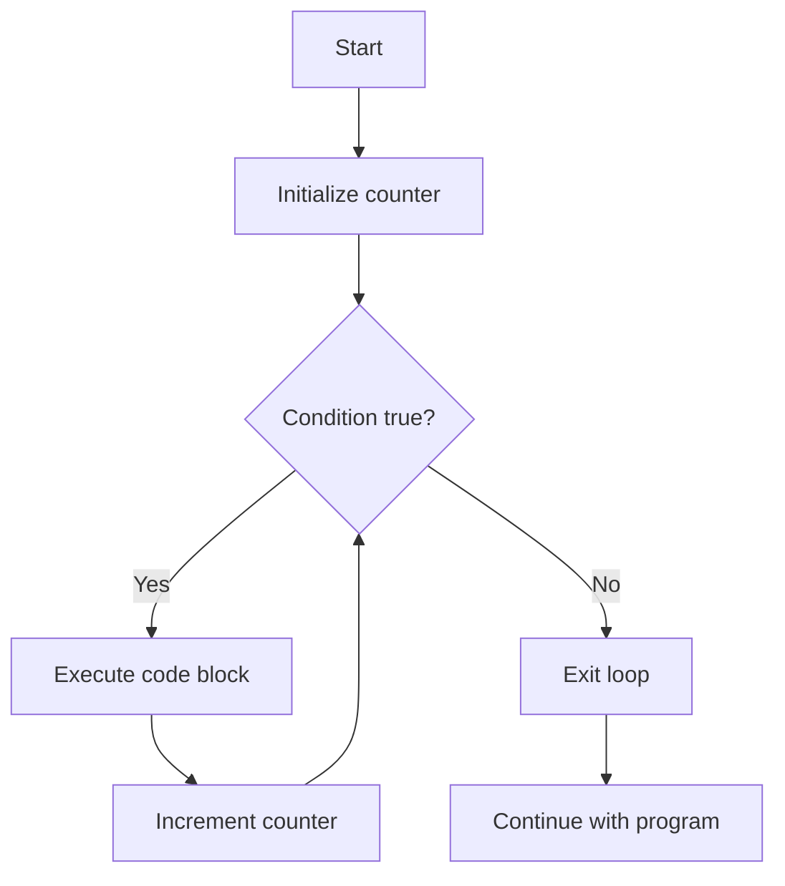

# Arduino For Loop

## Introduction

For loops are one of the most important control structures in Arduino programming. They allow you to execute a block of code repeatedly a specific number of times, making your code more efficient and compact. Instead of writing the same code multiple times, you can use a for loop to automate repetitive tasks.

In this tutorial, you'll learn how for loops work in Arduino, their syntax, and how to use them effectively in your projects.

## Basic Syntax

The basic syntax of a for loop in Arduino (and C/C++) is:

```cpp
for (initialization; condition; increment) {
  // Code to be repeated
}
```

Let's break down these components:

1. **Initialization**: Sets up a counter variable before the loop starts (executed once)
2. **Condition**: Evaluated before each loop iteration; the loop continues as long as this is true
3. **Increment**: Updates the counter after each iteration

## Simple For Loop Example

Let's start with a basic example that counts from 0 to 9:

```cpp
void setup() {
  Serial.begin(9600);
  
  for (int i = 0; i < 10; i++) {
    Serial.print("Count: ");
    Serial.println(i);
  }
}

void loop() {
  // Nothing here
}
```

**Output:**
```
Count: 0
Count: 1
Count: 2
Count: 3
Count: 4
Count: 5
Count: 6
Count: 7
Count: 8
Count: 9
```

### How It Works

1. `int i = 0`: We create a variable `i` and set it to 0
2. `i < 10`: The loop continues as long as `i` is less than 10
3. `i++`: After each iteration, we increment `i` by 1
4. The code inside the curly braces executes 10 times (with `i` values from 0 to 9)

## Controlling LED Blinks

For loops are perfect for controlling hardware. Here's an example that blinks an LED five times:

```cpp
const int ledPin = 13;  // Built-in LED on most Arduino boards

void setup() {
  pinMode(ledPin, OUTPUT);
  
  // Blink LED 5 times
  for (int i = 0; i < 5; i++) {
    digitalWrite(ledPin, HIGH);  // Turn LED on
    delay(500);                 // Wait 500ms
    digitalWrite(ledPin, LOW);   // Turn LED off
    delay(500);                 // Wait 500ms
  }
}

void loop() {
  // Nothing here
}
```

## Backwards Counting

You can also count backwards by using a different increment expression:

```cpp
void setup() {
  Serial.begin(9600);
  
  for (int i = 10; i > 0; i--) {
    Serial.print("Countdown: ");
    Serial.println(i);
  }
  
  Serial.println("Blast off!");
}

void loop() {
  // Nothing here
}
```

**Output:**
```
Countdown: 10
Countdown: 9
Countdown: 8
Countdown: 7
Countdown: 6
Countdown: 5
Countdown: 4
Countdown: 3
Countdown: 2
Countdown: 1
Blast off!
```

## Custom Increments

You're not limited to counting by 1. You can increment by any value:

```cpp
void setup() {
  Serial.begin(9600);
  
  Serial.println("Counting by 2s:");
  for (int i = 0; i <= 10; i += 2) {
    Serial.println(i);
  }
}

void loop() {
  // Nothing here
}
```

**Output:**
```
Counting by 2s:
0
2
4
6
8
10
```

## Nested For Loops

You can place one for loop inside another to perform more complex repetition patterns:

```cpp
void setup() {
  Serial.begin(9600);
  
  for (int row = 1; row <= 3; row++) {
    for (int col = 1; col <= 3; col++) {
      Serial.print("Row ");
      Serial.print(row);
      Serial.print(", Column ");
      Serial.println(col);
    }
    Serial.println("---");
  }
}

void loop() {
  // Nothing here
}
```

**Output:**
```
Row 1, Column 1
Row 1, Column 2
Row 1, Column 3
---
Row 2, Column 1
Row 2, Column 2
Row 2, Column 3
---
Row 3, Column 1
Row 3, Column 2
Row 3, Column 3
---
```

## Flow Diagram of a For Loop

Here's a visual representation of how a for loop works:



## Practical Example: LED Sequence

Let's create a sequence of 8 LEDs that light up in a pattern using a for loop:

```cpp
// Define the LED pins
const int ledPins[] = {2, 3, 4, 5, 6, 7, 8, 9};
const int numLeds = 8;

void setup() {
  // Set all LED pins as outputs
  for (int i = 0; i < numLeds; i++) {
    pinMode(ledPins[i], OUTPUT);
  }
}

void loop() {
  // Light up LEDs one after another
  for (int i = 0; i < numLeds; i++) {
    digitalWrite(ledPins[i], HIGH);  // Turn current LED on
    delay(100);                     // Wait
    digitalWrite(ledPins[i], LOW);   // Turn current LED off
  }
  
  // Light up LEDs in reverse order
  for (int i = numLeds - 1; i >= 0; i--) {
    digitalWrite(ledPins[i], HIGH);  // Turn current LED on
    delay(100);                     // Wait
    digitalWrite(ledPins[i], LOW);   // Turn current LED off
  }
}
```

This example creates a "Knight Rider" or "Cylon" effect with 8 LEDs connected to pins 2-9.

## Advanced: Breaking Out of a For Loop

Sometimes you need to exit a loop before it completes all iterations. You can use the `break` statement for this:

```cpp
void setup() {
  Serial.begin(9600);
  
  for (int i = 0; i < 10; i++) {
    Serial.print("Count: ");
    Serial.println(i);
    
    if (i == 5) {
      Serial.println("Reached 5, breaking out of loop!");
      break;  // Exit the loop when i equals 5
    }
  }
  
  Serial.println("Loop finished");
}

void loop() {
  // Nothing here
}
```

**Output:**
```
Count: 0
Count: 1
Count: 2
Count: 3
Count: 4
Count: 5
Reached 5, breaking out of loop!
Loop finished
```

## Advanced: Skipping Iterations

The `continue` statement allows you to skip to the next iteration of a loop:

```cpp
void setup() {
  Serial.begin(9600);
  
  for (int i = 0; i < 10; i++) {
    // Skip printing odd numbers
    if (i % 2 != 0) {
      continue;  // Skip to the next iteration
    }
    
    Serial.print("Even number: ");
    Serial.println(i);
  }
}

void loop() {
  // Nothing here
}
```

**Output:**
```
Even number: 0
Even number: 2
Even number: 4
Even number: 6
Even number: 8
```

## Common Pitfalls

### 1. Infinite Loops

If the condition in your for loop never becomes false, you'll create an infinite loop that can freeze your Arduino:

```cpp
// WARNING: Infinite loop!
for (int i = 0; i < 10; i--) {  // i will never reach 10
  // Code here will run forever
}
```

### 2. Off-by-One Errors

Be careful with the boundary conditions in your loops:

```cpp
// Array with 5 elements (indexes 0-4)
int myArray[5] = {10, 20, 30, 40, 50};

// INCORRECT: This will cause an error by accessing index 5, which doesn't exist
for (int i = 0; i <= 5; i++) {
  Serial.println(myArray[i]);  // Error when i = 5
}

// CORRECT: Use < instead of <=
for (int i = 0; i < 5; i++) {
  Serial.println(myArray[i]);
}
```

## Summary

For loops are powerful tools in Arduino programming that allow you to:

- Repeat code a specific number of times
- Iterate through sequences like arrays
- Create patterns and sequences for outputs
- Process data efficiently
- Control multiple components with minimal code

By mastering for loops, you'll write more efficient, cleaner code and unlock the ability to create more complex behaviors in your Arduino projects.

## Exercises

1. **LED Counter**: Create a program that uses a for loop to blink an LED a number of times equal to a button press count.

2. **Pattern Generator**: Use a for loop to create a specific pattern of LED flashes (e.g., three short, three long, three short).

3. **Tone Sequence**: Use a for loop with the `tone()` function to play an ascending scale on a piezo buzzer.

4. **Multi-LED Binary Counter**: Create a binary counter with 4 LEDs that counts from 0 to 15 using a for loop.

5. **Servo Sweep**: Use a for loop to make a servo motor sweep back and forth smoothly between 0 and 180 degrees.

## Next Steps

Now that you understand for loops, you can combine them with other control structures like `if` statements and `while` loops to create even more sophisticated Arduino programs. In the next tutorials, we'll explore these combinations and build more complex projects.