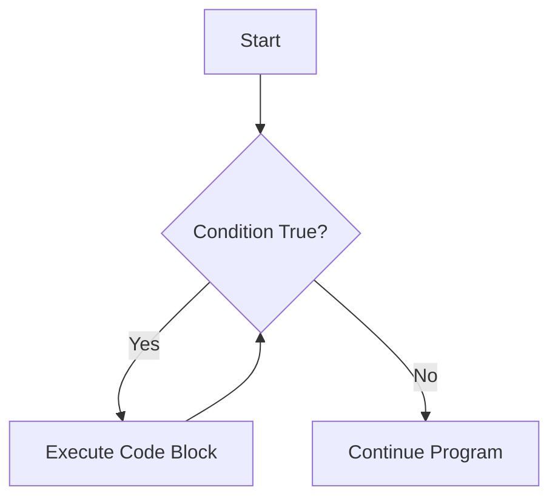

# Arduino While Loop

## Introduction

The `while` loop is a fundamental control flow structure in Arduino programming that allows you to execute a block of code repeatedly as long as a specified condition remains true. This is particularly useful when you need to repeat actions but don't know in advance how many iterations will be needed.

Unlike `for` loops which are typically used when the number of iterations is known, `while` loops are ideal for situations where the loop should continue until a certain condition changes.

## Basic Syntax

The basic syntax of a `while` loop in Arduino is:

```cpp
while (condition) {
  // code to be executed repeatedly
}
```

Where:
- `condition` is an expression that evaluates to either `true` or `false`
- The code inside the curly braces `{}` runs repeatedly as long as the condition is `true`
- Once the condition becomes `false`, the loop terminates and the program continues with the code after the loop

## How While Loops Work





1. When the program reaches the `while` statement, it first evaluates the condition
2. If the condition is `true`, the code inside the loop executes
3. After executing the loop code, the program returns to the `while` statement and checks the condition again
4. The process repeats until the condition becomes `false`
5. When the condition becomes `false`, the program exits the loop and continues with the next statement after the loop

## Simple Example: Counting

Let's create a simple example that counts from 0 to 9 using a `while` loop:

```cpp
void setup() {
  Serial.begin(9600);
  
  int count = 0;
  
  while (count < 10) {
    Serial.print("Count: ");
    Serial.println(count);
    count++;
    delay(500);  // Wait for 500 milliseconds
  }
  
  Serial.println("Loop finished!");
}

void loop() {
  // Empty loop
}
```

**Output:**
```
Count: 0
Count: 1
Count: 2
Count: 3
Count: 4
Count: 5
Count: 6
Count: 7
Count: 8
Count: 9
Loop finished!
```

In this example:
1. We initialize a variable `count` to 0
2. The `while` loop checks if `count` is less than 10
3. Inside the loop, we print the current value of `count`
4. We increment `count` by 1 using `count++`
5. The loop continues until `count` reaches 10, at which point the condition becomes `false`

## Common Patterns with While Loops

### 1. Waiting for a Condition

One common use of `while` loops is to wait for a specific condition to occur:

```cpp
void setup() {
  Serial.begin(9600);
  pinMode(2, INPUT_PULLUP);  // Button connected to pin 2
  
  Serial.println("Press the button to continue...");
  
  while (digitalRead(2) == HIGH) {
    // Wait until the button is pressed
    delay(50);  // Small delay to prevent CPU hogging
  }
  
  Serial.println("Button pressed! Continuing with program...");
}

void loop() {
  // Your main program here
}
```

This code waits until a button connected to pin 2 is pressed before proceeding.

### 2. Processing Until a Condition

Another common pattern is processing data until a certain condition is met:

```cpp
void setup() {
  Serial.begin(9600);
  
  int sensorValue = 0;
  
  Serial.println("Waiting for sensor to exceed threshold...");
  
  while (sensorValue < 500) {
    sensorValue = analogRead(A0);  // Read from analog pin A0
    Serial.print("Current sensor value: ");
    Serial.println(sensorValue);
    delay(200);
  }
  
  Serial.println("Threshold exceeded!");
}

void loop() {
  // Your main program here
}
```

This example continuously reads a sensor value until it exceeds 500.

## Practical Example: Fading LED with While Loop

Let's create a more practical example that uses a `while` loop to fade an LED in and out:

```cpp
const int ledPin = 9;  // LED connected to pin 9 (PWM)

void setup() {
  pinMode(ledPin, OUTPUT);
}

void loop() {
  int brightness = 0;
  
  // Fade in
  while (brightness <= 255) {
    analogWrite(ledPin, brightness);
    brightness += 5;
    delay(30);
  }
  
  // Hold at maximum brightness
  delay(500);
  
  // Fade out
  brightness = 255;
  while (brightness >= 0) {
    analogWrite(ledPin, brightness);
    brightness -= 5;
    delay(30);
  }
  
  // Hold at minimum brightness
  delay(500);
}
```

In this example:
1. We use two `while` loops - one to increase brightness (fade in) and another to decrease brightness (fade out)
2. The first loop increases the brightness from 0 to 255 in steps of 5
3. The second loop decreases the brightness from 255 to 0 in steps of 5
4. We use `analogWrite()` to control the LED brightness using PWM (Pulse Width Modulation)

## While Loop vs Do-While Loop

Arduino also supports a variation called the `do-while` loop, which checks the condition *after* executing the code block:

```cpp
do {
  // code to be executed
} while (condition);
```

The main difference is that a `do-while` loop always executes at least once, even if the condition is initially `false`.

Example:

```cpp
void setup() {
  Serial.begin(9600);
  
  int x = 10;
  
  // This loop won't execute at all because the condition is false
  while (x < 5) {
    Serial.println("This won't print");
    x++;
  }
  
  // This loop will execute once, then check the condition
  do {
    Serial.println("This will print once");
    x++;
  } while (x < 5);
  
  Serial.println("Done");
}

void loop() {
  // Empty
}
```

**Output:**
```
This will print once
Done
```

## Common Pitfalls and How to Avoid Them

### 1. Infinite Loops

One of the most common mistakes with `while` loops is creating an infinite loop that never terminates:

```cpp
void setup() {
  Serial.begin(9600);
  
  int x = 0;
  
  while (x < 10) {
    Serial.println(x);
    // Oops! We forgot to increment x
  }
  
  // This code will never be reached
}
```

To avoid infinite loops:
- Make sure the condition will eventually become `false`
- Ensure you're modifying the variables used in the condition
- Consider adding a safety mechanism like a counter or timeout

### 2. Off-by-One Errors

Another common issue is the "off-by-one" error, where the loop executes one too many or one too few times:

```cpp
int count = 1;
  
// This loop runs from 1 to 10 (10 times)
while (count <= 10) {
  Serial.println(count);
  count++;
}

// vs

int count = 1;
  
// This loop runs from 1 to 9 (9 times)
while (count < 10) {
  Serial.println(count);
  count++;
}
```

To avoid off-by-one errors:
- Pay careful attention to whether you use `<` or `<=` in your condition
- Test boundary conditions
- Consider using comments to clarify the intended range

## Real-World Applications

### 1. Reading Serial Data

```cpp
void setup() {
  Serial.begin(9600);
  Serial.println("Enter characters. Enter 'E' to end.");
}

void loop() {
  char inputBuffer[100];
  int index = 0;
  
  // Wait for serial data to be available
  while (!Serial.available()) {
    // Just wait
  }
  
  // Read characters until 'E' is received or buffer is full
  char c = Serial.read();
  while (c != 'E' && index < 99) {
    inputBuffer[index] = c;
    index++;
    
    // Wait for next character
    while (!Serial.available()) {
      // Just wait
    }
    
    c = Serial.read();
  }
  
  // Null-terminate the string
  inputBuffer[index] = '\0';
  
  // Display the received string
  Serial.print("You entered: ");
  Serial.println(inputBuffer);
}
```

This example reads characters from the serial monitor until the letter 'E' is entered, storing them in a buffer.

### 2. Calibration Routine

```cpp
const int sensorPin = A0;

void setup() {
  Serial.begin(9600);
  
  // Calibration variables
  int minValue = 1023;
  int maxValue = 0;
  unsigned long startTime = millis();
  
  Serial.println("Starting sensor calibration...");
  Serial.println("Move sensor through its full range of motion.");
  
  // Run calibration for 5 seconds
  while (millis() - startTime < 5000) {
    int sensorValue = analogRead(sensorPin);
    
    // Update min and max
    if (sensorValue < minValue) {
      minValue = sensorValue;
    }
    if (sensorValue > maxValue) {
      maxValue = sensorValue;
    }
    
    delay(10);
  }
  
  Serial.println("Calibration complete!");
  Serial.print("Min value: ");
  Serial.println(minValue);
  Serial.print("Max value: ");
  Serial.println(maxValue);
}

void loop() {
  // Main program code would go here
}
```

This example runs a 5-second calibration routine for a sensor, tracking the minimum and maximum values observed during that time.

## Summary

The `while` loop is a powerful control structure in Arduino programming that allows you to execute code repeatedly based on a condition. It's particularly useful when:

- You don't know in advance how many iterations will be needed
- You need to wait for a specific condition to occur
- You want to process data until a threshold is reached

Remember these key points:
- The condition is checked before each iteration
- The loop body only executes if the condition is `true`
- Make sure the condition will eventually become `false` to avoid infinite loops
- Use `do-while` when you need the loop to execute at least once

## Exercises

1. **Basic Counter**: Create a program that counts from 20 down to 0 using a `while` loop, printing each number to the serial monitor.

2. **LED Control**: Use a `while` loop to make an LED blink faster and faster until it appears to stay on continuously.

3. **Button Press Counter**: Create a program that counts and displays the number of times a button is pressed within a 10-second window using a `while` loop.

4. **Sensor Average**: Write a program that takes 100 readings from an analog sensor using a `while` loop and calculates the average value.

5. **Password System**: Create a simple password system that uses a `while` loop to keep asking for input until the correct password is entered.

## Additional Resources

- [Arduino While Loop Official Reference](https://www.arduino.cc/reference/en/language/structure/control-structure/while/)
- [Arduino DoWhile Loop Official Reference](https://www.arduino.cc/reference/en/language/structure/control-structure/dowhile/)
- [Arduino For Loop Guide](https://www.arduino.cc/reference/en/language/structure/control-structure/for/) (for comparison)