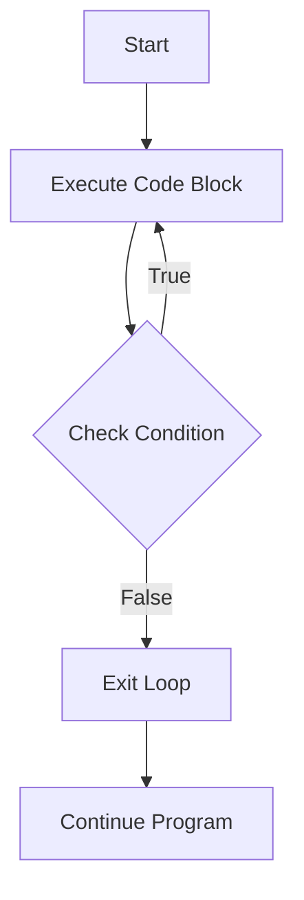

# Arduino Do While Loops

## Introduction

The **do-while** loop is an essential control flow structure in Arduino programming that allows you to repeat a block of code multiple times based on a condition. Unlike the standard `while` loop, the `do-while` loop guarantees that the code block executes at least once before checking the condition.

This type of loop is particularly useful when you need to ensure that certain operations are performed before evaluating whether to continue repeating them.

## Syntax of Do While Loop

The basic syntax of a do-while loop in Arduino is:

```cpp
do {
  // Code to be repeated
} while (condition);
```

Notice the important semicolon (`;`) at the end of the while statement!

## How Do While Loops Work



The flow of a do-while loop works as follows:

1. The code inside the loop executes first
2. After execution, the condition is evaluated
3. If the condition is `true`, the program goes back to step 1
4. If the condition is `false`, the program exits the loop and continues with the next instruction

## Basic Example

Here's a simple example that counts from 1 to 5 using a do-while loop:

```cpp
void setup() {
  Serial.begin(9600);
  
  int count = 1;
  
  do {
    Serial.println(count);
    count++;
  } while (count <= 5);
  
  Serial.println("Loop finished!");
}

void loop() {
  // Empty loop
}
```

### Output:
```
1
2
3
4
5
Loop finished!
```

In this example:
- We initialize `count` to 1
- The loop prints the current value of `count` and then increments it
- After each iteration, it checks if `count` is less than or equal to 5
- The loop continues until `count` becomes 6

## Difference Between While and Do While

The key difference between a `while` loop and a `do-while` loop is when the condition is evaluated:

| Loop Type | Condition Check | Minimum Executions |
|-----------|-----------------|-------------------|
| while     | Before code execution | 0 |
| do-while  | After code execution  | 1 |

Consider this example that demonstrates the difference:

```cpp
void setup() {
  Serial.begin(9600);
  
  Serial.println("Using while loop with false condition:");
  int x = 10;
  while (x < 10) {
    Serial.println("This will not print");
    x++;
  }
  
  Serial.println("Using do-while loop with false condition:");
  int y = 10;
  do {
    Serial.println("This will print once");
    y++;
  } while (y < 10);
  
  Serial.println("Program finished!");
}

void loop() {
  // Empty loop
}
```

### Output:
```
Using while loop with false condition:
Using do-while loop with false condition:
This will print once
Program finished!
```

Notice that the code inside the while loop never executes because the condition is false from the start. However, the code inside the do-while loop executes once before checking the condition.

## Practical Applications

### 1. Reading Sensor Until Valid Value

A common use case for do-while loops is when you need to read from a sensor until you get a valid reading:

```cpp
void setup() {
  Serial.begin(9600);
  
  int sensorValue;
  
  do {
    sensorValue = analogRead(A0);
    Serial.print("Reading sensor: ");
    Serial.println(sensorValue);
    delay(500);
  } while (sensorValue < 100);
  
  Serial.println("Valid reading obtained!");
}

void loop() {
  // Empty loop
}
```

This code reads from an analog sensor repeatedly until the reading exceeds 100.

### 2. Menu System

A do-while loop can be used to create a simple menu system:

```cpp
void setup() {
  Serial.begin(9600);
  
  char option;
  
  do {
    Serial.println("
--- MENU ---");
    Serial.println("1. Turn on LED");
    Serial.println("2. Read sensor");
    Serial.println("3. Play tone");
    Serial.println("Q. Quit");
    
    // Wait for user input
    while (!Serial.available()) {
      // Wait for input
    }
    
    option = Serial.read();
    
    switch (option) {
      case '1':
        Serial.println("LED turned on");
        break;
      case '2':
        Serial.println("Sensor value: 512");
        break;
      case '3':
        Serial.println("Playing tone");
        break;
      case 'Q':
      case 'q':
        Serial.println("Quitting...");
        break;
      default:
        Serial.println("Invalid option");
    }
    
    // Clear any remaining characters in buffer
    while (Serial.available()) {
      Serial.read();
    }
    
  } while (option != 'Q' && option != 'q');
}

void loop() {
  // Empty loop
}
```

This program displays a menu and keeps looping until the user selects the "Quit" option.

### 3. Calibration Routine

Another practical application is a calibration routine that continues until proper calibration is achieved:

```cpp
void setup() {
  Serial.begin(9600);
  
  Serial.println("Starting sensor calibration...");
  
  int calibrationValue;
  int targetValue = 512;
  int tolerance = 5;
  
  do {
    // Simulating reading a calibration value
    calibrationValue = analogRead(A0);
    
    Serial.print("Current calibration: ");
    Serial.print(calibrationValue);
    Serial.print(" (Target: ");
    Serial.print(targetValue);
    Serial.println(")");
    
    if (calibrationValue < targetValue - tolerance) {
      Serial.println("Adjust upward...");
    } else if (calibrationValue > targetValue + tolerance) {
      Serial.println("Adjust downward...");
    }
    
    delay(1000);
  } while (abs(calibrationValue - targetValue) > tolerance);
  
  Serial.println("Calibration complete!");
}

void loop() {
  // Empty loop
}
```

This routine reads from a sensor and provides adjustment guidance until the reading is within a specified tolerance of the target value.

## Common Pitfalls and Best Practices

### 1. Infinite Loops

Be careful not to create infinite loops. Always ensure there's a way for the condition to become false:

```cpp
// Potentially dangerous - may lead to an infinite loop
do {
  // Code here
  // Missing: logic to eventually make the condition false
} while (true);
```

### 2. Forgetting the Semicolon

Always remember to include the semicolon at the end of the while condition:

```cpp
do {
  // Code here
} while (condition); // Don't forget this semicolon!
```

### 3. Complex Conditions

You can use complex conditions involving logical operators:

```cpp
int x = 0;
int y = 0;

do {
  x++;
  y += 2;
  Serial.print("x = ");
  Serial.print(x);
  Serial.print(", y = ");
  Serial.println(y);
} while (x < 5 && y < 12);
```

## When to Use Do While vs While

Use a **do-while loop** when:
- You need to execute the code at least once before checking the condition
- You're validating user input
- You're implementing a menu system
- You're waiting for a specific event or value

Use a **while loop** when:
- You want to check the condition before executing any code
- The loop might not need to run at all
- You're not sure if the initial conditions warrant executing the loop body

## Summary

The do-while loop is a powerful control flow structure in Arduino programming that ensures code executes at least once before checking a condition. Key points to remember:

- The loop body always executes at least once
- The condition is checked after the loop body executes
- It's particularly useful for input validation, menus, and sensor reading scenarios
- Always include the semicolon after the condition
- Ensure there's a way to exit the loop to avoid infinite loops

## Exercises

1. Write a do-while loop that reads the value of a potentiometer connected to analog pin A0 and stops when the value exceeds 800.

2. Create a temperature monitoring system that repeatedly reads from a temperature sensor. The loop should continue until the temperature rises above 30°C, then display a warning message.

3. Implement a password entry system that keeps asking for a password until the correct one is entered.

4. Create a calibration routine for an LED brightness that adjusts the PWM value until a photoresistor reads the desired light level.

5. Modify the menu system example to include additional options and implement the actual functionality for each option.

## Additional Resources

- [Arduino While Loops](https://www.arduino.cc/reference/en/language/structure/control-structure/while/)
- [Arduino Programming Fundamentals](https://www.arduino.cc/reference/en/)
- [Control Flow in C++](https://en.cppreference.com/w/cpp/language/control)