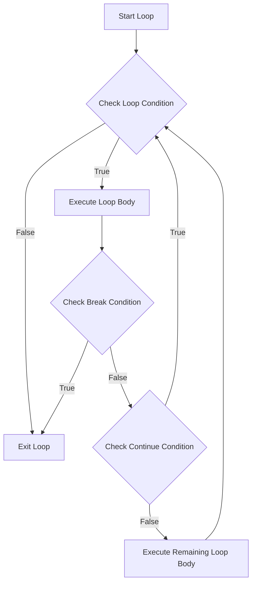

# Arduino Break Continue

## Introduction

When working with loops in Arduino programming, you might need more granular control over the execution flow. Perhaps you want to exit a loop early when a certain condition is met, or skip specific iterations without terminating the entire loop. This is where the `break` and `continue` statements come into play - powerful tools that give you precise control over your loop's execution.

In this tutorial, we'll explore how to use `break` and `continue` statements effectively in Arduino programming, understanding their differences, use cases, and looking at practical examples.

## The Break Statement

The `break` statement allows you to exit a loop immediately, regardless of the loop's condition. When Arduino encounters a `break` statement, it stops executing the current loop and continues with the code after the loop.

### Basic Syntax

```cpp
while (condition) {
  // code
  if (someCondition) {
    break; // Exit the loop immediately
  }
  // more code
}
// Execution continues here after break
```

### Example: Exit Loop When Button is Pressed

```cpp
const int buttonPin = 2;
const int ledPin = 13;

void setup() {
  pinMode(buttonPin, INPUT_PULLUP);
  pinMode(ledPin, OUTPUT);
  Serial.begin(9600);
}

void loop() {
  Serial.println("Starting the counting sequence...");
  
  for (int i = 1; i <= 10; i++) {
    // Check if button is pressed
    if (digitalRead(buttonPin) == LOW) {
      Serial.println("Button pressed! Exiting the count.");
      break; // Exit the counting loop
    }
    
    // Otherwise continue counting
    digitalWrite(ledPin, HIGH);
    Serial.print("Count: ");
    Serial.println(i);
    digitalWrite(ledPin, LOW);
    delay(1000);
  }
  
  Serial.println("Counting sequence finished or interrupted.");
  delay(2000); // Wait before starting again
}
```

In this example:
- We're counting from 1 to 10, with a 1-second delay between each count
- If the button is pressed at any point during the count, the `break` statement executes
- The loop terminates immediately, and execution jumps to the line after the loop

### Break with Nested Loops

It's important to note that `break` only exits the innermost loop it's contained in:

```cpp
for (int i = 0; i < 3; i++) {
  Serial.print("Outer loop i: ");
  Serial.println(i);
  
  for (int j = 0; j < 3; j++) {
    Serial.print("  Inner loop j: ");
    Serial.println(j);
    
    if (j == 1) {
      Serial.println("  Breaking inner loop");
      break; // This only breaks out of the inner loop
    }
  }
  
  // Execution continues here after inner loop break
  Serial.println("Still in outer loop");
}
```

Output:
```
Outer loop i: 0
  Inner loop j: 0
  Inner loop j: 1
  Breaking inner loop
Still in outer loop
Outer loop i: 1
  Inner loop j: 0
  Inner loop j: 1
  Breaking inner loop
Still in outer loop
Outer loop i: 2
  Inner loop j: 0
  Inner loop j: 1
  Breaking inner loop
Still in outer loop
```

## The Continue Statement

The `continue` statement skips the rest of the current iteration and jumps back to the loop's condition check. Unlike `break`, it doesn't exit the loop entirely - it just skips what remains in the current iteration.

### Basic Syntax

```cpp
while (condition) {
  // code
  if (someCondition) {
    continue; // Skip remainder of this iteration
  }
  // This code is skipped when continue executes
}
```

### Example: Skip Processing for Certain Sensor Values

```cpp
const int sensorPin = A0;

void setup() {
  Serial.begin(9600);
}

void loop() {
  Serial.println("Reading 10 sensor values...");
  
  for (int i = 0; i < 10; i++) {
    int sensorValue = analogRead(sensorPin);
    
    // Skip processing for sensor values below threshold
    if (sensorValue < 300) {
      Serial.print("Value too low (");
      Serial.print(sensorValue);
      Serial.println("), skipping this reading.");
      continue; // Skip the rest of this iteration
    }
    
    // Process valid readings (this code is skipped for low values)
    float voltage = sensorValue * (5.0 / 1023.0);
    Serial.print("Reading #");
    Serial.print(i);
    Serial.print(": ");
    Serial.print(sensorValue);
    Serial.print(" (");
    Serial.print(voltage);
    Serial.println("V)");
    
    delay(500);
  }
  
  Serial.println("Finished processing values.");
  delay(2000);
}
```

In this example:
- We're reading 10 values from an analog sensor
- If a reading is below 300, we skip the processing for that reading using `continue`
- The loop continues with the next iteration, without executing the code below the `continue` statement

## Practical Applications

### Example 1: Multi-Condition Menu Navigation

This example shows how to use `break` to exit a menu system once a selection is made:

```cpp
void setup() {
  Serial.begin(9600);
}

void loop() {
  Serial.println("
--- LED Control Menu ---");
  Serial.println("1: Blink LED");
  Serial.println("2: Fade LED");
  Serial.println("3: SOS Signal");
  Serial.println("4: Exit");
  
  // Wait for input
  while (!Serial.available()) {
    // Just wait
  }
  
  char choice = Serial.read();
  
  // Clear any remaining characters
  while (Serial.available()) {
    Serial.read();
  }
  
  switch (choice) {
    case '1':
      blinkLED();
      break;
    case '2':
      fadeLED();
      break;
    case '3':
      sosSignal();
      break;
    case '4':
      Serial.println("Exiting menu.");
      return; // Exit loop() function
    default:
      Serial.println("Invalid choice. Try again.");
      // No break here, so we'll continue to the loop again
  }
}

void blinkLED() {
  Serial.println("Executing: Blink LED");
  // Implementation...
}

void fadeLED() {
  Serial.println("Executing: Fade LED");
  // Implementation...
}

void sosSignal() {
  Serial.println("Executing: SOS Signal");
  // Implementation...
}
```

### Example 2: Data Filtering with Continue

This example uses `continue` to filter out invalid readings from a temperature sensor:

```cpp
const int tempSensorPin = A0;

void setup() {
  Serial.begin(9600);
}

void loop() {
  Serial.println("Starting temperature logging...");
  
  for (int i = 0; i < 20; i++) {
    // Read temperature
    int sensorValue = analogRead(tempSensorPin);
    float voltage = sensorValue * (5.0 / 1023.0);
    float temperatureC = (voltage - 0.5) * 100;
    
    // Filter out impossible values (sensor might give erroneous readings)
    if (temperatureC < -10 || temperatureC > 85) {
      Serial.print("Skipping invalid reading: ");
      Serial.print(temperatureC);
      Serial.println("°C");
      continue; // Skip this reading
    }
    
    // Process and log valid temperatures
    Serial.print("Reading #");
    Serial.print(i);
    Serial.print(": ");
    Serial.print(temperatureC);
    Serial.println("°C");
    
    // Check for high temperature alert
    if (temperatureC > 50) {
      Serial.println("ALERT: Temperature too high! Stopping log.");
      break; // Stop the logging loop
    }
    
    delay(1000);
  }
  
  Serial.println("Temperature logging complete.");
  delay(5000);
}
```

This example demonstrates using both `continue` and `break`:
- `continue` is used to skip processing invalid temperature readings
- `break` is used to exit the logging loop if a dangerously high temperature is detected

## Visualizing Control Flow

Here's a flowchart that illustrates how `break` and `continue` affect loop execution:



## Common Pitfalls and Best Practices

### Pitfalls to Avoid

1. **Infinite Loops**: Be careful with `continue` in `while` loops if the loop variable is incremented after the `continue` statement:

   ```cpp
   int i = 0;
   while (i < 10) {
     if (someCondition) {
       continue; // Danger! Loop variable won't be incremented
     }
     i++; // This line is skipped when continue executes
   }
   ```

2. **Breaking Out of Nested Loops**: Remember that `break` only exits the innermost loop. To exit multiple nested loops, you might need to use a flag variable:

   ```cpp
   bool shouldExit = false;
   
   for (int i = 0; i < 5; i++) {
     for (int j = 0; j < 5; j++) {
       if (someCondition) {
         shouldExit = true;
         break; // Breaks inner loop
       }
     }
     
     if (shouldExit) {
       break; // Breaks outer loop
     }
   }
   ```

### Best Practices

1. **Code Readability**: Use `break` and `continue` judiciously. Overusing them can make your code harder to follow.

2. **Comments**: Always add comments explaining why you're using `break` or `continue` in your code.

3. **Early Returns**: For simple cases in functions, consider using early returns instead of nested conditions with `break`.

4. **Loop Selection**: Choose the right loop type for your needs. Sometimes a `do-while` loop or a different approach might be clearer than using `while` with `break`.

## Summary

`break` and `continue` are powerful control flow tools in Arduino programming that give you more precise control over your loops:

- Use `break` when you need to exit a loop completely based on a certain condition
- Use `continue` when you want to skip the remainder of the current iteration but keep the loop running

These statements help make your code more efficient by avoiding unnecessary iterations and providing clear pathways for exceptional conditions.

## Exercises

1. **LED Pattern Modifier**: Create a program that blinks an LED in sequence from 1 to 10 blinks, but skips even numbers (using `continue`) and stops if a button is pressed (using `break`).

2. **Smart Light Sensor**: Read values from a light sensor in a loop. Ignore (using `continue`) readings that fluctuate more than 10% from the previous reading, and exit data collection (using `break`) once you have 5 stable readings.

3. **Password Entry System**: Create a simple password entry system that gives the user 3 attempts to enter a password. Use `break` to exit the attempt loop when a correct password is entered.

## Additional Resources

- [Arduino Reference - Control Structures](https://www.arduino.cc/reference/en/language/structure/control-structure/for/)
- [Arduino Reference - Break Statement](https://www.arduino.cc/reference/en/language/structure/control-structure/break/)
- [Arduino Reference - Continue Statement](https://www.arduino.cc/reference/en/language/structure/control-structure/continue/)