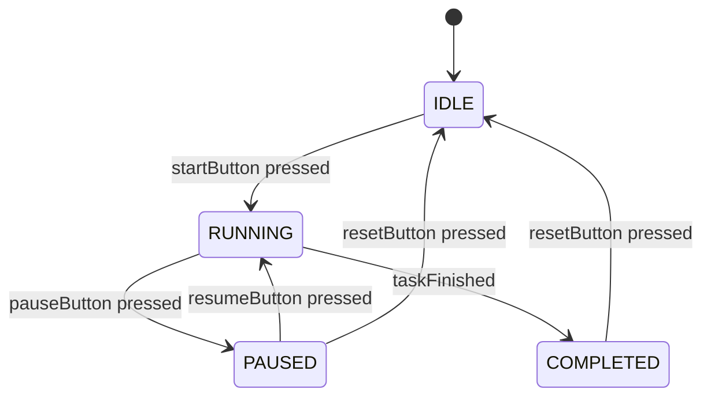

# Arduino State Machines

## Introduction

When your Arduino projects grow in complexity, managing different operational modes, responses, and behaviors can quickly become challenging with simple linear code. **State machines** offer an elegant solution to this problem by organizing your program into distinct states with well-defined transitions between them.

A state machine (also known as a finite state machine or FSM) is a programming model where your system exists in exactly one state at any given time, and can only transition to certain states from its current state. This approach makes your code more:

- **Organized**: Each state has clear responsibilities
- **Maintainable**: Easier to debug and expand
- **Efficient**: Avoids complicated nested if/else structures
- **Predictable**: System behavior is well-defined at all times

In this tutorial, we'll explore how to implement state machines in Arduino and see how they can transform your approach to complex projects.

## Understanding State Machines

### Key Concepts

Before diving into code, let's understand the core concepts of state machines:

1. **States**: Distinct operational modes where specific behaviors occur
2. **Events**: Triggers that can cause state transitions
3. **Transitions**: Rules for moving from one state to another
4. **Actions**: Operations performed when entering, exiting, or while in a state

### Visual Representation

State machines are often visualized using state diagrams, which make it easier to understand the overall flow of your system:



## Implementing Basic State Machines in Arduino

Let's start with a simple state machine implementation. We'll create an LED controller with multiple states.

### Example 1: LED State Machine

In this example, we'll create a state machine to control an LED with the following states:
- OFF: LED is turned off
- ON: LED is constantly on
- BLINKING: LED blinks at a regular interval

```cpp
// Define states
enum State {
  OFF,
  ON,
  BLINKING
};

// Initial state
State currentState = OFF;

// Pin definitions
const int ledPin = 13;
const int buttonPin = 2;

// Variables for timing and button handling
unsigned long previousMillis = 0;
const long blinkInterval = 500;  // Interval for blinking (milliseconds)
bool ledState = LOW;
int lastButtonState = HIGH;
int buttonState;

void setup() {
  pinMode(ledPin, OUTPUT);
  pinMode(buttonPin, INPUT_PULLUP);
  Serial.begin(9600);
  Serial.println("LED State Machine Started");
}

void loop() {
  // Read button (with debouncing)
  buttonState = digitalRead(buttonPin);
  
  // Check for button press (transition from HIGH to LOW with pullup)
  if (buttonState == LOW && lastButtonState == HIGH) {
    // Button was just pressed, change state
    switch (currentState) {
      case OFF:
        currentState = ON;
        Serial.println("State: ON");
        break;
      case ON:
        currentState = BLINKING;
        Serial.println("State: BLINKING");
        break;
      case BLINKING:
        currentState = OFF;
        Serial.println("State: OFF");
        break;
    }
    delay(50);  // Simple debounce
  }
  lastButtonState = buttonState;
  
  // Execute state behavior
  switch (currentState) {
    case OFF:
      digitalWrite(ledPin, LOW);
      break;
      
    case ON:
      digitalWrite(ledPin, HIGH);
      break;
      
    case BLINKING:
      // Blink the LED using non-blocking timing
      unsigned long currentMillis = millis();
      if (currentMillis - previousMillis >= blinkInterval) {
        previousMillis = currentMillis;
        ledState = !ledState;
        digitalWrite(ledPin, ledState);
      }
      break;
  }
}
```

### How It Works

1. We define an `enum` to represent our states.
2. The button press is used as an event to trigger state transitions.
3. The `currentState` variable always tracks which state we're in.
4. The main `loop()` function has two parts:
   - Event detection (button press) that may cause state transitions
   - State behavior execution based on the current state

The key advantage of this approach is clarity. Instead of mixing condition checks, behavior, and transitions together, we have a clear separation of concerns.

## Advanced State Machine Patterns

While the enum-based approach works well for simple state machines, more complex applications benefit from structured approaches. Let's explore a more advanced object-oriented pattern.

### Example 2: Object-Oriented State Machine

For more complex projects, we can use a class-based approach to create a more structured state machine:

```cpp
// State interface
class State {
  public:
    virtual void enter() = 0;
    virtual void update() = 0;
    virtual void exit() = 0;
    virtual State* getNextState() = 0;
};

// Concrete states
class IdleState : public State {
  private:
    unsigned long startTime;
    const int buttonPin = 2;
    
  public:
    void enter() override {
      Serial.println("Entering IDLE state");
      startTime = millis();
    }
    
    void update() override {
      // Check for button press
      if (digitalRead(buttonPin) == LOW) {
        // Wait for next getNextState call to transition
        Serial.println("Button pressed in IDLE");
      }
    }
    
    void exit() override {
      Serial.println("Exiting IDLE state");
    }
    
    State* getNextState() override {
      // Check for button press to transition to active state
      if (digitalRead(buttonPin) == LOW) {
        delay(50); // Simple debounce
        return new ActiveState();
      }
      return nullptr; // Stay in current state
    }
};

class ActiveState : public State {
  private:
    unsigned long startTime;
    const int ledPin = 13;
    const int buttonPin = 2;
    
  public:
    void enter() override {
      Serial.println("Entering ACTIVE state");
      startTime = millis();
      digitalWrite(ledPin, HIGH);
    }
    
    void update() override {
      // Perform active state behavior
      if (millis() - startTime > 5000) {
        Serial.println("Active for 5 seconds");
      }
    }
    
    void exit() override {
      Serial.println("Exiting ACTIVE state");
      digitalWrite(ledPin, LOW);
    }
    
    State* getNextState() override {
      // Check timeout or button press to return to idle
      if (digitalRead(buttonPin) == LOW || (millis() - startTime > 10000)) {
        delay(50); // Simple debounce
        return new IdleState();
      }
      return nullptr; // Stay in current state
    }
};

// State machine manager
class StateMachine {
  private:
    State* currentState;
    
  public:
    StateMachine(State* initialState) {
      currentState = initialState;
      currentState->enter();
    }
    
    ~StateMachine() {
      delete currentState;
    }
    
    void update() {
      // Execute current state behavior
      currentState->update();
      
      // Check for state transitions
      State* nextState = currentState->getNextState();
      if (nextState != nullptr) {
        currentState->exit();
        delete currentState;
        currentState = nextState;
        currentState->enter();
      }
    }
};

// Global state machine
StateMachine* stateMachine;

void setup() {
  pinMode(13, OUTPUT);
  pinMode(2, INPUT_PULLUP);
  Serial.begin(9600);
  
  // Initialize state machine with idle state
  stateMachine = new StateMachine(new IdleState());
}

void loop() {
  stateMachine->update();
  delay(100); // Small delay to prevent consuming too much CPU
}
```

This implementation provides several advantages:
- Each state encapsulates its own behavior and transition logic
- The `enter()` and `exit()` methods allow for proper setup and cleanup
- New states can be added without modifying the main state machine
- The implementation closely matches state diagram theory

## Practical Application: Traffic Light Controller

Let's apply our state machine knowledge to create a practical project: a traffic light controller.

```cpp
enum TrafficLightState {
  RED,
  RED_YELLOW,
  GREEN,
  YELLOW
};

// Pin definitions
const int redPin = 9;
const int yellowPin = 10;
const int greenPin = 11;
const int pedestrianButtonPin = 2;

// Timing constants (in milliseconds)
const unsigned long RED_DURATION = 5000;
const unsigned long RED_YELLOW_DURATION = 2000;
const unsigned long GREEN_DURATION = 4000;
const unsigned long YELLOW_DURATION = 3000;

// State variables
TrafficLightState currentState = RED;
unsigned long stateStartTime = 0;
bool pedestrianButtonPressed = false;

void setup() {
  pinMode(redPin, OUTPUT);
  pinMode(yellowPin, OUTPUT);
  pinMode(greenPin, OUTPUT);
  pinMode(pedestrianButtonPin, INPUT_PULLUP);
  
  Serial.begin(9600);
  Serial.println("Traffic Light Controller Started");
  
  // Initial state
  stateStartTime = millis();
  updateLights();
}

void loop() {
  // Check for pedestrian button press
  if (digitalRead(pedestrianButtonPin) == LOW) {
    pedestrianButtonPressed = true;
    delay(50); // Simple debounce
  }
  
  // Check for state transitions based on timing
  unsigned long currentTime = millis();
  unsigned long stateElapsed = currentTime - stateStartTime;
  
  switch (currentState) {
    case RED:
      if (stateElapsed >= RED_DURATION) {
        changeState(RED_YELLOW);
      }
      break;
      
    case RED_YELLOW:
      if (stateElapsed >= RED_YELLOW_DURATION) {
        changeState(GREEN);
      }
      break;
      
    case GREEN:
      // Shorten green time if pedestrian button was pressed
      if ((pedestrianButtonPressed && stateElapsed >= 2000) || 
          (stateElapsed >= GREEN_DURATION)) {
        changeState(YELLOW);
        pedestrianButtonPressed = false;
      }
      break;
      
    case YELLOW:
      if (stateElapsed >= YELLOW_DURATION) {
        changeState(RED);
      }
      break;
  }
}

void changeState(TrafficLightState newState) {
  currentState = newState;
  stateStartTime = millis();
  updateLights();
  
  // Print state change
  Serial.print("Changed to ");
  switch (currentState) {
    case RED: Serial.println("RED"); break;
    case RED_YELLOW: Serial.println("RED_YELLOW"); break;
    case GREEN: Serial.println("GREEN"); break;
    case YELLOW: Serial.println("YELLOW"); break;
  }
}

void updateLights() {
  // Turn all lights off first
  digitalWrite(redPin, LOW);
  digitalWrite(yellowPin, LOW);
  digitalWrite(greenPin, LOW);
  
  // Turn on appropriate lights for current state
  switch (currentState) {
    case RED:
      digitalWrite(redPin, HIGH);
      break;
    case RED_YELLOW:
      digitalWrite(redPin, HIGH);
      digitalWrite(yellowPin, HIGH);
      break;
    case GREEN:
      digitalWrite(greenPin, HIGH);
      break;
    case YELLOW:
      digitalWrite(yellowPin, HIGH);
      break;
  }
}
```

The traffic light controller demonstrates a state machine with:
- Four distinct states (RED, RED_YELLOW, GREEN, YELLOW)
- Time-based transitions
- Event influence (pedestrian button can shorten the GREEN state)
- Clear separation of state behavior and transitions

## State Machine with Timer Library

For more complex timing requirements, we can combine state machines with timer libraries. Here's an example using the `SimpleTimer` library:

```cpp
#include <SimpleTimer.h>

enum MachineState {
  STANDBY,
  HEATING,
  OPERATING,
  COOLING_DOWN,
  ERROR
};

// Create timer object
SimpleTimer timer;

// State machine variables
MachineState currentState = STANDBY;
int temperatureSensorPin = A0;
int heatingElementPin = 5;
int fanPin = 6;
int errorLedPin = 7;

// Temperature thresholds
const int minOperatingTemp = 50;  // in degrees Celsius
const int maxOperatingTemp = 80;
const int cooledDownTemp = 35;

// Timer IDs
int temperatureCheckTimerId;
int errorBlinkTimerId = -1;

void setup() {
  pinMode(heatingElementPin, OUTPUT);
  pinMode(fanPin, OUTPUT);
  pinMode(errorLedPin, OUTPUT);
  
  Serial.begin(9600);
  Serial.println("Machine Controller Started");
  
  // Schedule temperature check every second
  temperatureCheckTimerId = timer.setInterval(1000, checkTemperature);
  
  // Start in STANDBY state
  enterState(STANDBY);
}

void loop() {
  // Update timer
  timer.run();
  
  // Execute current state behavior
  switch (currentState) {
    case STANDBY:
      // In standby, we're just waiting for temperature checks
      break;
      
    case HEATING:
      // Actively heating
      digitalWrite(heatingElementPin, HIGH);
      break;
      
    case OPERATING:
      // Normal operation
      break;
      
    case COOLING_DOWN:
      // Cooling down, fan running
      digitalWrite(fanPin, HIGH);
      break;
      
    case ERROR:
      // Error state, waiting for reset
      break;
  }
}

void checkTemperature() {
  // Read temperature from sensor (convert analog reading to Celsius)
  int reading = analogRead(temperatureSensorPin);
  float voltage = reading * 5.0 / 1024.0;
  float temperature = (voltage - 0.5) * 100;
  
  Serial.print("Temperature: ");
  Serial.println(temperature);
  
  // State transitions based on temperature
  switch (currentState) {
    case STANDBY:
      // Begin heating if we're below operating temperature
      if (temperature < minOperatingTemp) {
        enterState(HEATING);
      }
      break;
      
    case HEATING:
      // Check if we've reached operating temperature
      if (temperature >= minOperatingTemp) {
        enterState(OPERATING);
      }
      // Check for overheating
      else if (temperature > maxOperatingTemp) {
        enterState(ERROR);
      }
      break;
      
    case OPERATING:
      // Check if we need to cool down
      if (temperature > maxOperatingTemp) {
        enterState(COOLING_DOWN);
      }
      break;
      
    case COOLING_DOWN:
      // Check if we've cooled down enough
      if (temperature <= cooledDownTemp) {
        enterState(STANDBY);
      }
      break;
      
    case ERROR:
      // Stay in error state until manual reset
      break;
  }
}

void enterState(MachineState newState) {
  // Exit actions for previous state
  switch (currentState) {
    case STANDBY:
      break;
    case HEATING:
      digitalWrite(heatingElementPin, LOW);
      break;
    case OPERATING:
      break;
    case COOLING_DOWN:
      digitalWrite(fanPin, LOW);
      break;
    case ERROR:
      // Stop error LED blinking
      if (errorBlinkTimerId != -1) {
        timer.deleteTimer(errorBlinkTimerId);
        errorBlinkTimerId = -1;
      }
      digitalWrite(errorLedPin, LOW);
      break;
  }
  
  // Update state
  currentState = newState;
  
  // Entry actions for new state
  switch (currentState) {
    case STANDBY:
      Serial.println("Entering STANDBY state");
      break;
    case HEATING:
      Serial.println("Entering HEATING state");
      break;
    case OPERATING:
      Serial.println("Entering OPERATING state");
      break;
    case COOLING_DOWN:
      Serial.println("Entering COOLING_DOWN state");
      break;
    case ERROR:
      Serial.println("Entering ERROR state");
      // Start error LED blinking
      errorBlinkTimerId = timer.setInterval(500, blinkErrorLed);
      break;
  }
}

// Toggle error LED state
bool errorLedState = false;
void blinkErrorLed() {
  errorLedState = !errorLedState;
  digitalWrite(errorLedPin, errorLedState);
}
```

This example demonstrates a more sophisticated state machine with:
- Timer-based events
- Entry and exit actions for each state
- Environmental monitoring influencing state transitions
- Error handling as a distinct state

## Best Practices for Arduino State Machines

To make the most of state machines in your Arduino projects, follow these best practices:

1. **Define States Clearly**: Each state should have a single, well-defined responsibility.
2. **Use Non-Blocking Code**: Avoid `delay()` in state implementations to keep your state machine responsive.
3. **Separate Logic**: Keep state behavior, transition logic, and event detection separate for clarity.
4. **Document Transitions**: Create state diagrams before coding to plan your state machine structure.
5. **Handle Edge Cases**: Consider what happens if sensors fail or unexpected events occur.
6. **Use Entry and Exit Actions**: Perform setup and cleanup operations when entering and exiting states.
7. **Keep it Simple**: Don't create more states than necessary. Combine similar states if possible.

## Summary

State machines offer a powerful pattern for organizing complex Arduino projects. By separating your program into distinct states with clear transitions, you can create more maintainable, reliable, and understandable code.

In this tutorial, we've explored:
- Basic state machine concepts
- Simple enum-based implementations
- Object-oriented state machine patterns
- Practical applications like traffic light controllers
- Integration with timer libraries
- Best practices for effective state machine design

State machines are especially valuable for projects involving:
- User interfaces with multiple modes
- Sequential operations with distinct phases
- Systems responding to multiple inputs or events
- Projects requiring reliable error handling
- Any program where "what to do next" depends on "what's happening now"

## Exercises

To reinforce your understanding, try these exercises:

1. Modify the traffic light example to include a pedestrian crossing light that coordinates with the main traffic light.
2. Implement a state machine for a simple vending machine with states for idle, selection, payment, and dispensing.
3. Create a plant watering system with states for checking soil moisture, watering, and waiting.
4. Extend the machine controller example to include a user interface with buttons and an LCD display.
5. Design a state machine for a security system with armed, disarmed, and alarm states.

## Additional Resources

For further learning, check out these resources:

- [State Machine Design Pattern](https://en.wikipedia.org/wiki/Finite-state_machine)
- [Arduino Reference](https://www.arduino.cc/reference/en/)
- [SimpleTimer Library](https://playground.arduino.cc/Code/SimpleTimer/)
- Book: "Making Things Talk" by Tom Igoe
- Book: "Programming Arduino: Getting Started with Sketches" by Simon Monk