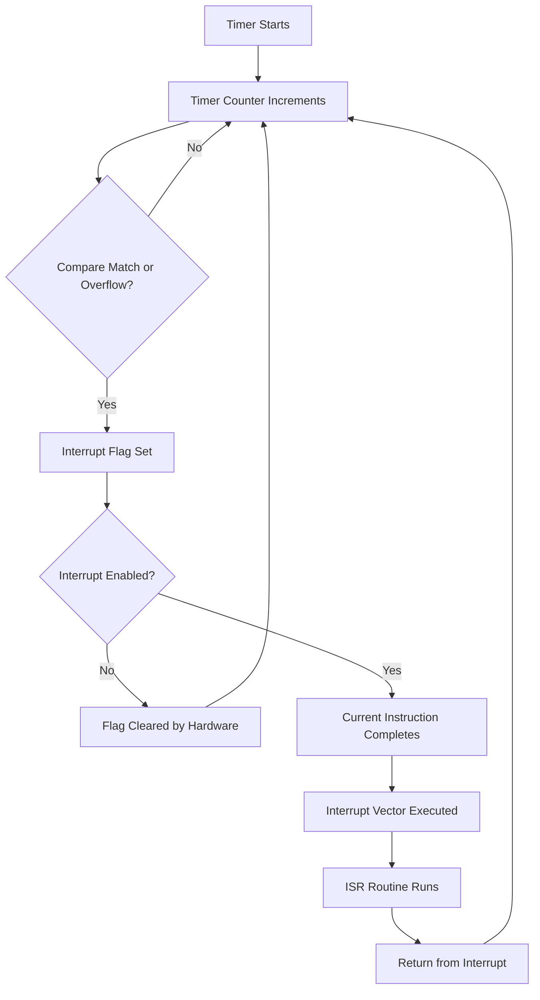

# Arduino Timers

## Introduction

Timers are powerful hardware components built into the microcontrollers that power Arduino boards. While you may have used functions like `delay()` and `millis()` in your projects, these functions actually utilize the underlying timer hardware. Understanding how to directly control and program these timers unlocks a whole new level of precision and capability in your Arduino projects.

In this guide, we'll explore:
- What timers are and why they're important
- The different timers available on Arduino boards
- How to configure and use timers for precise timing
- Practical applications including PWM generation, precise interrupts, and more

## Understanding Arduino Timers

### What Are Timers?

Timers are dedicated hardware modules inside microcontrollers that can count clock cycles independent of the main program execution. Think of them as separate counters running alongside your main code, capable of triggering events when certain conditions are met.

Most Arduino boards (like the Uno, based on the ATmega328P) have three hardware timers:
- **Timer0**: 8-bit timer (counts from 0 to 255)
- **Timer1**: 16-bit timer (counts from 0 to 65,535)
- **Timer2**: 8-bit timer (counts from 0 to 255)

### Why Use Hardware Timers?

1. **Precision**: Hardware timers offer microsecond-level precision
2. **Parallel Operation**: They operate independently of your main code
3. **Reduced CPU Load**: Timers handle timing tasks while your code handles other operations
4. **Consistent Timing**: Unlike software timing, hardware timers aren't affected by code execution time

### Timer Concepts

Before diving into programming, let's understand some key concepts:

#### 1. Timer Resolution

Timers can be 8-bit (counts up to 255) or 16-bit (counts up to 65,535). This determines the maximum count value before the timer overflows and resets to zero.

#### 2. Prescalers

Prescalers divide the clock frequency to slow down the timer's counting rate. For example, with a 16MHz Arduino and a prescaler of 64, the timer counts at 16MHz/64 = 250kHz, or once every 4 microseconds.

#### 3. Timer Modes

Timers can operate in different modes:
- **Normal Mode**: Counts from 0 to maximum, then overflows
- **CTC (Clear Timer on Compare)**: Counts from 0 to a specified value, then resets
- **PWM Modes**: For generating Pulse Width Modulation signals

#### 4. Timer Registers

Each timer has several registers to control its operation:
- **TCNTn**: The actual timer counter value
- **TCCRnA/TCCRnB**: Control registers that define the timer's behavior
- **OCRnA/OCRnB**: Output Compare Registers for setting compare values
- **TIMSKn**: Timer Interrupt Mask Register to enable interrupts

## Basic Timer Programming

Let's start with some basic examples of timer programming:

### Configuring Timer1 in Normal Mode

Here's a simple example that sets up Timer1 in normal mode with a prescaler of 64:

```cpp
void setup() {
  // Reset Timer1 control registers
  TCCR1A = 0;
  TCCR1B = 0;
  
  // Set prescaler to 64
  TCCR1B |= (1 << CS11) | (1 << CS10);
  
  // Initialize counter
  TCNT1 = 0;
  
  Serial.begin(9600);
}

void loop() {
  // Read and print the timer value
  Serial.println(TCNT1);
  delay(1000);
}
```

Output:
```
15625
31250
46875
62421
12953
28578
...
```

The timer counts up continuously, overflowing after reaching 65,535 and starting again from 0.

### Using Timer1 in CTC Mode

In this example, we'll use Timer1 in CTC (Clear Timer on Compare) mode to generate a precise 1Hz interrupt:

```cpp
void setup() {
  // Initialize serial communication
  Serial.begin(9600);
  
  // Reset Timer1 control registers
  TCCR1A = 0;
  TCCR1B = 0;
  
  // Set CTC mode
  TCCR1B |= (1 << WGM12);
  
  // Set prescaler to 256
  TCCR1B |= (1 << CS12);
  
  // Calculate the value for 1Hz timing (16MHz/256/1Hz = 62500)
  OCR1A = 62499;
  
  // Enable Timer1 compare interrupt
  TIMSK1 |= (1 << OCIE1A);
  
  // Enable global interrupts
  sei();
}

void loop() {
  // Main code runs normally while timer works in background
}

// Timer1 compare interrupt service routine
ISR(TIMER1_COMPA_vect) {
  Serial.println("One second has passed!");
}
```

Output (once per second):
```
One second has passed!
One second has passed!
One second has passed!
...
```

## Using Timers for PWM

Pulse Width Modulation (PWM) is one of the most common applications of timers. Let's explore how to use Timer1 for custom PWM generation:

```cpp
void setup() {
  // Set pin 9 as output (Timer1 OC1A output)
  pinMode(9, OUTPUT);
  
  // Reset Timer1 control registers
  TCCR1A = 0;
  TCCR1B = 0;
  
  // Set Fast PWM mode, 8-bit
  TCCR1A |= (1 << WGM10);
  TCCR1B |= (1 << WGM12);
  
  // Set non-inverting mode for OC1A (pin 9)
  TCCR1A |= (1 << COM1A1);
  
  // Set prescaler to 64
  TCCR1B |= (1 << CS11) | (1 << CS10);
  
  // Set initial PWM duty cycle (0-255)
  OCR1A = 127; // 50% duty cycle for 8-bit PWM
}

void loop() {
  // Slowly increase PWM duty cycle
  for (int dutyCycle = 0; dutyCycle < 256; dutyCycle++) {
    OCR1A = dutyCycle;
    delay(10);
  }
  
  // Slowly decrease PWM duty cycle
  for (int dutyCycle = 255; dutyCycle >= 0; dutyCycle--) {
    OCR1A = dutyCycle;
    delay(10);
  }
}
```

This code produces a PWM signal on pin 9 that gradually increases and decreases in duty cycle, creating a "breathing" LED effect if connected to an LED.

## Precision Timing with Timer Interrupts

Here's how to create a precise timing interrupt using Timer2:

```cpp
volatile unsigned long timerOverflowCount = 0;

void setup() {
  Serial.begin(9600);
  
  // Reset Timer2 control registers
  TCCR2A = 0;
  TCCR2B = 0;
  
  // Set Timer2 to normal mode
  TCCR2A = 0;
  
  // Set prescaler to 1024
  TCCR2B |= (1 << CS22) | (1 << CS21) | (1 << CS20);
  
  // Enable Timer2 overflow interrupt
  TIMSK2 |= (1 << TOIE2);
  
  // Enable global interrupts
  sei();
}

void loop() {
  // This code calculates the actual elapsed time in milliseconds
  unsigned long milliseconds = (timerOverflowCount * 256 + TCNT2) * 1024 / 16000;
  Serial.println(milliseconds);
  delay(1000);
}

// Timer2 overflow interrupt service routine
ISR(TIMER2_OVF_vect) {
  timerOverflowCount++;
}
```

The above code demonstrates using Timer2 to create a custom millisecond counter.

## Practical Application: Frequency Generator

Let's create a more advanced application – a programmable frequency generator using Timer1:

```cpp
// Define the output pin (OC1A)
#define OUTPUT_PIN 9

void setup() {
  Serial.begin(9600);
  Serial.println("Frequency Generator");
  Serial.println("Enter frequency in Hz (100-10000):");
  
  // Set pin 9 as output
  pinMode(OUTPUT_PIN, OUTPUT);
}

void loop() {
  // Check for user input
  if (Serial.available() > 0) {
    long frequency = Serial.parseInt();
    
    if (frequency >= 100 && frequency <= 10000) {
      setFrequency(frequency);
      Serial.print("Generating ");
      Serial.print(frequency);
      Serial.println(" Hz square wave");
    } else {
      Serial.println("Frequency must be between 100 and 10000 Hz");
    }
    
    // Clear any remaining input
    while (Serial.available()) {
      Serial.read();
    }
  }
}

void setFrequency(long frequency) {
  // Reset Timer1 control registers
  TCCR1A = 0;
  TCCR1B = 0;
  
  // Set CTC mode
  TCCR1B |= (1 << WGM12);
  
  // Toggle OC1A (pin 9) on compare match
  TCCR1A |= (1 << COM1A0);
  
  // Calculate optimal prescaler and OCR value for the desired frequency
  unsigned int prescalerValue = 1;
  byte prescalerBits = (1 << CS10); // No prescaling (1)
  
  // Determine best prescaler for the frequency
  long toggle_count = (F_CPU / (2 * frequency)) - 1;
  
  if (toggle_count <= 65535) {
    prescalerValue = 1;
    prescalerBits = (1 << CS10); // No prescaling (1)
  } else if ((toggle_count / 8) <= 65535) {
    prescalerValue = 8;
    prescalerBits = (1 << CS11); // Prescaler 8
  } else if ((toggle_count / 64) <= 65535) {
    prescalerValue = 64;
    prescalerBits = (1 << CS11) | (1 << CS10); // Prescaler 64
  } else if ((toggle_count / 256) <= 65535) {
    prescalerValue = 256;
    prescalerBits = (1 << CS12); // Prescaler 256
  } else {
    prescalerValue = 1024;
    prescalerBits = (1 << CS12) | (1 << CS10); // Prescaler 1024
  }
  
  // Calculate the actual compare value needed
  unsigned int compareValue = (F_CPU / (2 * frequency * prescalerValue)) - 1;
  
  // Set the compare value
  OCR1A = compareValue;
  
  // Set the prescaler and start the timer
  TCCR1B |= prescalerBits;
}
```

This program lets you generate square waves of different frequencies by sending a frequency value via the Serial Monitor.

## Timer Interrupt Diagram

Here's a diagram showing how timer interrupts work:



## Timer Comparison Table

Here's a comparison of the timers available on the Arduino Uno (ATmega328P):

| Feature | Timer0 | Timer1 | Timer2 |
|---------|--------|--------|--------|
| Bit Width | 8-bit | 16-bit | 8-bit |
| Pins | 6 (OC0A), 5 (OC0B) | 9 (OC1A), 10 (OC1B) | 11 (OC2A), 3 (OC2B) |
| PWM Frequencies | 62.5kHz, 977Hz | Various (up to 4MHz) | 31.25kHz, 977Hz |
| Used by Functions | `millis()`, `micros()`, `delay()` | `Servo` library | `tone()` |

## Common Timer Pitfalls and Solutions

1. **Conflict with Arduino Functions**:
   
   Problem: Timer0 is used by `millis()`, `delay()`, and `micros()`.
   
   Solution: Modify Timer1 or Timer2 instead, or be aware that changing Timer0 configurations will affect these functions.

2. **PWM Frequency Interference**:
   
   Problem: Changing timer prescalers changes PWM frequency on associated pins.
   
   Solution: Choose a timer that doesn't control pins you're using for standard PWM.

3. **16-bit Register Access**:
   
   Problem: 16-bit timer registers must be accessed with interrupts disabled to prevent corruption.
   
   Solution:
   ```cpp
   // Correct way to access 16-bit timer registers
   cli();           // Disable interrupts
   unsigned int timerValue = TCNT1;  // Read 16-bit timer
   sei();           // Re-enable interrupts
   ```

## Practical Project: Precise Ultrasonic Sensor

Here's a more advanced example using Timer1 to improve the precision of an ultrasonic distance sensor:

```cpp
#define TRIG_PIN 7
#define ECHO_PIN 8

volatile unsigned long echo_start = 0;
volatile unsigned long echo_end = 0;
volatile boolean echo_received = false;

void setup() {
  Serial.begin(9600);
  
  pinMode(TRIG_PIN, OUTPUT);
  pinMode(ECHO_PIN, INPUT);
  
  // Set up Timer1 in Input Capture mode
  TCCR1A = 0;
  TCCR1B = 0;
  
  // Set prescaler to 8 (2MHz counting frequency, 0.5µs resolution)
  TCCR1B |= (1 << CS11);
  
  // Enable input capture interrupt
  TIMSK1 |= (1 << ICIE1);
  
  // Trigger on rising edge initially
  TCCR1B |= (1 << ICES1);
  
  // Enable interrupts
  sei();
}

void loop() {
  // Trigger a new measurement every 100ms
  digitalWrite(TRIG_PIN, LOW);
  delayMicroseconds(2);
  digitalWrite(TRIG_PIN, HIGH);
  delayMicroseconds(10);
  digitalWrite(TRIG_PIN, LOW);
  
  // Wait for the echo
  delay(60);
  
  // Calculate distance if echo received
  if (echo_received) {
    unsigned long echo_duration = echo_end - echo_start;
    float distance_cm = echo_duration * 0.0343 / 2.0;
    
    Serial.print("Distance: ");
    Serial.print(distance_cm);
    Serial.println(" cm");
    
    echo_received = false;
  }
  
  delay(100);
}

// Input Capture Interrupt Service Routine
ISR(TIMER1_CAPT_vect) {
  if (TCCR1B & (1 << ICES1)) {
    // Rising edge detected
    echo_start = ICR1;
    
    // Change to falling edge detection
    TCCR1B &= ~(1 << ICES1);
  } else {
    // Falling edge detected
    echo_end = ICR1;
    echo_received = true;
    
    // Change back to rising edge detection
    TCCR1B |= (1 << ICES1);
  }
}
```

This example demonstrates using Timer1's Input Capture feature to precisely measure the time between the rising and falling edges of the ultrasonic sensor's echo pin, leading to more accurate distance measurements.

## Summary

Arduino timers are powerful hardware components that allow for precise timing control, PWM generation, and interrupt-based programming. By directly accessing these timers, you can:

- Create precise timing intervals
- Generate custom PWM signals
- Build accurate frequency generators
- Develop interrupt-driven applications
- Reduce CPU load by offloading timing tasks

Understanding timer programming opens up a new level of capability in your Arduino projects, allowing for more sophisticated and precise applications than are possible with just the standard Arduino functions.

## Exercises

1. Modify the frequency generator example to output a different waveform shape (like triangle or sawtooth).
2. Create a program that uses a timer to measure the frequency of an incoming signal.
3. Build a digital musical instrument that uses timers to generate different tones.
4. Implement a timer-based reaction time game that measures how quickly a user can press a button after an LED lights up.
5. Design a precise watering system that uses a timer to activate a pump for an exact duration every day.

## Additional Resources

- [ATmega328P Datasheet](https://ww1.microchip.com/downloads/en/DeviceDoc/Atmel-7810-Automotive-Microcontrollers-ATmega328P_Datasheet.pdf) - See chapter 15-17 for detailed timer documentation
- [AVR Libc Reference](https://www.nongnu.org/avr-libc/user-manual/group__avr__interrupts.html) - For information on AVR interrupts
- [Arduino Playground Timer Library](https://playground.arduino.cc/Code/Timer1/) - For a simpler API to access timer functionality