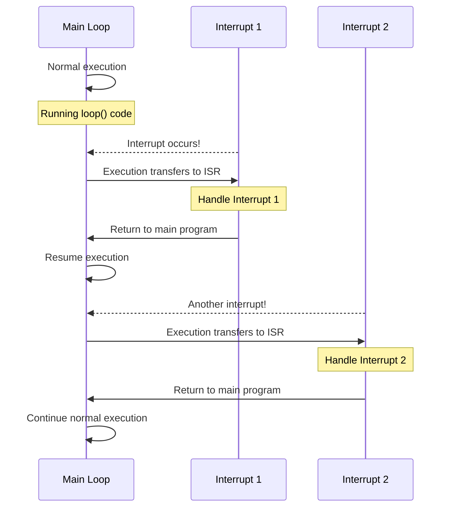

# Arduino Interrupts Advanced

## Introduction

Interrupts are powerful mechanisms in embedded systems that allow your Arduino to respond immediately to important events. While basic interrupts help you respond to simple events like button presses, advanced interrupt techniques enable more sophisticated applications by providing ways to handle multiple interrupt sources, manage priorities, and create more reliable and responsive systems.

In this tutorial, we'll dive deeper into Arduino interrupts, building on basic concepts to explore advanced techniques that will take your projects to the next level. We'll cover interrupt priorities, multiple interrupt handling, volatile variables, interrupt service routine (ISR) optimization, and practical applications.

## Prerequisites

Before proceeding, you should:
- Have a basic understanding of Arduino programming
- Be familiar with basic interrupt concepts
- Know how to use `attachInterrupt()` and digital I/O

## Understanding Interrupt Limitations

Before diving into advanced techniques, it's important to understand Arduino's interrupt limitations:

1. **Limited Interrupt Pins**: Most Arduino boards have only 2-3 pins that support external interrupts
2. **Shared Interrupt Vectors**: Some pins may share the same interrupt vector
3. **No Nested Interrupts**: By default, Arduino doesn't support nested interrupts
4. **ISR Restrictions**: You can't use `delay()` inside an ISR, and `millis()` won't update during an ISR

## Pin Change Interrupts (PCINTs)

While external interrupts are limited to specific pins, Pin Change Interrupts (PCINTs) allow you to monitor almost any digital pin for changes.

### How PCINTs Work

Unlike external interrupts that can trigger on rising, falling, or changing states, PCINTs only trigger when a pin changes state (either high-to-low or low-to-high). They're grouped into "ports" with multiple pins sharing one interrupt vector.

### Implementing PCINTs

Here's how to implement PCINTs using the `PinChangeInterrupt` library:

```cpp
#include <PinChangeInterrupt.h>

const byte PIN_A = 8;  // Any digital pin
const byte PIN_B = 9;  // Any digital pin
volatile byte stateA = LOW;
volatile byte stateB = LOW;

void setup() {
  pinMode(PIN_A, INPUT_PULLUP);
  pinMode(PIN_B, INPUT_PULLUP);
  Serial.begin(9600);
  
  // Attach pin change interrupts
  attachPCINT(digitalPinToPCINT(PIN_A), handlePinA, CHANGE);
  attachPCINT(digitalPinToPCINT(PIN_B), handlePinB, CHANGE);
}

void loop() {
  Serial.print("State A: ");
  Serial.print(stateA);
  Serial.print("\tState B: ");
  Serial.println(stateB);
  delay(1000);
}

// ISR for PIN_A
void handlePinA() {
  stateA = !stateA;
}

// ISR for PIN_B
void handlePinB() {
  stateB = !stateB;
}
```

This code monitors two pins that aren't traditional interrupt pins and toggles their respective state variables when triggered.

## Multiple Interrupt Sources

Managing multiple interrupt sources requires careful planning to prevent conflicts and ensure reliable operation.

### Using Different Interrupt Types

You can combine external interrupts with pin change interrupts to monitor more pins:

```cpp
#include <PinChangeInterrupt.h>

const byte EXT_INT_PIN = 2;     // External interrupt pin
const byte PCINT_PIN = 8;       // Pin change interrupt pin
volatile unsigned long extCount = 0;
volatile unsigned long pcintCount = 0;

void setup() {
  pinMode(EXT_INT_PIN, INPUT_PULLUP);
  pinMode(PCINT_PIN, INPUT_PULLUP);
  Serial.begin(9600);
  
  // Attach external interrupt
  attachInterrupt(digitalPinToInterrupt(EXT_INT_PIN), handleExtInt, FALLING);
  
  // Attach pin change interrupt
  attachPCINT(digitalPinToPCINT(PCINT_PIN), handlePCInt, FALLING);
}

void loop() {
  Serial.print("External interrupts: ");
  Serial.print(extCount);
  Serial.print("\tPin change interrupts: ");
  Serial.println(pcintCount);
  delay(1000);
}

void handleExtInt() {
  extCount++;
}

void handlePCInt() {
  pcintCount++;
}
```

## Interrupt Priorities and Conflict Management

Arduino doesn't have built-in interrupt priority management, but you can implement strategies to handle priority:

### 1. Using Flags Instead of Direct Actions

Instead of performing complex operations in an ISR, set flags that the main loop checks:

```cpp
volatile bool highPriorityFlag = false;
volatile bool lowPriorityFlag = false;

void setup() {
  // Setup interrupt pins and attach ISRs
  attachInterrupt(digitalPinToInterrupt(2), highPriorityISR, RISING);
  attachInterrupt(digitalPinToInterrupt(3), lowPriorityISR, RISING);
}

void loop() {
  // Check for high priority flag first
  if (highPriorityFlag) {
    handleHighPriorityTask();
    highPriorityFlag = false;
  }
  
  // Then check for low priority flag
  if (lowPriorityFlag) {
    handleLowPriorityTask();
    lowPriorityFlag = false;
  }
  
  // Regular program tasks
  performRegularTasks();
}

void highPriorityISR() {
  highPriorityFlag = true;
}

void lowPriorityISR() {
  lowPriorityFlag = true;
}
```

### 2. Temporarily Disabling Interrupts

For critical sections, you can disable and re-enable interrupts:

```cpp
void criticalFunction() {
  // Disable interrupts
  noInterrupts();
  
  // Critical code that shouldn't be interrupted
  // ...
  
  // Re-enable interrupts
  interrupts();
}
```

## Advanced ISR Optimization

### Keep ISRs Short and Fast

Long ISRs can cause your program to miss other interrupts:

```cpp
// BAD: Long ISR
void badISR() {
  // Complex calculations
  for (int i = 0; i < 1000; i++) {
    complexCalculation();
  }
}

// GOOD: Short ISR with flag
volatile bool needsCalculation = false;

void goodISR() {
  needsCalculation = true;  // Just set a flag
}

void loop() {
  if (needsCalculation) {
    // Do complex calculations in the main loop
    for (int i = 0; i < 1000; i++) {
      complexCalculation();
    }
    needsCalculation = false;
  }
}
```

### Using Circular Buffers for Data Collection

For high-speed data collection in ISRs, circular buffers provide an efficient way to store data without blocking:

```cpp
#define BUFFER_SIZE 64
volatile uint16_t buffer[BUFFER_SIZE];
volatile uint8_t writeIndex = 0;
volatile uint8_t readIndex = 0;

// In the ISR
void dataReadyISR() {
  // Read sensor data
  uint16_t sensorValue = analogRead(A0);
  
  // Store in buffer
  buffer[writeIndex] = sensorValue;
  
  // Update write index with wrap-around
  writeIndex = (writeIndex + 1) % BUFFER_SIZE;
}

// In the main loop
void processBuffer() {
  while (readIndex != writeIndex) {
    // Process data
    uint16_t value = buffer[readIndex];
    processValue(value);
    
    // Update read index with wrap-around
    readIndex = (readIndex + 1) % BUFFER_SIZE;
  }
}
```

## Hardware Timer Interrupts

Arduino has built-in timers that can trigger interrupts at precise intervals. These are useful for tasks that need exact timing.

### Configuring Timer Interrupts

Here's an example using Timer1 to generate a 1Hz interrupt on an Arduino Uno:

```cpp
#include <TimerOne.h>

volatile unsigned long secondsElapsed = 0;

void setup() {
  Serial.begin(9600);
  Timer1.initialize(1000000);  // Initialize timer for 1,000,000 microseconds (1 second)
  Timer1.attachInterrupt(timerISR);  // Attach the interrupt service routine
}

void loop() {
  Serial.print("Seconds elapsed: ");
  Serial.println(secondsElapsed);
  delay(100);
}

void timerISR() {
  secondsElapsed++;
}
```

## External Interrupt Masking and Port Manipulation

For ultimate control and speed, you can directly manipulate the interrupt registers:

```cpp
void setup() {
  // Set pin 2 as input with pullup
  DDRD &= ~(1 << DDD2);
  PORTD |= (1 << PORTD2);
  
  // Configure INT0 (pin 2) to trigger on falling edge
  EICRA |= (1 << ISC01);
  EICRA &= ~(1 << ISC00);
  
  // Enable INT0 interrupt
  EIMSK |= (1 << INT0);
  
  // Enable global interrupts
  sei();
}

// Interrupt service routine for INT0
ISR(INT0_vect) {
  // Handle interrupt
}
```

## Advanced Debouncing with Interrupts

Button debouncing is crucial for reliable interrupts. Here's an advanced debouncing technique using timestamps:

```cpp
const byte BUTTON_PIN = 2;
volatile unsigned long lastDebounceTime = 0;
volatile bool buttonState = false;
const unsigned long DEBOUNCE_DELAY = 50;  // milliseconds

void setup() {
  pinMode(BUTTON_PIN, INPUT_PULLUP);
  attachInterrupt(digitalPinToInterrupt(BUTTON_PIN), buttonISR, FALLING);
  Serial.begin(9600);
}

void loop() {
  // Check if button was pressed (debounced)
  static bool lastReportedState = false;
  
  if (buttonState != lastReportedState) {
    Serial.println("Button pressed!");
    lastReportedState = buttonState;
  }
}

void buttonISR() {
  unsigned long currentTime = millis();
  
  // If enough time has passed since last trigger
  if ((currentTime - lastDebounceTime) > DEBOUNCE_DELAY) {
    buttonState = true;
    lastDebounceTime = currentTime;
  }
}
```

## Real-World Application: Multi-Sensor Monitoring System

Let's implement a system that monitors temperature and motion simultaneously using interrupts.

```cpp
#include <PinChangeInterrupt.h>

// Pin definitions
const byte MOTION_PIN = 2;      // External interrupt
const byte TEMP_ALERT_PIN = 8;  // Pin change interrupt

// Flags for event handling
volatile bool motionDetected = false;
volatile bool tempAlert = false;

// Time tracking
unsigned long lastMotionTime = 0;
unsigned long lastTempAlertTime = 0;

void setup() {
  pinMode(MOTION_PIN, INPUT);
  pinMode(TEMP_ALERT_PIN, INPUT_PULLUP);
  Serial.begin(9600);
  
  // Attach interrupts
  attachInterrupt(digitalPinToInterrupt(MOTION_PIN), motionISR, RISING);
  attachPCINT(digitalPinToPCINT(TEMP_ALERT_PIN), tempAlertISR, FALLING);
  
  Serial.println("Multi-sensor monitoring system ready");
}

void loop() {
  // Handle motion events
  if (motionDetected) {
    Serial.print("Motion detected at ");
    Serial.print(lastMotionTime);
    Serial.println(" ms");
    
    // Take action (e.g., activate camera, sound alarm)
    activateCamera();
    
    motionDetected = false;  // Reset flag
  }
  
  // Handle temperature alerts
  if (tempAlert) {
    Serial.print("Temperature threshold exceeded at ");
    Serial.print(lastTempAlertTime);
    Serial.println(" ms");
    
    // Take action (e.g., activate cooling, send alert)
    activateCooling();
    
    tempAlert = false;  // Reset flag
  }
  
  // Regular system tasks
  performRegularMonitoring();
  delay(100);
}

// ISR for motion detection
void motionISR() {
  lastMotionTime = millis();
  motionDetected = true;
}

// ISR for temperature alert
void tempAlertISR() {
  lastTempAlertTime = millis();
  tempAlert = true;
}

// Simulate activating a camera
void activateCamera() {
  Serial.println("Camera activated");
}

// Simulate activating cooling
void activateCooling() {
  Serial.println("Cooling system activated");
}

// Regular system monitoring
void performRegularMonitoring() {
  // Read sensors, log data, etc.
}
```

## Visualizing Interrupt Flow

To better understand how interrupts work within your program, here's a sequence diagram showing the flow of execution:



## Common Pitfalls and Solutions

### 1. Forgetting `volatile` for Shared Variables

**Problem**: Variables modified in ISRs but read in the main loop may not update properly.

**Solution**: Always use the `volatile` keyword.

```cpp
// WRONG
int counter = 0;

// CORRECT
volatile int counter = 0;
```

### 2. Using `Serial` in ISRs

**Problem**: Serial operations are slow and can cause issues in ISRs.

**Solution**: Set flags and handle Serial communication in the main loop.

```cpp
// WRONG
void badISR() {
  Serial.println("Interrupt occurred!");  // Don't do this!
}

// CORRECT
volatile bool interruptOccurred = false;

void goodISR() {
  interruptOccurred = true;
}

void loop() {
  if (interruptOccurred) {
    Serial.println("Interrupt occurred!");
    interruptOccurred = false;
  }
}
```

### 3. Long ISRs Blocking Other Interrupts

**Problem**: Long-running ISRs can prevent other interrupts from being handled.

**Solution**: Keep ISRs short and use flags to defer processing to the main loop.

### 4. Not Handling Race Conditions

**Problem**: Data corruption can occur when both the ISR and main code access the same variables.

**Solution**: Use atomic operations or disable interrupts during critical sections.

```cpp
void updateCriticalValue() {
  noInterrupts();  // Disable interrupts
  criticalValue = newCalculatedValue;
  interrupts();    // Re-enable interrupts
}
```

## Advanced Project: Precise Frequency Measurement

This example uses interrupts to accurately measure the frequency of an input signal:

```cpp
const byte FREQ_INPUT_PIN = 2;  // External interrupt pin
volatile unsigned long pulseCount = 0;
volatile unsigned long lastMicros = 0;
volatile unsigned long periodSum = 0;
volatile byte sampleCount = 0;

void setup() {
  pinMode(FREQ_INPUT_PIN, INPUT);
  Serial.begin(9600);
  
  // Configure interrupt on pin 2
  attachInterrupt(digitalPinToInterrupt(FREQ_INPUT_PIN), countPulse, RISING);
}

void loop() {
  // Measure for 1 second
  pulseCount = 0;
  periodSum = 0;
  sampleCount = 0;
  
  unsigned long startMillis = millis();
  while (millis() - startMillis < 1000) {
    // Wait for data collection via interrupts
  }
  
  // Calculate frequency and period
  float frequency = pulseCount;  // pulses per second = Hz
  float avgPeriod = 0;
  
  if (sampleCount > 0) {
    avgPeriod = periodSum / (float)sampleCount / 1000.0;  // in milliseconds
  }
  
  // Display results
  Serial.print("Frequency: ");
  Serial.print(frequency);
  Serial.print(" Hz, Period: ");
  Serial.print(avgPeriod);
  Serial.println(" ms");
  
  delay(1000);
}

void countPulse() {
  // Count pulse
  pulseCount++;
  
  // Measure period between pulses
  unsigned long currentMicros = micros();
  if (lastMicros != 0) {
    unsigned long period = currentMicros - lastMicros;
    periodSum += period;
    sampleCount++;
  }
  lastMicros = currentMicros;
}
```

## Summary

Advanced interrupt techniques allow your Arduino to respond to multiple events simultaneously with precise timing. Key takeaways from this tutorial include:

1. **Multiple Interrupt Sources**: Combine external interrupts and PCINTs to monitor more pins
2. **Priority Management**: Implement your own priority system using flags and checking order
3. **Optimization**: Keep ISRs short and use flags to defer processing to the main loop
4. **Timer Interrupts**: Use hardware timers for precise timing requirements
5. **Practical Applications**: Implement sophisticated systems that respond to multiple events

By mastering these advanced interrupt techniques, you can create more responsive and efficient Arduino projects that handle complex, real-time requirements.

## Exercises

1. Create a digital clock using timer interrupts that keeps time even while the main loop is busy with other tasks.
2. Build a multi-button input system that uses pin change interrupts to detect presses on up to 8 buttons using just one interrupt vector.
3. Design a data logger that collects sensor data at precisely timed intervals using timer interrupts and stores it efficiently.
4. Implement a state machine that changes states based on external interrupts and performs different actions in each state.
5. Create a simple oscilloscope that uses interrupts to capture high-frequency signals and display them via Serial plotting.

## Additional Resources

- [Arduino Reference for attachInterrupt()](https://www.arduino.cc/reference/en/language/functions/external-interrupts/attachinterrupt/)
- [PinChangeInterrupt Library](https://github.com/NicoHood/PinChangeInterrupt)
- [TimerOne Library](https://github.com/PaulStoffregen/TimerOne)
- [AVR Interrupts Tutorial](https://www.nongnu.org/avr-libc/user-manual/group__avr__interrupts.html)