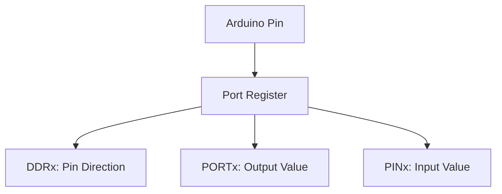

# Arduino Direct Port Manipulation

## Introduction

When you're working with Arduino, you've probably used functions like `digitalWrite()`, `digitalRead()`, and `pinMode()` to control pins. These functions are easy to use and understand, which makes them perfect for beginners. However, they come with a significant performance cost.

Direct Port Manipulation allows you to access Arduino's pins directly by manipulating the microcontroller's registers. This technique bypasses the standard Arduino functions, resulting in code that runs **20-50 times faster**. While more complex, mastering port manipulation unlocks new possibilities for timing-critical applications.

## Why Use Direct Port Manipulation?

Consider these advantages:

- **Speed**: Direct port access is much faster than using standard functions
- **Atomic operations**: Multiple pins can be changed simultaneously in a single operation
- **Precise timing control**: Critical for applications like generating precise signals
- **Reduced overhead**: Less CPU cycles used for I/O operations

However, there are also some drawbacks:

- **Reduced readability**: Code becomes more difficult to understand
- **Reduced portability**: Register names vary between microcontroller families
- **Steeper learning curve**: Requires understanding of microcontroller architecture

## Understanding Arduino's Port Architecture

Arduino boards use Atmel AVR microcontrollers (like the ATmega328P on the Uno). These microcontrollers organize their pins into logical groups called **ports**. Each port typically controls 8 pins (one byte).

On the Arduino Uno, there are three main ports:

- **Port B** (digital pins 8-13)
- **Port C** (analog input pins)
- **Port D** (digital pins 0-7)

Each port has three associated registers:

1. **DDRx** (Data Direction Register): Configures pins as inputs or outputs
2. **PORTx** (Port Register): Sets the output state of pins (HIGH or LOW)
3. **PINx** (Pin Register): Reads the current state of input pins

Where "x" represents the port letter (B, C, or D).



## Basic Port Manipulation

### Setting Pin Direction (Input/Output)

To configure pins as inputs or outputs, we use the DDRx registers:

```cpp
// Set digital pin 7 (PD7) as OUTPUT
DDRD |= (1 << DDD7);

// Set digital pin 2 (PD2) as INPUT
DDRD &= ~(1 << DDD2);
```

### Writing to Pins

To set pins HIGH or LOW, we use the PORTx registers:

```cpp
// Set digital pin 7 (PD7) HIGH
PORTD |= (1 << PORTD7);

// Set digital pin 7 (PD7) LOW
PORTD &= ~(1 << PORTD7);

// Toggle digital pin 7 (PD7)
PORTD ^= (1 << PORTD7);
```

### Reading from Pins

To read the state of pins, we use the PINx registers:

```cpp
// Read digital pin 2 (PD2)
if (PIND & (1 << PIND2)) {
  // Pin is HIGH
} else {
  // Pin is LOW
}
```

## Arduino Pin Mapping to AVR Ports

Understanding how Arduino pins map to the microcontroller's ports is crucial. Here's the mapping for the Arduino Uno (ATmega328P):

| Arduino Pin | Port | Port Pin |
|-------------|------|----------|
| 0           | D    | PD0      |
| 1           | D    | PD1      |
| 2           | D    | PD2      |
| 3           | D    | PD3      |
| 4           | D    | PD4      |
| 5           | D    | PD5      |
| 6           | D    | PD6      |
| 7           | D    | PD7      |
| 8           | B    | PB0      |
| 9           | B    | PB1      |
| 10          | B    | PB2      |
| 11          | B    | PB3      |
| 12          | B    | PB4      |
| 13          | B    | PB5      |
| A0          | C    | PC0      |
| A1          | C    | PC1      |
| A2          | C    | PC2      |
| A3          | C    | PC3      |
| A4          | C    | PC4      |
| A5          | C    | PC5      |

## Bit Manipulation Operators

Port manipulation relies heavily on bitwise operations:

- `|=` (OR): Sets specific bits to 1
- `&=` (AND): When used with ~ (NOT), clears specific bits to 0
- `^=` (XOR): Toggles specific bits

```cpp
// Using binary for clarity
PORTD = B00100010;  // Set pins 5 and 1 HIGH, rest LOW

// Same operation using bitshift
PORTD = (1 << PD5) | (1 << PD1);
```

## Practical Examples

### Example 1: High-Speed LED Blinking

Using standard Arduino functions:

```cpp
void setup() {
  pinMode(13, OUTPUT);
}

void loop() {
  digitalWrite(13, HIGH);
  digitalWrite(13, LOW);
}
```

Using direct port manipulation (much faster):

```cpp
void setup() {
  DDRB |= (1 << DDB5);  // Set pin 13 (PB5) as output
}

void loop() {
  PORTB |= (1 << PORTB5);  // Set pin 13 HIGH
  PORTB &= ~(1 << PORTB5); // Set pin 13 LOW
}
```

### Example 2: Reading Multiple Buttons at Once

Imagine you have buttons connected to pins 2, 3, 4, and 5 (all on Port D):

```cpp
void setup() {
  // Set pins 2-5 as inputs with pull-up resistors
  DDRD &= ~((1 << DDD2) | (1 << DDD3) | (1 << DDD4) | (1 << DDD5));
  PORTD |= ((1 << PORTD2) | (1 << PORTD3) | (1 << PORTD4) | (1 << PORTD5));
  
  Serial.begin(9600);
}

void loop() {
  // Read all buttons in a single operation (bits will be 0 if pressed because of pull-up)
  byte buttonStates = PIND & ((1 << PIND2) | (1 << PIND3) | (1 << PIND4) | (1 << PIND5));
  
  // Check individual buttons
  bool button2Pressed = !(buttonStates & (1 << PIND2));
  bool button3Pressed = !(buttonStates & (1 << PIND3));
  bool button4Pressed = !(buttonStates & (1 << PIND4));
  bool button5Pressed = !(buttonStates & (1 << PIND5));
  
  // Print results
  Serial.print("Buttons: ");
  Serial.print(button2Pressed ? "2 " : "- ");
  Serial.print(button3Pressed ? "3 " : "- ");
  Serial.print(button4Pressed ? "4 " : "- ");
  Serial.println(button5Pressed ? "5" : "-");
  
  delay(100);
}
```

### Example 3: Generating Precise Timing Signals

This example generates a 1MHz square wave (using a 16MHz Arduino):

```cpp
void setup() {
  DDRB |= (1 << DDB0);  // Set pin 8 (PB0) as output
  
  while(1) {
    PORTB |= (1 << PORTB0);   // Set pin HIGH
    asm("nop
 nop
 nop
"); // Delay with NOPs (No Operation)
    PORTB &= ~(1 << PORTB0);  // Set pin LOW
    asm("nop
 nop
 nop
"); // Delay with NOPs
  }
}

void loop() {
  // Empty loop, all work is done in setup
}
```

## Advanced Techniques

### Atomic Operations

For operations where timing is critical, use atomic operations to ensure they can't be interrupted:

```cpp
// Non-atomic (can be interrupted between operations)
PORTD |= (1 << PORTD4);
PORTD |= (1 << PORTD5);

// Atomic (sets both pins in a single operation)
PORTD |= ((1 << PORTD4) | (1 << PORTD5));
```

### Manipulating Multiple Pins

To change multiple pins at once:

```cpp
// Set pins 0, 1, and 2 on Port B, without affecting other pins
PORTB = (PORTB & B11111000) | B00000111;

// Or using bitshift
PORTB = (PORTB & ~((1 << PORTB0) | (1 << PORTB1) | (1 << PORTB2))) | 
                  ((1 << PORTB0) | (1 << PORTB1) | (1 << PORTB2));
```

### Using Preprocessor Macros

For better code readability, you can define macros:

```cpp
#define LED_PIN PB5  // Arduino pin 13
#define LED_OUTPUT_MODE() DDRB |= (1 << LED_PIN)
#define LED_ON() PORTB |= (1 << LED_PIN)
#define LED_OFF() PORTB &= ~(1 << LED_PIN)
#define LED_TOGGLE() PORTB ^= (1 << LED_PIN)

void setup() {
  LED_OUTPUT_MODE();
}

void loop() {
  LED_ON();
  delay(500);
  LED_OFF();
  delay(500);
  LED_TOGGLE();
  delay(500);
}
```

## Performance Comparison

Let's compare the performance of standard Arduino functions with direct port manipulation:

```cpp
void setup() {
  pinMode(13, OUTPUT);
  Serial.begin(9600);
  
  // Test digitalWrite performance
  unsigned long startTime = micros();
  for (int i = 0; i < 1000; i++) {
    digitalWrite(13, HIGH);
    digitalWrite(13, LOW);
  }
  unsigned long endTime = micros();
  Serial.print("digitalWrite time (us): ");
  Serial.println(endTime - startTime);
  
  // Test direct port manipulation performance
  startTime = micros();
  for (int i = 0; i < 1000; i++) {
    PORTB |= (1 << PORTB5);
    PORTB &= ~(1 << PORTB5);
  }
  endTime = micros();
  Serial.print("Direct port time (us): ");
  Serial.println(endTime - startTime);
}

void loop() {}
```

Typical output from this code:
```
digitalWrite time (us): 7960
Direct port time (us): 320
```

This demonstrates that direct port manipulation is about 25 times faster than using `digitalWrite()`.

## Real-World Applications

Direct port manipulation is especially useful for:

1. **Software-based protocols**: When implementing timing-sensitive communication protocols
2. **LED matrix control**: When driving multiple LEDs simultaneously
3. **High-speed sensor reading**: When sampling sensors at high frequencies
4. **Audio generation**: When precise timing is required for sound synthesis
5. **Motor control**: For applications requiring precise PWM timing

## Port Manipulation on Different Arduino Boards

While the concepts remain the same, different Arduino boards use different microcontrollers with different port mappings:

### Arduino Mega (ATmega2560)
- Has additional ports (A-L)
- Digital pins 22-29 are on Port A
- More complex mapping due to more pins

### Arduino Leonardo (ATmega32u4)
- Uses different port mapping
- Digital pins 0-7 are spread across different ports

Always consult your specific microcontroller's datasheet for the correct port mappings.

## Common Mistakes and Troubleshooting

1. **Forgetting to set pin direction**: Always configure DDRx before using PORTx
2. **Unintentionally changing other pins**: Be careful when setting whole ports
3. **Mixing direct port access with Arduino functions**: Avoid using both for the same pins
4. **Incorrect port mapping**: Double-check which pin maps to which port

## Summary

Direct Port Manipulation provides a powerful way to control Arduino's I/O pins with maximum speed and efficiency. While it requires a deeper understanding of the microcontroller's architecture, the performance benefits make it essential for timing-critical applications.

Key takeaways:
- Direct port manipulation is 20-50 times faster than standard Arduino functions
- Pins are organized into ports (B, C, D on the Arduino Uno)
- Each port has three registers: DDRx (direction), PORTx (output), PINx (input)
- Bitwise operations are used to manipulate individual pins

## Exercises

1. Write code to blink an LED on pin 10 using only port manipulation
2. Create a program that reads the state of a button on pin 2 and controls an LED on pin 8 using port manipulation
3. Modify the high-speed LED blinking example to alternate between two LEDs (pins 12 and 13)
4. Implement a simple binary counter using 8 LEDs connected to pins 0-7 (Port D)
5. Write a function that converts an Arduino pin number to its corresponding port and bit position

## Further Resources

- [ATmega328P Datasheet](https://ww1.microchip.com/downloads/en/DeviceDoc/Atmel-7810-Automotive-Microcontrollers-ATmega328P_Datasheet.pdf)
- [AVR Libc Manual](https://www.nongnu.org/avr-libc/user-manual/index.html)
- [Arduino Reference for Port Registers](https://www.arduino.cc/en/Reference/PortManipulation)