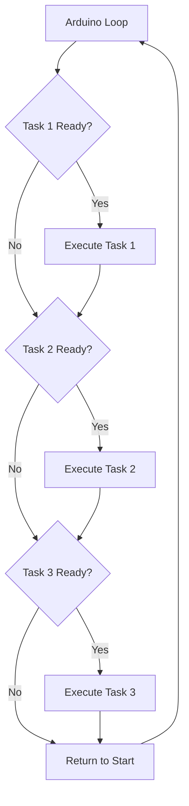

# Arduino Multitasking

## Introduction

When building Arduino projects, you'll often need your microcontroller to handle multiple tasks simultaneously. For example, you might want to read a sensor, control a motor, blink an LED, and respond to button presses—all at the same time.

However, Arduino doesn't support true multithreading like desktop computers. The microcontroller has a single core that can only execute one instruction at a time. So how can we make it appear to handle multiple tasks concurrently?

In this tutorial, we'll explore techniques for implementing effective multitasking on Arduino, allowing your projects to become more responsive and capable.

## The Problem with `delay()`

Many beginners start with code that uses the `delay()` function:

```cpp
void loop() {
  digitalWrite(LED_PIN, HIGH);
  delay(1000);                    // Wait for 1 second
  digitalWrite(LED_PIN, LOW);
  delay(1000);                    // Wait for 1 second
}
```

While this works for simple projects, it creates a major problem: during those delays, your Arduino can't do anything else. If you need to respond to a button press or read a sensor during that delay, you're stuck waiting.

This is where multitasking techniques come in.

## Multitasking Approaches for Arduino

### 1. Using `millis()` Instead of `delay()`

The most common approach to Arduino multitasking is replacing `delay()` with non-blocking time checks using the `millis()` function.

```cpp
const int LED_PIN = 13;
unsigned long previousMillis = 0;
const long interval = 1000;  // Interval in milliseconds (1 second)
int ledState = LOW;

void setup() {
  pinMode(LED_PIN, OUTPUT);
}

void loop() {
  // Current time
  unsigned long currentMillis = millis();

  // Check if it's time to toggle the LED
  if (currentMillis - previousMillis >= interval) {
    previousMillis = currentMillis;  // Save the last time LED was toggled

    // Toggle LED state
    ledState = (ledState == LOW) ? HIGH : LOW;
    digitalWrite(LED_PIN, ledState);
  }

  // Other code can run here without being blocked!
}
```

The key advantage here is that the `loop()` function keeps running continuously, checking the time instead of stopping for a fixed period. This allows you to add other tasks to the same loop.

### 2. State Machines

For more complex behaviors, state machines provide an organized way to manage multiple tasks:

```cpp
// State machine example with LED and button
const int LED_PIN = 13;
const int BUTTON_PIN = 2;
unsigned long ledPreviousMillis = 0;
unsigned long buttonPreviousMillis = 0;
const long ledInterval = 1000;     // LED blink interval
const long debounceTime = 50;      // Button debounce time

int ledState = LOW;
int buttonState = HIGH;            // Assume pull-up resistor
int lastButtonState = HIGH;

enum SystemState {
  NORMAL,
  FAST_BLINK,
  ALWAYS_ON
};

SystemState currentState = NORMAL;

void setup() {
  pinMode(LED_PIN, OUTPUT);
  pinMode(BUTTON_PIN, INPUT_PULLUP);
  Serial.begin(9600);
}

void loop() {
  unsigned long currentMillis = millis();
  
  // Button handling with debounce
  if (currentMillis - buttonPreviousMillis >= debounceTime) {
    int reading = digitalRead(BUTTON_PIN);
    
    if (reading != lastButtonState) {
      buttonPreviousMillis = currentMillis;
      lastButtonState = reading;
      
      // If button is pressed (LOW with pull-up resistor)
      if (reading == LOW) {
        // Change state on button press
        switch (currentState) {
          case NORMAL:
            currentState = FAST_BLINK;
            Serial.println("Mode: Fast Blink");
            break;
          case FAST_BLINK:
            currentState = ALWAYS_ON;
            Serial.println("Mode: Always On");
            break;
          case ALWAYS_ON:
            currentState = NORMAL;
            Serial.println("Mode: Normal");
            break;
        }
      }
    }
  }
  
  // LED control based on current state
  switch (currentState) {
    case NORMAL:
      // Normal blinking (1 second interval)
      if (currentMillis - ledPreviousMillis >= ledInterval) {
        ledPreviousMillis = currentMillis;
        ledState = (ledState == LOW) ? HIGH : LOW;
        digitalWrite(LED_PIN, ledState);
      }
      break;
      
    case FAST_BLINK:
      // Fast blinking (250ms interval)
      if (currentMillis - ledPreviousMillis >= ledInterval / 4) {
        ledPreviousMillis = currentMillis;
        ledState = (ledState == LOW) ? HIGH : LOW;
        digitalWrite(LED_PIN, ledState);
      }
      break;
      
    case ALWAYS_ON:
      // Always on
      digitalWrite(LED_PIN, HIGH);
      break;
  }
  
  // Other tasks can be added here
}
```

This state machine approach keeps track of what mode the system is in, and each state can have different behaviors.

### 3. Task Scheduler Pattern

For more advanced multitasking, we can create a simple task scheduler pattern:

```cpp
// Simplified task scheduler
typedef struct {
  unsigned long interval;     // Task interval in milliseconds  
  unsigned long previousMillis;  // Last time task was executed
  void (*callback)();         // Function to call
  bool enabled;               // Enable/disable task
} Task;

// Define tasks
void blinkLed();
void readSensor();
void checkButton();

// Create task array
Task tasks[] = {
  {100, 0, blinkLed, true},      // Task 1: Blink LED every 100ms
  {1000, 0, readSensor, true},   // Task 2: Read sensor every 1000ms
  {50, 0, checkButton, true}     // Task 3: Check button every 50ms
};

const int numTasks = sizeof(tasks) / sizeof(Task);

// Task function implementations
const int LED_PIN = 13;
int ledState = LOW;

void blinkLed() {
  ledState = (ledState == LOW) ? HIGH : LOW;
  digitalWrite(LED_PIN, ledState);
}

const int SENSOR_PIN = A0;

void readSensor() {
  int sensorValue = analogRead(SENSOR_PIN);
  Serial.print("Sensor value: ");
  Serial.println(sensorValue);
}

const int BUTTON_PIN = 2;
int lastButtonState = HIGH;

void checkButton() {
  int buttonState = digitalRead(BUTTON_PIN);
  
  if (buttonState != lastButtonState) {
    if (buttonState == LOW) {  // Button pressed
      Serial.println("Button pressed!");
    }
    lastButtonState = buttonState;
  }
}

void setup() {
  pinMode(LED_PIN, OUTPUT);
  pinMode(BUTTON_PIN, INPUT_PULLUP);
  Serial.begin(9600);
}

void loop() {
  unsigned long currentMillis = millis();
  
  // Run through all tasks
  for (int i = 0; i < numTasks; i++) {
    if (tasks[i].enabled && (currentMillis - tasks[i].previousMillis >= tasks[i].interval)) {
      tasks[i].previousMillis = currentMillis;
      tasks[i].callback();  // Call the task function
    }
  }
}
```

With this pattern, you can easily add, remove, or modify tasks without restructuring your entire program.

## Visualizing Arduino Multitasking

Let's visualize how multitasking works on Arduino:



The Arduino continuously checks if each task is ready to run, executes it if needed, and then moves to the next task.

## Advanced Multitasking Techniques

### Using Timer Interrupts

For timing-critical tasks, you can use hardware timer interrupts:

```cpp
#include <TimerOne.h>

const int LED_PIN = 13;
volatile int ledState = LOW;

void setup() {
  pinMode(LED_PIN, OUTPUT);
  
  // Initialize Timer1
  Timer1.initialize(500000);  // 500,000 microseconds = 0.5 seconds
  Timer1.attachInterrupt(blinkLed);  // Attach blink function to timer interrupt
  
  Serial.begin(9600);
  Serial.println("Timer interrupt example started");
}

void loop() {
  // Main code here runs independently of the LED blinking
  // You can do other tasks here
  delay(1000);
  Serial.println("Main loop is running");
}

// Timer interrupt function
void blinkLed() {
  ledState = !ledState;
  digitalWrite(LED_PIN, ledState);
}
```

The blink function runs precisely every 0.5 seconds, regardless of what's happening in the main loop.

### Task-oriented Programming with Protothreads

Although Arduino doesn't support true multithreading, you can use libraries like Protothreads to create a more thread-like programming model:

```cpp
#include <pt.h>

const int LED1_PIN = 13;
const int LED2_PIN = 12;

static struct pt pt1, pt2;

void setup() {
  pinMode(LED1_PIN, OUTPUT);
  pinMode(LED2_PIN, OUTPUT);
  
  PT_INIT(&pt1);
  PT_INIT(&pt2);
}

// Protothread for LED 1
static int protothreadLed1(struct pt *pt) {
  static unsigned long timestamp = 0;
  
  PT_BEGIN(pt);
  
  while(1) {
    digitalWrite(LED1_PIN, HIGH);
    timestamp = millis();
    PT_WAIT_UNTIL(pt, millis() - timestamp > 1000);
    
    digitalWrite(LED1_PIN, LOW);
    timestamp = millis();
    PT_WAIT_UNTIL(pt, millis() - timestamp > 1000);
  }
  
  PT_END(pt);
}

// Protothread for LED 2
static int protothreadLed2(struct pt *pt) {
  static unsigned long timestamp = 0;
  
  PT_BEGIN(pt);
  
  while(1) {
    digitalWrite(LED2_PIN, HIGH);
    timestamp = millis();
    PT_WAIT_UNTIL(pt, millis() - timestamp > 200);
    
    digitalWrite(LED2_PIN, LOW);
    timestamp = millis();
    PT_WAIT_UNTIL(pt, millis() - timestamp > 200);
  }
  
  PT_END(pt);
}

void loop() {
  protothreadLed1(&pt1);
  protothreadLed2(&pt2);
}
```

With Protothreads, you can write more sequential-looking code that still allows multitasking.

## Real-world Application Example

Let's create a practical example: a simple weather station that reads temperature and humidity, displays it on an LCD, and allows user interaction via buttons:

```cpp
#include <LiquidCrystal.h>
#include <DHT.h>

// Pin definitions
const int LCD_RS = 12, LCD_EN = 11, LCD_D4 = 5, LCD_D5 = 4, LCD_D6 = 3, LCD_D7 = 2;
const int DHT_PIN = 7;
const int BUTTON_NEXT = 8;
const int BUTTON_SELECT = 9;
const int LED_STATUS = 13;

// Initialize hardware
LiquidCrystal lcd(LCD_RS, LCD_EN, LCD_D4, LCD_D5, LCD_D6, LCD_D7);
DHT dht(DHT_PIN, DHT22);  // DHT22 or AM2302

// Display modes
enum DisplayMode {
  CURRENT_READINGS,
  MIN_MAX,
  GRAPH_VIEW,
  SETTINGS
};

DisplayMode currentMode = CURRENT_READINGS;

// Variables
float temperature = 0.0;
float humidity = 0.0;
float minTemp = 100.0, maxTemp = -40.0;
float minHum = 100.0, maxHum = 0.0;
bool ledState = LOW;
bool buttonNextState = HIGH;
bool buttonSelectState = HIGH;
bool lastButtonNextState = HIGH;
bool lastButtonSelectState = HIGH;

// Task timing
unsigned long readSensorPreviousMillis = 0;
unsigned long updateDisplayPreviousMillis = 0;
unsigned long blinkLedPreviousMillis = 0;
unsigned long checkButtonsPreviousMillis = 0;

const long READ_SENSOR_INTERVAL = 2000;    // Read sensor every 2 seconds
const long UPDATE_DISPLAY_INTERVAL = 1000; // Update display every 1 second
const long BLINK_LED_INTERVAL = 500;       // Blink LED every 0.5 seconds
const long CHECK_BUTTONS_INTERVAL = 50;    // Check buttons every 50ms (debounce)

void setup() {
  // Initialize LCD
  lcd.begin(16, 2);
  lcd.print("Weather Station");
  lcd.setCursor(0, 1);
  lcd.print("Initializing...");
  
  // Initialize sensor
  dht.begin();
  
  // Initialize buttons and LED
  pinMode(BUTTON_NEXT, INPUT_PULLUP);
  pinMode(BUTTON_SELECT, INPUT_PULLUP);
  pinMode(LED_STATUS, OUTPUT);
  
  // Give time for sensors to stabilize
  delay(2000);
  
  Serial.begin(9600);
  Serial.println("Weather Station Started");
}

void loop() {
  unsigned long currentMillis = millis();
  
  // Task 1: Read sensors
  if (currentMillis - readSensorPreviousMillis >= READ_SENSOR_INTERVAL) {
    readSensorPreviousMillis = currentMillis;
    readSensors();
  }
  
  // Task 2: Update display
  if (currentMillis - updateDisplayPreviousMillis >= UPDATE_DISPLAY_INTERVAL) {
    updateDisplayPreviousMillis = currentMillis;
    updateDisplay();
  }
  
  // Task 3: Blink status LED
  if (currentMillis - blinkLedPreviousMillis >= BLINK_LED_INTERVAL) {
    blinkLedPreviousMillis = currentMillis;
    blinkStatusLed();
  }
  
  // Task 4: Check buttons
  if (currentMillis - checkButtonsPreviousMillis >= CHECK_BUTTONS_INTERVAL) {
    checkButtonsPreviousMillis = currentMillis;
    checkButtons();
  }
}

void readSensors() {
  // Read temperature and humidity
  float newTemp = dht.readTemperature();
  float newHum = dht.readHumidity();
  
  // Check if readings are valid
  if (!isnan(newTemp) && !isnan(newHum)) {
    temperature = newTemp;
    humidity = newHum;
    
    // Update min/max values
    if (temperature < minTemp) minTemp = temperature;
    if (temperature > maxTemp) maxTemp = temperature;
    if (humidity < minHum) minHum = humidity;
    if (humidity > maxHum) maxHum = humidity;
    
    Serial.print("Temperature: ");
    Serial.print(temperature);
    Serial.print("°C, Humidity: ");
    Serial.print(humidity);
    Serial.println("%");
  }
}

void updateDisplay() {
  lcd.clear();
  
  switch (currentMode) {
    case CURRENT_READINGS:
      lcd.print("Temp: ");
      lcd.print(temperature, 1);
      lcd.print((char)223);
      lcd.print("C");
      
      lcd.setCursor(0, 1);
      lcd.print("Humidity: ");
      lcd.print(humidity, 1);
      lcd.print("%");
      break;
      
    case MIN_MAX:
      lcd.print("T: ");
      lcd.print(minTemp, 1);
      lcd.print("~");
      lcd.print(maxTemp, 1);
      lcd.print((char)223);
      lcd.print("C");
      
      lcd.setCursor(0, 1);
      lcd.print("H: ");
      lcd.print(minHum, 1);
      lcd.print("~");
      lcd.print(maxHum, 1);
      lcd.print("%");
      break;
      
    case GRAPH_VIEW:
      lcd.print("Graph View");
      lcd.setCursor(0, 1);
      
      // Simple text-based graph (10 positions)
      int tempPosition = map(temperature, 0, 40, 0, 10);
      for (int i = 0; i < 10; i++) {
        lcd.print(i == tempPosition ? "*" : "-");
      }
      break;
      
    case SETTINGS:
      lcd.print("Settings");
      lcd.setCursor(0, 1);
      lcd.print("Press SEL: Reset");
      break;
  }
}

void blinkStatusLed() {
  ledState = !ledState;
  digitalWrite(LED_STATUS, ledState);
}

void checkButtons() {
  // Read button states
  buttonNextState = digitalRead(BUTTON_NEXT);
  buttonSelectState = digitalRead(BUTTON_SELECT);
  
  // Handle NEXT button
  if (buttonNextState != lastButtonNextState) {
    if (buttonNextState == LOW) {  // Button pressed
      // Change display mode
      currentMode = (DisplayMode)((currentMode + 1) % 4);
      Serial.print("Mode changed to: ");
      Serial.println(currentMode);
    }
    lastButtonNextState = buttonNextState;
  }
  
  // Handle SELECT button
  if (buttonSelectState != lastButtonSelectState) {
    if (buttonSelectState == LOW) {  // Button pressed
      if (currentMode == SETTINGS) {
        // Reset min/max values
        minTemp = temperature;
        maxTemp = temperature;
        minHum = humidity;
        maxHum = humidity;
        Serial.println("Min/Max values reset");
      }
    }
    lastButtonSelectState = buttonSelectState;
  }
}
```

This weather station example demonstrates how to handle multiple tasks:
1. Reading sensor data periodically
2. Updating the LCD display
3. Blinking a status LED
4. Handling button inputs

Each task runs on its own schedule without interfering with the others.

## Memory Considerations

Arduino has limited memory, so be careful when implementing multitasking solutions. Some tips:

1. Use `static` variables inside functions to reduce stack usage
2. Be cautious with task schedulers that use many function pointers
3. Monitor memory usage with `Serial.print(freeMemory())` (requires MemoryFree library)
4. Choose appropriate data types (e.g., `byte` instead of `int` for small values)

## Summary

Arduino multitasking allows your microcontroller to handle multiple tasks concurrently without true multithreading. The key techniques we've covered are:

1. **Non-blocking timing with `millis()`** - Replace `delay()` to keep your code responsive
2. **State machines** - Organize complex behaviors into clear states
3. **Task schedulers** - Manage multiple tasks with their own timing
4. **Timer interrupts** - Handle timing-critical tasks with precision
5. **Protothreads** - Create thread-like code that's easier to read

By applying these techniques, you can create more responsive, capable Arduino projects that handle multiple operations simultaneously.

## Exercises

1. Modify the basic `millis()` example to control three LEDs with different blink patterns.
2. Create a state machine for a traffic light system with normal operation and blinking yellow emergency mode.
3. Implement a simple task scheduler to read three different sensors and output their values to the serial monitor.
4. Use the Protothreads library to implement a user interface with menu navigation and sensor readings.
5. Build a project that combines at least three simultaneous tasks of your choice.

## Additional Resources

- [Arduino millis() tutorial](https://www.arduino.cc/reference/en/language/functions/time/millis/)
- [State Machine Programming in Arduino](https://www.arduino.cc/en/Tutorial/StateChangeDetection)
- [Protothreads for Arduino](https://gitlab.com/airbornemint/arduino-protothreads)
- [TimerOne Library](https://playground.arduino.cc/Code/Timer1/)
- [Task Scheduling in Arduino](https://github.com/arkhipenko/TaskScheduler)