# Arduino Scheduling

## Introduction

When working on Arduino projects, you'll often need to handle multiple tasks simultaneously - blinking LEDs, reading sensors, updating displays, and responding to user input. Using the traditional `delay()` function blocks your program, making it impossible to do anything else during that time.

Arduino scheduling allows your microcontroller to juggle multiple tasks efficiently without using blocking delays. This is a critical skill for creating responsive, complex applications that can handle multiple operations concurrently.

## Why Avoid Using delay()?

Before we dive into scheduling techniques, let's understand why the `delay()` function is problematic for more complex projects:

```cpp
void loop() {
  digitalWrite(LED_PIN, HIGH);
  delay(1000);  // Blocks for 1 second - nothing else can happen!
  digitalWrite(LED_PIN, LOW);
  delay(1000);  // Blocks for another second
}
```

In this simple example, your Arduino can't do anything else during those one-second delays. If you needed to check a button press or read a sensor, you'd miss it entirely.

## Basic Scheduling Technique: millis()

The cornerstone of Arduino scheduling is the `millis()` function, which returns the number of milliseconds since your Arduino started running the current program.

### Blink Without delay()

Here's how to blink an LED without blocking the program:

```cpp
const int LED_PIN = 13;
unsigned long previousMillis = 0;
const long interval = 1000;  // Interval in milliseconds (1 second)
int ledState = LOW;

void setup() {
  pinMode(LED_PIN, OUTPUT);
}

void loop() {
  unsigned long currentMillis = millis();
  
  // Check if the interval has passed
  if (currentMillis - previousMillis >= interval) {
    previousMillis = currentMillis;  // Save the last time LED was updated
    
    // Toggle LED state
    ledState = (ledState == LOW) ? HIGH : LOW;
    digitalWrite(LED_PIN, ledState);
  }
  
  // Other code can run here without being blocked!
}
```

This approach allows your Arduino to perform other tasks in the loop while still maintaining the blinking behavior.

### Scheduling Multiple Tasks

To handle multiple tasks with different timing requirements, we can extend this concept:

```cpp
const int LED1_PIN = 13;
const int LED2_PIN = 12;

unsigned long previousMillisLED1 = 0;
unsigned long previousMillisLED2 = 0;

const long intervalLED1 = 1000;  // 1 second
const long intervalLED2 = 200;   // 0.2 seconds

int led1State = LOW;
int led2State = LOW;

void setup() {
  pinMode(LED1_PIN, OUTPUT);
  pinMode(LED2_PIN, OUTPUT);
}

void loop() {
  unsigned long currentMillis = millis();
  
  // Task 1: Blink LED1 every second
  if (currentMillis - previousMillisLED1 >= intervalLED1) {
    previousMillisLED1 = currentMillis;
    led1State = (led1State == LOW) ? HIGH : LOW;
    digitalWrite(LED1_PIN, led1State);
  }
  
  // Task 2: Blink LED2 every 0.2 seconds
  if (currentMillis - previousMillisLED2 >= intervalLED2) {
    previousMillisLED2 = currentMillis;
    led2State = (led2State == LOW) ? HIGH : LOW;
    digitalWrite(LED2_PIN, led2State);
  }
  
  // More tasks can be added here
}
```

## Task Scheduling Structure

For more complex projects, we can organize our code using a more structured approach:

```cpp
// Task timing variables
unsigned long task1PreviousMillis = 0;
unsigned long task2PreviousMillis = 0;
unsigned long task3PreviousMillis = 0;

const long task1Interval = 1000;   // Read sensor every second
const long task2Interval = 250;    // Update display every 250ms
const long task3Interval = 5000;   // Send data every 5 seconds

void setup() {
  Serial.begin(9600);
  // Initialize sensors, displays, etc.
}

void loop() {
  unsigned long currentMillis = millis();
  
  // Task 1: Read sensor
  if (currentMillis - task1PreviousMillis >= task1Interval) {
    task1PreviousMillis = currentMillis;
    readSensor();
  }
  
  // Task 2: Update display
  if (currentMillis - task2PreviousMillis >= task2Interval) {
    task2PreviousMillis = currentMillis;
    updateDisplay();
  }
  
  // Task 3: Send data
  if (currentMillis - task3PreviousMillis >= task3Interval) {
    task3PreviousMillis = currentMillis;
    sendData();
  }
}

void readSensor() {
  // Read sensor code here
  Serial.println("Reading sensor...");
}

void updateDisplay() {
  // Update display code here
  Serial.println("Updating display...");
}

void sendData() {
  // Send data code here
  Serial.println("Sending data...");
}
```

## Handling millis() Overflow

The `millis()` function returns an `unsigned long` value that will overflow after approximately 50 days. Here's how to handle that:

```cpp
unsigned long previousMillis = 0;
const long interval = 1000;

void loop() {
  unsigned long currentMillis = millis();
  
  // This comparison still works correctly even when overflow happens
  if (currentMillis - previousMillis >= interval) {
    previousMillis = currentMillis;
    // Task code here
  }
}
```

This works because of how unsigned arithmetic handles overflow in C++.

## Advanced Scheduling with Task Objects

For more complex applications, we can create a task-based system:

```cpp
class Task {
  private:
    unsigned long interval;
    unsigned long previousMillis;
    void (*callback)();
    
  public:
    Task(unsigned long _interval, void (*_callback)()) {
      interval = _interval;
      callback = _callback;
      previousMillis = 0;
    }
    
    void check() {
      unsigned long currentMillis = millis();
      if (currentMillis - previousMillis >= interval) {
        previousMillis = currentMillis;
        callback();
      }
    }
};

// Function prototypes
void blinkLed();
void readTemperature();

// Create task objects
Task blinkTask(1000, blinkLed);
Task tempTask(5000, readTemperature);

void setup() {
  pinMode(LED_BUILTIN, OUTPUT);
  Serial.begin(9600);
}

void loop() {
  blinkTask.check();
  tempTask.check();
  
  // Other non-blocking code can run here
}

void blinkLed() {
  static bool ledState = LOW;
  ledState = !ledState;
  digitalWrite(LED_BUILTIN, ledState);
}

void readTemperature() {
  // Simulate reading temperature
  Serial.println("Reading temperature sensor...");
}
```

## Using State Machines for Complex Tasks

For tasks with multiple stages, state machines offer a powerful scheduling approach:

```cpp
// LED sequence: OFF -> FADE IN -> STAY ON -> FADE OUT -> repeat
enum LedState {LED_OFF, FADING_IN, ON, FADING_OUT};
LedState currentState = LED_OFF;

const int LED_PIN = 9;  // PWM pin
unsigned long previousMillis = 0;
const long stateInterval = 2000;  // 2 seconds per state
int brightness = 0;

void setup() {
  pinMode(LED_PIN, OUTPUT);
}

void loop() {
  unsigned long currentMillis = millis();
  
  // State transition logic
  if (currentMillis - previousMillis >= stateInterval) {
    previousMillis = currentMillis;
    
    // Move to next state
    switch (currentState) {
      case LED_OFF:
        currentState = FADING_IN;
        brightness = 0;
        break;
      case FADING_IN:
        currentState = ON;
        brightness = 255;
        break;
      case ON:
        currentState = FADING_OUT;
        brightness = 255;
        break;
      case FADING_OUT:
        currentState = LED_OFF;
        brightness = 0;
        break;
    }
  }
  
  // State behavior logic
  switch (currentState) {
    case LED_OFF:
      analogWrite(LED_PIN, 0);
      break;
    case FADING_IN:
      // Calculate fade-in brightness
      brightness = map(currentMillis - previousMillis, 0, stateInterval, 0, 255);
      analogWrite(LED_PIN, brightness);
      break;
    case ON:
      analogWrite(LED_PIN, 255);
      break;
    case FADING_OUT:
      // Calculate fade-out brightness
      brightness = map(currentMillis - previousMillis, 0, stateInterval, 255, 0);
      analogWrite(LED_PIN, brightness);
      break;
  }
}
```

## Timer Libraries for Arduino

For more complex scheduling needs, consider using specialized libraries:

### SimpleTimer Library

```cpp
#include <SimpleTimer.h>

SimpleTimer timer;

void setup() {
  Serial.begin(9600);
  
  // Set up timed functions
  timer.setInterval(1000, doTask1);   // Run every 1 second
  timer.setInterval(5000, doTask2);   // Run every 5 seconds
  timer.setTimeout(10000, doOnce);    // Run once after 10 seconds
}

void loop() {
  timer.run();  // This keeps all timers running
}

void doTask1() {
  Serial.println("Task 1 running");
}

void doTask2() {
  Serial.println("Task 2 running");
}

void doOnce() {
  Serial.println("This runs just once after 10 seconds");
}
```

### TaskScheduler Library

```cpp
#include <TaskScheduler.h>

// Task prototypes
void blinkCallback();
void sensorCallback();

// Tasks
Task blinkTask(1000, TASK_FOREVER, &blinkCallback);
Task sensorTask(2000, TASK_FOREVER, &sensorCallback);

Scheduler runner;

void setup() {
  Serial.begin(9600);
  pinMode(LED_BUILTIN, OUTPUT);
  
  // Initialize the scheduler and add tasks
  runner.init();
  runner.addTask(blinkTask);
  runner.addTask(sensorTask);
  
  // Enable the tasks
  blinkTask.enable();
  sensorTask.enable();
}

void loop() {
  runner.execute();
}

void blinkCallback() {
  static bool ledState = LOW;
  ledState = !ledState;
  digitalWrite(LED_BUILTIN, ledState);
}

void sensorCallback() {
  Serial.println("Reading sensor...");
}
```

## A Real-World Example: Weather Station

Let's apply scheduling to a practical weather station project:

```cpp
#include <DHT.h>
#include <LiquidCrystal_I2C.h>

#define DHTPIN 2
#define DHTTYPE DHT22
#define BUTTON_PIN 3

DHT dht(DHTPIN, DHTTYPE);
LiquidCrystal_I2C lcd(0x27, 16, 2);

// Timing variables
unsigned long previousSensorMillis = 0;
unsigned long previousDisplayMillis = 0;
unsigned long previousLogMillis = 0;
unsigned long buttonDebounceMillis = 0;

// Intervals
const long sensorInterval = 2000;     // Read sensor every 2 seconds
const long displayInterval = 250;     // Update display 4 times per second
const long logInterval = 60000;       // Log data every minute
const long debounceTime = 50;         // Button debounce time

// Variables
float temperature = 0;
float humidity = 0;
int displayMode = 0;  // 0 = temp, 1 = humidity

void setup() {
  Serial.begin(9600);
  lcd.init();
  lcd.backlight();
  dht.begin();
  pinMode(BUTTON_PIN, INPUT_PULLUP);
  
  lcd.print("Weather Station");
  lcd.setCursor(0, 1);
  lcd.print("Initializing...");
  delay(1000);  // One-time initialization delay is acceptable
}

void loop() {
  unsigned long currentMillis = millis();
  
  // Task 1: Read sensor at regular intervals
  if (currentMillis - previousSensorMillis >= sensorInterval) {
    previousSensorMillis = currentMillis;
    readSensor();
  }
  
  // Task 2: Update display
  if (currentMillis - previousDisplayMillis >= displayInterval) {
    previousDisplayMillis = currentMillis;
    updateDisplay();
  }
  
  // Task 3: Log data to Serial
  if (currentMillis - previousLogMillis >= logInterval) {
    previousLogMillis = currentMillis;
    logData();
  }
  
  // Task 4: Check button (non-blocking)
  checkButton();
}

void readSensor() {
  // Read humidity and temperature from DHT sensor
  humidity = dht.readHumidity();
  temperature = dht.readTemperature();
  
  // Check if reads are valid
  if (isnan(humidity) || isnan(temperature)) {
    Serial.println("Failed to read from DHT sensor!");
    return;
  }
}

void updateDisplay() {
  lcd.clear();
  
  if (displayMode == 0) {
    lcd.print("Temperature:");
    lcd.setCursor(0, 1);
    lcd.print(temperature);
    lcd.print(" C");
  } else {
    lcd.print("Humidity:");
    lcd.setCursor(0, 1);
    lcd.print(humidity);
    lcd.print(" %");
  }
}

void logData() {
  Serial.print("Time: ");
  Serial.print(millis() / 1000);
  Serial.print("s, Temp: ");
  Serial.print(temperature);
  Serial.print("C, Humidity: ");
  Serial.print(humidity);
  Serial.println("%");
}

void checkButton() {
  static int lastButtonState = HIGH;
  int buttonState = digitalRead(BUTTON_PIN);
  
  // Check if button was pressed (with debounce)
  if (buttonState != lastButtonState) {
    unsigned long currentMillis = millis();
    
    if (currentMillis - buttonDebounceMillis >= debounceTime) {
      buttonDebounceMillis = currentMillis;
      
      // Button press detected (on release)
      if (buttonState == HIGH && lastButtonState == LOW) {
        // Toggle display mode
        displayMode = (displayMode == 0) ? 1 : 0;
      }
      
      lastButtonState = buttonState;
    }
  }
}
```

## Visualizing Task Scheduling

Here's a diagram showing how multiple tasks are scheduled over time:

```mermaid
gantt
  title Arduino Task Scheduling Timeline
  dateFormat s
  axisFormat %S
  
  section LED Blink
  Task 1 (1s interval)   :a1, 0, 1s
  Task 1 repeats         :a2, after a1, 1s
  Task 1 repeats again   :a3, after a2, 1s
  
  section Sensor Read
  Task 2 (2s interval)   :b1, 0, 2s
  Task 2 repeats         :b2, after b1, 2s
  
  section Display Update
  Task 3 (0.5s interval) :c1, 0, 0.5s
  Task 3 repeats         :c2, after c1, 0.5s
  Task 3 repeats again   :c3, after c2, 0.5s
  Task 3 repeats again   :c4, after c3, 0.5s
```



## Dealing with Long-Running Tasks

Some operations like writing to SD cards or connecting to WiFi can take a long time. Here's how to handle them:

```cpp
// State for long operation
bool longOperationRunning = false;
unsigned long longOperationStartTime = 0;
const long longOperationTimeout = 5000;  // 5 second timeout

void loop() {
  unsigned long currentMillis = millis();
  
  // Regular tasks
  handleRegularTasks();
  
  // Handle long-running operation with timeout
  if (longOperationRunning) {
    // Check for timeout
    if (currentMillis - longOperationStartTime >= longOperationTimeout) {
      // Operation timed out
      Serial.println("Operation timed out!");
      longOperationRunning = false;
    }
    else if (isOperationComplete()) {
      // Operation finished normally
      Serial.println("Operation completed successfully");
      longOperationRunning = false;
    }
    // Otherwise, operation is still running, continue
  }
  else if (needToStartLongOperation()) {
    // Start operation
    longOperationRunning = true;
    longOperationStartTime = currentMillis;
    startLongOperation();
  }
}

// Placeholder functions
void handleRegularTasks() {
  // Handle fast, regular tasks
}

bool isOperationComplete() {
  // Check if the operation is done
  return false;  // Placeholder
}

bool needToStartLongOperation() {
  // Determine if we need to start the operation
  return false;  // Placeholder
}

void startLongOperation() {
  // Begin the long-running task
  Serial.println("Starting long operation...");
}
```

## Common Pitfalls and Solutions

### 1. Logic Errors in Timing Calculations

```cpp
// INCORRECT approach - will never trigger
unsigned long previousMillis = millis();
if (millis() - previousMillis > interval) {
  // This never executes because previousMillis is reset each time
}

// CORRECT approach
unsigned long previousMillis = 0;  // Initialize once
void loop() {
  if (millis() - previousMillis > interval) {
    previousMillis = millis();  // Update only when interval passes
    // Do task
  }
}
```

### 2. Accidentally Blocking Code

```cpp
// INCORRECT - blocks execution
void loop() {
  // Non-blocking LED blink
  blinkLED();
  
  // But this blocks everything for 5 seconds!
  if (buttonPressed()) {
    delay(5000);
  }
}

// CORRECT - fully non-blocking
void loop() {
  blinkLED();
  
  // Handle button state without blocking
  static bool waitingAfterPress = false;
  static unsigned long buttonPressTime = 0;
  
  if (waitingAfterPress) {
    if (millis() - buttonPressTime >= 5000) {
      waitingAfterPress = false;
    }
  }
  else if (buttonPressed()) {
    buttonPressTime = millis();
    waitingAfterPress = true;
  }
}
```

### 3. Mishandling State Variables

```cpp
// INCORRECT - state resets each loop
void loop() {
  int ledState = LOW;  // Resets every loop!
  
  if (millis() - previousMillis >= interval) {
    previousMillis = millis();
    ledState = !ledState;  // No effect - always toggles from LOW
    digitalWrite(LED_PIN, ledState);
  }
}

// CORRECT - state persists
int ledState = LOW;  // Global or static variable
void loop() {
  if (millis() - previousMillis >= interval) {
    previousMillis = millis();
    ledState = !ledState;  // Properly toggles between LOW and HIGH
    digitalWrite(LED_PIN, ledState);
  }
}
```

## Summary

Arduino scheduling is a fundamental technique for creating responsive applications that can handle multiple tasks. By avoiding blocking delays and using timing functions like `millis()`, you can create Arduino programs that:

- Respond to inputs without missing events
- Handle multiple concurrent tasks
- Maintain precise timing for various operations
- Scale to complex applications with many components

The key concepts we've covered include:
- Using `millis()` instead of `delay()`
- Creating timing mechanisms for multiple independent tasks
- Building state machines for complex task sequences
- Utilizing libraries for more advanced scheduling
- Handling long-running operations without blocking

## Exercises

1. **Basic Scheduling**: Modify the basic blink example to control three LEDs with different blinking rates.

2. **Button Integration**: Create a program that blinks an LED but immediately responds when a button is pressed to change the blink rate.

3. **State Machine**: Implement a traffic light controller with proper timing sequences for red, yellow, and green lights.

4. **Advanced Challenge**: Create a data logger that reads from multiple sensors at different intervals and logs to Serial while maintaining a responsive user interface.

## Additional Resources

- [Arduino millis() Tutorial](https://www.arduino.cc/reference/en/language/functions/time/millis/)
- [State Machine Programming Techniques](https://www.arduino.cc/en/Tutorial/StateChangeDetection)
- [TaskScheduler Library](https://github.com/arkhipenko/TaskScheduler)
- [SimpleTimer Library](https://github.com/jfturcot/SimpleTimer)

Remember that effective scheduling is as much about good program design as it is about timing functions. By breaking your tasks into small, manageable pieces and thinking about how they interact, you can create complex Arduino applications that remain responsive and reliable.