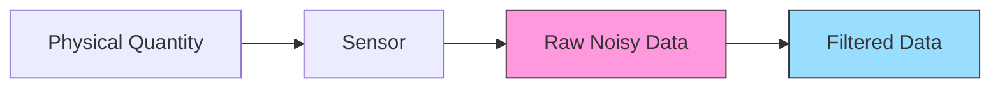

# Arduino Filtering

## Introduction

When working with Arduino projects that involve sensors, one of the most common challenges is dealing with noisy data. Sensors rarely provide perfectly clean readings - they often include random fluctuations, outliers, and interference that can make your measurements unreliable. This is where filtering comes in.

Filtering is the process of removing unwanted components or features from a signal while preserving the important information. For Arduino projects, filtering is essential for:

- Smoothing out noisy sensor readings
- Removing outliers and spikes
- Extracting meaningful trends from raw data
- Improving the accuracy of your measurements

In this guide, we'll explore several filtering techniques that you can implement on Arduino, from simple moving averages to more sophisticated algorithms. You'll learn when to use each method and how to implement them in your own projects.

## Understanding Noise in Sensor Data

Before diving into filtering techniques, it's important to understand what causes noise in sensor data:

1. **Electrical noise**: Interference from power supplies, motors, or nearby electronics
2. **Quantization errors**: Limitations in the analog-to-digital conversion process
3. **Environmental factors**: Temperature variations, vibrations, or electromagnetic interference
4. **Sensor limitations**: Physical constraints of the sensing elements

Here's an example of what noisy sensor data might look like compared to the actual physical quantity being measured:



## Simple Filtering Techniques

### 1. Moving Average Filter

The moving average filter is one of the simplest and most widely used filtering techniques. It works by averaging a fixed number of recent measurements to produce each filtered output value.

#### How it works:

1. Keep a buffer of the N most recent sensor readings
2. Calculate the average of these readings
3. Use this average as your filtered value
4. When a new reading arrives, drop the oldest reading and add the new one

#### Arduino Implementation:

```cpp
const int numReadings = 10;  // Number of samples to average
int readings[numReadings];   // Array to store readings
int readIndex = 0;           // Current position in the array
int total = 0;               // Running total
int average = 0;             // Moving average result

void setup() {
  Serial.begin(9600);
  
  // Initialize all readings to 0
  for (int i = 0; i < numReadings; i++) {
    readings[i] = 0;
  }
}

void loop() {
  // Subtract the oldest reading from the total
  total = total - readings[readIndex];
  
  // Read the sensor
  readings[readIndex] = analogRead(A0);
  
  // Add the new reading to the total
  total = total + readings[readIndex];
  
  // Advance to the next position in the array
  readIndex = (readIndex + 1) % numReadings;
  
  // Calculate the average
  average = total / numReadings;
  
  // Print the results
  Serial.print("Raw: ");
  Serial.print(readings[readIndex]);
  Serial.print("\tFiltered: ");
  Serial.println(average);
  
  delay(100);  // Short delay between readings
}
```

#### Example Input/Output:

| Time | Raw Sensor Value | Filtered Value (10-point moving average) |
|------|------------------|------------------------------------------|
| 0.0s | 521              | 521                                      |
| 0.1s | 534              | 527                                      |
| 0.2s | 498              | 517                                      |
| 0.3s | 547              | 525                                      |
| 0.4s | 512              | 522                                      |
| 0.5s | 530              | 523                                      |

#### Advantages and Limitations:

**Advantages:**
- Simple to implement
- Low computational overhead
- Works well for removing random noise

**Limitations:**
- Introduces a lag in response to rapid changes
- All samples have equal weight regardless of age
- Cannot handle outliers very well

### 2. Exponential Moving Average (EMA)

The exponential moving average gives more weight to recent readings and less weight to older ones. This makes it more responsive to changes while still providing smoothing.

#### How it works:

1. Apply a weighting factor (α) to the current reading
2. Apply a complementary weight (1-α) to the previous filtered value
3. Sum these two components for the new filtered value

The formula is: `filteredValue = α × currentReading + (1 - α) × previousFilteredValue`

#### Arduino Implementation:

```cpp
float sensorValue = 0;      // Current sensor reading
float filteredValue = 0;    // Filtered value
float alpha = 0.2;          // Smoothing factor (0-1)
                            // Higher = more responsive, less smoothing

void setup() {
  Serial.begin(9600);
  
  // Initialize with first reading
  filteredValue = analogRead(A0);
}

void loop() {
  // Read the sensor
  sensorValue = analogRead(A0);
  
  // Apply exponential moving average filter
  filteredValue = alpha * sensorValue + (1 - alpha) * filteredValue;
  
  // Print the results
  Serial.print("Raw: ");
  Serial.print(sensorValue);
  Serial.print("\tFiltered: ");
  Serial.println(filteredValue);
  
  delay(100);
}
```

#### Tuning the Alpha Parameter:

- α = 0.1: Heavy smoothing, slow response
- α = 0.3: Moderate smoothing
- α = 0.7: Light smoothing, quick response

#### Advantages and Limitations:

**Advantages:**
- Requires minimal memory (only stores previous filtered value)
- More responsive to changes than simple moving average
- Easy to tune with a single parameter

**Limitations:**
- Still vulnerable to outliers
- Choosing the right α value requires experimentation

## Intermediate Filtering Techniques

### 1. Median Filter

The median filter is excellent for removing spikes and outliers. Instead of averaging values, it sorts them and selects the middle value.

#### How it works:

1. Collect N samples
2. Sort them in ascending or descending order
3. Select the middle value

#### Arduino Implementation:

```cpp
const int numReadings = 9;    // Number of samples (odd number works best)
int readings[numReadings];    // Array to store readings
int sortedValues[numReadings]; // Array for sorting

int getMedian() {
  // Copy array values
  for (int i = 0; i < numReadings; i++) {
    sortedValues[i] = readings[i];
  }
  
  // Simple bubble sort
  for (int i = 0; i < numReadings - 1; i++) {
    for (int j = 0; j < numReadings - i - 1; j++) {
      if (sortedValues[j] > sortedValues[j + 1]) {
        // Swap values
        int temp = sortedValues[j];
        sortedValues[j] = sortedValues[j + 1];
        sortedValues[j + 1] = temp;
      }
    }
  }
  
  // Return the middle value
  return sortedValues[numReadings / 2];
}

void setup() {
  Serial.begin(9600);
  
  // Initialize readings array
  for (int i = 0; i < numReadings; i++) {
    readings[i] = analogRead(A0);
    delay(10);
  }
}

void loop() {
  // Shift readings array
  for (int i = 0; i < numReadings - 1; i++) {
    readings[i] = readings[i + 1];
  }
  
  // Add new reading
  readings[numReadings - 1] = analogRead(A0);
  
  // Get median filtered value
  int medianValue = getMedian();
  
  // Print results
  Serial.print("Raw: ");
  Serial.print(readings[numReadings - 1]);
  Serial.print("\tMedian: ");
  Serial.println(medianValue);
  
  delay(100);
}
```

#### Advantages and Limitations:

**Advantages:**
- Excellent at removing spikes and outliers
- Preserves edges better than averaging methods
- Doesn't introduce new values (output is always one of the input values)

**Limitations:**
- More computationally intensive due to sorting
- Requires more memory to store the window of values
- Not ideal for reducing general noise

### 2. Kalman Filter

The Kalman filter is a sophisticated algorithm that estimates the true state of a system based on noisy measurements. It works by predicting the current state based on previous states and then correcting this prediction using new measurements.

#### How it works:

1. Predict the current state based on the previous state
2. Estimate uncertainty in the prediction
3. Take a measurement and calculate Kalman gain
4. Update the estimate with the measurement
5. Update the uncertainty

#### Simplified Kalman Filter for Arduino:

```cpp
float kalmanFilter(float measurement) {
  static float x = 0;           // Estimated value
  static float p = 100;         // Estimation error covariance
  static float q = 0.01;        // Process noise covariance
  static float r = 1;           // Measurement noise covariance
  static float k = 0;           // Kalman gain
  
  // Prediction update
  p = p + q;
  
  // Measurement update
  k = p / (p + r);
  x = x + k * (measurement - x);
  p = (1 - k) * p;
  
  return x;
}

void setup() {
  Serial.begin(9600);
}

void loop() {
  // Read the sensor
  float sensorValue = analogRead(A0);
  
  // Apply Kalman filter
  float filteredValue = kalmanFilter(sensorValue);
  
  // Print the results
  Serial.print("Raw: ");
  Serial.print(sensorValue);
  Serial.print("\tKalman: ");
  Serial.println(filteredValue);
  
  delay(100);
}
```

#### Advantages and Limitations:

**Advantages:**
- Provides optimal filtering when the system model and noise characteristics are known
- Adapts to the dynamics of the system
- Handles both random noise and systematic errors

**Limitations:**
- More complex to implement and understand
- Requires tuning of parameters (q and r)
- More computationally intensive

## Practical Application: Temperature Sensor Filtering

Let's put these filtering techniques to use in a real-world example: reading a temperature sensor.

```cpp
#include <OneWire.h>
#include <DallasTemperature.h>

// Data wire is connected to Arduino pin 2
#define ONE_WIRE_BUS 2

// Setup OneWire instance
OneWire oneWire(ONE_WIRE_BUS);

// Pass OneWire reference to DallasTemperature
DallasTemperature sensors(&oneWire);

// Filtering parameters
const int numReadings = 10;
float readings[numReadings];
int readIndex = 0;
float total = 0;
float alpha = 0.1;
float filteredTemp = 0;

void setup() {
  Serial.begin(9600);
  sensors.begin();
  
  // Initialize all readings with first temperature measurement
  sensors.requestTemperatures();
  float initialTemp = sensors.getTempCByIndex(0);
  
  for (int i = 0; i < numReadings; i++) {
    readings[i] = initialTemp;
  }
  
  total = initialTemp * numReadings;
  filteredTemp = initialTemp;
}

void loop() {
  // Request temperature reading
  sensors.requestTemperatures();
  float currentTemp = sensors.getTempCByIndex(0);
  
  // Moving average filter
  total = total - readings[readIndex];
  readings[readIndex] = currentTemp;
  total = total + readings[readIndex];
  readIndex = (readIndex + 1) % numReadings;
  float avgTemp = total / numReadings;
  
  // Exponential filter
  filteredTemp = alpha * currentTemp + (1 - alpha) * filteredTemp;
  
  // Print results
  Serial.print("Raw: ");
  Serial.print(currentTemp);
  Serial.print("°C\tMoving Avg: ");
  Serial.print(avgTemp);
  Serial.print("°C\tEMA: ");
  Serial.print(filteredTemp);
  Serial.println("°C");
  
  delay(1000);  // Read temperature once per second
}
```

In this example, we're applying both a moving average and an exponential filter to temperature readings from a DS18B20 sensor. This helps smooth out the readings, which can be particularly useful for:

- Thermostats that need to avoid frequent switching
- Weather monitoring systems that need reliable trend data
- Medical temperature measurement devices

## Choosing the Right Filter

The best filter for your Arduino project depends on several factors:

1. **Type of noise**: Different filters are better at removing different types of noise
2. **Computational resources**: Some filters require more processing power and memory
3. **Response time requirements**: How quickly do you need to respond to changes?
4. **Accuracy needs**: How important is the absolute accuracy of the measurement?

Here's a quick guide to help you choose:

| Filter Type | Best For | Arduino Resource Usage | Code Complexity |
|-------------|----------|------------------------|-----------------|
| Moving Average | General noise reduction | Medium | Low |
| Exponential | Continuous monitoring with gradual changes | Low | Low |
| Median | Outlier/spike removal | High | Medium |
| Kalman | Complex systems with known models | High | High |

## Advanced Tips

### 1. Combining Filters

For challenging noise problems, you can often get better results by combining multiple filtering techniques:

```cpp
float rawValue = analogRead(A0);
float medianFiltered = applyMedianFilter(rawValue);  // Remove spikes first
float finalValue = applyEMA(medianFiltered);         // Then smooth the result
```

### 2. Adaptive Filtering

You can create adaptive filters that change their behavior based on the data:

```cpp
// Adaptive EMA that adjusts alpha based on rate of change
float adaptiveEMA(float newValue) {
  static float lastValue = newValue;
  static float filteredValue = newValue;
  
  // Calculate rate of change
  float changeRate = abs(newValue - lastValue);
  
  // Adjust alpha based on change rate
  float adaptiveAlpha = constrain(changeRate / 10.0, 0.1, 0.9);
  
  // Apply EMA with adaptive alpha
  filteredValue = adaptiveAlpha * newValue + (1 - adaptiveAlpha) * filteredValue;
  
  // Update last value
  lastValue = newValue;
  
  return filteredValue;
}
```

## Summary

Filtering is an essential skill for Arduino projects that involve sensors or any form of data acquisition. In this guide, we've covered:

- Basic filtering techniques like moving average and exponential moving average
- Intermediate methods like median filtering and simplified Kalman filtering
- Practical applications for temperature sensors
- Guidelines for choosing the right filter for your application

By implementing these filtering techniques, you can dramatically improve the reliability and accuracy of your Arduino projects, making them more robust and professional.

## Exercises

1. Modify the moving average example to use a circular buffer without having to subtract the oldest value.
2. Implement a weighted moving average where more recent values have higher weights.
3. Create a project that compares all four filtering methods in real-time using sensor data from an LDR (Light Dependent Resistor).
4. Design an adaptive filter that automatically adjusts its parameters based on the noise level in the signal.
5. Implement a low-pass filter using the Arduino's analog capabilities and compare its performance to the digital filtering methods.

## Additional Resources

- [Arduino Reference for analogRead()](https://www.arduino.cc/reference/en/language/functions/analog-io/analogread/)
- [Understanding Digital Filters](https://www.analog.com/en/education/education-library/understanding-digital-filters.html)
- [Introduction to Kalman Filters](https://www.kalmanfilter.net/default.aspx)
- [Arduino Library Reference](https://www.arduino.cc/reference/en/libraries/)