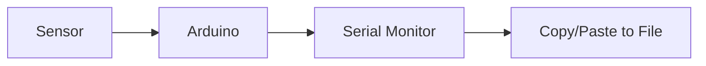
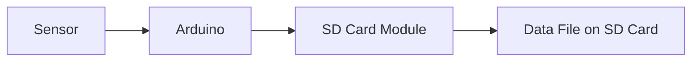
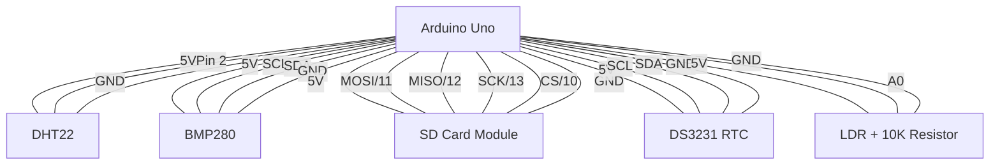

# Arduino Data Logging

## Introduction

Data logging is the process of collecting and storing data over time from sensors or other sources. In the Arduino ecosystem, data logging allows you to capture environmental measurements, monitor system performance, or record user interactions for later analysis. This capability transforms your Arduino from a simple real-time controller into a powerful data collection tool.

Whether you want to monitor temperature changes throughout the day, track soil moisture in your garden, or record acceleration data during a physics experiment, understanding data logging techniques will significantly expand your Arduino project possibilities.

## Why Data Logging Matters

Data logging serves several important purposes:

- **Tracking changes over time**: Observe patterns and trends that aren't visible in single measurements
- **Verification**: Provide evidence that certain conditions were met
- **Analysis**: Collect data for further processing and insights
- **Remote monitoring**: Gather information from locations where constant human observation is impractical

## Data Logging Methods with Arduino

Arduino offers several methods for logging data, each with its advantages and limitations:

### 1. Serial Monitor Logging

The simplest form of data logging uses the Serial Monitor to display data in real-time.



#### Example: Basic Temperature Logging to Serial Monitor

```cpp
#include <DHT.h>

#define DHTPIN 2      // Digital pin connected to the DHT sensor
#define DHTTYPE DHT22 // DHT 22 (AM2302)

DHT dht(DHTPIN, DHTTYPE);

unsigned long previousMillis = 0;
const long interval = 5000; // Log every 5 seconds

void setup() {
  Serial.begin(9600);
  dht.begin();
  
  // Print CSV header
  Serial.println("Time (ms),Temperature (C),Humidity (%)");
}

void loop() {
  unsigned long currentMillis = millis();
  
  if (currentMillis - previousMillis >= interval) {
    previousMillis = currentMillis;
    
    float humidity = dht.readHumidity();
    float temperature = dht.readTemperature();
    
    // Check if any reads failed
    if (isnan(humidity) || isnan(temperature)) {
      Serial.println("Failed to read from DHT sensor!");
      return;
    }
    
    // Log data in CSV format
    Serial.print(currentMillis);
    Serial.print(",");
    Serial.print(temperature);
    Serial.print(",");
    Serial.println(humidity);
  }
}
```

**Output:**
```
Time (ms),Temperature (C),Humidity (%)
5023,22.70,48.20
10036,22.80,48.10
15048,22.70,48.20
20061,22.80,48.30
```

**Advantages:**
- No additional hardware required
- Easy to implement
- Good for short-term data collection

**Limitations:**
- Arduino must remain connected to computer
- Data is lost when the Serial Monitor is closed unless manually saved
- Not suitable for long-term or autonomous operation

### 2. SD Card Data Logging

For standalone operation, storing data on an SD card is the most common solution.



#### Example: Logging Temperature to SD Card

```cpp
#include <SPI.h>
#include <SD.h>
#include <DHT.h>
#include <RTClib.h>

#define DHTPIN 2      // Digital pin connected to the DHT sensor
#define DHTTYPE DHT22 // DHT 22 (AM2302)
#define CHIP_SELECT 10 // SD card chip select pin

DHT dht(DHTPIN, DHTTYPE);
RTC_DS3231 rtc; // Real-time clock for accurate timestamps
File dataFile;
const String FILENAME = "templog.csv";

unsigned long previousMillis = 0;
const long interval = 60000; // Log every minute

void setup() {
  Serial.begin(9600);
  
  // Initialize DHT sensor
  dht.begin();
  
  // Initialize RTC
  if (!rtc.begin()) {
    Serial.println("Couldn't find RTC");
    while (1);
  }
  
  // Set RTC time (only once, then comment out)
  // rtc.adjust(DateTime(F(__DATE__), F(__TIME__)));
  
  // Initialize SD card
  Serial.print("Initializing SD card...");
  if (!SD.begin(CHIP_SELECT)) {
    Serial.println("initialization failed!");
    while (1);
  }
  Serial.println("initialization done.");
  
  // Create/open file and write header if it doesn't exist
  if (!SD.exists(FILENAME)) {
    dataFile = SD.open(FILENAME, FILE_WRITE);
    if (dataFile) {
      dataFile.println("Date,Time,Temperature (C),Humidity (%)");
      dataFile.close();
    } else {
      Serial.println("Error opening file!");
      while (1);
    }
  }
}

void loop() {
  unsigned long currentMillis = millis();
  
  if (currentMillis - previousMillis >= interval) {
    previousMillis = currentMillis;
    
    // Get current time
    DateTime now = rtc.now();
    
    // Read sensor data
    float humidity = dht.readHumidity();
    float temperature = dht.readTemperature();
    
    // Check if any reads failed
    if (isnan(humidity) || isnan(temperature)) {
      Serial.println("Failed to read from DHT sensor!");
      return;
    }
    
    // Format date and time
    String dateStamp = String(now.year()) + "/" + String(now.month()) + "/" + String(now.day());
    String timeStamp = String(now.hour()) + ":" + String(now.minute()) + ":" + String(now.second());
    
    // Open file for writing
    dataFile = SD.open(FILENAME, FILE_WRITE);
    if (dataFile) {
      // Log data in CSV format
      dataFile.print(dateStamp);
      dataFile.print(",");
      dataFile.print(timeStamp);
      dataFile.print(",");
      dataFile.print(temperature);
      dataFile.print(",");
      dataFile.println(humidity);
      dataFile.close();
      
      // Also print to Serial for debugging
      Serial.print(dateStamp);
      Serial.print(" ");
      Serial.print(timeStamp);
      Serial.print(" - Temperature: ");
      Serial.print(temperature);
      Serial.print("°C, Humidity: ");
      Serial.print(humidity);
      Serial.println("%");
    } else {
      Serial.println("Error opening file!");
    }
  }
}
```

**Hardware Requirements:**
- Arduino board (Uno, Mega, etc.)
- SD card module
- SD card (FAT16 or FAT32 formatted)
- DHT22 temperature and humidity sensor
- DS3231 RTC module
- Connecting wires

**SD Card Module Connections:**
- MOSI -> Arduino pin 11
- MISO -> Arduino pin 12
- CLK -> Arduino pin 13
- CS -> Arduino pin 10 (configurable)
- VCC -> 5V
- GND -> GND

**Advantages:**
- Standalone operation (no computer needed)
- Large storage capacity
- Data persists after power loss
- Ideal for long-term monitoring

**Limitations:**
- Requires additional hardware (SD card module, SD card)
- Slightly more complex code
- Limited by power availability in remote locations

### 3. EEPROM Data Logging

For small amounts of data, Arduino's built-in EEPROM can be used as storage.

```cpp
#include <EEPROM.h>

#define TEMP_SENSOR A0
#define LOG_SIZE 24    // Number of readings to store
#define LOG_INTERVAL 3600000 // Log every hour (in milliseconds)

unsigned long previousMillis = 0;
int logIndex = 0;

void setup() {
  Serial.begin(9600);
  Serial.println("EEPROM Temperature Logger");
  Serial.println("Enter 'R' to read all stored data");
  Serial.println("Enter 'C' to clear all stored data");
}

void loop() {
  // Check for commands
  if (Serial.available() > 0) {
    char command = Serial.read();
    if (command == 'R' || command == 'r') {
      readAllData();
    } else if (command == 'C' || command == 'c') {
      clearAllData();
    }
  }
  
  unsigned long currentMillis = millis();
  
  // Log data at specified interval
  if (currentMillis - previousMillis >= LOG_INTERVAL) {
    previousMillis = currentMillis;
    
    // Check if we've reached the maximum number of logs
    if (logIndex >= LOG_SIZE) {
      logIndex = 0; // Wrap around and start overwriting
    }
    
    int sensorValue = analogRead(TEMP_SENSOR);
    // Convert analog reading to temperature (assuming TMP36 sensor)
    float voltage = sensorValue * (5.0 / 1023.0);
    float temperatureC = (voltage - 0.5) * 100;
    
    // Store in EEPROM (1 byte per reading, scaled)
    // Scale temperature to fit in a byte (0-255)
    byte scaledTemp = (byte)constrain(temperatureC + 128, 0, 255);
    EEPROM.write(logIndex, scaledTemp);
    
    Serial.print("Logged temperature: ");
    Serial.print(temperatureC);
    Serial.print("°C (raw: ");
    Serial.print(sensorValue);
    Serial.print(", scaled: ");
    Serial.print(scaledTemp);
    Serial.print(") at index: ");
    Serial.println(logIndex);
    
    logIndex++;
  }
}

void readAllData() {
  Serial.println("
Stored Temperature Data:");
  Serial.println("Index,Temperature (C)");
  
  for (int i = 0; i < LOG_SIZE; i++) {
    byte scaledTemp = EEPROM.read(i);
    float temperatureC = scaledTemp - 128;
    
    Serial.print(i);
    Serial.print(",");
    Serial.println(temperatureC);
  }
  Serial.println("End of data");
}

void clearAllData() {
  Serial.println("Clearing all data...");
  for (int i = 0; i < LOG_SIZE; i++) {
    EEPROM.write(i, 0);
  }
  logIndex = 0;
  Serial.println("Data cleared!");
}
```

**Advantages:**
- No additional hardware required
- Data persists after power loss
- Simple to implement

**Limitations:**
- Very limited storage capacity (1KB-4KB depending on Arduino model)
- EEPROM has limited write cycles (typically ~100,000)
- Not suitable for high-frequency logging

### 4. Logging to External EEPROM

To extend storage capacity while keeping the simplicity of EEPROM:

```cpp
#include <Wire.h>

#define EEPROM_I2C_ADDRESS 0x50
#define LOG_INTERVAL 60000 // Log every minute

unsigned long previousMillis = 0;
unsigned int address = 0;
const unsigned int MAX_ADDRESS = 32768; // For 24LC256 (32KB EEPROM)

void setup() {
  Wire.begin();
  Serial.begin(9600);
  Serial.println("External EEPROM Data Logger");
}

void loop() {
  unsigned long currentMillis = millis();
  
  if (currentMillis - previousMillis >= LOG_INTERVAL) {
    previousMillis = currentMillis;
    
    // Read sensor
    int sensorValue = analogRead(A0);
    
    // Write to external EEPROM (2 bytes per reading)
    writeEEPROM(EEPROM_I2C_ADDRESS, address, highByte(sensorValue));
    writeEEPROM(EEPROM_I2C_ADDRESS, address + 1, lowByte(sensorValue));
    
    Serial.print("Logged value: ");
    Serial.print(sensorValue);
    Serial.print(" at address: ");
    Serial.println(address);
    
    address += 2;
    if (address >= MAX_ADDRESS) {
      address = 0; // Wrap around when full
    }
  }
}

void writeEEPROM(int deviceAddress, unsigned int memoryAddress, byte data) {
  Wire.beginTransmission(deviceAddress);
  Wire.write(highByte(memoryAddress));
  Wire.write(lowByte(memoryAddress));
  Wire.write(data);
  Wire.endTransmission();
  delay(5); // Wait for write to complete
}

byte readEEPROM(int deviceAddress, unsigned int memoryAddress) {
  byte data = 0;
  
  Wire.beginTransmission(deviceAddress);
  Wire.write(highByte(memoryAddress));
  Wire.write(lowByte(memoryAddress));
  Wire.endTransmission();
  
  Wire.requestFrom(deviceAddress, 1);
  if (Wire.available()) {
    data = Wire.read();
  }
  
  return data;
}
```

### 5. Wireless Data Logging

For remote monitoring, data can be sent wirelessly to a base station or directly to the internet.

#### Example: ESP8266 + Arduino Logging to ThingSpeak

```cpp
#include <ESP8266WiFi.h>
#include <DHT.h>

#define DHTPIN 2
#define DHTTYPE DHT22

const char* ssid = "YourWiFiName";
const char* password = "YourWiFiPassword";

// ThingSpeak settings
const char* server = "api.thingspeak.com";
String apiKey = "YourAPIKey";

DHT dht(DHTPIN, DHTTYPE);
WiFiClient client;

void setup() {
  Serial.begin(115200);
  dht.begin();
  
  // Connect to WiFi
  Serial.print("Connecting to ");
  Serial.println(ssid);
  
  WiFi.begin(ssid, password);
  
  while (WiFi.status() != WL_CONNECTED) {
    delay(500);
    Serial.print(".");
  }
  
  Serial.println("");
  Serial.println("WiFi connected");
  Serial.println("IP address: ");
  Serial.println(WiFi.localIP());
}

void loop() {
  float humidity = dht.readHumidity();
  float temperature = dht.readTemperature();
  
  if (isnan(humidity) || isnan(temperature)) {
    Serial.println("Failed to read from DHT sensor!");
    return;
  }
  
  Serial.print("Temperature: ");
  Serial.print(temperature);
  Serial.print(" °C, Humidity: ");
  Serial.print(humidity);
  Serial.println(" %");
  
  // Send data to ThingSpeak
  if (client.connect(server, 80)) {
    String postStr = apiKey;
    postStr += "&field1=";
    postStr += String(temperature);
    postStr += "&field2=";
    postStr += String(humidity);
    
    client.print("POST /update HTTP/1.1
");
    client.print("Host: api.thingspeak.com
");
    client.print("Connection: close
");
    client.print("X-THINGSPEAK-API-KEY: " + apiKey + "
");
    client.print("Content-Type: application/x-www-form-urlencoded
");
    client.print("Content-Length: ");
    client.print(postStr.length());
    client.print("

");
    client.print(postStr);
    
    Serial.println("Data sent to ThingSpeak");
  }
  client.stop();
  
  // Wait 30 seconds before sending again
  delay(30000);
}
```

**Advantages:**
- Real-time remote monitoring
- No need to physically access the device to retrieve data
- Integration with cloud services for analysis

**Limitations:**
- Requires wireless connectivity (WiFi, cellular, etc.)
- Higher power consumption
- More complex setup and maintenance

## Essential Components for Effective Data Logging

### 1. Accurate Timestamps

For meaningful data analysis, accurate time information is crucial. The Real-Time Clock (RTC) module provides reliable timekeeping:

```cpp
#include <RTClib.h>

RTC_DS3231 rtc;

void setup() {
  Serial.begin(9600);
  
  if (!rtc.begin()) {
    Serial.println("Couldn't find RTC");
    while (1);
  }
  
  // Set the RTC to the date & time this sketch was compiled
  // Only run this ONCE, then comment it out and upload again
  // rtc.adjust(DateTime(F(__DATE__), F(__TIME__)));
}

void loop() {
  DateTime now = rtc.now();
  
  Serial.print(now.year(), DEC);
  Serial.print('/');
  Serial.print(now.month(), DEC);
  Serial.print('/');
  Serial.print(now.day(), DEC);
  Serial.print(' ');
  Serial.print(now.hour(), DEC);
  Serial.print(':');
  Serial.print(now.minute(), DEC);
  Serial.print(':');
  Serial.print(now.second(), DEC);
  Serial.println();
  
  delay(1000);
}
```

### 2. Power Management

For long-term logging in remote locations, power efficiency is critical:

```cpp
#include <avr/sleep.h>
#include <avr/power.h>

// Pin used for wake up
#define WAKE_PIN 2

void setup() {
  Serial.begin(9600);
  Serial.println("Power-efficient data logger");
  
  // Configure wake up pin as input with internal pullup
  pinMode(WAKE_PIN, INPUT_PULLUP);
  
  // Take sensor readings before sleep
  recordData();
}

void loop() {
  // Enter sleep mode
  Serial.println("Going to sleep...");
  delay(100);  // Give serial time to complete
  
  // Configure sleep mode
  set_sleep_mode(SLEEP_MODE_PWR_DOWN);
  sleep_enable();
  
  // Set up external interrupt
  attachInterrupt(digitalPinToInterrupt(WAKE_PIN), wakeUp, LOW);
  
  // Enter sleep
  sleep_mode();
  
  // Execution resumes here after wake-up
  sleep_disable();
  detachInterrupt(digitalPinToInterrupt(WAKE_PIN));
  
  // Take readings after wake up
  Serial.println("Awake now!");
  recordData();
}

void wakeUp() {
  // Empty function - just needed for the interrupt
}

void recordData() {
  // Read sensors and log data
  Serial.println("Recording data...");
  // Your logging code here
}
```

### 3. Data Format and Structure

Organizing data in a standard format like CSV (Comma-Separated Values) makes it easy to import into analysis tools:

```cpp
// Example CSV format output
// timestamp,temperature,humidity,light,pressure

void logDataCSV(File file, DateTime timestamp, float temp, float humidity, int light, float pressure) {
  // Format: YYYY-MM-DD HH:MM:SS,temp,humidity,light,pressure
  file.print(timestamp.year());
  file.print("-");
  file.print(timestamp.month());
  file.print("-");
  file.print(timestamp.day());
  file.print(" ");
  file.print(timestamp.hour());
  file.print(":");
  file.print(timestamp.minute());
  file.print(":");
  file.print(timestamp.second());
  file.print(",");
  file.print(temp);
  file.print(",");
  file.print(humidity);
  file.print(",");
  file.print(light);
  file.print(",");
  file.println(pressure);
}
```

## Practical Project: Weather Station Data Logger

Now let's build a complete weather station data logger that records temperature, humidity, atmospheric pressure, and light levels to an SD card.

### Hardware Required

- Arduino Uno or similar board
- DHT22 temperature & humidity sensor
- BMP280 pressure sensor
- LDR (Light Dependent Resistor)
- SD card module with SD card
- DS3231 RTC module
- 10K resistor (for LDR)
- Breadboard and jumper wires

### Wiring Diagram



### Complete Code

```cpp
#include <SPI.h>
#include <SD.h>
#include <Wire.h>
#include <RTClib.h>
#include <DHT.h>
#include <Adafruit_BMP280.h>

// Pin definitions
#define DHTPIN 2
#define DHTTYPE DHT22
#define LDR_PIN A0
#define CHIP_SELECT 10

// Time between readings (in milliseconds)
const unsigned long LOG_INTERVAL = 60000; // 1 minute

// File to log to
const char FILENAME[] = "WEATHER.CSV";

// Initialize sensors
DHT dht(DHTPIN, DHTTYPE);
Adafruit_BMP280 bmp;
RTC_DS3231 rtc;

// Timing
unsigned long lastLogTime = 0;

void setup() {
  Serial.begin(9600);
  Serial.println(F("Weather Station Data Logger"));
  
  // Initialize sensors
  dht.begin();
  
  if (!bmp.begin()) {
    Serial.println(F("Could not find BMP280 sensor!"));
    while (1);
  }
  
  if (!rtc.begin()) {
    Serial.println(F("Couldn't find RTC"));
    while (1);
  }
  
  // Initialize SD card
  Serial.print(F("Initializing SD card..."));
  if (!SD.begin(CHIP_SELECT)) {
    Serial.println(F("Card failed or not present"));
    while (1);
  }
  Serial.println(F("Card initialized."));
  
  // Create/open the file and write header if it doesn't exist
  if (!SD.exists(FILENAME)) {
    File dataFile = SD.open(FILENAME, FILE_WRITE);
    if (dataFile) {
      dataFile.println(F("Timestamp,Temperature (C),Humidity (%),Pressure (hPa),Light Level"));
      dataFile.close();
    } else {
      Serial.println(F("Error opening file!"));
      while (1);
    }
  }
  
  // Set RTC time (only once, then comment out)
  // rtc.adjust(DateTime(F(__DATE__), F(__TIME__)));
  
  // Configure BMP280
  bmp.setSampling(Adafruit_BMP280::MODE_NORMAL,     // Operating Mode
                  Adafruit_BMP280::SAMPLING_X2,     // Temp. oversampling
                  Adafruit_BMP280::SAMPLING_X16,    // Pressure oversampling
                  Adafruit_BMP280::FILTER_X16,      // Filtering
                  Adafruit_BMP280::STANDBY_MS_500); // Standby time
}

void loop() {
  unsigned long currentMillis = millis();
  
  // Check if it's time to log data
  if (currentMillis - lastLogTime >= LOG_INTERVAL || lastLogTime == 0) {
    lastLogTime = currentMillis;
    
    DateTime now = rtc.now();
    
    // Read sensors
    float humidity = dht.readHumidity();
    float temperature = dht.readTemperature();
    float pressure = bmp.readPressure() / 100.0F; // Convert Pa to hPa
    int lightLevel = analogRead(LDR_PIN);
    
    // Check if any reads failed
    if (isnan(humidity) || isnan(temperature) || isnan(pressure)) {
      Serial.println(F("Failed to read from sensors!"));
      return;
    }
    
    // Format timestamp
    char timestamp[20];
    sprintf(timestamp, "%04d-%02d-%02d %02d:%02d:%02d", 
            now.year(), now.month(), now.day(), 
            now.hour(), now.minute(), now.second());
    
    // Log data to SD card
    File dataFile = SD.open(FILENAME, FILE_WRITE);
    if (dataFile) {
      // Write data in CSV format
      dataFile.print(timestamp);
      dataFile.print(F(","));
      dataFile.print(temperature);
      dataFile.print(F(","));
      dataFile.print(humidity);
      dataFile.print(F(","));
      dataFile.print(pressure);
      dataFile.print(F(","));
      dataFile.println(lightLevel);
      dataFile.close();
      
      // Also print to Serial for monitoring
      Serial.print(F("Logged: "));
      Serial.print(timestamp);
      Serial.print(F(" - Temp: "));
      Serial.print(temperature);
      Serial.print(F("°C, Humidity: "));
      Serial.print(humidity);
      Serial.print(F("%, Pressure: "));
      Serial.print(pressure);
      Serial.print(F(" hPa, Light: "));
      Serial.println(lightLevel);
    } else {
      Serial.println(F("Error opening data file!"));
    }
  }
}
```

### Analyzing the Data

Once you've collected data, you can analyze it using various tools:

1. **Excel or Google Sheets**: Import your CSV file for basic analysis and charting
2. **Python with pandas and matplotlib**: For more advanced analysis and visualization
3. **R**: For statistical analysis of your environmental data
4. **Specialized data analysis tools**: Like Tableau or Power BI

Example Python script to plot data from our weather station:

```python
import pandas as pd
import matplotlib.pyplot as plt
from matplotlib.dates import DateFormatter
import matplotlib.dates as mdates

# Load the data
df = pd.read_csv('WEATHER.CSV', parse_dates=['Timestamp'])

# Set the timestamp as index
df.set_index('Timestamp', inplace=True)

# Create a figure with multiple subplots
fig, axes = plt.subplots(4, 1, figsize=(12, 16), sharex=True)

# Temperature
axes[0].plot(df.index, df['Temperature (C)'], 'r-')
axes[0].set_ylabel('Temperature (°C)')
axes[0].set_title('Weather Station Data')
axes[0].grid(True)

# Humidity
axes[1].plot(df.index, df['Humidity (%)'], 'b-')
axes[1].set_ylabel('Humidity (%)')
axes[1].grid(True)

# Pressure
axes[2].plot(df.index, df['Pressure (hPa)'], 'g-')
axes[2].set_ylabel('Pressure (hPa)')
axes[2].grid(True)

# Light Level
axes[3].plot(df.index, df['Light Level'], 'y-')
axes[3].set_ylabel('Light Level')
axes[3].set_xlabel('Time')
axes[3].grid(True)

# Format the x-axis
date_format = DateFormatter('%m-%d %H:%M')
axes[3].xaxis.set_major_formatter(date_format)
axes[3].xaxis.set_major_locator(mdates.HourLocator(interval=6))
plt.xticks(rotation=45)

plt.tight_layout()
plt.savefig('weather_data_plot.png', dpi=300)
plt.show()
```

## Troubleshooting Common Issues

### SD Card Problems

- **Card not recognized**: Format the card as FAT16 or FAT32, not exFAT or NTFS
- **Write errors**: Check your wiring, especially the SPI connections
- **Slow writing**: Increase buffer size or reduce sampling frequency
- **Corrupted files**: Make sure to properly close files after writing

### Power Issues

- **Data logger stops unexpectedly**: Add backup power (larger battery, solar panel)
- **Inconsistent readings**: Add capacitors near sensors to stabilize power
- **Short battery life**: Implement sleep modes and reduce logging frequency

### Sensor Accuracy

- **Erratic readings**: Add filtering code to smooth out anomalies
- **Drift over time**: Implement calibration routines
- **Temperature affects other sensors**: Compensate for temperature in calculations

## Extensions and Advanced Techniques

### 1. Web Dashboard for Remote Monitoring

Connect your Arduino to the internet using WiFi (ESP8266/ESP32) or Ethernet shield to send data to online platforms:

- ThingSpeak
- Adafruit IO
- PubNub
- Custom web server with Node.js, PHP, or Python

### 2. Adaptive Sampling Rates

Save power and storage by changing logging frequency based on activity:

```cpp
// Adaptive sampling based on data variability
float lastTemperature = 0;
unsigned long fastInterval = 10000;  // 10 seconds
unsigned long slowInterval = 300000; // 5 minutes
unsigned long currentInterval = fastInterval;

void loop() {
  float currentTemperature = dht.readTemperature();
  
  // Check if temperature has changed significantly
  if (abs(currentTemperature - lastTemperature) > 1.0) {
    // Switch to fast sampling when environment is changing
    currentInterval = fastInterval;
  } else {
    // Switch to slow sampling when stable
    currentInterval = slowInterval;
  }
  
  // Log at the current interval
  if (millis() - lastLogTime >= currentInterval) {
    // Log data here
    lastLogTime = millis();
    lastTemperature = currentTemperature;
  }
}
```

### 3. Data Compression

For very long-term logging, implement simple compression techniques:

```cpp
// Example: Store difference between readings instead of absolute values
int lastReading = 0;
byte difference = 0;

void loop() {
  int currentReading = analogRead(SENSOR_PIN);
  difference = currentReading - lastReading;
  
  // Store the difference (takes less space than full readings)
  storeData(difference);
  
  lastReading = currentReading;
}
```

## Summary

Arduino data logging opens up a world of possibilities for monitoring, tracking, and analyzing environmental data or system performance. We've covered:

- Different methods for logging data (Serial, SD card, EEPROM, wireless)
- Essential components for effective logging (timestamps, power management, data structure)
- A complete weather station project example
- Troubleshooting common issues
- Advanced techniques for extending your data logging projects

With these skills, you can create sophisticated data collection systems for scientific experiments, home monitoring, agricultural applications, or any other field where capturing and analyzing data