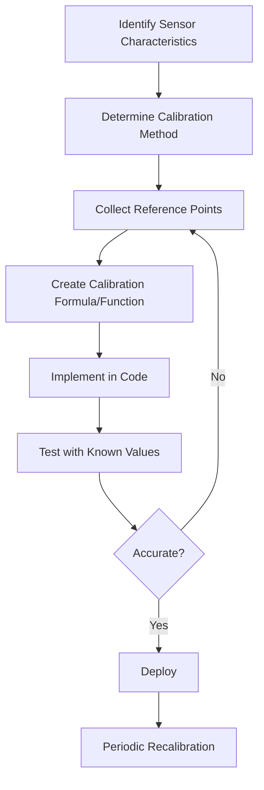

# Arduino Calibration

When working with Arduino projects that involve sensors, one of the most critical steps for accurate data processing is proper calibration. This tutorial will guide you through the process of calibrating various types of sensors on your Arduino to ensure your measurements are reliable and accurate.

## What is Calibration?

Calibration is the process of adjusting your sensor readings to match known reference values. Even high-quality sensors may provide raw values that don't directly correspond to the physical quantities you want to measure.

For example:
- A temperature sensor might output `573` as a raw analog value, but this needs to be converted to Celsius or Fahrenheit
- An accelerometer might have an offset that needs to be subtracted from all readings
- A light sensor's output may need to be mapped differently based on ambient lighting conditions

## Why Calibration Matters

Uncalibrated sensors can lead to:
- Inaccurate measurements
- Inconsistent behavior across different devices
- Poor performance in changing environmental conditions
- Failed projects when measurements trigger incorrect actions

## Basic Calibration Techniques

### 1. Map Function Calibration

The simplest form of calibration uses Arduino's `map()` function to convert raw sensor values to meaningful units.

```cpp
// Basic mapping calibration
int rawValue = analogRead(A0);  // Read raw sensor value (0-1023)
float voltage = map(rawValue, 0, 1023, 0, 5000) / 1000.0;  // Convert to voltage (0-5V)
```

This technique works well for linear sensors where the relationship between the sensor output and the measured quantity is a straight line.

### 2. Two-Point Calibration

For more accuracy, we can use calibration with two known reference points.

```cpp
// Two-point calibration example
// For a temperature sensor calibrated at ice water (0°C) and boiling water (100°C)

// Calibration points - determined experimentally
int rawLow = 102;    // Raw value at 0°C 
int rawHigh = 912;   // Raw value at 100°C

// Take a new reading
int rawValue = analogRead(A0);

// Convert to temperature using the calibration points
float temperature = (rawValue - rawLow) * 100.0 / (rawHigh - rawLow);
```

### 3. Multi-Point Calibration

For non-linear sensors, we need multiple calibration points and interpolation.

```cpp
// Multi-point calibration example
// Calibration arrays
int rawValues[] = {102, 310, 596, 912};     // Raw sensor values
float realValues[] = {0.0, 25.0, 50.0, 100.0};  // Corresponding temperatures
int numPoints = 4;

// Take a reading
int rawValue = analogRead(A0);

// Find the calibration points that bracket our reading
int i = 0;
while (i < numPoints - 1 && rawValue > rawValues[i+1]) {
  i++;
}

if (i >= numPoints - 1) {
  // Beyond the highest calibration point
  return realValues[numPoints - 1];
}

// Interpolate between the two points
float calibratedValue = realValues[i] + 
  (realValues[i+1] - realValues[i]) * 
  (rawValue - rawValues[i]) / 
  (rawValues[i+1] - rawValues[i]);
```

## Practical Example: Soil Moisture Sensor Calibration

Let's walk through a complete example of calibrating a soil moisture sensor:

```cpp
// Soil moisture sensor calibration
// Pin connected to soil moisture sensor
const int soilMoisturePin = A0;

// Calibration values (determined experimentally)
const int airValue = 890;    // Value in completely dry soil (or in air)
const int waterValue = 420;  // Value in water (100% moisture)

void setup() {
  Serial.begin(9600);
  Serial.println("Soil Moisture Sensor Calibration");
  Serial.println("================================");
  
  // Instructions for calibration
  Serial.println("1. Place sensor in dry air and note the value");
  Serial.println("2. Place sensor in water and note the value");
  Serial.println("3. Update the airValue and waterValue constants in the code");
  Serial.println("4. Upload the updated code to complete calibration");
  Serial.println();
}

void loop() {
  // Read the sensor
  int sensorValue = analogRead(soilMoisturePin);
  
  // Convert to percentage using the calibration values
  int moisturePercentage = map(sensorValue, airValue, waterValue, 0, 100);
  
  // Constrain the value between 0 and 100
  moisturePercentage = constrain(moisturePercentage, 0, 100);
  
  // Display results
  Serial.print("Raw Sensor Value: ");
  Serial.print(sensorValue);
  Serial.print(" | Moisture Percentage: ");
  Serial.print(moisturePercentage);
  Serial.println("%");
  
  delay(1000);
}
```

### Calibration Process

1. First, we determine the sensor values at two extreme conditions:
   - In completely dry conditions (air) 
   - In water (maximum moisture)
   
2. Then we use these values to map any reading to a percentage (0-100%)

3. The `constrain()` function ensures our values stay within a valid range, even if the sensor reading goes slightly outside our calibration range

## Advanced Techniques: Moving Average Calibration

To improve stability in readings, we can implement a moving average filter:

```cpp
// Moving average calibration example
const int numReadings = 10;
int readings[numReadings];      // the readings from the analog input
int readIndex = 0;              // the index of the current reading
int total = 0;                  // the running total
int average = 0;                // the average

void setup() {
  Serial.begin(9600);
  
  // initialize all the readings to 0:
  for (int i = 0; i < numReadings; i++) {
    readings[i] = 0;
  }
}

void loop() {
  // subtract the last reading:
  total = total - readings[readIndex];
  
  // read from the sensor:
  readings[readIndex] = analogRead(A0);
  
  // add the reading to the total:
  total = total + readings[readIndex];
  
  // advance to the next position in the array:
  readIndex = readIndex + 1;

  // if we're at the end of the array...
  if (readIndex >= numReadings) {
    // ...wrap around to the beginning:
    readIndex = 0;
  }

  // calculate the average:
  average = total / numReadings;
  
  // Now apply your calibration formula to the smoothed average
  float calibratedValue = map(average, 0, 1023, 0, 100);
  
  // Send output to serial
  Serial.print("Raw Average: ");
  Serial.print(average);
  Serial.print(" | Calibrated: ");
  Serial.println(calibratedValue);
  
  delay(100);
}
```

## Real-World Application: Weather Station Calibration

Here's how you might calibrate multiple sensors for a simple weather station:

```cpp
// Weather station with calibrated sensors
#include <DHT.h>

// Pins
#define DHTPIN 2        // DHT temperature/humidity sensor pin
#define LIGHTPIN A0     // Light sensor pin
#define PRESSUREPIN A1  // Pressure sensor pin
#define DHTTYPE DHT22   // DHT 22 (AM2302)

// Light sensor calibration
const int darkValue = 800;   // Value in darkness
const int brightValue = 100; // Value in bright light

// Pressure sensor calibration
const int pressureLow = 102;  // Raw value at known low pressure (e.g., 980 hPa)
const int pressureHigh = 922; // Raw value at known high pressure (e.g., 1030 hPa)
const float knownLowPressure = 980.0;
const float knownHighPressure = 1030.0;

DHT dht(DHTPIN, DHTTYPE);

void setup() {
  Serial.begin(9600);
  dht.begin();
  Serial.println("Calibrated Weather Station");
  Serial.println("=========================");
}

void loop() {
  // Read and calibrate light level
  int rawLight = analogRead(LIGHTPIN);
  int lightPercentage = map(rawLight, darkValue, brightValue, 0, 100);
  lightPercentage = constrain(lightPercentage, 0, 100);
  
  // Read and calibrate pressure
  int rawPressure = analogRead(PRESSUREPIN);
  float pressure = knownLowPressure + (knownHighPressure - knownLowPressure) * 
                  (rawPressure - pressureLow) / (float)(pressureHigh - pressureLow);
  
  // Read DHT sensor (already calibrated in the library)
  float humidity = dht.readHumidity();
  float temperature = dht.readTemperature();
  
  // Check if any reads failed
  if (isnan(humidity) || isnan(temperature)) {
    Serial.println("Failed to read from DHT sensor!");
    return;
  }
  
  // Display all readings
  Serial.println("Weather Station Readings:");
  Serial.print("Temperature: ");
  Serial.print(temperature);
  Serial.println(" °C");
  
  Serial.print("Humidity: ");
  Serial.print(humidity);
  Serial.println(" %");
  
  Serial.print("Light Level: ");
  Serial.print(lightPercentage);
  Serial.println(" %");
  
  Serial.print("Pressure: ");
  Serial.print(pressure);
  Serial.println(" hPa");
  Serial.println();
  
  delay(2000);
}
```

## Creating a Calibration Process Flow

A typical sensor calibration workflow looks like this:



## Automated Calibration

You can also create code that guides users through the calibration process:

```cpp
// Automated calibration procedure
const int sensorPin = A0;
int lowValue = 1023;  // Start with extreme values
int highValue = 0;
boolean calibrationComplete = false;

void setup() {
  Serial.begin(9600);
  Serial.println("Sensor Calibration Utility");
  Serial.println("=========================");
  Serial.println("1. Expose sensor to minimum stimulus");
  Serial.println("2. Press any key when ready to capture minimum");
  pinMode(LED_BUILTIN, OUTPUT);
}

void loop() {
  if (!calibrationComplete) {
    // Blink LED to indicate calibration mode
    digitalWrite(LED_BUILTIN, (millis() / 500) % 2);
    
    // Read sensor
    int reading = analogRead(sensorPin);
    
    // Show current reading
    Serial.print("Current reading: ");
    Serial.println(reading);
    
    // Check for user input
    if (Serial.available() > 0) {
      char input = Serial.read();
      
      if (lowValue == 1023 && highValue == 0) {
        // First point - capturing minimum
        lowValue = reading;
        Serial.print("Minimum captured: ");
        Serial.println(lowValue);
        Serial.println("3. Now expose sensor to maximum stimulus");
        Serial.println("4. Press any key when ready to capture maximum");
      } 
      else {
        // Second point - capturing maximum
        highValue = reading;
        Serial.print("Maximum captured: ");
        Serial.println(highValue);
        
        // Display calibration results
        Serial.println("Calibration Complete!");
        Serial.println("====================");
        Serial.print("Low Value: ");
        Serial.println(lowValue);
        Serial.print("High Value: ");
        Serial.println(highValue);
        Serial.println("Add these values to your code as calibration constants");
        
        // Example calibration formula
        Serial.println("Calibration formula example:");
        Serial.println("mappedValue = map(rawValue, " + String(lowValue) + ", " + 
                      String(highValue) + ", 0, 100);");
        
        calibrationComplete = true;
        digitalWrite(LED_BUILTIN, HIGH);  // Solid LED indicates completion
      }
      
      // Clear serial buffer
      while(Serial.available()) {
        Serial.read();
      }
    }
  }
  
  delay(100);
}
```

## Handling Special Cases and Troubleshooting

### Dealing with Non-Linear Sensors

Some sensors have non-linear response curves. In these cases, you can use:

1. Multi-point calibration (as shown earlier)
2. Mathematical formulas that model the behavior
3. Lookup tables for discrete values

```cpp
// Example of a non-linear thermistor calculation 
// using the Steinhart-Hart equation
#include <math.h>

const float BETA = 3950; // From thermistor datasheet
const float ROOM_TEMP = 298.15; // 25°C in Kelvin
const float ROOM_RESISTANCE = 10000; // 10K at 25°C

float readTemperature() {
  int rawValue = analogRead(A0);
  
  // Calculate resistance based on voltage divider
  float resistance = 10000.0 * ((1023.0 / rawValue) - 1.0);
  
  // Apply Steinhart-Hart equation
  float steinhart = resistance / ROOM_RESISTANCE;
  steinhart = log(steinhart);
  steinhart /= BETA;
  steinhart += 1.0 / ROOM_TEMP;
  steinhart = 1.0 / steinhart;
  
  // Convert from Kelvin to Celsius
  float celsius = steinhart - 273.15;
  
  return celsius;
}
```

### Calibration Drift

Sensors can drift over time due to aging, wear, or environmental factors. To handle this:

1. Implement periodic recalibration
2. Store calibration values in EEPROM for persistence
3. Add a calibration button to your project

```cpp
// Storing calibration values in EEPROM
#include <EEPROM.h>

// EEPROM addresses
const int ADDR_LOW_BYTE1 = 0;
const int ADDR_LOW_BYTE2 = 1;
const int ADDR_HIGH_BYTE1 = 2;
const int ADDR_HIGH_BYTE2 = 3;
const int ADDR_CALIBRATED = 4;

// Calibration values
int lowValue;
int highValue;
boolean isCalibrated = false;

void setup() {
  Serial.begin(9600);
  
  // Check if device has been calibrated
  isCalibrated = EEPROM.read(ADDR_CALIBRATED) == 1;
  
  if (isCalibrated) {
    // Read calibration values from EEPROM
    lowValue = (EEPROM.read(ADDR_LOW_BYTE1) << 8) | EEPROM.read(ADDR_LOW_BYTE2);
    highValue = (EEPROM.read(ADDR_HIGH_BYTE1) << 8) | EEPROM.read(ADDR_HIGH_BYTE2);
    
    Serial.println("Loaded calibration values from memory:");
    Serial.print("Low: ");
    Serial.print(lowValue);
    Serial.print(" | High: ");
    Serial.println(highValue);
  } else {
    Serial.println("Device not calibrated. Run calibration procedure.");
  }
}

void saveCalibration(int low, int high) {
  // Save low value (16 bits split into 2 bytes)
  EEPROM.write(ADDR_LOW_BYTE1, (low >> 8) & 0xFF);
  EEPROM.write(ADDR_LOW_BYTE2, low & 0xFF);
  
  // Save high value (16 bits split into 2 bytes)
  EEPROM.write(ADDR_HIGH_BYTE1, (high >> 8) & 0xFF);
  EEPROM.write(ADDR_HIGH_BYTE2, high & 0xFF);
  
  // Mark as calibrated
  EEPROM.write(ADDR_CALIBRATED, 1);
  
  lowValue = low;
  highValue = high;
  isCalibrated = true;
  
  Serial.println("Calibration saved to EEPROM");
}
```

## Best Practices for Sensor Calibration

1. **Controlled Environment**: Calibrate under stable conditions for temperature, humidity, and light.

2. **Multiple Readings**: Take several readings at each calibration point and average them.

3. **Regular Recalibration**: Schedule periodic recalibration, especially for critical applications.

4. **Documentation**: Keep records of calibration dates and values for reference.

5. **Verification**: Always verify calibration with known values before deploying.

6. **Temperature Compensation**: For sensors affected by temperature, implement compensation formulas.

## Summary

Proper calibration is essential for accurate sensor readings in Arduino projects. In this tutorial, we've covered:

- Basic calibration concepts and importance
- Different calibration techniques (mapping, two-point, multi-point)
- Real-world examples with soil moisture sensors and weather stations
- Advanced techniques like moving averages and non-linear calibration
- How to implement automated calibration and handle calibration drift
- Best practices for reliable sensor measurements

By following these calibration methods, you'll ensure your Arduino projects collect accurate and reliable data, leading to better results in your applications.

## Exercises

1. Calibrate a photoresistor to measure light levels in lux units.
2. Implement a temperature calibration system that compensates for ambient temperature changes.
3. Create a self-calibrating system that recalibrates at regular intervals.
4. Build a multi-sensor array where each sensor can be individually calibrated.
5. Implement a calibration system that stores calibration values in EEPROM and allows recalibration via a button press.

## Additional Resources

- Arduino Reference for the [map() function](https://www.arduino.cc/reference/en/language/functions/math/map/)
- Arduino Reference for [EEPROM Library](https://www.arduino.cc/en/Reference/EEPROM)
- Arduino Reference for [constrain() function](https://www.arduino.cc/reference/en/language/functions/math/constrain/)
- Arduino Guide on [Smoothing sensor readings](https://www.arduino.cc/en/Tutorial/BuiltInExamples/Smoothing)