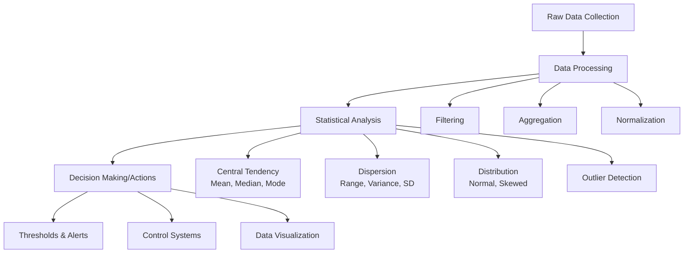

# Arduino Statistics

## Introduction

Statistics play a crucial role in making sense of data collected by Arduino projects. Whether you're building an environmental monitoring system, a biometric device, or any sensor-based project, understanding how to process data statistically will help you derive meaningful insights from your measurements.

In this tutorial, we'll explore how to implement basic and advanced statistical functions with Arduino. You'll learn how to calculate averages, find minimum and maximum values, determine standard deviation, and more. These techniques will help you filter noise, identify trends, and make your Arduino projects more robust and intelligent.

## Basic Statistical Functions

### Mean (Average)

The most fundamental statistical calculation is finding the mean, or average, of a data set.

```cpp
float calculateMean(int arr[], int size) {
  long sum = 0;
  for (int i = 0; i < size; i++) {
    sum += arr[i];
  }
  return (float)sum / size;
}
```

**Example Usage:**

```cpp
int sensorReadings[] = {512, 523, 510, 514, 520, 515, 518, 509};
int readingsCount = 8;

void setup() {
  Serial.begin(9600);
  float average = calculateMean(sensorReadings, readingsCount);
  Serial.print("Average reading: ");
  Serial.println(average);
}

void loop() {
  // Nothing here
}
```

**Output:**
```
Average reading: 515.13
```

### Minimum and Maximum Values

Finding the minimum and maximum values helps identify outliers or peak values in your data.

```cpp
int findMinimum(int arr[], int size) {
  int minValue = arr[0];
  for (int i = 1; i < size; i++) {
    if (arr[i] < minValue) {
      minValue = arr[i];
    }
  }
  return minValue;
}

int findMaximum(int arr[], int size) {
  int maxValue = arr[0];
  for (int i = 1; i < size; i++) {
    if (arr[i] > maxValue) {
      maxValue = arr[i];
    }
  }
  return maxValue;
}
```

**Example Usage:**

```cpp
int temperatureReadings[] = {21, 23, 20, 19, 24, 25, 22, 21};
int readingsCount = 8;

void setup() {
  Serial.begin(9600);
  
  int minTemp = findMinimum(temperatureReadings, readingsCount);
  int maxTemp = findMaximum(temperatureReadings, readingsCount);
  
  Serial.print("Minimum temperature: ");
  Serial.println(minTemp);
  Serial.print("Maximum temperature: ");
  Serial.println(maxTemp);
}

void loop() {
  // Nothing here
}
```

**Output:**
```
Minimum temperature: 19
Maximum temperature: 25
```

### Median

The median is the middle value of a sorted data set, which can be more robust than the mean when dealing with outliers.

```cpp
// Helper function to sort array
void bubbleSort(int arr[], int size) {
  for (int i = 0; i < size - 1; i++) {
    for (int j = 0; j < size - i - 1; j++) {
      if (arr[j] > arr[j + 1]) {
        // Swap elements
        int temp = arr[j];
        arr[j] = arr[j + 1];
        arr[j + 1] = temp;
      }
    }
  }
}

float calculateMedian(int arr[], int size) {
  // Create a copy of the array to avoid modifying the original
  int tempArr[size];
  for (int i = 0; i < size; i++) {
    tempArr[i] = arr[i];
  }
  
  // Sort the array
  bubbleSort(tempArr, size);
  
  // Calculate median
  if (size % 2 == 0) {
    // Even number of elements
    return (tempArr[size/2 - 1] + tempArr[size/2]) / 2.0;
  } else {
    // Odd number of elements
    return tempArr[size/2];
  }
}
```

**Example Usage:**

```cpp
int noiseReadings[] = {45, 42, 90, 44, 43, 46, 41};
int readingsCount = 7;

void setup() {
  Serial.begin(9600);
  float median = calculateMedian(noiseReadings, readingsCount);
  Serial.print("Median noise level: ");
  Serial.println(median);
}

void loop() {
  // Nothing here
}
```

**Output:**
```
Median noise level: 44.00
```

## Advanced Statistical Functions

### Standard Deviation

Standard deviation measures the amount of variation or dispersion in a set of values. A low standard deviation indicates that values tend to be close to the mean, while a high standard deviation indicates values are spread out over a wider range.

```cpp
float calculateSD(int arr[], int size) {
  float mean = calculateMean(arr, size);
  float sumSquaredDiff = 0;
  
  for (int i = 0; i < size; i++) {
    float diff = arr[i] - mean;
    sumSquaredDiff += diff * diff;
  }
  
  return sqrt(sumSquaredDiff / size);
}
```

**Example Usage:**

```cpp
int lightReadings[] = {512, 523, 510, 514, 520, 515, 618, 509};
int readingsCount = 8;

void setup() {
  Serial.begin(9600);
  
  float mean = calculateMean(lightReadings, readingsCount);
  float sd = calculateSD(lightReadings, readingsCount);
  
  Serial.print("Mean: ");
  Serial.println(mean);
  Serial.print("Standard Deviation: ");
  Serial.println(sd);
}

void loop() {
  // Nothing here
}
```

**Output:**
```
Mean: 527.63
Standard Deviation: 36.28
```

### Moving Average

A moving average helps smooth out short-term fluctuations and highlight longer-term trends or cycles in your data. This is especially useful for real-time sensor readings.

```cpp
class MovingAverage {
  private:
    int *values;
    int size;
    int index;
    long sum;
    bool filled;
    
  public:
    MovingAverage(int windowSize) {
      size = windowSize;
      values = new int[size];
      for (int i = 0; i < size; i++) {
        values[i] = 0;
      }
      index = 0;
      sum = 0;
      filled = false;
    }
    
    ~MovingAverage() {
      delete[] values;
    }
    
    float add(int value) {
      // Subtract the oldest value from the sum
      sum -= values[index];
      
      // Add the new value to the array and sum
      values[index] = value;
      sum += value;
      
      // Increment and wrap the index
      index = (index + 1) % size;
      
      // Mark as filled if we've been through the whole array
      if (index == 0) {
        filled = true;
      }
      
      // Calculate the average
      int count = filled ? size : index;
      return count > 0 ? (float)sum / count : 0;
    }
};
```

**Example Usage:**

```cpp
MovingAverage movingAvg(5);  // 5-point moving average

void setup() {
  Serial.begin(9600);
}

void loop() {
  // Simulate reading an analog sensor
  int sensorValue = analogRead(A0);
  
  // Calculate moving average
  float avgValue = movingAvg.add(sensorValue);
  
  Serial.print("Raw: ");
  Serial.print(sensorValue);
  Serial.print("\tSmoothed: ");
  Serial.println(avgValue);
  
  delay(100);
}
```

**Output:**
```
Raw: 512    Smoothed: 512.00
Raw: 523    Smoothed: 517.50
Raw: 510    Smoothed: 515.00
Raw: 514    Smoothed: 514.75
Raw: 520    Smoothed: 515.80
Raw: 515    Smoothed: 516.40
...
```

## Real-world Applications

### Temperature Monitoring System

This example shows a temperature monitoring system that calculates statistics over time and alerts when temperature deviates significantly from the average.

```cpp
#include <DHT.h>

#define DHTPIN 2       // Digital pin connected to the DHT sensor
#define DHTTYPE DHT22  // DHT 22 (AM2302)

const int BUFFER_SIZE = 60;  // Store 60 readings (e.g., one per minute for an hour)
float temperatures[BUFFER_SIZE];
int index = 0;
bool bufferFilled = false;

DHT dht(DHTPIN, DHTTYPE);

void setup() {
  Serial.begin(9600);
  dht.begin();
  
  Serial.println("Temperature Monitoring System");
  Serial.println("-----------------------------");
}

void loop() {
  // Read temperature
  float temp = dht.readTemperature();
  
  if (isnan(temp)) {
    Serial.println("Failed to read temperature!");
  } else {
    // Add temperature to buffer
    temperatures[index] = temp;
    index = (index + 1) % BUFFER_SIZE;
    
    if (index == 0) {
      bufferFilled = true;
    }
    
    // Calculate statistics if we have enough data
    if (index > 5 || bufferFilled) {
      int count = bufferFilled ? BUFFER_SIZE : index;
      
      // Calculate mean
      float sum = 0;
      for (int i = 0; i < count; i++) {
        sum += temperatures[i];
      }
      float mean = sum / count;
      
      // Calculate standard deviation
      float sumSquaredDiff = 0;
      for (int i = 0; i < count; i++) {
        float diff = temperatures[i] - mean;
        sumSquaredDiff += diff * diff;
      }
      float sd = sqrt(sumSquaredDiff / count);
      
      // Determine if current reading is an outlier (> 2 standard deviations from mean)
      bool isOutlier = abs(temp - mean) > (2 * sd);
      
      // Output
      Serial.print("Temperature: ");
      Serial.print(temp);
      Serial.print("°C, Average: ");
      Serial.print(mean);
      Serial.print("°C, SD: ");
      Serial.print(sd);
      
      if (isOutlier && count > 10) {  // Only alert after collecting enough data
        Serial.println(" - ALERT: Unusual temperature detected!");
      } else {
        Serial.println();
      }
    } else {
      Serial.print("Temperature: ");
      Serial.print(temp);
      Serial.println("°C (collecting initial data...)");
    }
  }
  
  delay(60000);  // Wait for 1 minute before next reading
}
```

### Noise Level Analyzer

This example demonstrates processing audio levels to determine ambient noise patterns.

```cpp
const int SOUND_SENSOR = A0;  // Analog pin for sound sensor
const int SAMPLES = 100;      // Number of samples to collect per measurement
const int MEASUREMENTS = 24;  // Store 24 measurements (e.g., hourly for a day)

int noiseLevels[MEASUREMENTS];
int measurementIndex = 0;
bool dataFilled = false;

void setup() {
  Serial.begin(9600);
  Serial.println("Noise Level Analyzer");
  Serial.println("-------------------");
}

void loop() {
  // Take multiple samples to get a reliable reading
  long sum = 0;
  int maxLevel = 0;
  
  for (int i = 0; i < SAMPLES; i++) {
    int soundLevel = analogRead(SOUND_SENSOR);
    sum += soundLevel;
    if (soundLevel > maxLevel) {
      maxLevel = soundLevel;
    }
    delay(10);  // Short delay between samples
  }
  
  // Calculate average
  int avgLevel = sum / SAMPLES;
  
  // Store the measurement
  noiseLevels[measurementIndex] = avgLevel;
  measurementIndex = (measurementIndex + 1) % MEASUREMENTS;
  
  if (measurementIndex == 0) {
    dataFilled = true;
  }
  
  // Calculate statistics if we have enough data
  if (measurementIndex > 5 || dataFilled) {
    int count = dataFilled ? MEASUREMENTS : measurementIndex;
    
    // Find min and max
    int minNoise = noiseLevels[0];
    int maxNoise = noiseLevels[0];
    long totalNoise = 0;
    
    for (int i = 0; i < count; i++) {
      totalNoise += noiseLevels[i];
      if (noiseLevels[i] < minNoise) minNoise = noiseLevels[i];
      if (noiseLevels[i] > maxNoise) maxNoise = noiseLevels[i];
    }
    
    float avgNoise = (float)totalNoise / count;
    
    Serial.println("
Noise Statistics:");
    Serial.print("Current Level (avg/peak): ");
    Serial.print(avgLevel);
    Serial.print("/");
    Serial.println(maxLevel);
    Serial.print("Historical: Min: ");
    Serial.print(minNoise);
    Serial.print(", Max: ");
    Serial.print(maxNoise);
    Serial.print(", Avg: ");
    Serial.println(avgNoise);
    
    // Determine the current noise level category
    String noiseCategory;
    if (avgLevel < avgNoise * 0.7) {
      noiseCategory = "Quiet";
    } else if (avgLevel < avgNoise * 1.2) {
      noiseCategory = "Normal";
    } else {
      noiseCategory = "Loud";
    }
    
    Serial.print("Noise category: ");
    Serial.println(noiseCategory);
  } else {
    Serial.print("Current noise level: ");
    Serial.println(avgLevel);
    Serial.println("Collecting initial data...");
  }
  
  // Wait before next measurement
  delay(60000);  // 1 minute delay for demonstration; adjust as needed
}
```

## Data Visualization with Arduino

Understanding your data often requires visualization. While Arduino itself doesn't have advanced display capabilities, there are several ways to visualize the statistical data you collect:

### Serial Plotter

Arduino IDE includes a built-in Serial Plotter that can visualize data in real-time. This is perfect for viewing trends in your statistical data.

```cpp
void setup() {
  Serial.begin(9600);
}

void loop() {
  // Read analog sensor
  int sensorValue = analogRead(A0);
  
  // Calculate a rolling average (last 10 readings)
  static int readings[10] = {0};
  static int readIndex = 0;
  static long total = 0;
  
  total = total - readings[readIndex];
  readings[readIndex] = sensorValue;
  total = total + readings[readIndex];
  readIndex = (readIndex + 1) % 10;
  
  int average = total / 10;
  
  // Calculate an approximate standard deviation
  long sumSquaredDiff = 0;
  for (int i = 0; i < 10; i++) {
    long diff = readings[i] - average;
    sumSquaredDiff += diff * diff;
  }
  int stdDev = sqrt(sumSquaredDiff / 10);
  
  // Send raw value, average, and thresholds for plotting
  Serial.print(sensorValue);
  Serial.print(" ");
  Serial.print(average);
  Serial.print(" ");
  Serial.print(average + stdDev);
  Serial.print(" ");
  Serial.println(average - stdDev);
  
  delay(100);
}
```

To use this, open the Serial Plotter in Arduino IDE (Tools > Serial Plotter) and you'll see four lines graphed in real-time:
- The raw sensor value
- The rolling average
- Upper threshold (average + standard deviation)
- Lower threshold (average - standard deviation)

### Data Logging for External Visualization

For more advanced visualization, you can log data to an SD card and later process it with tools like Excel, Python, or R.

```cpp
#include <SD.h>
#include <SPI.h>

const int chipSelect = 4;
const int sensorPin = A0;

void setup() {
  Serial.begin(9600);
  
  Serial.print("Initializing SD card...");
  if (!SD.begin(chipSelect)) {
    Serial.println("Card failed or not present!");
    while (1); // Don't proceed
  }
  Serial.println("Card initialized.");
  
  // Create column headers in the CSV file
  File dataFile = SD.open("stats.csv", FILE_WRITE);
  if (dataFile) {
    dataFile.println("Time,Raw,Average,Min,Max,StdDev");
    dataFile.close();
  }
}

void loop() {
  static unsigned long startTime = millis();
  static int readings[60];
  static int readingCount = 0;
  
  // Read sensor
  int sensorValue = analogRead(sensorPin);
  
  // Add to our array
  if (readingCount < 60) {
    readings[readingCount] = sensorValue;
    readingCount++;
  } else {
    // Shift array left, discarding oldest value
    for (int i = 0; i < 59; i++) {
      readings[i] = readings[i+1];
    }
    readings[59] = sensorValue;
  }
  
  // Calculate statistics
  if (readingCount > 0) {
    long sum = 0;
    int minVal = readings[0];
    int maxVal = readings[0];
    
    for (int i = 0; i < readingCount; i++) {
      sum += readings[i];
      if (readings[i] < minVal) minVal = readings[i];
      if (readings[i] > maxVal) maxVal = readings[i];
    }
    
    float average = (float)sum / readingCount;
    
    // Calculate standard deviation
    float sumSquaredDiff = 0;
    for (int i = 0; i < readingCount; i++) {
      float diff = readings[i] - average;
      sumSquaredDiff += diff * diff;
    }
    float stdDev = sqrt(sumSquaredDiff / readingCount);
    
    // Log to SD card every 5 seconds
    unsigned long currentTime = millis();
    if (currentTime - startTime >= 5000) {
      startTime = currentTime;
      
      // Open the file
      File dataFile = SD.open("stats.csv", FILE_WRITE);
      
      if (dataFile) {
        // Time in seconds since start
        float seconds = currentTime / 1000.0;
        
        // Write data to file
        dataFile.print(seconds);
        dataFile.print(",");
        dataFile.print(sensorValue);
        dataFile.print(",");
        dataFile.print(average);
        dataFile.print(",");
        dataFile.print(minVal);
        dataFile.print(",");
        dataFile.print(maxVal);
        dataFile.print(",");
        dataFile.println(stdDev);
        
        dataFile.close();
        
        // Output to serial for monitoring
        Serial.print("Logged: Time=");
        Serial.print(seconds);
        Serial.print("s, Raw=");
        Serial.print(sensorValue);
        Serial.print(", Avg=");
        Serial.println(average);
      } else {
        Serial.println("Error opening stats.csv");
      }
    }
  }
  
  delay(100);
}
```

## Understanding Statistical Concepts

When working with Arduino statistics, you should understand these key concepts:



## Optimizing Statistical Code for Arduino

Arduino has limited memory and processing power, so optimizing your statistical code is important:

1. **Use appropriate data types**: Use `int` instead of `float` when possible, and be mindful of the size differences between `int`, `long`, `float`, and `double`.

2. **Consider fixed-point arithmetic**: For many statistical calculations, you can use fixed-point arithmetic (essentially multiplying everything by a power of 10) to avoid floating-point operations.

3. **Minimize memory usage**: For large datasets, consider processing data as it arrives rather than storing it all.

4. **Incremental calculations**: For statistics like mean and variance, use incremental algorithms that don't require storing all values.

Example of incremental mean and variance calculation:

```cpp
float incrementalMean = 0;
float incrementalVariance = 0;
int count = 0;

void addValue(float newValue) {
  count++;
  float delta = newValue - incrementalMean;
  incrementalMean += delta / count;
  float delta2 = newValue - incrementalMean;
  incrementalVariance += delta * delta2;
}

float getMean() {
  return incrementalMean;
}

float getVariance() {
  return (count > 1) ? incrementalVariance / count : 0;
}

float getStandardDeviation() {
  return sqrt(getVariance());
}
```

## Summary

Statistical processing is an essential skill for intermediate Arduino projects, enabling more sophisticated data analysis and decision-making. In this tutorial, we've covered:

1. Basic statistical functions (mean, median, min/max)
2. Advanced statistics (standard deviation, moving averages)
3. Real-world applications in temperature and noise monitoring
4. Data visualization techniques
5. Optimization strategies for Arduino's limited resources

These techniques transform raw sensor data into actionable insights, making your Arduino projects smarter and more responsive to their environment.

## Further Exercises

1. **Sensor Calibration**: Create a system that automatically calibrates a sensor by collecting samples and determining the mean and standard deviation.

2. **Anomaly Detection**: Build a project that uses statistical methods to detect and alert when environmental readings are abnormal.

3. **Data Logger with Statistics**: Create a data logger that not only records values but also calculates and stores statistical summaries hourly and daily.

4. **Multi-sensor Correlation**: Design a project that calculates correlation coefficients between two or more sensors to detect relationships.

5. **Interactive Threshold Setting**: Create a system where thresholds adjust automatically based on the statistical distribution of recent measurements.

## Additional Resources

- [Arduino Reference](https://www.arduino.cc/reference/en/) - Official Arduino documentation
- [Statistics with Arduino](https://www.arduino.cc/en/Tutorial/LibraryExamples) - Additional examples using Arduino libraries
- [Data Analysis with Arduino](https://forum.arduino.cc/index.php?board=6.0) - Arduino forum discussions
- [Embedded Statistical Computing](https://github.com/Statistic-on-IoT/Embedded-Statistical-Computing) - GitHub repository with more advanced statistical algorithms for embedded systems