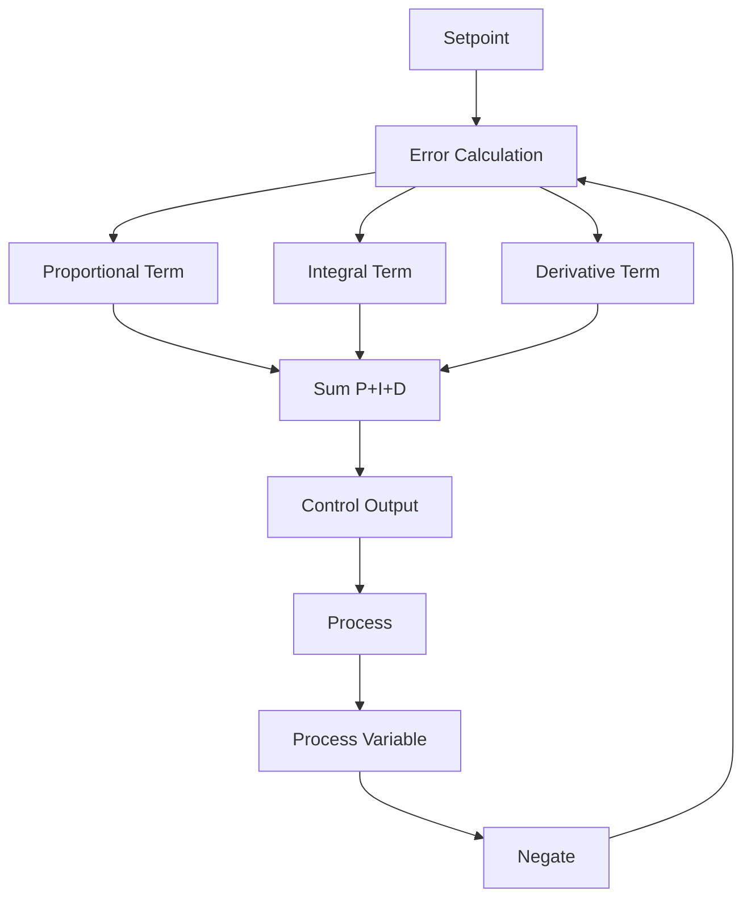

# Arduino PID Control

## Introduction

PID (Proportional-Integral-Derivative) control is a powerful feedback mechanism widely used in industrial systems and robotics to achieve precise control of physical parameters like temperature, position, or speed. In this tutorial, we'll explore how to implement PID controllers using Arduino, enabling your projects to respond accurately to changing conditions.

A PID controller continuously calculates an error value as the difference between a desired setpoint and a measured process variable. It applies a correction based on proportional, integral, and derivative terms, each contributing uniquely to the control response.

## Understanding PID Control

Before diving into code, let's understand the three components of PID control and how they work together:

### Proportional (P)

The proportional component produces an output proportional to the current error value:

```
P = Kp × error
```

Where:
- `error` is the difference between the setpoint and current measured value
- `Kp` is the proportional gain constant

The P term provides immediate response to errors but may lead to oscillation or steady-state error if used alone.

### Integral (I)

The integral component sums the error over time:

```
I = Ki × ∫error dt
```

Or in discrete form:
```
I = I_previous + Ki × error × dt
```

Where:
- `Ki` is the integral gain constant
- `dt` is the time between measurements

The I term helps eliminate steady-state error but can cause overshoot.

### Derivative (D)

The derivative component responds to the rate of change of error:

```
D = Kd × d(error)/dt
```

Or in discrete form:
```
D = Kd × (error - previous_error) / dt
```

Where:
- `Kd` is the derivative gain constant

The D term improves stability and dampens oscillations.

### Combined PID Equation

The three components are summed to produce the final control output:

```
output = P + I + D
```

## Visualizing PID Control

Let's visualize how these three components work together:



## Basic PID Implementation in Arduino

Let's start with a basic PID controller implementation for Arduino:

```cpp
// PID Constants
float Kp = 2.0;
float Ki = 0.5;
float Kd = 1.0;

// Variables
float setpoint = 100.0;   // The value we want to maintain
float input = 0.0;        // Current value from sensor
float output = 0.0;       // Output to actuator/motor
float error = 0.0;        // Difference between setpoint and input
float lastError = 0.0;    // Previous error value
float cumError = 0.0;     // Sum of errors (for integral term)
float rateError = 0.0;    // Rate of change in error (for derivative term)
unsigned long lastTime = 0;
unsigned long sampleTime = 100; // Sample time in milliseconds

void setup() {
  Serial.begin(9600);
  // Initialize other required components (sensor, actuator, etc.)
}

void loop() {
  unsigned long currentTime = millis();
  
  // Check if it's time to calculate
  if (currentTime - lastTime >= sampleTime) {
    // Calculate time elapsed
    float deltaTime = (currentTime - lastTime) / 1000.0; // Convert to seconds
    
    // Read the input (in a real scenario, this would be from a sensor)
    // For example: input = analogRead(A0);
    // Here we'll simulate a process
    simulatePlantProcess();
    
    // Calculate error
    error = setpoint - input;
    
    // Calculate the integral term
    cumError += error * deltaTime;
    
    // Calculate the derivative term
    rateError = (error - lastError) / deltaTime;
    
    // Calculate PID output
    output = Kp * error + Ki * cumError + Kd * rateError;
    
    // Constrain output (for example, if using PWM)
    output = constrain(output, 0, 255);
    
    // Apply the output (in a real scenario, this might be controlling a motor or heater)
    // For example: analogWrite(motorPin, output);
    
    // Store values for next iteration
    lastError = error;
    lastTime = currentTime;
    
    // Print values for debugging
    Serial.print("Setpoint: ");
    Serial.print(setpoint);
    Serial.print(", Input: ");
    Serial.print(input);
    Serial.print(", Output: ");
    Serial.print(output);
    Serial.print(", Error: ");
    Serial.println(error);
  }
}

// Simulate a plant process (in real application, this would be replaced with actual sensor readings)
void simulatePlantProcess() {
  // Simple simulation: input approaches output slowly with some noise
  input = input + (output - input) * 0.05 + (random(-10, 10) * 0.1);
}
```

This basic implementation shows the core concepts, but let's improve it with some practical enhancements.

## Enhanced PID Controller

For more robust applications, let's create an improved PID controller with:
- Anti-windup protection for the integral term
- Output limiting
- Better tuning options

```cpp
class PIDController {
  private:
    // PID constants
    float kp;
    float ki;
    float kd;
    
    // Controller state
    float setpoint;
    float lastInput;
    float outputSum;
    float lastError;
    
    // Timing
    unsigned long lastTime;
    unsigned long sampleTime;
    
    // Output limits
    float outMin;
    float outMax;
    
  public:
    PIDController(float Kp, float Ki, float Kd, float sampleTimeMs) {
      kp = Kp;
      ki = Ki;
      kd = Kd;
      sampleTime = sampleTimeMs;
      
      outMin = 0;
      outMax = 255;
      
      lastInput = 0;
      outputSum = 0;
      lastError = 0;
      lastTime = 0;
      setpoint = 0;
    }
    
    void setOutputLimits(float min, float max) {
      if (min >= max) return;
      
      outMin = min;
      outMax = max;
      
      // Ensure output sum is within limits
      if (outputSum > outMax) outputSum = outMax;
      else if (outputSum < outMin) outputSum = outMin;
    }
    
    void setTunings(float Kp, float Ki, float Kd) {
      if (Kp < 0 || Ki < 0 || Kd < 0) return;
      
      float sampleTimeInSec = ((float)sampleTime) / 1000;
      kp = Kp;
      ki = Ki * sampleTimeInSec;
      kd = Kd / sampleTimeInSec;
    }
    
    void setSetpoint(float sp) {
      setpoint = sp;
    }
    
    float compute(float input) {
      unsigned long now = millis();
      unsigned long timeChange = now - lastTime;
      
      // Check if it's time to calculate
      if (timeChange >= sampleTime) {
        // Calculate error
        float error = setpoint - input;
        
        // Compute the proportional term
        float output = kp * error;
        
        // Compute integral term
        outputSum += ki * error;
        
        // Anti-windup: limit integral term
        if (outputSum > outMax) outputSum = outMax;
        else if (outputSum < outMin) outputSum = outMin;
        
        // Add integral term to output
        output += outputSum;
        
        // Compute derivative term (on input change, not error)
        float dInput = input - lastInput;
        output -= kd * dInput;
        
        // Apply output limits
        if (output > outMax) output = outMax;
        else if (output < outMin) output = outMin;
        
        // Store variables for next iteration
        lastInput = input;
        lastTime = now;
        
        return output;
      }
      
      // If not enough time has passed, return the previous output
      return lastInput;
    }
    
    void reset() {
      outputSum = 0;
      lastInput = 0;
      lastError = 0;
    }
};
```

## Practical Example: Temperature Control

Now let's implement a practical example: a temperature controller using a thermistor and a heating element:

```cpp
#include <math.h>

// Pin definitions
const int THERMISTOR_PIN = A0;
const int HEATER_PIN = 9;

// Thermistor parameters
const float R1 = 10000;  // Value of the series resistor
const float c1 = 1.009249522e-03, c2 = 2.378405444e-04, c3 = 2.019202697e-07;  // Steinhart-Hart coefficients

// PID controller
PIDController pid(5.0, 0.1, 1.0, 100);  // Kp, Ki, Kd, sample time (ms)

void setup() {
  Serial.begin(9600);
  pinMode(HEATER_PIN, OUTPUT);
  
  // Set PID parameters
  pid.setOutputLimits(0, 255);  // PWM output limits
  pid.setSetpoint(30.0);        // Target temperature in Celsius
}

void loop() {
  // Read thermistor value
  float temperature = readTemperature();
  
  // Compute PID output
  float output = pid.compute(temperature);
  
  // Apply the output to the heater
  analogWrite(HEATER_PIN, output);
  
  // Debug output
  Serial.print("Temperature: ");
  Serial.print(temperature);
  Serial.print(" °C, Heater Output: ");
  Serial.println(output);
  
  delay(100);  // Small delay to avoid flooding the serial monitor
}

// Function to read temperature from thermistor
float readTemperature() {
  int rawADC = analogRead(THERMISTOR_PIN);
  
  // Convert ADC value to resistance
  float resistance = R1 * (1023.0 / rawADC - 1.0);
  
  // Apply Steinhart-Hart equation to get temperature in Kelvin
  float logR = log(resistance);
  float temperatureK = 1.0 / (c1 + c2 * logR + c3 * logR * logR * logR);
  
  // Convert to Celsius
  float temperatureC = temperatureK - 273.15;
  
  return temperatureC;
}
```

## Tuning PID Controllers

Tuning a PID controller involves finding the right values for Kp, Ki, and Kd. Here's a systematic approach called the Ziegler-Nichols method:

1. Set Ki and Kd to zero
2. Increase Kp until the system oscillates steadily
3. Record the critical gain (Kc) and the oscillation period (Pc)
4. Set the PID parameters according to:
   - Kp = 0.6 * Kc
   - Ki = 1.2 * Kc / Pc
   - Kd = 0.075 * Kc * Pc

Alternatively, you can use the trial and error method with these guidelines:

- Increase Kp to improve response time, but watch for oscillation
- Increase Ki to eliminate steady-state error, but watch for overshoot
- Increase Kd to reduce overshoot and oscillation, but watch for noise sensitivity

## Auto-Tuning PID

For more advanced applications, we can implement auto-tuning. Here's a simple auto-tuning sketch based on the relay method:

```cpp
// Auto-tuning PID example
// This implements a simplified version of the relay method

const int INPUT_PIN = A0;
const int OUTPUT_PIN = 9;

// Tuning variables
float setpoint = 100;
float outputStep = 50;    // Output change for relay
float outputStart = 100;  // Initial output value
unsigned long stepDelay = 1000;  // ms
unsigned int cycles = 10; // Number of cycles to observe

// State variables
boolean tuning = false;
unsigned long lastStepTime = 0;
boolean stepUp = true;
float inputMax = 0;
float inputMin = 1023;
unsigned int cycleCount = 0;
unsigned long cycleTime = 0;
unsigned long lastCycleTime = 0;

void setup() {
  Serial.begin(9600);
  pinMode(OUTPUT_PIN, OUTPUT);
  
  // Initialize with mid-range output
  analogWrite(OUTPUT_PIN, outputStart);
  
  Serial.println("Auto-tuning PID start...");
  Serial.println("Press any key to begin auto-tuning");
}

void loop() {
  if (Serial.available() > 0) {
    Serial.read();
    if (!tuning) {
      tuning = true;
      Serial.println("Auto-tuning started");
    }
  }
  
  if (tuning) {
    float input = analogRead(INPUT_PIN);
    unsigned long now = millis();
    
    // Perform relay step
    if (now - lastStepTime > stepDelay) {
      lastStepTime = now;
      
      if (stepUp) {
        Serial.println("Step UP");
        analogWrite(OUTPUT_PIN, outputStart + outputStep);
      } else {
        Serial.println("Step DOWN");
        analogWrite(OUTPUT_PIN, outputStart - outputStep);
      }
      
      stepUp = !stepUp;
    }
    
    // Record min and max input
    if (input > inputMax) inputMax = input;
    if (input < inputMin) inputMin = input;
    
    // Detect cycle (when input crosses setpoint)
    if ((input > setpoint && stepUp) || (input < setpoint && !stepUp)) {
      unsigned long currentCycleTime = now;
      
      // Calculate oscillation period
      if (lastCycleTime != 0) {
        cycleTime += currentCycleTime - lastCycleTime;
        cycleCount++;
      }
      
      lastCycleTime = currentCycleTime;
      
      // Check if we've collected enough cycles
      if (cycleCount >= cycles) {
        // Calculate Ziegler-Nichols parameters
        float amplitude = (inputMax - inputMin) / 2;
        float avgPeriod = cycleTime / cycleCount;
        
        // Calculate ultimate gain Ku
        float Ku = (4 * outputStep) / (PI * amplitude);
        
        // Calculate PID parameters (Ziegler-Nichols)
        float Kp = 0.6 * Ku;
        float Ki = 1.2 * Ku / avgPeriod;
        float Kd = 0.075 * Ku * avgPeriod;
        
        Serial.println("Auto-tuning completed!");
        Serial.print("Recommended PID values: Kp=");
        Serial.print(Kp);
        Serial.print(", Ki=");
        Serial.print(Ki);
        Serial.print(", Kd=");
        Serial.println(Kd);
        
        // Stop tuning
        tuning = false;
        
        // Reset output
        analogWrite(OUTPUT_PIN, outputStart);
      }
    }
  }
}
```

## Real-World Applications

PID control has numerous applications with Arduino:

### 1. Drone Stability System

PID controllers are used to maintain the stability of drones and quadcopters:

```cpp
// Simple angle control for a drone
// This would be one axis of control

const int GYRO_PIN = A0;        // Gyroscope input
const int MOTOR_LEFT_PIN = 9;   // Left motor control
const int MOTOR_RIGHT_PIN = 10; // Right motor control

float targetAngle = 0.0;        // We want the drone to remain level
PIDController pid(4.0, 0.02, 1.5, 10); // Fast sample time for flight control

void setup() {
  Serial.begin(9600);
  pinMode(MOTOR_LEFT_PIN, OUTPUT);
  pinMode(MOTOR_RIGHT_PIN, OUTPUT);
  
  pid.setOutputLimits(-50, 50);  // Control values to add/subtract from base motor power
  pid.setSetpoint(targetAngle);  // Target is level flight (0 degrees)
}

void loop() {
  // Read gyroscope (in real application, this would include proper filtering)
  float currentAngle = (analogRead(GYRO_PIN) - 512) * 0.1; // Convert to degrees
  
  // Compute PID output
  float correction = pid.compute(currentAngle);
  
  // Base motor power (this would typically be controlled by throttle)
  int basePower = 150;
  
  // Apply correction to motors
  int leftPower = basePower + correction;
  int rightPower = basePower - correction;
  
  // Constrain motor values to valid PWM range
  leftPower = constrain(leftPower, 0, 255);
  rightPower = constrain(rightPower, 0, 255);
  
  // Apply power to motors
  analogWrite(MOTOR_LEFT_PIN, leftPower);
  analogWrite(MOTOR_RIGHT_PIN, rightPower);
}
```

### 2. Sous Vide Cooking Controller

A popular DIY project is making a sous vide cooker that precisely controls water temperature:

```cpp
// Temperature control for a sous vide cooker
const int TEMP_SENSOR_PIN = A0;  // DS18B20 temperature sensor (through OneWire)
const int RELAY_PIN = 7;         // Relay controlling the heating element

float cookingTemp = 60.0;        // Target temperature in Celsius
PIDController pid(10.0, 0.2, 0.5, 1000); // Temperature control needs slower response

// Time tracking for cooking duration
unsigned long cookingStartTime = 0;
unsigned long cookingDuration = 3600000; // 1 hour in milliseconds
boolean cookingStarted = false;

#include <OneWire.h>
#include <DallasTemperature.h>

// Setup OneWire instance and temperature sensors
OneWire oneWire(TEMP_SENSOR_PIN);
DallasTemperature sensors(&oneWire);

void setup() {
  Serial.begin(9600);
  pinMode(RELAY_PIN, OUTPUT);
  digitalWrite(RELAY_PIN, LOW); // Ensure heater is off initially
  
  // Initialize temperature sensor
  sensors.begin();
  
  // Configure PID
  pid.setOutputLimits(0, 100);  // Output is "percentage on" time
  pid.setSetpoint(cookingTemp);
  
  Serial.println("Sous Vide Controller");
  Serial.print("Target temperature: ");
  Serial.print(cookingTemp);
  Serial.println(" °C");
}

void loop() {
  // Request temperature reading
  sensors.requestTemperatures();
  float currentTemp = sensors.getTempCByIndex(0);
  
  // Compute PID output (0-100 representing percentage of heating time)
  float output = pid.compute(currentTemp);
  
  // Apply output using simple PWM-like on/off control
  // with a 5-second control cycle
  unsigned long currentMillis = millis();
  unsigned long cycle = currentMillis % 5000;
  
  if (cycle < (output * 50)) {
    digitalWrite(RELAY_PIN, HIGH);  // Heater on
  } else {
    digitalWrite(RELAY_PIN, LOW);   // Heater off
  }
  
  // Check if we've reached our target temperature to start the timer
  if (!cookingStarted && currentTemp >= cookingTemp - 0.5) {
    cookingStarted = true;
    cookingStartTime = currentMillis;
    Serial.println("Cooking timer started!");
  }
  
  // Print status every 5 seconds
  if (currentMillis % 5000 < 100) {
    Serial.print("Temperature: ");
    Serial.print(currentTemp);
    Serial.print(" °C, Heater Output: ");
    Serial.print(output);
    Serial.print("%");
    
    if (cookingStarted) {
      unsigned long elapsedTime = currentMillis - cookingStartTime;
      unsigned long remainingTime = (elapsedTime > cookingDuration) ? 0 : (cookingDuration - elapsedTime);
      
      Serial.print(", Remaining: ");
      Serial.print(remainingTime / 60000); // Convert to minutes
      Serial.print(" minutes");
      
      // Alert when cooking is done
      if (remainingTime == 0) {
        Serial.print(" - COOKING COMPLETE!");
      }
    }
    
    Serial.println();
  }
}
```

## PID Tuning Challenges and Solutions

PID controllers can be challenging to tune. Here are common issues and solutions:

### Overshooting

If your system consistently overshoots the setpoint:
- Reduce Kp
- Increase Kd
- Consider a different control approach like a two-step approach for large changes

### Slow Response

If your system takes too long to reach the setpoint:
- Increase Kp
- Carefully increase Ki, but watch for oscillation

### Oscillation

If your system oscillates around the setpoint:
- Reduce Kp
- Increase Kd
- Check for mechanical issues or sensor noise

### PID Tuning Assistant

This code helps visualize PID behavior for easier tuning:

```cpp
// PID Tuning Assistant
// Sends time series data to Serial Plotter for visualization

// Define your system here
const int SENSOR_PIN = A0;
const int ACTUATOR_PIN = 9;

// PID controller
PIDController pid(2.0, 0.5, 1.0, 100);  // Initial values
float setpoint = 512;  // Midpoint of analog read

// Command processing
String command = "";

void setup() {
  Serial.begin(9600);
  pinMode(ACTUATOR_PIN, OUTPUT);
  
  pid.setOutputLimits(0, 255);
  pid.setSetpoint(setpoint);
  
  Serial.println("PID Tuning Assistant");
  Serial.println("Commands: 'kp=X' 'ki=X' 'kd=X' 'sp=X'");
}

void loop() {
  // Process any incoming commands
  while (Serial.available() > 0) {
    char c = Serial.read();
    if (c == '
') {
      processCommand();
      command = "";
    } else {
      command += c;
    }
  }
  
  // Read the input
  float input = analogRead(SENSOR_PIN);
  
  // Compute PID output
  float output = pid.compute(input);
  
  // Apply output
  analogWrite(ACTUATOR_PIN, output);
  
  // Send data for plotting
  Serial.print("Setpoint:");
  Serial.print(setpoint);
  Serial.print(",Input:");
  Serial.print(input);
  Serial.print(",Output:");
  Serial.println(output);
  
  delay(50);  // Short delay for readability
}

void processCommand() {
  if (command.startsWith("kp=")) {
    float value = command.substring(3).toFloat();
    pid.setTunings(value, pid.ki, pid.kd);
    Serial.print("Kp set to ");
    Serial.println(value);
  }
  else if (command.startsWith("ki=")) {
    float value = command.substring(3).toFloat();
    pid.setTunings(pid.kp, value, pid.kd);
    Serial.print("Ki set to ");
    Serial.println(value);
  }
  else if (command.startsWith("kd=")) {
    float value = command.substring(3).toFloat();
    pid.setTunings(pid.kp, pid.ki, value);
    Serial.print("Kd set to ");
    Serial.println(value);
  }
  else if (command.startsWith("sp=")) {
    float value = command.substring(3).toFloat();
    setpoint = value;
    pid.setSetpoint(value);
    Serial.print("Setpoint set to ");
    Serial.println(value);
  }
}
```

## Advanced PID Concepts

For more complex applications, consider these advanced techniques:

### Cascade Control

Use multiple PID controllers in a hierarchical arrangement where the output of one controller sets the setpoint for another.

### Feed-Forward Control

Add a feed-forward term to the PID output based on known disturbances:

```cpp
// Basic feed-forward example for a heating system
float feedForward = 0;

void loop() {
  // Calculate feed-forward based on room vs outdoor temperature difference
  float roomTemp = readRoomTemp();
  float outdoorTemp = readOutdoorTemp();
  feedForward = map(roomTemp - outdoorTemp, -10, 30, 50, 0);
  
  // Compute PID output
  float pidOutput = pid.compute(roomTemp);
  
  // Combined output
  float finalOutput = pidOutput + feedForward;
  finalOutput = constrain(finalOutput, 0, 255);
  
  // Apply output
  analogWrite(HEATER_PIN, finalOutput);
}
```

### Gain Scheduling

Change PID constants based on operating conditions:

```cpp
// Simple gain scheduling example
void updateGains(float error) {
  // Use different gains depending on how far we are from setpoint
  if (abs(error) > 10) {
    // Far from setpoint - use aggressive tuning
    pid.setTunings(4.0, 0.2, 1.0);
  } else if (abs(error) > 5) {
    // Medium distance - use moderate tuning
    pid.setTunings(2.0, 0.1, 0.5);
  } else {
    // Close to setpoint - use conservative tuning for precision
    pid.setTunings(1.0, 0.05, 0.25);
  }
}
```

## Summary

PID control is a powerful technique for maintaining precise control over physical parameters in your Arduino projects. In this tutorial, we've explored:

- The fundamentals of PID control theory
- Basic PID implementation in Arduino
- Enhanced PID controller with anti-windup protection
- Practical applications like temperature control
- PID tuning techniques and auto-tuning
- Real-world examples like drone stability and sous vide cooking
- Advanced PID concepts like feed-forward and gain scheduling

By understanding and applying these concepts, you can create sophisticated Arduino projects that respond precisely to changing conditions.

## Exercises and Further Learning

1. **Basic PID Experiment**: Implement a simple PID control system using an LED and a light sensor to maintain a constant light level despite environmental changes.

2. **Tuning Challenge**: Create a system to balance a ball on a servo-controlled platform, then tune the PID parameters for optimal performance.

3. **Advanced Project**: Build a mini weather station that uses PID control to maintain a constant humidity level in a small chamber.

## Additional Resources

- [Arduino PID Library](https://github.com/br3ttb/Arduino-PID-Library) by Brett Beauregard
- "Feedback Systems: An Introduction for Scientists and Engineers" by Åström and Murray
- "PID Controllers: Theory, Design, and Tuning" by Astrom and Hagglund
- "Control System Design Guide" by George Ellis

Remember that PID control is as much an art as a science. Practice and experimentation are key to mastering it for your Arduino projects.