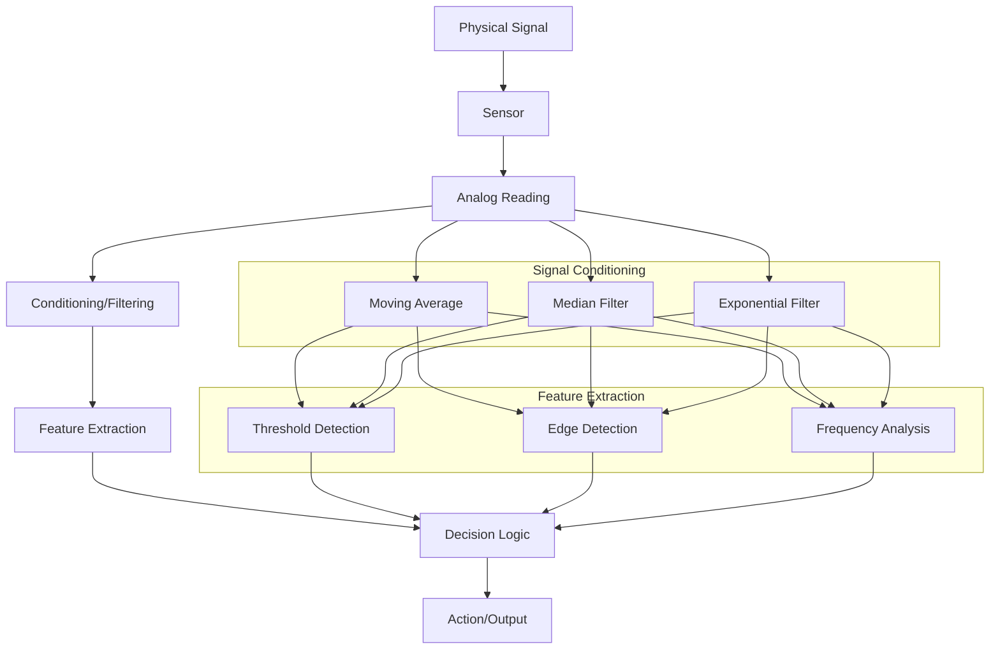

# Arduino Signal Processing

## Introduction

Signal processing is a fundamental skill in the world of embedded systems and IoT projects. When working with Arduino, your projects will often involve collecting data from the physical world through sensors. However, raw sensor data is rarely perfect—it contains noise, interference, and other unwanted components. This is where signal processing comes in.

In this tutorial, you'll learn how to implement various signal processing techniques using Arduino to transform raw sensor data into meaningful, actionable information. Whether you're building a weather station, a music visualizer, or a motion-sensitive robot, these techniques will help you extract the signals you need from the noise.

## What is Signal Processing?

Signal processing is the analysis, interpretation, and manipulation of signals. A signal is any variable that carries information, such as:

- Voltage readings from analog sensors
- Temperature variations over time
- Sound waves captured by a microphone
- Vibration patterns detected by an accelerometer

On Arduino, signal processing typically involves:

1. **Acquisition**: Reading raw signals from sensors
2. **Conditioning**: Cleaning up and preparing the signal
3. **Analysis**: Extracting meaningful information
4. **Output**: Using the processed information to trigger actions or display results

Let's explore each of these steps in detail.

## Basic Signal Acquisition

Before we can process a signal, we need to acquire it. Arduino boards come with analog-to-digital converters (ADCs) that allow us to read analog voltages.

Here's a simple example of reading an analog value from a potentiometer:

```cpp
const int potPin = A0;  // Analog pin connected to the potentiometer

void setup() {
  Serial.begin(9600);  // Initialize serial communication
}

void loop() {
  int sensorValue = analogRead(potPin);  // Read the analog value (0-1023)
  
  // Print the raw sensor value
  Serial.print("Raw sensor value: ");
  Serial.println(sensorValue);
  
  delay(100);  // Short delay between readings
}
```

**Output Example:**
```
Raw sensor value: 512
Raw sensor value: 513
Raw sensor value: 510
Raw sensor value: 498
```

This gives us raw readings, but in real-world applications, these readings might contain noise or unwanted variations.

## Signal Conditioning Techniques

### Moving Average Filter

One of the simplest yet most effective signal processing techniques is the moving average filter. It smooths out short-term fluctuations and highlights longer-term trends.

```cpp
const int potPin = A0;
const int numReadings = 10;

int readings[numReadings];  // Array to store readings
int readIndex = 0;          // Current position in the array
int total = 0;              // Running total
int average = 0;            // Moving average

void setup() {
  Serial.begin(9600);
  
  // Initialize all readings to 0
  for (int i = 0; i < numReadings; i++) {
    readings[i] = 0;
  }
}

void loop() {
  // Subtract the oldest reading from the total
  total = total - readings[readIndex];
  
  // Read the sensor
  readings[readIndex] = analogRead(potPin);
  
  // Add the new reading to the total
  total = total + readings[readIndex];
  
  // Advance to the next position in the array
  readIndex = (readIndex + 1) % numReadings;
  
  // Calculate the average
  average = total / numReadings;
  
  // Print both raw and filtered values
  Serial.print("Raw: ");
  Serial.print(readings[readIndex]);
  Serial.print("\tFiltered: ");
  Serial.println(average);
  
  delay(100);
}
```

**Output Example:**
```
Raw: 498    Filtered: 505
Raw: 512    Filtered: 506
Raw: 515    Filtered: 507
Raw: 510    Filtered: 508
```

The moving average filter is effective for removing random noise while preserving the underlying trend. By adjusting the `numReadings` value, you can control the amount of smoothing:
- Larger values provide more smoothing but slower response
- Smaller values provide less smoothing but faster response

### Exponential Moving Average

An exponential moving average (EMA) gives more weight to recent measurements, providing a more responsive filter while still smoothing the signal:

```cpp
const int potPin = A0;
float EMA_alpha = 0.3;      // Smoothing factor (0-1)
float EMA_filtered = 0;     // Filtered value

void setup() {
  Serial.begin(9600);
  
  // Initialize filtered value with first reading
  EMA_filtered = analogRead(potPin);
}

void loop() {
  int rawValue = analogRead(potPin);
  
  // Apply exponential moving average filter
  EMA_filtered = (EMA_alpha * rawValue) + ((1 - EMA_alpha) * EMA_filtered);
  
  // Print both raw and filtered values
  Serial.print("Raw: ");
  Serial.print(rawValue);
  Serial.print("\tEMA Filtered: ");
  Serial.println(EMA_filtered);
  
  delay(100);
}
```

The `EMA_alpha` parameter determines the filter behavior:
- Values closer to 1 make the filter respond more quickly to changes
- Values closer to 0 produce more smoothing but slower response

### Median Filter

A median filter is excellent for removing "spikes" or outliers in your data:

```cpp
const int potPin = A0;
const int windowSize = 5;  // Must be an odd number
int readings[windowSize];

void setup() {
  Serial.begin(9600);
}

void loop() {
  // Shift readings in array
  for (int i = windowSize - 1; i > 0; i--) {
    readings[i] = readings[i-1];
  }
  
  // Add new reading
  readings[0] = analogRead(potPin);
  
  // Create a temporary array for sorting
  int temp[windowSize];
  for (int i = 0; i < windowSize; i++) {
    temp[i] = readings[i];
  }
  
  // Sort the array (bubble sort)
  for (int i = 0; i < windowSize - 1; i++) {
    for (int j = 0; j < windowSize - i - 1; j++) {
      if (temp[j] > temp[j + 1]) {
        int t = temp[j];
        temp[j] = temp[j + 1];
        temp[j + 1] = t;
      }
    }
  }
  
  // Get the middle value (median)
  int medianValue = temp[windowSize / 2];
  
  // Print raw and median-filtered values
  Serial.print("Raw: ");
  Serial.print(readings[0]);
  Serial.print("\tMedian: ");
  Serial.println(medianValue);
  
  delay(100);
}
```

The median filter is particularly useful when dealing with occasional outliers or noise spikes, as it completely removes them rather than just reducing their impact.

## Advanced Signal Processing Techniques

### Threshold Detection

Threshold detection is useful for identifying when a signal crosses a specific value, allowing you to detect events:

```cpp
const int sensorPin = A0;
const int ledPin = 13;
const int threshold = 500;  // Threshold value

void setup() {
  Serial.begin(9600);
  pinMode(ledPin, OUTPUT);
}

void loop() {
  int sensorValue = analogRead(sensorPin);
  
  // Threshold detection
  if (sensorValue > threshold) {
    digitalWrite(ledPin, HIGH);
    Serial.println("Threshold exceeded!");
  } else {
    digitalWrite(ledPin, LOW);
  }
  
  Serial.print("Sensor value: ");
  Serial.println(sensorValue);
  
  delay(100);
}
```

### Edge Detection

Edge detection identifies rapid changes in a signal, which can indicate important events:

```cpp
const int sensorPin = A0;
int lastValue = 0;
const int edgeThreshold = 100;  // Minimum change to be considered an edge

void setup() {
  Serial.begin(9600);
  
  // Initialize lastValue
  lastValue = analogRead(sensorPin);
}

void loop() {
  int currentValue = analogRead(sensorPin);
  
  // Calculate the absolute difference
  int difference = abs(currentValue - lastValue);
  
  // Check if we detected a significant change (edge)
  if (difference > edgeThreshold) {
    if (currentValue > lastValue) {
      Serial.println("Rising edge detected!");
    } else {
      Serial.println("Falling edge detected!");
    }
  }
  
  Serial.print("Value: ");
  Serial.print(currentValue);
  Serial.print("\tDifference: ");
  Serial.println(difference);
  
  // Update lastValue for the next iteration
  lastValue = currentValue;
  
  delay(100);
}
```

### Frequency Analysis Using Zero Crossing

A simple way to estimate the frequency of a signal is to count how many times it crosses zero (or a threshold value) in a given time period:

```cpp
const int audioPin = A0;
const int samplePeriod = 1000;  // Sample for 1 second
const int threshold = 512;      // Midpoint for zero crossing detection

void setup() {
  Serial.begin(9600);
}

void loop() {
  unsigned long startTime = millis();
  int crossings = 0;
  int lastValue = analogRead(audioPin);
  bool wasAboveThreshold = (lastValue > threshold);
  
  // Count zero crossings for the sample period
  while (millis() - startTime < samplePeriod) {
    int newValue = analogRead(audioPin);
    bool isAboveThreshold = (newValue > threshold);
    
    // Check if we crossed the threshold
    if (isAboveThreshold != wasAboveThreshold) {
      crossings++;
      wasAboveThreshold = isAboveThreshold;
    }
    
    // Small delay to prevent overwhelming the ADC
    delayMicroseconds(100);
  }
  
  // Calculate frequency (divide by 2 because each complete cycle has 2 crossings)
  float frequency = (float)crossings / 2.0;
  
  Serial.print("Estimated frequency: ");
  Serial.print(frequency);
  Serial.println(" Hz");
  
  delay(500);
}
```

This is a simplified approach to frequency detection. For more accurate results, especially with complex signals, you might need to implement more advanced techniques like the Fast Fourier Transform (FFT).

## Real-World Applications

### Digital Thermostat

This example uses filtering and threshold detection to create a simple thermostat:

```cpp
#include <OneWire.h>
#include <DallasTemperature.h>

#define ONE_WIRE_BUS 2      // Data wire is connected to pin 2
#define RELAY_PIN 4         // Relay connected to pin 4

// Setup a oneWire instance
OneWire oneWire(ONE_WIRE_BUS);

// Pass oneWire reference to Dallas Temperature sensor
DallasTemperature sensors(&oneWire);

// Temperature settings
float targetTemp = 25.0;    // Target temperature in Celsius
float hysteresis = 0.5;     // Hysteresis to prevent rapid switching

// Filter settings
const int numReadings = 10;
float tempReadings[numReadings];
int readIndex = 0;

void setup() {
  Serial.begin(9600);
  sensors.begin();
  pinMode(RELAY_PIN, OUTPUT);
  
  // Initialize the temperature readings array
  for (int i = 0; i < numReadings; i++) {
    sensors.requestTemperatures();
    tempReadings[i] = sensors.getTempCByIndex(0);
    delay(100);
  }
}

void loop() {
  // Request temperature
  sensors.requestTemperatures();
  
  // Get temperature reading
  float newTemp = sensors.getTempCByIndex(0);
  
  // Update the readings array
  tempReadings[readIndex] = newTemp;
  readIndex = (readIndex + 1) % numReadings;
  
  // Calculate the average temperature
  float avgTemp = 0;
  for (int i = 0; i < numReadings; i++) {
    avgTemp += tempReadings[i];
  }
  avgTemp /= numReadings;
  
  // Apply heating control with hysteresis
  if (avgTemp < (targetTemp - hysteresis)) {
    digitalWrite(RELAY_PIN, HIGH);  // Turn heating on
    Serial.print("Heating ON - ");
  } else if (avgTemp > (targetTemp + hysteresis)) {
    digitalWrite(RELAY_PIN, LOW);   // Turn heating off
    Serial.print("Heating OFF - ");
  }
  
  // Print current status
  Serial.print("Current: ");
  Serial.print(newTemp);
  Serial.print("°C, Filtered: ");
  Serial.print(avgTemp);
  Serial.print("°C, Target: ");
  Serial.print(targetTemp);
  Serial.println("°C");
  
  delay(1000);
}
```

### Audio Beat Detector

This example detects beats in an audio signal using a combination of filtering and threshold detection:

```cpp
const int audioPin = A0;
const int ledPin = 13;

// EMA filter variables
float EMA_a = 0.3;      // EMA alpha for fast filter
float EMA_a_slow = 0.05; // EMA alpha for slow filter
float EMA_fast = 0;     // Fast EMA value
float EMA_slow = 0;     // Slow EMA value
float peak = 0;         // Peak value
const float threshold_factor = 1.5; // How much fast needs to exceed slow for a beat

void setup() {
  Serial.begin(9600);
  pinMode(ledPin, OUTPUT);
  
  // Initialize EMA values with first reading
  int firstReading = analogRead(audioPin);
  EMA_fast = firstReading;
  EMA_slow = firstReading;
  peak = firstReading;
}

void loop() {
  // Read audio level
  int audioValue = analogRead(audioPin);
  
  // Update fast and slow EMAs
  EMA_fast = (EMA_a * audioValue) + ((1 - EMA_a) * EMA_fast);
  EMA_slow = (EMA_a_slow * audioValue) + ((1 - EMA_a_slow) * EMA_slow);
  
  // Update peak if necessary (with some decay)
  peak = max(EMA_fast, peak * 0.95);
  
  // Calculate dynamic threshold based on slow EMA and peak
  float threshold = EMA_slow * threshold_factor;
  
  // Detect beat (when fast EMA exceeds threshold)
  if (EMA_fast > threshold && EMA_fast > 100) { // 100 is to avoid noise triggering
    digitalWrite(ledPin, HIGH);
    Serial.println("BEAT DETECTED!");
  } else {
    digitalWrite(ledPin, LOW);
  }
  
  // Print values for debugging
  Serial.print("Raw: ");
  Serial.print(audioValue);
  Serial.print("\tFast EMA: ");
  Serial.print(EMA_fast);
  Serial.print("\tSlow EMA: ");
  Serial.print(EMA_slow);
  Serial.print("\tThreshold: ");
  Serial.println(threshold);
  
  delay(10);  // Short delay to not overwhelm the serial output
}
```

### Tilt Angle Calculation with IMU Sensor

This example uses a complementary filter to calculate tilt angle from an accelerometer and gyroscope:

```cpp
#include <Wire.h>
#include <MPU6050.h>

MPU6050 mpu;

// Complementary filter coefficient
float alpha = 0.98;

// Variables to store angles
float gyroAngleX = 0;
float accelAngleX = 0;
float complementaryAngleX = 0;

// Variables for timing
unsigned long previousTime = 0;

void setup() {
  Serial.begin(9600);
  Wire.begin();
  
  // Initialize MPU6050
  Serial.println("Initializing MPU6050...");
  while(!mpu.begin(MPU6050_SCALE_2000DPS, MPU6050_RANGE_2G)) {
    Serial.println("Could not find a valid MPU6050 sensor, check wiring!");
    delay(500);
  }
  
  // Calibrate gyroscope
  mpu.calibrateGyro();
}

void loop() {
  // Get current time
  unsigned long currentTime = millis();
  float deltaTime = (currentTime - previousTime) / 1000.0; // Convert to seconds
  previousTime = currentTime;
  
  // Read normalized values from MPU6050
  Vector normAccel = mpu.readNormalizeAccel();
  Vector normGyro = mpu.readNormalizeGyro();
  
  // Calculate accel angle (uses atan2 for proper quadrant handling)
  accelAngleX = atan2(normAccel.Y, sqrt(normAccel.X * normAccel.X + normAccel.Z * normAccel.Z)) * 180 / PI;
  
  // Calculate gyro angle change
  float gyroRateX = normGyro.X;
  gyroAngleX += gyroRateX * deltaTime;
  
  // Apply complementary filter
  complementaryAngleX = alpha * (complementaryAngleX + gyroRateX * deltaTime) + (1 - alpha) * accelAngleX;
  
  // Print angles for comparison
  Serial.print("Accel Angle X: ");
  Serial.print(accelAngleX);
  Serial.print(" deg, Gyro Angle X: ");
  Serial.print(gyroAngleX);
  Serial.print(" deg, Complementary Angle X: ");
  Serial.print(complementaryAngleX);
  Serial.println(" deg");
  
  delay(10);
}
```

The complementary filter combines the strengths of both sensors:
- The accelerometer provides accurate long-term measurements but is sensitive to vibration
- The gyroscope provides smooth short-term measurements but tends to drift over time
- The complementary filter gives us the best of both worlds

## Signal Processing Flow

Let's visualize a typical signal processing flow in an Arduino project:



## Summary

Signal processing is an essential skill for Arduino projects that involve sensors and real-world data. In this tutorial, we've covered:

1. **Basic Signal Acquisition**: Reading analog values from sensors
2. **Signal Conditioning Techniques**:
   - Moving Average Filter for general noise reduction
   - Exponential Moving Average for responsive filtering
   - Median Filter for eliminating spikes and outliers
3. **Advanced Processing Techniques**:
   - Threshold Detection for identifying when signals cross certain values
   - Edge Detection for identifying rapid changes
   - Frequency Analysis using zero crossings
4. **Real-World Applications**:
   - Digital Thermostat with hysteresis
   - Audio Beat Detector with dynamic thresholds
   - Tilt Angle Calculation with complementary filter

By applying these techniques to your projects, you can extract meaningful information from noisy sensor data and create more robust, responsive Arduino applications.

## Exercises

1. **Basic Filtering**: Connect a potentiometer to your Arduino and implement both moving average and exponential moving average filters. Compare the results with different filter parameters.

2. **Noise Removal Challenge**: Add random noise to a signal (you can do this by wiring a floating analog input) and try to clean it up using the filtering techniques learned.

3. **Temperature Logger**: Create a temperature monitoring system that filters sensor readings and alerts when the temperature changes significantly.

4. **Sound Detector**: Build a sound level meter that can identify loud noises above a certain threshold, with filtering to prevent false triggers.

5. **Advanced Project**: Create a hand gesture recognition system using an accelerometer, applying filtering and edge detection to identify different movements.

## Additional Resources

- [Arduino Reference for analogRead()](https://www.arduino.cc/reference/en/language/functions/analog-io/analogread/)
- [Introduction to Digital Filters with Arduino](https://www.arduino.cc/reference/en/libraries/digitalfilter/)
- [FFT Library for Arduino](https://github.com/kosme/arduinoFFT) for frequency domain analysis
- [Sensor Fusion on Arduino](https://www.arduino.cc/reference/en/libraries/madgwick/) for advanced IMU processing
- [The Scientist and Engineer's Guide to Digital Signal Processing](https://www.dspguide.com/) - A comprehensive free online book