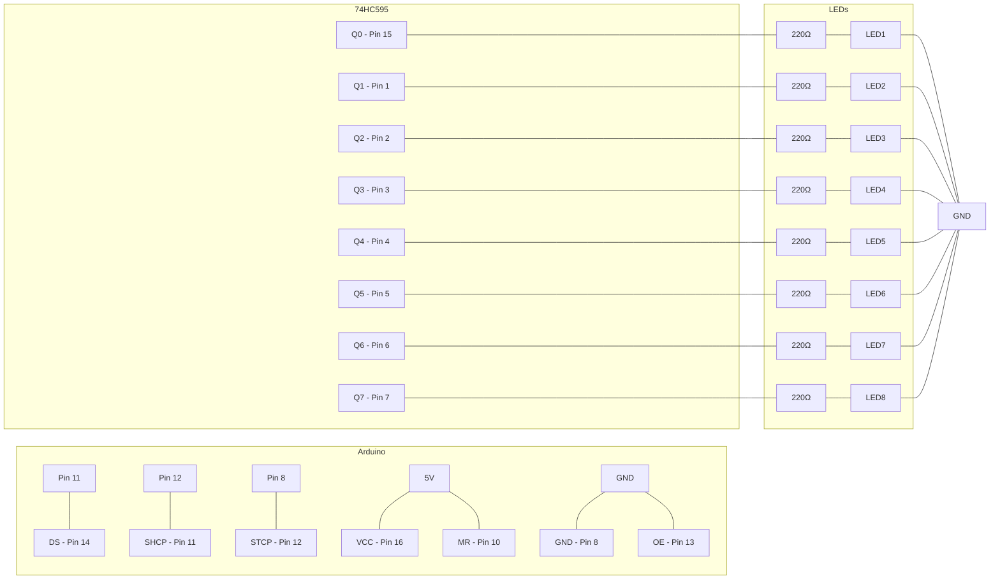
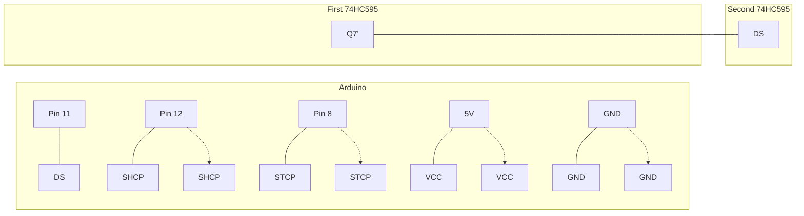

# Arduino Shift Registers

## Introduction

When working on Arduino projects, you'll often find yourself running out of pins. Perhaps you need to control multiple LEDs, read several buttons, or interface with components that require numerous connections. This is where **shift registers** come to the rescue!

Shift registers are integrated circuits that allow you to expand the number of inputs or outputs available on your Arduino. They work by converting serial data (using just a few pins) into parallel data (controlling many outputs), or vice versa.

In this tutorial, we'll focus on the popular **74HC595** 8-bit shift register, which can add 8 additional digital outputs to your Arduino using only 3 pins.

## What Are Shift Registers?

A shift register is a sequential logic circuit that can store and "shift" binary data. Think of it as a series of connected flip-flops where data moves from one storage element to the next with each clock pulse.

Shift registers come in two main varieties:
- **Serial-In, Parallel-Out (SIPO)**: Accepts data serially (one bit at a time) and outputs it in parallel (all bits simultaneously)
- **Parallel-In, Serial-Out (PISO)**: Accepts data in parallel and outputs it serially

For Arduino projects, the SIPO type (like the 74HC595) is most commonly used to expand outputs, while PISO types (like the 74HC165) are used to expand inputs.

## The 74HC595 Shift Register

The 74HC595 is an 8-bit Serial-In, Parallel-Out (SIPO) shift register that's inexpensive and easy to use with Arduino. Let's look at its pinout:

```mermaid
graph TD
    subgraph 74HC595 Pinout
        Q1(Q1 - Pin 1) --- Q2(Q2 - Pin 2)
        Q2 --- Q3(Q3 - Pin 3)
        Q3 --- Q4(Q4 - Pin 4)
        Q4 --- Q5(Q5 - Pin 5)
        Q5 --- Q6(Q6 - Pin 6)
        Q6 --- Q7(Q7 - Pin 7)
        Q7 --- GND(GND - Pin 8)
        GND --- Q7s(Q7' - Pin 9)
        Q7s --- MR(MR - Pin 10)
        MR --- SHCP(SHCP - Pin 11)
        SHCP --- STCP(STCP - Pin 12)
        STCP --- OE(OE - Pin 13)
        OE --- DS(DS - Pin 14)
        DS --- Q0(Q0 - Pin 15)
        Q0 --- VCC(VCC - Pin 16)
    end
```



Key pins you'll work with:
- **DS (Data Serial)**: Pin 14 - The serial data input
- **SHCP (Shift Register Clock Pin)**: Pin 11 - The clock input for the shift register
- **STCP (Storage Register Clock Pin)**: Pin 12 - The latch pin that updates the outputs
- **OE (Output Enable)**: Pin 13 - Enables/disables outputs (usually connected to ground)
- **MR (Master Reset)**: Pin 10 - Resets the shift register (usually connected to VCC)
- **Q0-Q7**: Pins 15, 1-7 - The eight output pins
- **VCC**: Pin 16 - Connect to 5V
- **GND**: Pin 8 - Connect to ground

## How Shift Registers Work

The 74HC595 operates in a simple but powerful way:

1. **Serial Data Input**: You send data one bit at a time through the DS pin
2. **Shifting**: Each bit is shifted into the register with a clock pulse on SHCP
3. **Storage**: Once all bits are shifted in, you pulse the STCP pin to update all outputs simultaneously
4. **Parallel Output**: The 8 bits are now available on the Q0-Q7 pins

This approach allows you to control 8 outputs using just 3 Arduino pins.

## Basic Circuit: Controlling 8 LEDs

Let's start with a simple example of controlling 8 LEDs with a 74HC595 and Arduino.

### Components Needed:
- Arduino board (Uno, Nano, etc.)
- 74HC595 shift register
- 8 LEDs
- 8 resistors (220Ω to 330Ω)
- Breadboard and jumper wires

### Circuit Connection:



### Basic Code Example:

```cpp
// Define pins connected to the 74HC595
const int dataPin = 11;   // DS
const int clockPin = 12;  // SHCP
const int latchPin = 8;   // STCP

void setup() {
  // Set pins as outputs
  pinMode(dataPin, OUTPUT);
  pinMode(clockPin, OUTPUT);
  pinMode(latchPin, OUTPUT);
}

void loop() {
  // Example 1: Count in binary from 0 to 255
  for (int i = 0; i < 256; i++) {
    updateShiftRegister(i);
    delay(100);
  }
  
  delay(500);
  
  // Example 2: Light each LED one by one
  for (int i = 0; i < 8; i++) {
    byte value = (1 << i);  // Shift 1 to position i
    updateShiftRegister(value);
    delay(200);
  }
  
  delay(500);
}

void updateShiftRegister(byte value) {
  // Make latchPin LOW to prevent updating while shifting bits
  digitalWrite(latchPin, LOW);
  
  // Shift out the bits
  shiftOut(dataPin, clockPin, MSBFIRST, value);
  
  // Make latchPin HIGH to update the outputs
  digitalWrite(latchPin, HIGH);
}
```

### Understanding the Code:

1. **Pin Setup**: We define and configure the three pins that will control the shift register.

2. **updateShiftRegister() Function**: This is where the magic happens:
   - We set the latch pin LOW to tell the 74HC595 we're about to send data
   - We use Arduino's built-in `shiftOut()` function to send 8 bits serially
   - We set the latch pin HIGH to update all the outputs simultaneously

3. **loop() Examples**:
   - The first example counts from 0 to 255, displaying binary patterns on the LEDs
   - The second example lights up each LED one by one using bit shifting

The `shiftOut()` function takes four parameters:
- `dataPin`: Where to send the data (DS pin)
- `clockPin`: The clock pin to pulse (SHCP pin)
- `bitOrder`: Whether to send the most significant bit first (`MSBFIRST`) or least significant bit first (`LSBFIRST`)
- `value`: The byte (8 bits) of data to send

## Daisy-Chaining Multiple Shift Registers

What if 8 outputs aren't enough? You can daisy-chain multiple 74HC595 shift registers to control 16, 24, or more outputs using the same three Arduino pins!

### How to Connect Multiple Shift Registers:



The key connection is from Q7' (serial output) of the first shift register to DS (data input) of the second shift register. The clock and latch pins of both registers are connected in parallel to the same Arduino pins.

### Code for Daisy-Chained Shift Registers:

```cpp
// Define pins connected to the 74HC595
const int dataPin = 11;   // DS
const int clockPin = 12;  // SHCP
const int latchPin = 8;   // STCP
const int numRegisters = 2;  // Number of shift registers

void setup() {
  // Set pins as outputs
  pinMode(dataPin, OUTPUT);
  pinMode(clockPin, OUTPUT);
  pinMode(latchPin, OUTPUT);
}

void loop() {
  // Example: Light one LED at a time across all registers
  for (int i = 0; i < 8 * numRegisters; i++) {
    // Create an array of bytes to hold the values for each register
    byte registerValues[numRegisters] = {0};
    
    // Calculate which register and bit position
    int registerIndex = i / 8;
    int bitPosition = i % 8;
    
    // Set the appropriate bit
    registerValues[registerIndex] = (1 << bitPosition);
    
    // Update all registers
    updateShiftRegisters(registerValues, numRegisters);
    delay(100);
  }
}

void updateShiftRegisters(byte registerValues[], int numRegisters) {
  // Make latchPin LOW to prevent updating while shifting bits
  digitalWrite(latchPin, LOW);
  
  // Shift out the bits for each register
  // Note: We need to send the last register first (MSBFIRST order)
  for (int i = numRegisters - 1; i >= 0; i--) {
    shiftOut(dataPin, clockPin, MSBFIRST, registerValues[i]);
  }
  
  // Make latchPin HIGH to update the outputs
  digitalWrite(latchPin, HIGH);
}
```

In this code:
1. We define how many shift registers we're using (`numRegisters = 2`)
2. We create an array to hold the values for each register
3. We calculate which register and bit position we need to modify
4. We send the data starting with the last register (since data flows through the chain)

## Practical Applications

Shift registers are incredibly versatile. Here are some practical applications:

### 1. LED Matrix Control

You can use shift registers to control an LED matrix, greatly reducing the number of Arduino pins needed.

```cpp
// Define pins connected to the 74HC595
const int dataPin = 11;
const int clockPin = 12;
const int latchPin = 8;

// Define LED matrix patterns (8x8)
const byte MATRIX_PATTERNS[] = {
  0x00, 0x66, 0xFF, 0xFF, 0x7E, 0x3C, 0x18, 0x00,  // Heart
  0x3C, 0x42, 0xA5, 0x81, 0xA5, 0x99, 0x42, 0x3C,  // Smiley face
};

void setup() {
  pinMode(dataPin, OUTPUT);
  pinMode(clockPin, OUTPUT);
  pinMode(latchPin, OUTPUT);
}

void loop() {
  // Display the heart pattern
  for (int row = 0; row < 8; row++) {
    displayRow(row, MATRIX_PATTERNS[row]);
    delay(1);  // Refresh rate
  }
}

void displayRow(int row, byte pattern) {
  digitalWrite(latchPin, LOW);
  
  // First shift register: row selection (one row active at a time)
  shiftOut(dataPin, clockPin, MSBFIRST, (1 << row));
  
  // Second shift register: LED pattern for that row
  shiftOut(dataPin, clockPin, MSBFIRST, pattern);
  
  digitalWrite(latchPin, HIGH);
}
```

### 2. Seven-Segment Display Control

You can use shift registers to drive multiple seven-segment displays:

```cpp
// Define pins connected to the 74HC595
const int dataPin = 11;
const int clockPin = 12;
const int latchPin = 8;

// Seven-segment display segments (a-g)
// For common cathode displays:
//   0   1   2   3   4   5   6   7   8   9
const byte digits[] = {
  0x3F, 0x06, 0x5B, 0x4F, 0x66, 0x6D, 0x7D, 0x07, 0x7F, 0x6F
};

void setup() {
  pinMode(dataPin, OUTPUT);
  pinMode(clockPin, OUTPUT);
  pinMode(latchPin, OUTPUT);
}

void loop() {
  // Count from 0 to 99 on two seven-segment displays
  for (int i = 0; i < 100; i++) {
    int tens = i / 10;
    int ones = i % 10;
    
    // Display tens digit
    updateShiftRegister(digits[tens]);
    delay(500);
    
    // Display ones digit
    updateShiftRegister(digits[ones]);
    delay(500);
  }
}

void updateShiftRegister(byte value) {
  digitalWrite(latchPin, LOW);
  shiftOut(dataPin, clockPin, MSBFIRST, value);
  digitalWrite(latchPin, HIGH);
}
```

### 3. Button Input Matrix with 74HC165

While we've focused on the 74HC595 for outputs, the 74HC165 is a Parallel-In, Serial-Out (PISO) shift register that can be used to read multiple buttons or switches:

```cpp
// Define pins connected to the 74HC165
const int loadPin = 8;    // PL
const int clockPin = 12;  // CP
const int dataPin = 11;   // Q7
const int numButtons = 8;

void setup() {
  pinMode(loadPin, OUTPUT);
  pinMode(clockPin, OUTPUT);
  pinMode(dataPin, INPUT);
  
  Serial.begin(9600);
  Serial.println("Button Matrix Reader");
}

void loop() {
  // Read 8 buttons
  byte buttonStates = readButtons();
  
  // Print which buttons are pressed
  Serial.print("Button states: ");
  for (int i = 0; i < numButtons; i++) {
    bool isPressed = bitRead(buttonStates, i);
    Serial.print("Button ");
    Serial.print(i);
    Serial.print(": ");
    Serial.print(isPressed ? "PRESSED" : "released");
    Serial.print("  ");
  }
  Serial.println();
  
  delay(200);
}

byte readButtons() {
  // Pulse the latch pin to load the current button states
  digitalWrite(loadPin, LOW);
  delayMicroseconds(5);
  digitalWrite(loadPin, HIGH);
  delayMicroseconds(5);
  
  // Read the button states
  byte data = 0;
  for (int i = 0; i < numButtons; i++) {
    // Shift in the next bit
    bitWrite(data, i, digitalRead(dataPin));
    
    // Pulse the clock to get the next bit
    digitalWrite(clockPin, HIGH);
    delayMicroseconds(5);
    digitalWrite(clockPin, LOW);
  }
  
  return data;
}
```

## Optimizations and Best Practices

When working with shift registers, keep these tips in mind:

### 1. Power Considerations

When driving many LEDs or other loads, make sure to:
- Use an external power supply if needed
- Add decoupling capacitors (0.1μF) between VCC and GND near each shift register
- Check the maximum current per pin (usually 20-25mA for 74HC595)
- Use transistors or driver ICs for higher current loads

### 2. Speed Optimizations

For faster operation:
- Use direct port manipulation instead of `digitalWrite()`
- Reduce `delayMicroseconds()` values while ensuring reliable operation
- Use `MSBFIRST` or `LSBFIRST` based on your circuit layout

```cpp
// Faster version using direct port manipulation
// (Example for Arduino Uno - pins will vary on other boards)
#define DATA_PIN 11  // PB3
#define CLOCK_PIN 12 // PB4
#define LATCH_PIN 8  // PB0

void fastUpdateShiftRegister(byte value) {
  // Set latch low
  PORTB &= ~(1 << 0);
  
  // Shift out 8 bits
  for (int i = 7; i >= 0; i--) {
    // Set data pin based on bit value
    if (value & (1 << i))
      PORTB |= (1 << 3);
    else
      PORTB &= ~(1 << 3);
      
    // Pulse clock
    PORTB |= (1 << 4);
    PORTB &= ~(1 << 4);
  }
  
  // Set latch high
  PORTB |= (1 << 0);
}
```

### 3. Troubleshooting Common Issues

- **Random or flickering outputs**: Add decoupling capacitors, check connections
- **No output**: Verify OE (pin 13) is connected to ground and MR (pin 10) is pulled high
- **Partial operation**: Check for cold solder joints or broken connections
- **Wrong pattern**: Check if you're using `MSBFIRST` or `LSBFIRST` correctly

## Summary

Shift registers are powerful tools that allow you to expand the I/O capabilities of your Arduino. The 74HC595 provides 8 additional outputs using just 3 Arduino pins, and multiple shift registers can be daisy-chained for even more expansion.

In this tutorial, we've covered:
- The basics of shift registers and how they work
- Detailed explanations of the 74HC595 shift register
- How to control multiple LEDs with a single shift register
- Methods for daisy-chaining multiple shift registers
- Practical applications including LED matrices and seven-segment displays
- Button input expansion using the 74HC165
- Optimizations and best practices

## Exercises

To reinforce your understanding, try these exercises:

1. Create a binary counter that displays values from 0 to 255 on 8 LEDs using a shift register
2. Build a "Knight Rider" effect with 8 LEDs (light bouncing back and forth)
3. Control a 4-digit seven-segment display using two shift registers
4. Make a simple 4x4 LED matrix using shift registers
5. Create a 16-button input system using two 74HC165 shift registers

## Additional Resources

- [74HC595 Datasheet](https://www.ti.com/lit/ds/symlink/sn74hc595.pdf)
- [74HC165 Datasheet](https://www.ti.com/lit/ds/symlink/sn74hc165.pdf)
- Arduino ShiftOut Reference: [arduino.cc/reference/en/language/functions/advanced-io/shiftout/](https://www.arduino.cc/reference/en/language/functions/advanced-io/shiftout/)
- Arduino ShiftIn Reference: [arduino.cc/reference/en/language/functions/advanced-io/shiftin/](https://www.arduino.cc/reference/en/language/functions/advanced-io/shiftin/)