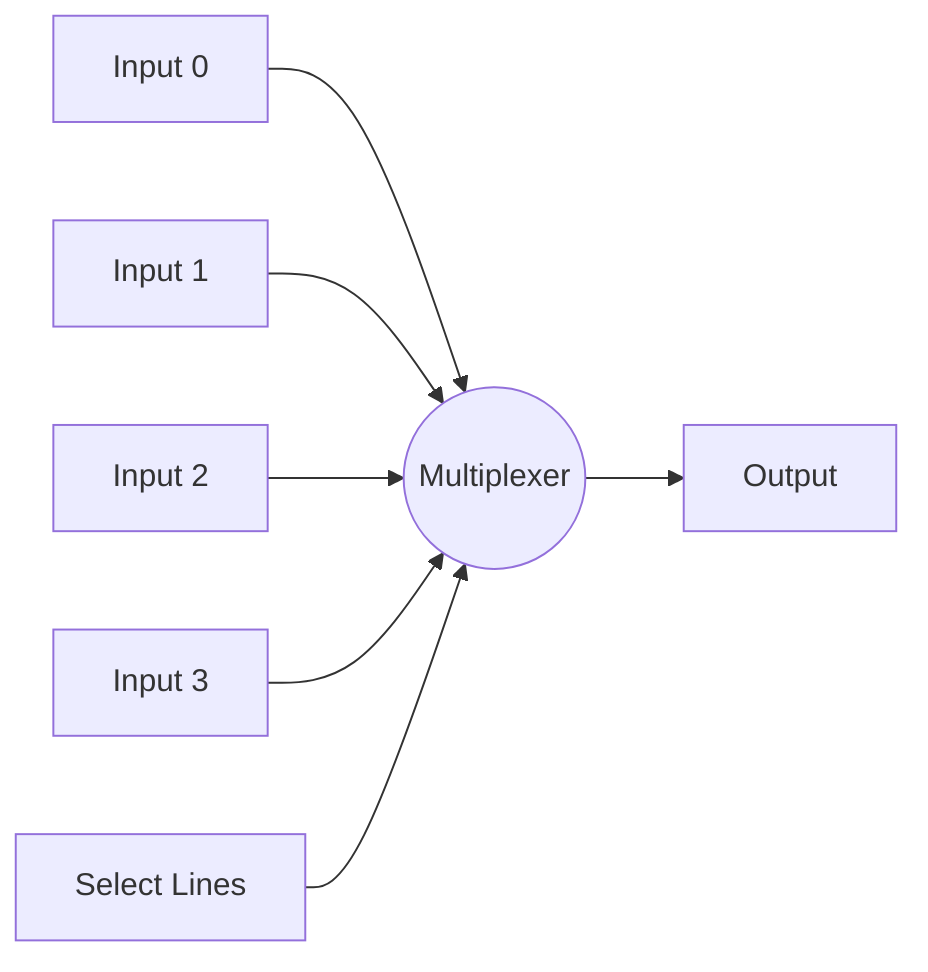

# Arduino Multiplexers

## Introduction

When working on Arduino projects, you'll eventually encounter a common limitation: the restricted number of input/output (I/O) pins. Most Arduino boards have between 14 and 20 digital pins and 6 analog pins, which can quickly become insufficient for complex projects involving multiple sensors, displays, or actuators.

This is where multiplexers come to the rescue! Multiplexers (often abbreviated as "mux") are devices that allow you to connect multiple signals to a single channel, effectively expanding your Arduino's I/O capabilities significantly.

In this tutorial, we'll explore how multiplexers work, the different types available for Arduino projects, and how to implement them in your own circuits with practical examples.

## What is a Multiplexer?

A multiplexer is a circuit element that selects one of several input signals and forwards the selected input to a single output line. Think of it as a digitally controlled switch with multiple inputs but only one output.



The selection of which input gets connected to the output is controlled by "select" or "address" lines. With N select lines, a multiplexer can handle 2^N inputs. For example:
- 2 select lines can control 4 inputs (2^2)
- 3 select lines can control 8 inputs (2^3)
- 4 select lines can control 16 inputs (2^4)

## Common Multiplexer ICs for Arduino

Here are some popular multiplexer ICs you can use with your Arduino:

1. **74HC4051**: 8-channel analog multiplexer/demultiplexer
2. **CD74HC4067**: 16-channel analog multiplexer/demultiplexer
3. **74HC150**: 16-input digital multiplexer
4. **74HC151**: 8-input digital multiplexer

For most beginner applications, the 74HC4051 and CD74HC4067 are excellent choices as they support both analog and digital signals.

## Using a 74HC4051 8-Channel Multiplexer

The 74HC4051 is one of the most commonly used multiplexers with Arduino. Let's look at how to connect and use it.

### Hardware Setup

Here's how to connect the 74HC4051 to your Arduino:

| 74HC4051 Pin | Connection |
|--------------|------------|
| VCC | 5V on Arduino |
| GND | GND on Arduino |
| Z (Common I/O) | Digital or Analog pin on Arduino |
| S0, S1, S2 (Address Selectors) | Digital pins on Arduino |
| E (Enable, active LOW) | GND for always enabled or digital pin for control |
| Y0 through Y7 | Your input/output devices |

### Basic Digital Input Example

In this example, we'll use a 74HC4051 to read 8 buttons using only 4 Arduino pins:

```cpp
// Define pin connections
const int muxSIG = A0;    // Arduino pin connected to multiplexer output
const int muxS0 = 2;      // Arduino pin connected to multiplexer S0
const int muxS1 = 3;      // Arduino pin connected to multiplexer S1
const int muxS2 = 4;      // Arduino pin connected to multiplexer S2

void setup() {
  // Initialize serial communication
  Serial.begin(9600);
  
  // Set up the select pins as outputs
  pinMode(muxS0, OUTPUT);
  pinMode(muxS1, OUTPUT);
  pinMode(muxS2, OUTPUT);
  
  // Set up the signal pin as input with pull-up resistor
  // Note: We're assuming buttons connected to ground
  pinMode(muxSIG, INPUT_PULLUP);
}

void loop() {
  // Loop through all 8 channels of the multiplexer
  for (int i = 0; i < 8; i++) {
    // Set the select pins according to the channel we want
    digitalWrite(muxS0, bitRead(i, 0));
    digitalWrite(muxS1, bitRead(i, 1));
    digitalWrite(muxS2, bitRead(i, 2));
    
    // Read the value from the selected channel
    int value = digitalRead(muxSIG);
    
    // Print the channel and its value
    Serial.print("Button ");
    Serial.print(i);
    Serial.print(": ");
    Serial.println(value == LOW ? "Pressed" : "Not Pressed");
  }
  
  Serial.println(); // Add a line break for readability
  delay(1000);      // Wait a second before next reading
}
```

### Analog Input Example

The 74HC4051 can also handle analog signals. Here's how to read 8 analog sensors with just 4 Arduino pins:

```cpp
// Define pin connections
const int muxSIG = A0;    // Arduino pin connected to multiplexer output
const int muxS0 = 2;      // Arduino pin connected to multiplexer S0
const int muxS1 = 3;      // Arduino pin connected to multiplexer S1
const int muxS2 = 4;      // Arduino pin connected to multiplexer S2

void setup() {
  // Initialize serial communication
  Serial.begin(9600);
  
  // Set up the select pins as outputs
  pinMode(muxS0, OUTPUT);
  pinMode(muxS1, OUTPUT);
  pinMode(muxS2, OUTPUT);
  
  // No need to set pinMode for analog inputs
}

void loop() {
  // Loop through all 8 channels of the multiplexer
  for (int i = 0; i < 8; i++) {
    // Set the select pins according to the channel we want
    digitalWrite(muxS0, bitRead(i, 0));
    digitalWrite(muxS1, bitRead(i, 1));
    digitalWrite(muxS2, bitRead(i, 2));
    
    // Small delay to allow the multiplexer to settle
    delayMicroseconds(10);
    
    // Read the value from the selected channel
    int value = analogRead(muxSIG);
    
    // Print the channel and its value
    Serial.print("Sensor ");
    Serial.print(i);
    Serial.print(": ");
    Serial.println(value);
  }
  
  Serial.println(); // Add a line break for readability
  delay(1000);      // Wait a second before next reading
}
```

## Using a CD74HC4067 16-Channel Multiplexer

The CD74HC4067 is similar to the 74HC4051 but provides 16 channels instead of 8. This means it needs 4 select pins instead of 3.

### Hardware Setup

Here's how to connect the CD74HC4067:

| CD74HC4067 Pin | Connection |
|----------------|------------|
| VCC | 5V on Arduino |
| GND | GND on Arduino |
| SIG (Common I/O) | Digital or Analog pin on Arduino |
| S0, S1, S2, S3 (Address Selectors) | Digital pins on Arduino |
| EN (Enable, active LOW) | GND for always enabled or digital pin for control |
| C0 through C15 | Your input/output devices |

### LED Control Example

In this example, we'll use a CD74HC4067 to control 16 LEDs using just 6 Arduino pins:

```cpp
// Define pin connections
const int muxSIG = 5;     // Arduino pin connected to multiplexer signal
const int muxS0 = 9;      // Arduino pin connected to multiplexer S0
const int muxS1 = 10;     // Arduino pin connected to multiplexer S1
const int muxS2 = 11;     // Arduino pin connected to multiplexer S2
const int muxS3 = 12;     // Arduino pin connected to multiplexer S3
const int muxEN = 8;      // Arduino pin connected to multiplexer enable

void setup() {
  // Set up the select pins as outputs
  pinMode(muxS0, OUTPUT);
  pinMode(muxS1, OUTPUT);
  pinMode(muxS2, OUTPUT);
  pinMode(muxS3, OUTPUT);
  pinMode(muxEN, OUTPUT);
  pinMode(muxSIG, OUTPUT);
  
  // Enable the multiplexer
  digitalWrite(muxEN, LOW);
}

// Function to select a specific channel and set its state
void setChannel(int channel, boolean state) {
  // Set the select pins according to the channel
  digitalWrite(muxS0, bitRead(channel, 0));
  digitalWrite(muxS1, bitRead(channel, 1));
  digitalWrite(muxS2, bitRead(channel, 2));
  digitalWrite(muxS3, bitRead(channel, 3));
  
  // Set the channel state
  digitalWrite(muxSIG, state);
}

void loop() {
  // LED chaser effect - light up one LED at a time
  for (int i = 0; i < 16; i++) {
    // Turn on current LED
    setChannel(i, HIGH);
    delay(100);
    // Turn off current LED
    setChannel(i, LOW);
  }
  
  // All LEDs on then off
  for (int i = 0; i < 16; i++) {
    setChannel(i, HIGH);
    delay(50);
  }
  delay(500);
  
  for (int i = 0; i < 16; i++) {
    setChannel(i, LOW);
    delay(50);
  }
  delay(500);
}
```

## Demultiplexers

While multiplexers combine multiple inputs into one output, demultiplexers (demux) do the opposite - they route one input to one of several possible outputs based on the address lines.

Interestingly, many multiplexer ICs like the 74HC4051 and CD74HC4067 can also function as demultiplexers by simply using them in reverse. The common I/O pin becomes the input, and the channel pins become outputs.

## Practical Project: Multi-Sensor Weather Station

Let's create a more comprehensive example: a weather station with multiple sensors connected through a multiplexer.

```cpp
// Multi-Sensor Weather Station using CD74HC4067 Multiplexer
// Sensors:
// - 4x Soil moisture sensors (analog)
// - 4x Temperature sensors (analog)
// - 4x Light sensors (analog)
// - 4x Rain sensors (digital)

// Define pin connections
const int muxSIG = A0;    // Arduino pin connected to multiplexer signal
const int muxS0 = 2;      // Arduino pin connected to multiplexer S0
const int muxS1 = 3;      // Arduino pin connected to multiplexer S1
const int muxS2 = 4;      // Arduino pin connected to multiplexer S2
const int muxS3 = 5;      // Arduino pin connected to multiplexer S3
const int muxEN = 6;      // Arduino pin connected to multiplexer enable

void setup() {
  Serial.begin(9600);
  
  // Set up the select pins as outputs
  pinMode(muxS0, OUTPUT);
  pinMode(muxS1, OUTPUT);
  pinMode(muxS2, OUTPUT);
  pinMode(muxS3, OUTPUT);
  pinMode(muxEN, OUTPUT);
  
  // Enable the multiplexer
  digitalWrite(muxEN, LOW);
  
  Serial.println("Weather Station Starting...");
  delay(1000);
}

// Function to read a specific multiplexer channel
int readMuxChannel(int channel) {
  // Set the select pins according to the channel
  digitalWrite(muxS0, bitRead(channel, 0));
  digitalWrite(muxS1, bitRead(channel, 1));
  digitalWrite(muxS2, bitRead(channel, 2));
  digitalWrite(muxS3, bitRead(channel, 3));
  
  // Allow the multiplexer to settle
  delayMicroseconds(10);
  
  // Read the value
  return analogRead(muxSIG);
}

// Convert analog reading to temperature in Celsius
float convertToTemperature(int reading) {
  // For example, using a TMP36 sensor
  float voltage = reading * 5.0 / 1024.0;
  return (voltage - 0.5) * 100.0;
}

// Convert analog reading to soil moisture percentage
int convertToMoisture(int reading) {
  // Map the reading to a percentage (adjust min/max to calibrate)
  return map(reading, 0, 1023, 0, 100);
}

// Convert analog reading to light level percentage
int convertToLightLevel(int reading) {
  // Map the reading to a percentage (adjust min/max to calibrate)
  return map(reading, 0, 1023, 0, 100);
}

// Check if it's raining based on the sensor reading
boolean isRaining(int reading) {
  // If the reading is below a threshold, consider it raining
  return reading < 500;
}

void loop() {
  Serial.println("------ Weather Station Readings ------");
  
  // Read soil moisture sensors (channels 0-3)
  Serial.println("Soil Moisture Readings:");
  for (int i = 0; i < 4; i++) {
    int reading = readMuxChannel(i);
    int moisture = convertToMoisture(reading);
    Serial.print("Sensor ");
    Serial.print(i + 1);
    Serial.print(": ");
    Serial.print(moisture);
    Serial.println("%");
  }
  
  // Read temperature sensors (channels 4-7)
  Serial.println("
Temperature Readings:");
  for (int i = 4; i < 8; i++) {
    int reading = readMuxChannel(i);
    float temperature = convertToTemperature(reading);
    Serial.print("Sensor ");
    Serial.print(i - 3);
    Serial.print(": ");
    Serial.print(temperature);
    Serial.println("°C");
  }
  
  // Read light sensors (channels 8-11)
  Serial.println("
Light Level Readings:");
  for (int i = 8; i < 12; i++) {
    int reading = readMuxChannel(i);
    int lightLevel = convertToLightLevel(reading);
    Serial.print("Sensor ");
    Serial.print(i - 7);
    Serial.print(": ");
    Serial.print(lightLevel);
    Serial.println("%");
  }
  
  // Read rain sensors (channels 12-15)
  Serial.println("
Rain Sensor Readings:");
  for (int i = 12; i < 16; i++) {
    int reading = readMuxChannel(i);
    Serial.print("Sensor ");
    Serial.print(i - 11);
    Serial.print(": ");
    Serial.println(isRaining(reading) ? "Raining" : "Dry");
  }
  
  Serial.println("------------------------------------");
  delay(5000); // Take readings every 5 seconds
}
```

## Multiple Multiplexers

For even more I/O expansion, you can use multiple multiplexers. Here are two approaches:

### 1. Independent Multiplexers

Use separate multiplexers, each with its own signal line but sharing select lines:

```cpp
// Using two CD74HC4067 multiplexers sharing the same select lines
const int mux1SIG = A0;   // First multiplexer signal
const int mux2SIG = A1;   // Second multiplexer signal
const int muxS0 = 2;      // Select line S0
const int muxS1 = 3;      // Select line S1
const int muxS2 = 4;      // Select line S2
const int muxS3 = 5;      // Select line S3

// Read from the first multiplexer
int readMux1Channel(int channel) {
  // Set the select pins
  digitalWrite(muxS0, bitRead(channel, 0));
  digitalWrite(muxS1, bitRead(channel, 1));
  digitalWrite(muxS2, bitRead(channel, 2));
  digitalWrite(muxS3, bitRead(channel, 3));
  
  // Read from the first multiplexer
  return analogRead(mux1SIG);
}

// Read from the second multiplexer
int readMux2Channel(int channel) {
  // Set the select pins
  digitalWrite(muxS0, bitRead(channel, 0));
  digitalWrite(muxS1, bitRead(channel, 1));
  digitalWrite(muxS2, bitRead(channel, 2));
  digitalWrite(muxS3, bitRead(channel, 3));
  
  // Read from the second multiplexer
  return analogRead(mux2SIG);
}
```

### 2. Cascaded Multiplexers

You can also cascade multiplexers by connecting outputs from one to inputs of another:

```cpp
// Example: Using one multiplexer to select which of 8 other multiplexers to use
// This gives 8 multiplexers × 8 channels = 64 channels
```

The implementation of cascaded multiplexers is more complex and would require careful consideration of your specific needs.

## Troubleshooting Multiplexers

When working with multiplexers, you might encounter some common issues:

1. **Inconsistent readings**: Ensure you have a small delay after changing select pins before reading.
2. **Cross-talk between channels**: Add decoupling capacitors near the multiplexer's power pins.
3. **Signal degradation**: Multiplexers have internal resistance; be aware of this when working with low-current sensors.
4. **High-frequency signals**: Basic multiplexers may not work well with high-frequency signals. Check the datasheet for bandwidth limitations.

## Summary

Multiplexers are essential components for expanding the I/O capabilities of your Arduino. By understanding how to use devices like the 74HC4051 and CD74HC4067, you can create complex projects without running out of pins.

Key takeaways from this tutorial:
- Multiplexers let you connect multiple inputs to a single Arduino pin
- Select lines determine which input channel is active
- Common multiplexers like 74HC4051 (8 channels) and CD74HC4067 (16 channels) are easy to use
- Multiplexers can handle both digital and analog signals
- You can combine multiple multiplexers for even more I/O expansion

## Exercises

1. Build a simple digital input system with 8 buttons using a 74HC4051.
2. Create an analog sensor array with temperature and light sensors.
3. Make an LED matrix using multiplexers for both rows and columns.
4. Challenge: Build a MIDI controller with 16 potentiometers using a CD74HC4067.
5. Advanced: Create a home automation system that monitors multiple rooms using cascaded multiplexers.

## Additional Resources

- Datasheets:
  - [74HC4051 Datasheet](https://www.ti.com/lit/ds/symlink/cd74hc4051.pdf)
  - [CD74HC4067 Datasheet](https://www.ti.com/lit/ds/symlink/cd74hc4067.pdf)

- Reference books:
  - "Practical Electronics for Inventors" by Paul Scherz and Simon Monk
  - "Make: Electronics" by Charles Platt

- Arduino libraries:
  - [CD74HC4067 Library](https://github.com/blackketter/CD74HC4067)
  - [4051 Mux Shield Library](https://github.com/MajenkoLibraries/4051)

Happy tinkering with multiplexers and expanding your Arduino projects!