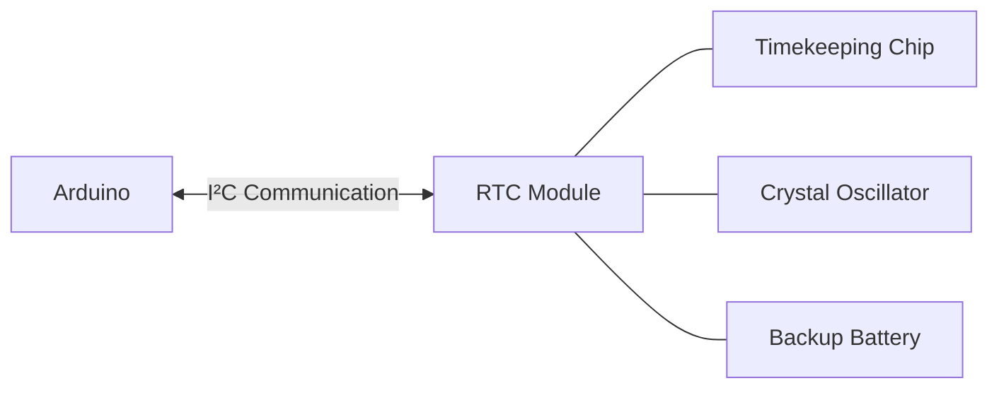

# Arduino Real-time Clock

## Introduction

Time is a crucial element in many electronic projects. Whether you're building a digital clock, a data logger, or a scheduling system, your Arduino needs a way to keep track of time accurately. While Arduino has built-in timing functions, these are not designed for keeping real-world time over extended periods, especially when power is disconnected.

This is where Real-Time Clock (RTC) modules come in. An RTC is a small, low-power chip that keeps track of time even when your Arduino is powered off, thanks to a backup battery. In this tutorial, we'll explore how to integrate RTC modules with Arduino and create applications that require accurate timekeeping.

## Understanding RTC Modules

### What is an RTC Module?

An RTC module is a specialized integrated circuit that maintains accurate time even when the main power is disconnected. Most RTC modules include:

- A timekeeping chip (commonly DS1307 or DS3231)
- A backup battery (usually a CR2032 coin cell)
- A crystal oscillator (for time precision)
- I²C interface for communication with microcontrollers



### Common RTC Modules

1. **DS1307**: A basic RTC module with 56 bytes of battery-backed RAM.
2. **DS3231**: A more accurate RTC with a built-in temperature-compensated crystal oscillator, providing better precision.

## Hardware Requirements

To follow along with this tutorial, you'll need:

- Arduino board (Uno, Nano, Mega, etc.)
- RTC module (DS1307 or DS3231)
- Breadboard and jumper wires
- USB cable for programming Arduino

## Wiring the RTC Module

Connect your RTC module to Arduino using the following connections:

| RTC Pin | Arduino Pin | Function           |
|---------|-------------|-------------------|
| VCC     | 5V          | Power supply      |
| GND     | GND         | Ground            |
| SDA     | A4 (Uno/Nano) or pin 20 (Mega) | I²C data line     |
| SCL     | A5 (Uno/Nano) or pin 21 (Mega) | I²C clock line    |

## Required Libraries

For this tutorial, we'll be using the RTClib library, which provides an easy-to-use interface for various RTC modules.

Install the library via the Arduino Library Manager:

1. In the Arduino IDE, go to **Sketch > Include Library > Manage Libraries...**
2. Search for "RTClib"
3. Install the library by Adafruit

## Basic RTC Operation

### Setting the Time

When you first use an RTC module, you'll need to set the current time. Here's a simple sketch to set the time on a DS3231 RTC module:

```cpp
#include <Wire.h>
#include <RTClib.h>

RTC_DS3231 rtc;

void setup() {
  Serial.begin(9600);
  
  if (!rtc.begin()) {
    Serial.println("Couldn't find RTC");
    while (1);
  }
  
  // Uncomment this line to set the RTC to the date & time this sketch was compiled
  // ONLY RUN THIS ONCE, THEN COMMENT IT OUT AGAIN
  rtc.adjust(DateTime(F(__DATE__), F(__TIME__)));
  
  Serial.println("RTC time set!");
}

void loop() {
  // Nothing to do in the loop for setting the time
}
```

**Note**: Only run the `rtc.adjust()` line once, then comment it out and upload the sketch again. Otherwise, the time will be reset every time the Arduino restarts.

### Reading the Time

Once the time is set, we can read it from the RTC module:

```cpp
#include <Wire.h>
#include <RTClib.h>

RTC_DS3231 rtc;

void setup() {
  Serial.begin(9600);
  
  if (!rtc.begin()) {
    Serial.println("Couldn't find RTC");
    while (1);
  }
}

void loop() {
  DateTime now = rtc.now();
  
  Serial.print(now.year(), DEC);
  Serial.print('/');
  Serial.print(now.month(), DEC);
  Serial.print('/');
  Serial.print(now.day(), DEC);
  Serial.print(" ");
  Serial.print(now.hour(), DEC);
  Serial.print(':');
  Serial.print(now.minute(), DEC);
  Serial.print(':');
  Serial.print(now.second(), DEC);
  Serial.println();
  
  delay(1000);
}
```

**Expected Output:**
```
2025/3/12 15:30:45
2025/3/12 15:30:46
2025/3/12 15:30:47
...
```

### Formatting Time and Date

The RTClib provides several helpful methods for formatting time and date:

```cpp
#include <Wire.h>
#include <RTClib.h>

RTC_DS3231 rtc;
char daysOfTheWeek[7][12] = {"Sunday", "Monday", "Tuesday", "Wednesday", "Thursday", "Friday", "Saturday"};

void setup() {
  Serial.begin(9600);
  
  if (!rtc.begin()) {
    Serial.println("Couldn't find RTC");
    while (1);
  }
}

void loop() {
  DateTime now = rtc.now();
  
  Serial.print("Date: ");
  Serial.print(now.year(), DEC);
  Serial.print('/');
  Serial.print(now.month(), DEC);
  Serial.print('/');
  Serial.print(now.day(), DEC);
  
  Serial.print(" (");
  Serial.print(daysOfTheWeek[now.dayOfTheWeek()]);
  Serial.print(") ");
  
  Serial.print("Time: ");
  Serial.print(now.hour(), DEC);
  Serial.print(':');
  if (now.minute() < 10) {
    Serial.print('0');
  }
  Serial.print(now.minute(), DEC);
  Serial.print(':');
  if (now.second() < 10) {
    Serial.print('0');
  }
  Serial.print(now.second(), DEC);
  Serial.println();
  
  // Unix time (seconds since Jan 1, 1970)
  Serial.print("Unix time: ");
  Serial.println(now.unixtime());
  
  delay(1000);
}
```

**Expected Output:**
```
Date: 2025/3/12 (Wednesday) Time: 15:30:45
Unix time: 1741955445
Date: 2025/3/12 (Wednesday) Time: 15:30:46
Unix time: 1741955446
...
```

## Practical Applications

### Digital Clock

Let's create a simple digital clock using an RTC module and an LCD display:

```cpp
#include <Wire.h>
#include <RTClib.h>
#include <LiquidCrystal_I2C.h>

RTC_DS3231 rtc;
LiquidCrystal_I2C lcd(0x27, 16, 2); // I2C address 0x27, 16 columns and 2 rows

void setup() {
  lcd.init();               // Initialize LCD
  lcd.backlight();          // Turn on backlight
  
  if (!rtc.begin()) {
    lcd.print("RTC not found!");
    while (1);
  }
}

void loop() {
  DateTime now = rtc.now();
  
  // Display date on the first row
  lcd.setCursor(0, 0);
  lcd.print(now.year(), DEC);
  lcd.print('/');
  if (now.month() < 10) lcd.print('0');
  lcd.print(now.month(), DEC);
  lcd.print('/');
  if (now.day() < 10) lcd.print('0');
  lcd.print(now.day(), DEC);
  
  // Display time on the second row
  lcd.setCursor(0, 1);
  if (now.hour() < 10) lcd.print('0');
  lcd.print(now.hour(), DEC);
  lcd.print(':');
  if (now.minute() < 10) lcd.print('0');
  lcd.print(now.minute(), DEC);
  lcd.print(':');
  if (now.second() < 10) lcd.print('0');
  lcd.print(now.second(), DEC);
  
  delay(1000);
}
```

### Data Logger with Timestamping

This example shows how to create a simple temperature data logger that records readings with timestamps:

```cpp
#include <Wire.h>
#include <RTClib.h>
#include <SD.h>
#include <SPI.h>

RTC_DS3231 rtc;
const int chipSelect = 10; // CS pin for SD card module
const int tempSensorPin = A0; // Temperature sensor connected to A0

void setup() {
  Serial.begin(9600);
  
  if (!rtc.begin()) {
    Serial.println("Couldn't find RTC");
    while (1);
  }
  
  Serial.print("Initializing SD card...");
  if (!SD.begin(chipSelect)) {
    Serial.println("SD card initialization failed!");
    while (1);
  }
  Serial.println("SD card initialized.");
  
  // Create header in log file
  File dataFile = SD.open("templog.csv", FILE_WRITE);
  if (dataFile) {
    if (dataFile.size() == 0) {
      dataFile.println("Date,Time,Temperature(C)");
    }
    dataFile.close();
  }
}

void loop() {
  DateTime now = rtc.now();
  
  // Read temperature (convert analog reading to Celsius)
  int sensorValue = analogRead(tempSensorPin);
  float temperature = (sensorValue * 5.0 / 1024.0 - 0.5) * 100; // For LM35 sensor
  
  // Format date and time
  String dateStamp = String(now.year()) + "/" + 
                    String(now.month()) + "/" + 
                    String(now.day());
                    
  String timeStamp = String(now.hour()) + ":" + 
                    String(now.minute()) + ":" + 
                    String(now.second());
  
  // Log data to SD card
  File dataFile = SD.open("templog.csv", FILE_WRITE);
  if (dataFile) {
    dataFile.print(dateStamp);
    dataFile.print(",");
    dataFile.print(timeStamp);
    dataFile.print(",");
    dataFile.println(temperature);
    dataFile.close();
    
    // Print to Serial monitor as well
    Serial.print(dateStamp);
    Serial.print(" ");
    Serial.print(timeStamp);
    Serial.print(" - Temperature: ");
    Serial.print(temperature);
    Serial.println(" C");
  } else {
    Serial.println("Error opening log file!");
  }
  
  delay(60000); // Log data every minute
}
```

### Alarm Clock

Let's create a simple alarm clock that triggers a buzzer at a specified time:

```cpp
#include <Wire.h>
#include <RTClib.h>

RTC_DS3231 rtc;
const int buzzerPin = 9;

// Set your alarm time here
const int alarmHour = 7;
const int alarmMinute = 30;

void setup() {
  Serial.begin(9600);
  pinMode(buzzerPin, OUTPUT);
  
  if (!rtc.begin()) {
    Serial.println("Couldn't find RTC");
    while (1);
  }
}

void loop() {
  DateTime now = rtc.now();
  
  Serial.print(now.hour(), DEC);
  Serial.print(':');
  if (now.minute() < 10) Serial.print('0');
  Serial.print(now.minute(), DEC);
  Serial.print(':');
  if (now.second() < 10) Serial.print('0');
  Serial.print(now.second(), DEC);
  
  // Check if it's alarm time
  if (now.hour() == alarmHour && now.minute() == alarmMinute) {
    Serial.println(" - ALARM!");
    // Sound the buzzer
    tone(buzzerPin, 1000); // 1kHz tone
    delay(500);
    noTone(buzzerPin);
    delay(500);
  } else {
    Serial.println();
  }
  
  delay(1000);
}
```

## Advanced Features

### Temperature Reading (DS3231 Only)

The DS3231 RTC includes a built-in temperature sensor, which you can read to monitor the ambient temperature:

```cpp
#include <Wire.h>
#include <RTClib.h>

RTC_DS3231 rtc;

void setup() {
  Serial.begin(9600);
  
  if (!rtc.begin()) {
    Serial.println("Couldn't find RTC");
    while (1);
  }
}

void loop() {
  DateTime now = rtc.now();
  
  Serial.print(now.year(), DEC);
  Serial.print('/');
  Serial.print(now.month(), DEC);
  Serial.print('/');
  Serial.print(now.day(), DEC);
  Serial.print(" ");
  Serial.print(now.hour(), DEC);
  Serial.print(':');
  Serial.print(now.minute(), DEC);
  Serial.print(':');
  Serial.print(now.second(), DEC);
  
  // Read and display temperature
  float temp = rtc.getTemperature();
  Serial.print(" - Temperature: ");
  Serial.print(temp);
  Serial.println(" C");
  
  delay(1000);
}
```

### Using RTC Alarms (DS3231 Only)

The DS3231 chip supports hardware alarms. Here's how to use them:

```cpp
#include <Wire.h>
#include <RTClib.h>

RTC_DS3231 rtc;
const int alarmPin = 2; // Connect SQW pin from RTC to this Arduino pin
volatile bool alarmFlag = false;

void setup() {
  Serial.begin(9600);
  pinMode(alarmPin, INPUT_PULLUP);
  attachInterrupt(digitalPinToInterrupt(alarmPin), alarmISR, FALLING);
  
  if (!rtc.begin()) {
    Serial.println("Couldn't find RTC");
    while (1);
  }
  
  // Clear any existing alarms
  rtc.disableAlarm(1);
  rtc.disableAlarm(2);
  rtc.clearAlarm(1);
  rtc.clearAlarm(2);
  
  // Set alarm 1 to trigger at a specific time (e.g., 7:30 AM every day)
  DateTime alarmTime = DateTime(2020, 1, 1, 7, 30, 0); // Year and month don't matter for daily alarms
  rtc.setAlarm1(alarmTime, DS3231_A1_Hour); // Trigger when hours and minutes match
  
  // Enable the alarm to trigger the SQW pin
  rtc.writeSqwPinMode(DS3231_OFF);
  rtc.enableAlarm(1);
  
  Serial.println("Alarm set for 7:30 AM daily");
}

void loop() {
  DateTime now = rtc.now();
  
  // Print current time
  Serial.print(now.hour(), DEC);
  Serial.print(':');
  if (now.minute() < 10) Serial.print('0');
  Serial.print(now.minute(), DEC);
  Serial.print(':');
  if (now.second() < 10) Serial.print('0');
  Serial.println(now.second(), DEC);
  
  // Check if alarm was triggered
  if (alarmFlag) {
    Serial.println("ALARM TRIGGERED!");
    rtc.clearAlarm(1);
    alarmFlag = false;
    
    // Add your alarm action here
    // ...
  }
  
  delay(1000);
}

void alarmISR() {
  alarmFlag = true;
}
```

## Troubleshooting

### Common Issues and Solutions

1. **RTC Not Detected**:
   - Check your wiring connections
   - Verify the I²C address (use an I²C scanner sketch)
   - Make sure the RTC battery is not depleted

2. **Incorrect Time**:
   - Ensure you've set the time correctly
   - The backup battery might be low
   - Excessive temperature fluctuations can affect accuracy

3. **RTC Resets After Power Cycle**:
   - The backup battery is likely depleted and needs replacement

```cpp
// I²C Scanner - Use this to find the address of your RTC
#include <Wire.h>

void setup() {
  Wire.begin();
  Serial.begin(9600);
  Serial.println("I2C Scanner");
}

void loop() {
  byte error, address;
  int nDevices = 0;
  
  Serial.println("Scanning...");
  
  for (address = 1; address < 127; address++) {
    Wire.beginTransmission(address);
    error = Wire.endTransmission();
    
    if (error == 0) {
      Serial.print("I2C device found at address 0x");
      if (address < 16) {
        Serial.print("0");
      }
      Serial.print(address, HEX);
      Serial.println();
      nDevices++;
    }
  }
  
  if (nDevices == 0) {
    Serial.println("No I2C devices found");
  } else {
    Serial.println("Scan complete");
  }
  
  delay(5000);
}
```

## Summary

Real-time clock modules are essential components for Arduino projects that require accurate timekeeping, especially when the power might be disconnected. In this tutorial, we've covered:

- The basics of RTC modules and how they work
- How to connect an RTC module to Arduino
- Setting and reading the time
- Practical applications like digital clocks, data loggers, and alarm systems
- Advanced features like temperature readings and hardware alarms
- Troubleshooting common issues

With this knowledge, you can now incorporate accurate timekeeping into your Arduino projects, enabling a wide range of time-dependent applications.

## Exercises

1. Create a digital clock with an LCD that displays the date, time, and day of the week.
2. Build a scheduling system that turns on different LEDs at specific times of the day.
3. Develop a data logger that records sensor readings with timestamps to an SD card.
4. Create a watering system for plants that activates at specific times.
5. Build an alarm clock with multiple programmable alarms and a snooze function.

## Additional Resources

- [RTClib Documentation](https://adafruit.github.io/RTClib/html/index.html)
- [DS1307 Datasheet](https://datasheets.maximintegrated.com/en/ds/DS1307.pdf)
- [DS3231 Datasheet](https://datasheets.maximintegrated.com/en/ds/DS3231.pdf)
- Adafruit's guides on using RTC modules
- Arduino forum for community support on RTC-related questions