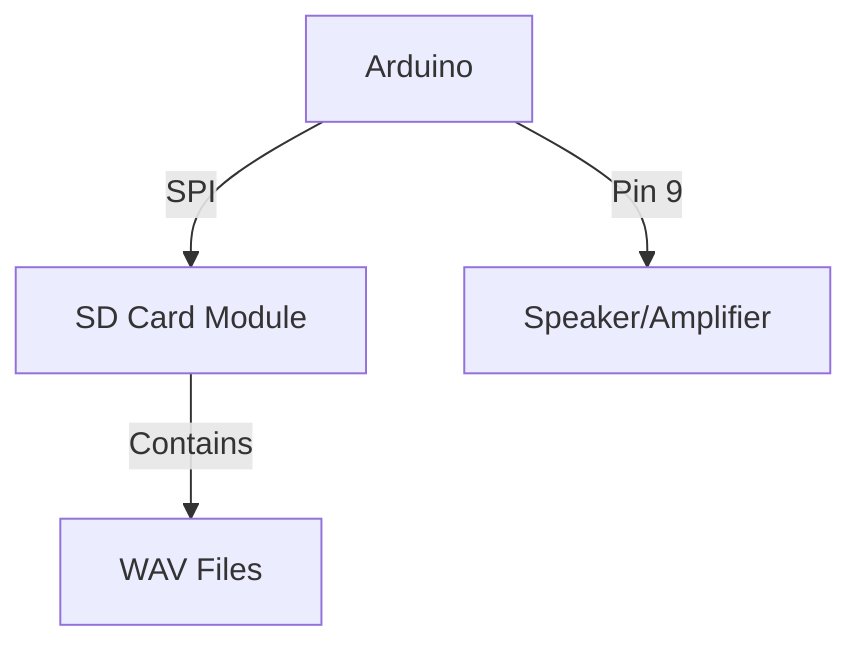
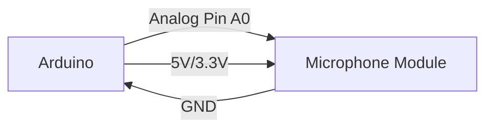

# Arduino Audio

## Introduction

Audio capabilities add a new dimension to Arduino projects, allowing your creations to respond to sound or generate audio feedback. Whether you want to build a music player, voice-controlled system, or sound effects generator, understanding how to work with audio on Arduino is an essential skill.

In this tutorial, we'll explore:
- How Arduino interacts with audio signals
- Connecting and using speakers
- Working with microphones and audio inputs
- Processing audio data
- Building practical audio projects

## Understanding Arduino and Audio

Arduino boards don't have dedicated audio hardware, but they can generate and process audio signals through digital and analog pins. There are two primary approaches to working with audio on Arduino:

1. **Digital Audio**: Using digital pins to create square wave tones
2. **Analog Audio**: Using PWM (Pulse Width Modulation) to approximate audio waveforms

### Audio Fundamentals

Before diving into code, let's understand some basic audio concepts:

- **Frequency**: Measured in Hertz (Hz), determines the pitch of a sound
- **Amplitude**: Determines the volume of a sound
- **Sampling Rate**: Number of audio measurements taken per second
- **Bit Depth**: Number of bits used to represent each sample

## Playing Sounds with Arduino

### Simple Tones with the `tone()` Function

The simplest way to generate sound with Arduino is using the built-in `tone()` function, which produces square wave signals at specified frequencies.

```cpp
const int speakerPin = 8;  // Speaker connected to digital pin 8

void setup() {
  pinMode(speakerPin, OUTPUT);
}

void loop() {
  // Play a 440Hz tone (A4 note) for 500ms
  tone(speakerPin, 440, 500);
  delay(1000);  // Wait a second
  
  // Play a 523Hz tone (C5 note) for 500ms
  tone(speakerPin, 523, 500);
  delay(1000);  // Wait a second
}
```

### Hardware Setup for Basic Sound Output

To connect a speaker to your Arduino:

1. Connect one terminal of your speaker/piezo buzzer to a digital pin (pin 8 in our example)
2. Connect the other terminal to ground (GND)


### Playing a Simple Melody

Let's create a more complex example that plays a recognizable melody:

```cpp
const int speakerPin = 8;

// Notes in the melody:
int melody[] = {
  262, 262, 294, 262, 349, 330, 
  262, 262, 294, 262, 392, 349,
  262, 262, 523, 440, 349, 330, 294,
  466, 466, 440, 349, 392, 349
};

// Note durations (4 = quarter note, 8 = eighth note, etc.)
int noteDurations[] = {
  4, 4, 4, 4, 4, 2,
  4, 4, 4, 4, 4, 2,
  4, 4, 4, 4, 4, 4, 2,
  4, 4, 4, 4, 4, 2
};

void setup() {
  pinMode(speakerPin, OUTPUT);
}

void loop() {
  // Iterate through the melody array
  for (int thisNote = 0; thisNote < 25; thisNote++) {
    
    // Calculate note duration based on tempo
    int noteDuration = 1000 / noteDurations[thisNote];
    
    // Play the note
    tone(speakerPin, melody[thisNote], noteDuration);
    
    // Add a small pause between notes
    delay(noteDuration * 1.3);
    
    // Stop the tone
    noTone(speakerPin);
  }
  
  // Wait a bit before replaying
  delay(2000);
}
```

## Working with Audio Libraries

For more complex audio applications, Arduino libraries can simplify your code. Here are some popular options:

### TMRpcm Library for WAV File Playback

The TMRpcm library allows Arduino to play WAV audio files from an SD card.

```cpp
#include <SD.h>
#include <TMRpcm.h>
#include <SPI.h>

TMRpcm tmrpcm;
const int SD_ChipSelectPin = 10;

void setup() {
  Serial.begin(9600);
  
  // Initialize SD card
  if (!SD.begin(SD_ChipSelectPin)) {
    Serial.println("SD card initialization failed");
    return;
  }
  
  Serial.println("SD card initialized");
  
  // Set the speaker pin
  tmrpcm.speakerPin = 9; // Speaker connected to pin 9
  
  // Set volume (0 to 7)
  tmrpcm.setVolume(5);
  
  // Play a WAV file from SD card
  tmrpcm.play("sound.wav");
}

void loop() {
  // Code here runs continuously
}
```

For this example, you need:
- An Arduino with sufficient memory (like Arduino Uno or larger)
- An SD card module connected via SPI
- WAV files (8-bit, 8-16kHz, mono) on the SD card



### Mozzi Library for Synthesized Audio

The Mozzi library enables the creation of synthesized audio without external DACs:

```cpp
#include <MozziGuts.h>
#include <Oscil.h>
#include <tables/sin2048_int8.h>

// Use a sinewave oscillator
Oscil<SIN2048_NUM_CELLS, AUDIO_RATE> aSin(SIN2048_DATA);

// For changing the frequency
#define POT_PIN A0

void setup() {
  startMozzi(CONTROL_RATE);  // Initialize Mozzi
  aSin.setFreq(440);         // Set initial frequency to A4
}

void updateControl() {
  // Read the potentiometer and map it to a frequency range
  int pot_value = analogRead(POT_PIN);
  int frequency = map(pot_value, 0, 1023, 50, 1000);
  
  // Update oscillator frequency
  aSin.setFreq(frequency);
}

int updateAudio() {
  // Return the next sample
  return aSin.next();
}

void loop() {
  audioHook(); // Required in the loop for Mozzi to work
}
```

## Capturing Audio Input

Arduino can also process audio inputs from microphones or other audio sources.

### Reading Analog Audio Input

The simplest approach is connecting an analog microphone module to an analog pin:

```cpp
const int microphonePin = A0;  // Microphone connected to analog pin A0
const int ledPin = 13;         // Onboard LED for visual feedback
int threshold = 500;           // Sound threshold (adjust based on your microphone)

void setup() {
  Serial.begin(9600);
  pinMode(ledPin, OUTPUT);
}

void loop() {
  // Read the microphone value
  int soundValue = analogRead(microphonePin);
  
  // Print the value for debugging
  Serial.println(soundValue);
  
  // If sound is above threshold, turn on LED
  if (soundValue > threshold) {
    digitalWrite(ledPin, HIGH);
    delay(200);
  } else {
    digitalWrite(ledPin, LOW);
  }
  
  delay(50);  // Small delay for stability
}
```

Hardware setup:
1. Connect the microphone module's output to analog pin A0
2. Connect VCC to 5V or 3.3V (check your module's specifications)
3. Connect GND to ground



### Sound Level Meter Project

Let's build a more practical project - a sound level meter with LEDs:

```cpp
const int microphonePin = A0;  // Microphone connected to analog pin A0
const int ledPins[] = {3, 4, 5, 6, 7};  // Connect 5 LEDs to these pins
const int numLeds = 5;

void setup() {
  Serial.begin(9600);
  
  // Set all LED pins as outputs
  for (int i = 0; i < numLeds; i++) {
    pinMode(ledPins[i], OUTPUT);
  }
}

void loop() {
  // Read the microphone value
  int soundValue = analogRead(microphonePin);
  
  // Print the value for debugging
  Serial.println(soundValue);
  
  // Map the sound level to the number of LEDs to light
  // Adjust min/max values based on your microphone sensitivity
  int ledsToLight = map(soundValue, 50, 800, 0, numLeds);
  
  // Light up LEDs based on sound level
  for (int i = 0; i < numLeds; i++) {
    if (i < ledsToLight) {
      digitalWrite(ledPins[i], HIGH);  // Turn on LED
    } else {
      digitalWrite(ledPins[i], LOW);   // Turn off LED
    }
  }
  
  delay(50);  // Small delay for stability
}
```

## Audio Processing Techniques

### Frequency Detection

To detect specific frequencies (like musical notes), we can use the Arduino to perform simple frequency analysis:

```cpp
#include <FreqCount.h>

void setup() {
  Serial.begin(9600);
  FreqCount.begin(1000);  // Count for 1 second
}

void loop() {
  if (FreqCount.available()) {
    unsigned long frequency = FreqCount.read();
    Serial.print("Frequency: ");
    Serial.print(frequency);
    Serial.println(" Hz");
    
    // Simple note detection example
    if (frequency > 255 && frequency < 270) {
      Serial.println("Note detected: C4");
    } else if (frequency > 335 && frequency < 350) {
      Serial.println("Note detected: E4");
    } else if (frequency > 390 && frequency < 405) {
      Serial.println("Note detected: G4");
    }
  }
}
```

### Audio Filtering Example

For basic audio filtering, we can implement a simple low-pass filter:

```cpp
const int microphonePin = A0;  // Microphone connected to analog pin A0
const int speakerPin = 9;      // Speaker on PWM pin 9

// Variables for the low-pass filter
float filteredValue = 0;
float filterFactor = 0.2;  // Adjust between 0-1 (lower = more filtering)

void setup() {
  Serial.begin(9600);
  pinMode(speakerPin, OUTPUT);
}

void loop() {
  // Read the microphone value
  int rawValue = analogRead(microphonePin);
  
  // Apply the low-pass filter
  filteredValue = (filterFactor * rawValue) + ((1 - filterFactor) * filteredValue);
  
  // Map the filtered value to PWM output range (0-255)
  int outputValue = map(filteredValue, 0, 1023, 0, 255);
  
  // Output the filtered signal to the speaker
  analogWrite(speakerPin, outputValue);
  
  // Print values for debugging
  Serial.print("Raw: ");
  Serial.print(rawValue);
  Serial.print(" | Filtered: ");
  Serial.println(filteredValue);
  
  delay(5);  // Small delay for stability
}
```

## Advanced Project: Voice-Controlled LED

Let's build a project that responds to voice commands by detecting amplitude patterns:

```cpp
const int microphonePin = A0;  // Microphone connected to analog pin A0
const int ledPin = 13;         // LED pin
int threshold = 500;           // Adjust based on your microphone
unsigned long lastSoundTime = 0;
int soundCount = 0;

void setup() {
  Serial.begin(9600);
  pinMode(ledPin, OUTPUT);
  Serial.println("Voice Control Ready");
  Serial.println("Clap or say 'Hey' to toggle the LED");
}

void loop() {
  // Read the microphone value
  int soundValue = analogRead(microphonePin);
  
  // Check if sound is above threshold
  if (soundValue > threshold) {
    // Get current time
    unsigned long currentTime = millis();
    
    // If this is a new sound (not just continuation of the same sound)
    if (currentTime - lastSoundTime > 200) {
      soundCount++;
      Serial.print("Sound detected! Count: ");
      Serial.println(soundCount);
      lastSoundTime = currentTime;
      
      // Reset counter after 1.5 seconds of detecting sounds
      if (currentTime - lastSoundTime > 1500) {
        soundCount = 1;
      }
      
      // If we've detected enough sounds in sequence, toggle the LED
      if (soundCount >= 2) {
        toggleLED();
        soundCount = 0;
      }
    }
  }
  
  delay(50);  // Small delay for stability
}

void toggleLED() {
  static boolean ledState = LOW;
  ledState = !ledState;
  digitalWrite(ledPin, ledState);
  Serial.println(ledState ? "LED ON" : "LED OFF");
}
```

## Summary

In this tutorial, we've explored various aspects of working with audio on Arduino:

1. **Generating simple tones** using the built-in `tone()` function
2. **Playing melodies** by sequencing multiple tones
3. **Using audio libraries** like TMRpcm for WAV playback and Mozzi for synthesized audio
4. **Capturing and processing audio input** from microphones
5. **Building practical audio projects** like a sound level meter and voice control system

Arduino's audio capabilities may be basic compared to dedicated audio hardware, but they're sufficient for many projects and a great way to add interactivity to your creations.

## Additional Resources

- **Libraries to Explore**:
  - TMRpcm: For WAV file playback
  - Mozzi: For synthesized audio
  - Tone: For improved tone generation
  - FreqCount: For frequency measurement

- **Circuit Improvements**:
  - Add an amplifier circuit to improve audio output quality
  - Use a hardware DAC (Digital-to-Analog Converter) for better audio fidelity
  - Implement filtering circuits to clean up microphone inputs

## Exercises

1. **Build a simple piano** using buttons or a touch sensor to trigger different tones
2. **Create a sound-reactive LED display** that changes patterns based on music
3. **Design a voice-controlled home automation system** that responds to specific sound patterns
4. **Build a digital recorder** that captures sound samples to an SD card
5. **Create a sound effects box** with multiple buttons for different pre-programmed sounds

Remember that audio processing can be demanding for Arduino's limited processing power. Start with simple projects and gradually increase complexity as you become more comfortable with the concepts.