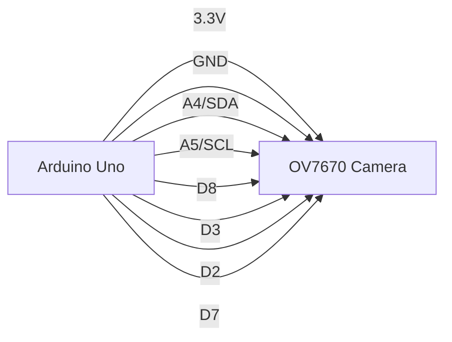
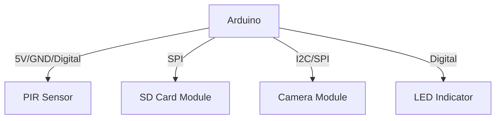

# Arduino Camera Integration

## Introduction

Integrating cameras with Arduino opens up a world of visual possibilities for your projects. Whether you want to create a security system, a time-lapse camera, or a computer vision application, learning how to connect and control cameras with Arduino is an essential skill for any maker or electronics enthusiast.

In this tutorial, we'll explore different camera modules compatible with Arduino, how to connect them, and how to write code to capture and process images. By the end, you'll have the knowledge to incorporate visual capabilities into your Arduino projects.

## Camera Modules for Arduino

There are several camera modules designed to work with Arduino. Let's explore the most popular options:

### OV7670 Camera Module

The OV7670 is a low-cost VGA camera module that can capture images at 640x480 resolution. It communicates with Arduino using the I²C protocol.

### ArduCAM Mini

ArduCAM modules are specifically designed for Arduino and offer higher resolutions (up to 5MP) with built-in JPEG compression. They use the SPI interface for faster data transfer.

### ESP32-CAM

While technically not an Arduino board, the ESP32-CAM combines an ESP32 microcontroller with a camera and can be programmed using the Arduino IDE. It offers Wi-Fi capabilities along with a built-in OV2640 camera.

## Connecting a Camera Module to Arduino

Let's look at how to connect the popular OV7670 camera module to an Arduino Uno:



### Wiring Table

| OV7670 Pin | Arduino Uno Pin |
|------------|-----------------|
| 3.3V       | 3.3V            |
| GND        | GND             |
| SIOD       | A4 (SDA)        |
| SIOC       | A5 (SCL)        |
| VSYNC      | D8              |
| HREF       | D3              |
| PCLK       | D2              |
| XCLK       | D7              |
| D0-D7      | Various digital pins (see full schematic) |

## Installing Required Libraries

Before we start coding, we need to install the necessary libraries. For this tutorial, we'll use the "OV7670" library.

1. In the Arduino IDE, go to **Sketch > Include Library > Manage Libraries**
2. Search for "OV7670"
3. Install the library by Arducam

## Basic Image Capture Example

Let's start with a basic example to capture an image from the OV7670 camera and save it to an SD card:

```cpp
#include <SPI.h>
#include <SD.h>
#include <Wire.h>
#include <ArduCAM.h>
#include <memorysaver.h>

const int CS = 10;
ArduCAM myCAM(OV7670, CS);
File imgFile;

void setup() {
  Serial.begin(9600);
  
  // Initialize SPI bus
  pinMode(CS, OUTPUT);
  digitalWrite(CS, HIGH);
  SPI.begin();
  
  // Initialize SD Card
  if (!SD.begin(4)) {
    Serial.println("SD Card initialization failed!");
    return;
  }
  
  // Initialize the camera
  Wire.begin();
  
  // Reset the CPLD
  myCAM.write_reg(0x07, 0x80);
  delay(100);
  myCAM.write_reg(0x07, 0x00);
  delay(100);
  
  // Check if the camera is available
  uint8_t vid, pid;
  myCAM.wrSensorReg8_8(0xFF, 0x01);
  myCAM.rdSensorReg8_8(0x0A, &vid);
  myCAM.rdSensorReg8_8(0x0B, &pid);
  
  if ((vid != 0x76) || (pid != 0x73)) {
    Serial.println("Camera not found!");
    return;
  }
  
  // Set camera resolution
  myCAM.set_format(JPEG);
  myCAM.InitCAM();
  myCAM.OV7670_set_JPEG_size(OV7670_320x240);
  
  Serial.println("Camera initialized successfully!");
}

void loop() {
  // Take a picture when 'c' is received
  if (Serial.available() && Serial.read() == 'c') {
    captureImage();
  }
}

void captureImage() {
  Serial.println("Capturing image...");
  
  // Start capture
  myCAM.flush_fifo();
  myCAM.clear_fifo_flag();
  myCAM.start_capture();
  
  // Wait for capture to complete
  while (!myCAM.get_bit(ARDUCHIP_TRIG, CAP_DONE_MASK)) {}
  
  Serial.println("Capture done, saving to SD card...");
  
  // Create a new file with an incremented name
  char filename[12];
  static int imgCount = 0;
  sprintf(filename, "IMG_%03d.JPG", imgCount);
  imgCount++;
  
  // Open the file
  imgFile = SD.open(filename, FILE_WRITE);
  
  if (!imgFile) {
    Serial.println("Failed to open file for writing");
    return;
  }
  
  // Read FIFO and write to file
  uint32_t length = myCAM.read_fifo_length();
  
  if (length >= MAX_FIFO_SIZE) {
    Serial.println("Image too large");
    return;
  }
  
  myCAM.CS_LOW();
  myCAM.set_fifo_burst();
  
  for (uint32_t i = 0; i < length; i++) {
    imgFile.write(SPI.transfer(0x00));
  }
  
  myCAM.CS_HIGH();
  imgFile.close();
  
  Serial.print("Image saved as ");
  Serial.println(filename);
}
```

This code initializes the camera, waits for a serial command ('c'), then captures an image and saves it to the SD card.

## Reading and Processing Images

For more advanced projects, you might want to process images directly on the Arduino. However, due to memory limitations, this can be challenging on standard Arduino boards. Here's a simple example that captures a low-resolution grayscale image and detects bright areas:

```cpp
#include <Wire.h>
#include <ArduCAM.h>
#include <memorysaver.h>

const int CS = 10;
ArduCAM myCAM(OV7670, CS);

// Buffer for a single grayscale frame (QQVGA: 160x120)
uint8_t frame[160 * 120];

void setup() {
  Serial.begin(115200);
  
  // Initialize SPI and camera
  pinMode(CS, OUTPUT);
  digitalWrite(CS, HIGH);
  SPI.begin();
  Wire.begin();
  
  myCAM.write_reg(0x07, 0x80);
  delay(100);
  myCAM.write_reg(0x07, 0x00);
  delay(100);
  
  // Set camera to YUV mode for grayscale processing
  myCAM.set_format(YUV);
  myCAM.InitCAM();
  myCAM.OV7670_set_size(OV7670_160x120);
  
  Serial.println("Camera initialized in grayscale mode");
}

void loop() {
  if (Serial.available() && Serial.read() == 'c') {
    captureAndProcess();
  }
}

void captureAndProcess() {
  Serial.println("Capturing frame...");
  
  // Start capture
  myCAM.flush_fifo();
  myCAM.clear_fifo_flag();
  myCAM.start_capture();
  
  while (!myCAM.get_bit(ARDUCHIP_TRIG, CAP_DONE_MASK)) {}
  
  // Read the frame into the buffer
  uint32_t length = myCAM.read_fifo_length();
  
  if (length > sizeof(frame)) {
    Serial.println("Frame too large for buffer");
    return;
  }
  
  myCAM.CS_LOW();
  myCAM.set_fifo_burst();
  
  for (uint32_t i = 0; i < length && i < sizeof(frame); i++) {
    frame[i] = SPI.transfer(0x00);
  }
  
  myCAM.CS_HIGH();
  
  // Process the image - simple brightness detection
  int brightPixels = 0;
  const int THRESHOLD = 200;  // Brightness threshold (0-255)
  
  for (int i = 0; i < sizeof(frame); i++) {
    if (frame[i] > THRESHOLD) {
      brightPixels++;
    }
  }
  
  Serial.print("Bright pixels detected: ");
  Serial.println(brightPixels);
  
  if (brightPixels > 100) {
    Serial.println("Bright object detected!");
  } else {
    Serial.println("No bright objects.");
  }
}
```

This example captures a 160x120 grayscale image and counts pixels above a brightness threshold.

## Project Example: Motion-Activated Camera

Now let's create a practical example: a motion-activated camera system. This project combines a PIR motion sensor with our camera module to create a simple security system.

### Components Needed:
- Arduino Uno or similar board
- OV7670 or ArduCAM camera module
- PIR motion sensor
- SD card module
- LED indicator (optional)

### Wiring Diagram



### Code for Motion-Activated Camera

```cpp
#include <SPI.h>
#include <SD.h>
#include <Wire.h>
#include <ArduCAM.h>
#include <memorysaver.h>

// Pin definitions
const int CS = 10;
const int PIR_PIN = 2;
const int LED_PIN = 4;

// Camera setup
ArduCAM myCAM(OV7670, CS);
File imgFile;

// Variables for motion detection
boolean motionDetected = false;
unsigned long lastCaptureTime = 0;
const int COOLDOWN_PERIOD = 5000;  // 5 seconds between captures

void setup() {
  Serial.begin(9600);
  
  // Initialize pins
  pinMode(CS, OUTPUT);
  pinMode(PIR_PIN, INPUT);
  pinMode(LED_PIN, OUTPUT);
  
  digitalWrite(CS, HIGH);
  
  // Initialize SPI, SD card, and camera
  SPI.begin();
  
  Serial.print("Initializing SD card...");
  if (!SD.begin(4)) {
    Serial.println("SD Card failed!");
    return;
  }
  Serial.println("SD card initialized.");
  
  Wire.begin();
  
  // Reset and initialize camera
  myCAM.write_reg(0x07, 0x80);
  delay(100);
  myCAM.write_reg(0x07, 0x00);
  delay(100);
  
  // Camera setup
  myCAM.set_format(JPEG);
  myCAM.InitCAM();
  myCAM.OV7670_set_JPEG_size(OV7670_320x240);
  
  Serial.println("Camera initialized!");
  Serial.println("Motion detection system ready!");
}

void loop() {
  // Check for motion
  if (digitalRead(PIR_PIN) == HIGH) {
    if (!motionDetected) {
      Serial.println("Motion detected!");
      motionDetected = true;
      digitalWrite(LED_PIN, HIGH);
      
      // Check if enough time has passed since last capture
      if (millis() - lastCaptureTime > COOLDOWN_PERIOD) {
        captureImage();
        lastCaptureTime = millis();
      }
    }
  } else {
    if (motionDetected) {
      Serial.println("Motion ended");
      motionDetected = false;
      digitalWrite(LED_PIN, LOW);
    }
  }
  
  // Optional: Manual trigger via serial
  if (Serial.available() && Serial.read() == 'c') {
    captureImage();
    lastCaptureTime = millis();
  }
}

void captureImage() {
  Serial.println("Capturing image...");
  
  // Start capture
  myCAM.flush_fifo();
  myCAM.clear_fifo_flag();
  myCAM.start_capture();
  
  // Wait for capture to complete
  while (!myCAM.get_bit(ARDUCHIP_TRIG, CAP_DONE_MASK)) {}
  
  // Create a new file with timestamp
  char filename[20];
  unsigned long timestamp = millis();
  sprintf(filename, "MOT_%lu.JPG", timestamp);
  
  // Open file
  imgFile = SD.open(filename, FILE_WRITE);
  
  if (!imgFile) {
    Serial.println("File open failed");
    return;
  }
  
  // Read data from FIFO
  uint32_t length = myCAM.read_fifo_length();
  
  if (length >= MAX_FIFO_SIZE) {
    Serial.println("Image too large");
    return;
  }
  
  myCAM.CS_LOW();
  myCAM.set_fifo_burst();
  
  for (uint32_t i = 0; i < length; i++) {
    imgFile.write(SPI.transfer(0x00));
  }
  
  myCAM.CS_HIGH();
  imgFile.close();
  
  Serial.print("Image saved as ");
  Serial.println(filename);
  
  // Flash LED to indicate successful capture
  for (int i = 0; i < 3; i++) {
    digitalWrite(LED_PIN, LOW);
    delay(100);
    digitalWrite(LED_PIN, HIGH);
    delay(100);
  }
}
```

This project captures an image whenever motion is detected and saves it to the SD card with a timestamp, making it useful for home security or wildlife monitoring.

## Video Streaming with ESP32-CAM

For more advanced applications, you can use the ESP32-CAM to stream video over Wi-Fi. Here's a simplified example:

```cpp
#include "esp_camera.h"
#include <WiFi.h>
#include "esp_timer.h"
#include "img_converters.h"
#include "Arduino.h"
#include "fb_gfx.h"
#include "soc/soc.h"
#include "soc/rtc_cntl_reg.h"
#include "esp_http_server.h"

// WiFi credentials
const char* ssid = "YourWiFiName";
const char* password = "YourWiFiPassword";

// Camera pins for ESP32-CAM
#define PWDN_GPIO_NUM     32
#define RESET_GPIO_NUM    -1
#define XCLK_GPIO_NUM      0
#define SIOD_GPIO_NUM     26
#define SIOC_GPIO_NUM     27
#define Y9_GPIO_NUM       35
#define Y8_GPIO_NUM       34
#define Y7_GPIO_NUM       39
#define Y6_GPIO_NUM       36
#define Y5_GPIO_NUM       21
#define Y4_GPIO_NUM       19
#define Y3_GPIO_NUM       18
#define Y2_GPIO_NUM        5
#define VSYNC_GPIO_NUM    25
#define HREF_GPIO_NUM     23
#define PCLK_GPIO_NUM     22

// Server object
httpd_handle_t camera_httpd = NULL;

void setup() {
  WRITE_PERI_REG(RTC_CNTL_BROWN_OUT_REG, 0); // Disable brownout detector
  
  Serial.begin(115200);
  Serial.setDebugOutput(true);
  
  camera_config_t config;
  config.ledc_channel = LEDC_CHANNEL_0;
  config.ledc_timer = LEDC_TIMER_0;
  config.pin_d0 = Y2_GPIO_NUM;
  config.pin_d1 = Y3_GPIO_NUM;
  config.pin_d2 = Y4_GPIO_NUM;
  config.pin_d3 = Y5_GPIO_NUM;
  config.pin_d4 = Y6_GPIO_NUM;
  config.pin_d5 = Y7_GPIO_NUM;
  config.pin_d6 = Y8_GPIO_NUM;
  config.pin_d7 = Y9_GPIO_NUM;
  config.pin_xclk = XCLK_GPIO_NUM;
  config.pin_pclk = PCLK_GPIO_NUM;
  config.pin_vsync = VSYNC_GPIO_NUM;
  config.pin_href = HREF_GPIO_NUM;
  config.pin_sscb_sda = SIOD_GPIO_NUM;
  config.pin_sscb_scl = SIOC_GPIO_NUM;
  config.pin_pwdn = PWDN_GPIO_NUM;
  config.pin_reset = RESET_GPIO_NUM;
  config.xclk_freq_hz = 20000000;
  config.pixel_format = PIXFORMAT_JPEG;
  
  // If PSRAM exists, use higher resolution
  if (psramFound()) {
    config.frame_size = FRAMESIZE_VGA;
    config.jpeg_quality = 10;
    config.fb_count = 2;
  } else {
    config.frame_size = FRAMESIZE_QVGA;
    config.jpeg_quality = 12;
    config.fb_count = 1;
  }
  
  // Initialize the camera
  esp_err_t err = esp_camera_init(&config);
  if (err != ESP_OK) {
    Serial.printf("Camera init failed with error 0x%x", err);
    return;
  }
  
  // Connect to Wi-Fi
  WiFi.begin(ssid, password);
  
  while (WiFi.status() != WL_CONNECTED) {
    delay(500);
    Serial.print(".");
  }
  Serial.println("");
  Serial.println("WiFi connected");
  
  // Start the web server
  startCameraServer();
  Serial.print("Camera Ready! Use 'http://");
  Serial.print(WiFi.localIP());
  Serial.println("' to connect");
}

void loop() {
  // Nothing to do here
}

// Handle HTTP request for streaming
static esp_err_t stream_handler(httpd_req_t *req) {
  camera_fb_t *fb = NULL;
  esp_err_t res = ESP_OK;
  size_t _jpg_buf_len = 0;
  uint8_t *_jpg_buf = NULL;
  char *part_buf[64];
  
  static int64_t last_frame = 0;
  if (!last_frame) {
    last_frame = esp_timer_get_time();
  }
  
  res = httpd_resp_set_type(req, "multipart/x-mixed-replace;boundary=123456789000000000000987654321");
  if (res != ESP_OK) {
    return res;
  }
  
  while (true) {
    fb = esp_camera_fb_get();
    if (!fb) {
      Serial.println("Camera capture failed");
      res = ESP_FAIL;
    } else {
      if (fb->format != PIXFORMAT_JPEG) {
        bool jpeg_converted = frame2jpg(fb, 80, &_jpg_buf, &_jpg_buf_len);
        esp_camera_fb_return(fb);
        fb = NULL;
        if (!jpeg_converted) {
          Serial.println("JPEG compression failed");
          res = ESP_FAIL;
        }
      } else {
        _jpg_buf_len = fb->len;
        _jpg_buf = fb->buf;
      }
    }
    
    if (res == ESP_OK) {
      size_t hlen = snprintf((char *)part_buf, 64, 
                            "Content-Type: image/jpeg\r
"
                            "Content-Length: %u\r
\r
",
                            _jpg_buf_len);
      
      res = httpd_resp_send_chunk(req, (const char *)part_buf, hlen);
    }
    
    if (res == ESP_OK) {
      res = httpd_resp_send_chunk(req, (const char *)_jpg_buf, _jpg_buf_len);
    }
    
    if (res == ESP_OK) {
      res = httpd_resp_send_chunk(req, "\r
--123456789000000000000987654321\r
", 37);
    }
    
    if (fb) {
      esp_camera_fb_return(fb);
      fb = NULL;
      _jpg_buf = NULL;
    } else if (_jpg_buf) {
      free(_jpg_buf);
      _jpg_buf = NULL;
    }
    
    if (res != ESP_OK) {
      break;
    }
    
    int64_t fr_end = esp_timer_get_time();
    int64_t frame_time = fr_end - last_frame;
    last_frame = fr_end;
    frame_time /= 1000;
    
    // Add a small delay to control frame rate
    delay(50);
  }
  
  return res;
}

// Start the web server
void startCameraServer() {
  httpd_config_t config = HTTPD_DEFAULT_CONFIG();
  config.server_port = 80;
  
  httpd_uri_t index_uri = {
    .uri       = "/",
    .method    = HTTP_GET,
    .handler   = stream_handler,
    .user_ctx  = NULL
  };
  
  if (httpd_start(&camera_httpd, &config) == ESP_OK) {
    httpd_register_uri_handler(camera_httpd, &index_uri);
  }
}
```

With this code, the ESP32-CAM creates a web server that streams video to any browser on the same network. You can access it by entering the IP address of the ESP32-CAM in a web browser.

## Troubleshooting Camera Integration

Working with camera modules can sometimes be challenging. Here are some common issues and solutions:

### 1. Images Not Captured or Poor Quality

- Check all connections, especially the clock pins
- Make sure you're using the correct voltage (most camera modules need 3.3V)
- Verify that you're using the correct camera settings
- Ensure proper lighting for clear images

### 2. Memory Issues

- Arduino Uno has limited memory (2KB RAM), which may not be enough for high-resolution images
- Consider using Arduino Mega or ESP32 for better performance
- Use lower resolutions or JPEG compression
- Process images in small chunks

### 3. Speed Problems

- Use SPI for faster data transfer
- Use a higher clock speed when possible
- Consider buffering or streaming data directly

## Advanced Applications

Once you've mastered basic camera integration, you can explore these advanced applications:

1. **Face Detection**: Using libraries like OpenCV (on a computer) with Arduino sending images
2. **Color Tracking**: Detect specific colors in a scene for object tracking
3. **OCR (Optical Character Recognition)**: Recognize text in images
4. **QR Code/Barcode Reading**: Build a scanner for codes
5. **Time-lapse Photography**: Capture images at set intervals

## Summary

Arduino camera integration opens up exciting possibilities for creative and practical projects. In this tutorial, we've covered:

- Different types of camera modules compatible with Arduino
- How to connect and configure camera modules
- Basic image capture and storage
- Simple image processing techniques
- A practical motion detection camera project
- Video streaming with ESP32-CAM

With these fundamentals, you can now incorporate visual capabilities into your Arduino projects. Remember that memory limitations are the biggest challenge when working with images on Arduino, so choose your hardware and resolution accordingly.

## Additional Resources

- [ArduCAM GitHub Repository](https://github.com/ArduCAM/Arduino)
- [ESP32-CAM Projects and Examples](https://randomnerdtutorials.com/esp32-cam-projects/)
- [OpenCV for Arduino](https://github.com/opencv/opencv-arduino)

## Exercises

1. **Beginner**: Modify the basic image capture example to take pictures at regular intervals.
2. **Intermediate**: Create a system that counts people passing by using motion detection and image processing.
3. **Advanced**: Build a plant monitoring system that takes pictures of growing plants and analyzes the green area to track growth.

Happy tinkering with Arduino and cameras!