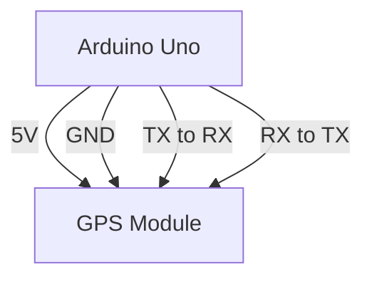

# Arduino GPS Modules

## Introduction

GPS (Global Positioning System) modules are powerful components that allow your Arduino projects to determine their precise location anywhere on Earth. By connecting a GPS module to your Arduino, you can create projects that track movement, navigate routes, timestamp events with accurate time data, and much more.

In this tutorial, we'll explore how GPS modules work with Arduino, how to connect them, and how to write code to extract useful information from GPS data. By the end, you'll have the knowledge to incorporate location awareness into your Arduino projects.

## What is GPS?

The Global Positioning System is a satellite-based navigation system consisting of approximately 30 satellites orbiting Earth. These satellites continuously transmit signals containing their position and the precise time. A GPS receiver (like our GPS module) captures signals from multiple satellites and uses the time differences between signals to calculate its exact position on Earth.

A typical GPS module provides the following information:
- Latitude and longitude (your position on Earth)
- Altitude (height above sea level)
- Speed (if you're moving)
- Course/heading (the direction you're moving)
- Precise time and date (synchronized to atomic clocks on the satellites)

## Common GPS Modules for Arduino

Several GPS modules are popular in the Arduino community:

1. **NEO-6M** - An affordable and reliable option for beginners
2. **Adafruit Ultimate GPS** - Feature-rich with built-in data logging
3. **SparkFun GPS Breakout** - Available in various form factors
4. **SIM28ML** - Good performance in challenging environments

## Hardware Connection

Most Arduino GPS modules communicate using serial communication via UART (Universal Asynchronous Receiver/Transmitter). Let's see how to connect a typical NEO-6M GPS module to an Arduino Uno:



### Connection Table

| Arduino Pin | GPS Module Pin |
|-------------|---------------|
| 5V          | VCC           |
| GND         | GND           |
| Digital Pin 3 (RX) | TX     |
| Digital Pin 4 (TX) | RX     |

**Note:** We're using digital pins 3 and 4 for serial communication with the GPS module through a software serial interface, leaving the Arduino's hardware serial port (pins 0 and 1) free for communication with the computer.

## Required Libraries

For working with GPS modules, we'll use the excellent TinyGPS++ library, which makes parsing GPS data straightforward and reliable.

To install the TinyGPS++ library:
1. In the Arduino IDE, go to **Sketch > Include Library > Manage Libraries**
2. Search for "TinyGPS++"
3. Click "Install" on the library by Mikal Hart

## Basic GPS Data Reading Example

Let's start with a basic example that reads and displays GPS data:

```cpp
#include <SoftwareSerial.h>
#include <TinyGPS++.h>

// Create a software serial port for the GPS module
SoftwareSerial gpsSerial(3, 4); // RX, TX

// Create a TinyGPS++ object
TinyGPSPlus gps;

void setup() {
  // Start the serial communications
  Serial.begin(9600);
  gpsSerial.begin(9600); // Most GPS modules communicate at 9600 baud
  
  Serial.println("Arduino GPS Module Example");
  Serial.println("Waiting for GPS data...");
}

void loop() {
  // Read data from GPS module
  while (gpsSerial.available() > 0) {
    if (gps.encode(gpsSerial.read())) {
      displayGPSInfo();
    }
  }
  
  // If no data received for 5 seconds, check for connection issues
  if (millis() > 5000 && gps.charsProcessed() < 10) {
    Serial.println("No GPS data received!");
    Serial.println("Check wiring and antenna");
    while(true); // Infinite loop to stop program
  }
}

void displayGPSInfo() {
  Serial.println("----------------------");
  Serial.println("GPS Information");
  Serial.println("----------------------");
  
  // Display location information
  if (gps.location.isValid()) {
    Serial.print("Latitude: ");
    Serial.println(gps.location.lat(), 6); // 6 decimal places
    Serial.print("Longitude: ");
    Serial.println(gps.location.lng(), 6);
    Serial.print("Altitude: ");
    Serial.print(gps.altitude.meters());
    Serial.println(" meters");
  } else {
    Serial.println("Location: Not Available");
  }
  
  // Display date/time information
  if (gps.date.isValid() && gps.time.isValid()) {
    Serial.print("Date: ");
    Serial.print(gps.date.month());
    Serial.print("/");
    Serial.print(gps.date.day());
    Serial.print("/");
    Serial.println(gps.date.year());
    
    Serial.print("Time: ");
    Serial.print(gps.time.hour());
    Serial.print(":");
    if (gps.time.minute() < 10) Serial.print("0");
    Serial.print(gps.time.minute());
    Serial.print(":");
    if (gps.time.second() < 10) Serial.print("0");
    Serial.println(gps.time.second());
  } else {
    Serial.println("Date/Time: Not Available");
  }
  
  // Display speed and course information
  if (gps.speed.isValid()) {
    Serial.print("Speed: ");
    Serial.print(gps.speed.kmph());
    Serial.println(" km/h");
  } else {
    Serial.println("Speed: Not Available");
  }
  
  if (gps.course.isValid()) {
    Serial.print("Course: ");
    Serial.print(gps.course.deg());
    Serial.println(" degrees");
  } else {
    Serial.println("Course: Not Available");
  }
  
  // Display satellite information
  Serial.print("Satellites: ");
  Serial.println(gps.satellites.value());
  
  Serial.println();
  delay(1000); // Wait a second before displaying again
}
```

### Expected Output

When your GPS module obtains a fix (connection to satellites), you'll see output like this in the serial monitor:

```
----------------------
GPS Information
----------------------
Latitude: 37.422740
Longitude: -122.084446
Altitude: 32.5 meters
Date: 9/15/2023
Time: 14:32:55
Speed: 0.25 km/h
Course: 45.20 degrees
Satellites: 8
```

**Note:** GPS modules typically need a clear view of the sky to get a good signal. When indoors, they may have difficulty obtaining a fix. It's normal to wait several minutes for the first fix, especially when a module is used for the first time.

## Understanding GPS Data Fields

Let's break down the key information we can get from a GPS module:

1. **Latitude and Longitude** - The geographical coordinates that pinpoint your exact location on Earth
2. **Altitude** - Height above sea level in meters
3. **Date and Time** - Synchronized to atomic clocks on GPS satellites (very accurate)
4. **Speed** - How fast you're moving (in km/h, mph, knots, etc.)
5. **Course** - The direction you're heading in degrees (0-359, where 0 is North)
6. **Satellites** - The number of satellites the module can "see" (more satellites = better accuracy)

## Practical Project: GPS Location Logger

Now, let's build a practical project - a GPS location logger that saves tracking data to an SD card:

```cpp
#include <SoftwareSerial.h>
#include <TinyGPS++.h>
#include <SPI.h>
#include <SD.h>

// Create a software serial port for the GPS module
SoftwareSerial gpsSerial(3, 4); // RX, TX

// Create a TinyGPS++ object
TinyGPSPlus gps;

// Define the SD card chip select pin
const int chipSelect = 10;

// File object for data logging
File logFile;

// Variables to control logging frequency
unsigned long lastLogTime = 0;
const unsigned long logInterval = 5000; // Log every 5 seconds

void setup() {
  // Start the serial communications
  Serial.begin(9600);
  gpsSerial.begin(9600);
  
  Serial.println("Arduino GPS Logger Starting");
  
  // Initialize SD card
  Serial.print("Initializing SD card...");
  if (!SD.begin(chipSelect)) {
    Serial.println("SD card initialization failed!");
    while (1); // Stop program if SD card fails
  }
  Serial.println("SD card initialized.");
  
  // Create a new log file with a unique name
  String fileName = "GPS_LOG_";
  for (int i = 1; i < 100; i++) {
    String indexString = String(i);
    if (i < 10) indexString = "0" + indexString;
    
    String currentFileName = fileName + indexString + ".csv";
    if (!SD.exists(currentFileName)) {
      logFile = SD.open(currentFileName, FILE_WRITE);
      Serial.print("Logging to: ");
      Serial.println(currentFileName);
      break;
    }
  }
  
  // Write the header row to the CSV file
  if (logFile) {
    logFile.println("Timestamp,Latitude,Longitude,Altitude,Speed,Satellites");
    logFile.flush(); // Make sure data is written
  } else {
    Serial.println("Error opening log file!");
  }
  
  Serial.println("Waiting for GPS signal...");
}

void loop() {
  // Read data from GPS module
  while (gpsSerial.available() > 0) {
    gps.encode(gpsSerial.read());
  }
  
  // Log data at specified intervals if location is valid
  if (gps.location.isValid() && millis() - lastLogTime >= logInterval) {
    lastLogTime = millis();
    logGPSData();
  }
}

void logGPSData() {
  // Format timestamp as YYYY-MM-DD HH:MM:SS
  String timestamp = "";
  if (gps.date.isValid() && gps.time.isValid()) {
    timestamp += String(gps.date.year()) + "-";
    
    // Add month with leading zero if needed
    if (gps.date.month() < 10) timestamp += "0";
    timestamp += String(gps.date.month()) + "-";
    
    // Add day with leading zero if needed
    if (gps.date.day() < 10) timestamp += "0";
    timestamp += String(gps.date.day()) + " ";
    
    // Add hour with leading zero if needed
    if (gps.time.hour() < 10) timestamp += "0";
    timestamp += String(gps.time.hour()) + ":";
    
    // Add minute with leading zero if needed
    if (gps.time.minute() < 10) timestamp += "0";
    timestamp += String(gps.time.minute()) + ":";
    
    // Add second with leading zero if needed
    if (gps.time.second() < 10) timestamp += "0";
    timestamp += String(gps.time.second());
  } else {
    timestamp = "Invalid";
  }
  
  // Prepare the log entry
  String dataString = "";
  dataString += timestamp + ",";
  dataString += String(gps.location.lat(), 6) + ",";
  dataString += String(gps.location.lng(), 6) + ",";
  
  if (gps.altitude.isValid()) {
    dataString += String(gps.altitude.meters());
  } else {
    dataString += "N/A";
  }
  dataString += ",";
  
  if (gps.speed.isValid()) {
    dataString += String(gps.speed.kmph());
  } else {
    dataString += "N/A";
  }
  dataString += ",";
  
  dataString += String(gps.satellites.value());
  
  // Write the data to the SD card
  if (logFile) {
    logFile.println(dataString);
    logFile.flush(); // Make sure data is written
    
    // Also output to serial monitor
    Serial.println(dataString);
  } else {
    Serial.println("Error writing to log file!");
  }
}
```

This project creates a CSV file on an SD card and logs GPS data every 5 seconds. The data includes timestamp, latitude, longitude, altitude, speed, and number of satellites.

## Improving GPS Accuracy

Here are some tips to improve the accuracy of your GPS readings:

1. **Use an external antenna** - Many GPS modules have connectors for external antennas, which can dramatically improve reception
2. **Position matters** - Place your GPS module with a clear view of the sky
3. **Take multiple readings** - Average multiple readings to reduce error
4. **Check the HDOP value** - Horizontal Dilution of Precision indicates the accuracy of your readings (lower is better)

Here's a simple code snippet to implement averaging:

```cpp
const int numReadings = 10;
double latSum = 0, lngSum = 0;
int validReadings = 0;

// Inside your loop, collect multiple readings
if (gps.location.isValid()) {
  latSum += gps.location.lat();
  lngSum += gps.location.lng();
  validReadings++;
  
  if (validReadings >= numReadings) {
    double avgLat = latSum / validReadings;
    double avgLng = lngSum / validReadings;
    
    // Use these averaged values
    Serial.print("Average Latitude: ");
    Serial.println(avgLat, 6);
    Serial.print("Average Longitude: ");
    Serial.println(avgLng, 6);
    
    // Reset for next batch
    latSum = 0;
    lngSum = 0;
    validReadings = 0;
  }
}
```

## Advanced Project: GPS-Triggered Actions

You can use GPS to trigger actions when your Arduino enters or exits specific geographic areas. This is called "geofencing" and has many practical applications:

```cpp
#include <SoftwareSerial.h>
#include <TinyGPS++.h>

SoftwareSerial gpsSerial(3, 4); // RX, TX
TinyGPSPlus gps;

// Define a circular geofence
const double fenceLat = 37.422740;    // Center latitude
const double fenceLng = -122.084446;  // Center longitude
const double fenceRadius = 0.5;       // Radius in kilometers

// LED pins for status
const int insideFencePin = 7;  // Green LED
const int outsideFencePin = 8; // Red LED

// Variables to track geofence status
bool wasInsideFence = false;

void setup() {
  Serial.begin(9600);
  gpsSerial.begin(9600);
  
  // Set up LED pins
  pinMode(insideFencePin, OUTPUT);
  pinMode(outsideFencePin, OUTPUT);
  
  // Initially turn both LEDs off
  digitalWrite(insideFencePin, LOW);
  digitalWrite(outsideFencePin, LOW);
  
  Serial.println("Arduino GPS Geofence Example");
}

void loop() {
  // Read data from GPS module
  while (gpsSerial.available() > 0) {
    if (gps.encode(gpsSerial.read())) {
      checkGeofence();
    }
  }
}

void checkGeofence() {
  if (gps.location.isValid()) {
    // Calculate distance from fence center in kilometers
    double distanceKm = TinyGPSPlus::distanceBetween(
      gps.location.lat(),
      gps.location.lng(),
      fenceLat,
      fenceLng
    ) / 1000.0; // Convert meters to kilometers
    
    // Check if we're inside the fence
    bool isInsideFence = (distanceKm <= fenceRadius);
    
    // Update LEDs
    digitalWrite(insideFencePin, isInsideFence ? HIGH : LOW);
    digitalWrite(outsideFencePin, isInsideFence ? LOW : HIGH);
    
    // Print distance and status
    Serial.print("Distance to fence center: ");
    Serial.print(distanceKm, 3);
    Serial.println(" km");
    
    Serial.print("Status: ");
    Serial.println(isInsideFence ? "INSIDE fence" : "OUTSIDE fence");
    
    // Detect entry and exit events
    if (isInsideFence && !wasInsideFence) {
      Serial.println("ALERT: Entered geofence!");
      // You could trigger other actions here
    }
    else if (!isInsideFence && wasInsideFence) {
      Serial.println("ALERT: Exited geofence!");
      // You could trigger other actions here
    }
    
    // Update previous state
    wasInsideFence = isInsideFence;
  }
  
  Serial.println();
  delay(2000);
}
```

This project lights different LEDs when you're inside or outside a predefined area and triggers alerts when you cross the boundary.

## Common Challenges and Solutions

### Problem: GPS Not Getting a Fix
- **Solution**: Ensure your module has a clear view of the sky. Try using an external antenna if available.

### Problem: Incorrect Time/Date
- **Solution**: GPS modules provide UTC time. Add code to adjust for your time zone:

```cpp
// Adjust for time zone (e.g., UTC-8 for PST)
int timeZoneOffset = -8;
int adjustedHour = (gps.time.hour() + timeZoneOffset) % 24;
if (adjustedHour < 0) adjustedHour += 24;
```

### Problem: GPS Module Not Communicating
- **Solution**: Double-check wiring, especially TX/RX connections. Remember that TX on the module connects to RX on the Arduino, and vice versa.

### Problem: High Power Consumption
- **Solution**: Most GPS modules support power-saving modes. Set up your code to put the GPS to sleep when not needed:

```cpp
// For modules that support power saving commands
void setGPSPowerSave() {
  // Example command for NEO-6M, other modules might use different commands
  uint8_t setPowerSaveMode[] = {
    0xB5, 0x62, 0x06, 0x11, 0x02, 0x00, 0x08, 0x01, 0x22, 0x92
  };
  
  for (int i = 0; i < sizeof(setPowerSaveMode); i++) {
    gpsSerial.write(setPowerSaveMode[i]);
  }
}
```

## Real-World Applications

### 1. DIY Fitness Tracker
Create a portable device that records your running or cycling routes and calculates distance, speed, and calories burned.

### 2. Pet Tracker
Build a small GPS device that attaches to a pet's collar, allowing you to monitor their location.

### 3. Weather Station with Location
Combine GPS with environmental sensors for a mobile weather station that records conditions at specific locations.

### 4. Precision Agriculture
Use GPS coordinates to map soil conditions or plant health across a field.

### 5. Autonomous Navigation
Combine GPS with motors and sensors to create simple autonomous vehicles that can navigate to waypoints.

## Summary

GPS modules are powerful tools that can add location awareness to your Arduino projects. In this tutorial, we've covered:

- Basic concepts of how GPS works
- How to connect a GPS module to an Arduino
- Reading and interpreting GPS data with the TinyGPS++ library
- Building practical projects like a location logger and geofence
- Improving GPS accuracy
- Troubleshooting common issues

Armed with this knowledge, you can now incorporate GPS functionality into your Arduino projects, enabling them to understand and respond to their location in the world.

## Exercises for Practice

1. **Beginner**: Modify the basic GPS example to display altitude in both meters and feet.

2. **Intermediate**: Create a "GPS speedometer" that displays your current speed on an LCD screen.

3. **Advanced**: Build a "breadcrumb" navigation system that records waypoints when a button is pressed and can guide you back along the same route.

## Additional Resources

- [TinyGPS++ Library Documentation](https://github.com/mikalhart/TinyGPSPlus)
- [NMEA Sentence Reference](https://www.gpsinformation.org/dale/nmea.htm) - For understanding raw GPS data formats
- [U-blox GPS Module Documentation](https://www.u-blox.com/en/product-resources) - Technical documentation for popular GPS modules