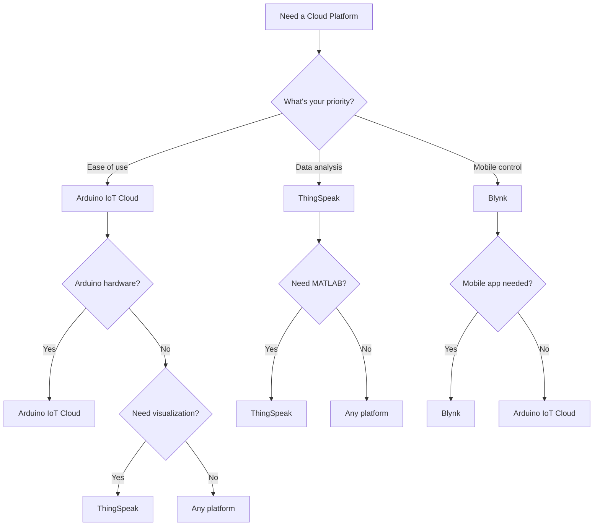

# Arduino Cloud Platforms

## Introduction

Arduino Cloud platforms provide a seamless way to connect your Arduino devices to the internet, enabling remote monitoring, control, and data collection. These platforms serve as the bridge between your physical hardware and the digital world, allowing your projects to become truly connected and part of the Internet of Things (IoT) ecosystem.

In this guide, we'll explore various Arduino Cloud platforms, their features, and how to integrate them into your projects. By the end, you'll understand how to transform simple Arduino projects into sophisticated IoT applications that can communicate with the web and other devices.

## What Are Arduino Cloud Platforms?

Arduino Cloud platforms are services that provide the infrastructure for connecting Arduino devices to the internet and to each other. They typically include:

- **Device management** - Register, configure and monitor your devices
- **Data storage** - Store sensor readings and device states
- **Visualization tools** - Display your data in dashboards
- **Remote control** - Send commands to your devices from anywhere
- **Integration capabilities** - Connect with other web services and applications

Let's look at some of the most popular Arduino Cloud platforms available today.

## Arduino IoT Cloud

The Arduino IoT Cloud is the official cloud platform developed by Arduino. It offers a user-friendly interface for beginners while providing powerful features for more advanced users.

### Key Features

- **Things** - Virtual representations of your physical devices
- **Properties** - Variables that can be synchronized between the device and the cloud
- **Dashboards** - Custom interfaces to visualize and control your devices
- **Web Editor** - Code your devices directly from your browser
- **API** - Access your data programmatically

### Getting Started with Arduino IoT Cloud

#### 1. Setup and Registration

1. Create an Arduino account at [https://create.arduino.cc/](https://create.arduino.cc/)
2. Navigate to the IoT Cloud section
3. Add a new "Thing" (your device)

#### 2. Configure Your Device

To connect your Arduino to the IoT Cloud, you'll need:

- A compatible Arduino board (like Arduino MKR WiFi 1010, Arduino Nano 33 IoT, etc.)
- The Arduino IoT Cloud Agent installed on your computer
- Internet connection

#### 3. Creating a Simple Weather Station

Let's build a simple weather station that publishes temperature and humidity data to the Arduino IoT Cloud.

First, set up your properties in the Arduino IoT Cloud:

1. Create a new Thing named "WeatherStation"
2. Add two properties:
   - `temperature` (Number, read-only)
   - `humidity` (Number, read-only)

Then, write the code for your Arduino:

```cpp
#include "thingProperties.h"
#include <DHT.h>

#define DHTPIN 2     // Digital pin connected to the DHT sensor
#define DHTTYPE DHT22   // DHT 22 sensor type

DHT dht(DHTPIN, DHTTYPE);

void setup() {
  // Initialize serial and wait for port to open:
  Serial.begin(9600);
  delay(1500);

  // Initialize the DHT sensor
  dht.begin();

  // Initialize Arduino IoT Cloud properties
  initProperties();

  // Connect to Arduino IoT Cloud
  ArduinoCloud.begin(ArduinoIoTPreferredConnection);
  
  Serial.println("Connected to Arduino IoT Cloud");
}

void loop() {
  ArduinoCloud.update();
  
  // Read sensor values every 5 seconds
  static unsigned long lastRead = 0;
  if (millis() - lastRead > 5000) {
    lastRead = millis();
    
    // Read temperature and humidity
    float tempValue = dht.readTemperature();
    float humValue = dht.readHumidity();
    
    // Check if any reads failed
    if (isnan(tempValue) || isnan(humValue)) {
      Serial.println("Failed to read from DHT sensor!");
      return;
    }
    
    // Update cloud properties
    temperature = tempValue;
    humidity = humValue;
    
    Serial.print("Temperature: ");
    Serial.print(temperature);
    Serial.print(" °C, Humidity: ");
    Serial.print(humidity);
    Serial.println(" %");
  }
}
```

#### 4. Create a Dashboard

Once your device is publishing data, create a dashboard to visualize it:

1. Go to the "Dashboards" section
2. Create a new dashboard named "Weather Station Dashboard"
3. Add widgets:
   - Line chart for temperature
   - Gauge for humidity
   - Value displays for both properties

Now you can monitor your weather station data from anywhere!

## ThingSpeak

ThingSpeak is another popular IoT platform that works well with Arduino devices. It's especially good for data analytics and visualization.

### Key Features

- **Channels** - Collect and store sensor data
- **MATLAB Analysis** - Analyze your data using MATLAB
- **Data Visualization** - Create charts and dashboards
- **ThingSpeak Apps** - Extend functionality with React
- **REST API** - Integrate with other services

### Example: Sending Data to ThingSpeak

```cpp
#include <WiFiNINA.h>
#include "secrets.h"
#include <ThingSpeak.h>

// WiFi settings (stored in secrets.h file)
char ssid[] = SECRET_SSID;   
char pass[] = SECRET_PASS;   
WiFiClient client;

// ThingSpeak settings
unsigned long channelID = SECRET_CH_ID;
const char* apiKey = SECRET_WRITE_APIKEY;
unsigned int fieldNumber = 1;  // Which field to write to

void setup() {
  Serial.begin(9600);
  while (!Serial);
  
  // Connect to WiFi
  while (WiFi.status() != WL_CONNECTED) {
    Serial.print("Attempting to connect to SSID: ");
    Serial.println(ssid);
    WiFi.begin(ssid, pass);
    delay(5000);
  }
  
  Serial.println("Connected to WiFi");
  
  // Initialize ThingSpeak
  ThingSpeak.begin(client);
}

void loop() {
  // Read sensor (e.g., temperature)
  int sensorValue = analogRead(A0);
  float voltage = sensorValue * (5.0 / 1023.0);
  float temperature = (voltage - 0.5) * 100;  // LM35 sensor
  
  // Send data to ThingSpeak
  ThingSpeak.writeField(channelID, fieldNumber, temperature, apiKey);
  
  Serial.print("Temperature: ");
  Serial.print(temperature);
  Serial.println(" °C (sent to ThingSpeak)");
  
  // ThingSpeak requires at least a 15-second delay between updates
  delay(20000);
}
```

Create a `secrets.h` file with your credentials:

```cpp
#define SECRET_SSID "YourWiFiName"
#define SECRET_PASS "YourWiFiPassword"
#define SECRET_CH_ID 000000  // Your ThingSpeak Channel ID
#define SECRET_WRITE_APIKEY "XXXXXXXXXXXXXXXX"  // Your ThingSpeak Write API Key
```

## Blynk

Blynk offers a platform specifically designed for IoT projects with a focus on mobile app integration. It's perfect for controlling Arduino devices from your smartphone.

### Key Features

- **Mobile App** - Custom control interface for iOS and Android
- **Virtual Pins** - Easy data exchange between devices and the app
- **Widgets** - Buttons, sliders, displays, and more
- **Notifications** - Get alerts from your devices
- **Device groups** - Manage multiple devices together

### Example: Controlling an LED with Blynk

```cpp
#include <BlynkSimpleEsp8266.h>
#include <ESP8266WiFi.h>

// WiFi credentials
char ssid[] = "YourWiFiName";
char pass[] = "YourWiFiPassword";

// Blynk authentication token
char auth[] = "YourBlynkAuthToken";

// LED pin
const int ledPin = 2;  // GPIO2 on ESP8266

void setup() {
  pinMode(ledPin, OUTPUT);
  
  Serial.begin(9600);
  
  // Connect to Blynk
  Blynk.begin(auth, ssid, pass);
  
  Serial.println("Connected to Blynk!");
}

// This function will be called every time the device receives a command from the app
BLYNK_WRITE(V0) {
  int pinValue = param.asInt();  // Get value as integer
  
  digitalWrite(ledPin, pinValue);
  
  Serial.print("LED state changed to: ");
  Serial.println(pinValue);
}

void loop() {
  Blynk.run();  // Run Blynk
}
```

## Choosing the Right Platform

Let's compare these platforms to help you choose the right one for your project:



## Advanced Integration: MQTT Protocol

Most Arduino Cloud platforms use MQTT (Message Queuing Telemetry Transport) under the hood. Understanding MQTT can help you create more advanced integrations.

### What is MQTT?

MQTT is a lightweight messaging protocol designed for IoT devices with:
- Low bandwidth requirements
- Publish/Subscribe model
- QoS (Quality of Service) levels
- Small code footprint

### Example: Publishing to an MQTT Broker

```cpp
#include <WiFiNINA.h>
#include <ArduinoMqttClient.h>

// WiFi credentials
const char ssid[] = "YourWiFiName";
const char pass[] = "YourWiFiPassword";

// MQTT broker settings
const char broker[] = "broker.hivemq.com";
int port = 1883;
const char topic[] = "arduino/sensor";

WiFiClient wifiClient;
MqttClient mqttClient(wifiClient);

void setup() {
  Serial.begin(9600);
  while (!Serial);

  // Connect to WiFi
  Serial.print("Connecting to WiFi...");
  WiFi.begin(ssid, pass);
  while (WiFi.status() != WL_CONNECTED) {
    Serial.print(".");
    delay(1000);
  }
  Serial.println("Connected!");

  // Connect to MQTT broker
  Serial.print("Connecting to MQTT broker...");
  if (!mqttClient.connect(broker, port)) {
    Serial.print("MQTT connection failed! Error code = ");
    Serial.println(mqttClient.connectError());
    while (1);
  }
  Serial.println("Connected to MQTT broker!");
}

void loop() {
  // Make sure we're still connected
  if (!mqttClient.connected()) {
    Serial.println("Reconnecting to MQTT broker...");
    mqttClient.connect(broker, port);
  }
  
  // Read sensor data
  int sensorValue = analogRead(A0);
  
  // Publish to topic
  Serial.print("Sending message to topic: ");
  Serial.println(topic);
  
  mqttClient.beginMessage(topic);
  mqttClient.print("Sensor value: ");
  mqttClient.print(sensorValue);
  mqttClient.endMessage();
  
  delay(5000);
}
```

## Real-World Applications

### 1. Smart Home Automation

Connect Arduino to control lights, monitor temperature, and automate household tasks:

```cpp
// Simplified example of a smart home light controller
#include "thingProperties.h"

// Define pins
const int motionSensorPin = 2;
const int lightRelayPin = 3;

// Properties defined in Arduino IoT Cloud
// boolean motionDetected;
// boolean lightOn;
// int lightTimeout;  // in seconds

unsigned long lastMotionTime = 0;

void setup() {
  Serial.begin(9600);
  delay(1500);
  
  // Set pin modes
  pinMode(motionSensorPin, INPUT);
  pinMode(lightRelayPin, OUTPUT);
  
  // Initialize cloud properties
  initProperties();
  ArduinoCloud.begin(ArduinoIoTPreferredConnection);
}

void loop() {
  ArduinoCloud.update();
  
  // Check motion sensor
  if (digitalRead(motionSensorPin) == HIGH) {
    motionDetected = true;
    lastMotionTime = millis();
    
    // Turn on light if not already on
    if (!lightOn) {
      lightOn = true;
      digitalWrite(lightRelayPin, HIGH);
      Serial.println("Motion detected, light turned on");
    }
  } else {
    motionDetected = false;
  }
  
  // Check if light should turn off based on timeout
  if (lightOn && !motionDetected) {
    if (millis() - lastMotionTime > lightTimeout * 1000) {
      lightOn = false;
      digitalWrite(lightRelayPin, LOW);
      Serial.println("Timeout reached, light turned off");
    }
  }
}

// This function is called when lightOn property is changed from the dashboard
void onLightOnChange() {
  digitalWrite(lightRelayPin, lightOn ? HIGH : LOW);
  Serial.print("Light turned ");
  Serial.println(lightOn ? "ON" : "OFF");
}
```

### 2. Agricultural Monitoring

Monitor soil moisture, temperature, and control irrigation systems:

```cpp
#include "thingProperties.h"

// Define pins
const int soilMoisturePin = A0;
const int temperaturePin = A1;
const int irrigationRelayPin = 4;

// Properties defined in Arduino IoT Cloud
// float soilMoisture;  // in percentage
// float temperature;   // in Celsius
// boolean irrigationOn;
// float moistureThreshold;  // threshold to activate irrigation

void setup() {
  Serial.begin(9600);
  delay(1500);
  
  pinMode(irrigationRelayPin, OUTPUT);
  
  // Initialize cloud properties
  initProperties();
  ArduinoCloud.begin(ArduinoIoTPreferredConnection);
}

void loop() {
  ArduinoCloud.update();
  
  // Read sensor data
  int rawMoisture = analogRead(soilMoisturePin);
  soilMoisture = map(rawMoisture, 0, 1023, 0, 100);
  
  int rawTemp = analogRead(temperaturePin);
  float voltage = rawTemp * (5.0 / 1023.0);
  temperature = (voltage - 0.5) * 100;
  
  // Auto-irrigation logic
  if (soilMoisture < moistureThreshold && !irrigationOn) {
    irrigationOn = true;
  } else if (soilMoisture > moistureThreshold + 5 && irrigationOn) {
    irrigationOn = false;
  }
  
  // Control irrigation system
  digitalWrite(irrigationRelayPin, irrigationOn ? HIGH : LOW);
  
  Serial.print("Soil Moisture: ");
  Serial.print(soilMoisture);
  Serial.print("%, Temperature: ");
  Serial.print(temperature);
  Serial.print("°C, Irrigation: ");
  Serial.println(irrigationOn ? "ON" : "OFF");
  
  delay(5000);
}

// This function is called when irrigationOn property is changed from the dashboard
void onIrrigationOnChange() {
  digitalWrite(irrigationRelayPin, irrigationOn ? HIGH : LOW);
}
```

### 3. Industrial Monitoring

Monitor machine status, temperature, and vibration in an industrial setting:

```cpp
#include "thingProperties.h"
#include <Adafruit_MPU6050.h>
#include <Adafruit_Sensor.h>
#include <Wire.h>

Adafruit_MPU6050 mpu;

// Properties defined in Arduino IoT Cloud
// float machineTemperature;
// float vibrationLevel;
// boolean machineStatus;  // ON/OFF
// float alertThreshold;   // vibration threshold for alert

void setup() {
  Serial.begin(9600);
  delay(1500);
  
  // Initialize MPU6050 sensor
  if (!mpu.begin()) {
    Serial.println("Failed to find MPU6050 chip");
    while (1) {
      delay(10);
    }
  }
  
  // Setup accelerometer range
  mpu.setAccelerometerRange(MPU6050_RANGE_8_G);
  
  // Initialize cloud properties
  initProperties();
  ArduinoCloud.begin(ArduinoIoTPreferredConnection);
}

void loop() {
  ArduinoCloud.update();
  
  // Get sensor readings
  sensors_event_t a, g, temp;
  mpu.getEvent(&a, &g, &temp);
  
  // Calculate vibration magnitude from accelerometer data
  float vibration = sqrt(a.acceleration.x * a.acceleration.x + 
                        a.acceleration.y * a.acceleration.y + 
                        a.acceleration.z * a.acceleration.z) - 9.8;  // Subtract gravity
  
  // Update properties
  machineTemperature = temp.temperature;
  vibrationLevel = vibration;
  
  // Check for alerts
  if (vibrationLevel > alertThreshold) {
    Serial.println("ALERT: Excessive vibration detected!");
    // You could trigger additional actions here
  }
  
  Serial.print("Temperature: ");
  Serial.print(machineTemperature);
  Serial.print(" °C, Vibration: ");
  Serial.print(vibrationLevel);
  Serial.print(" m/s², Machine Status: ");
  Serial.println(machineStatus ? "ON" : "OFF");
  
  delay(1000);
}
```

## Best Practices for Arduino Cloud Projects

1. **Security First**
   - Use secure connections (TLS/SSL) when available
   - Keep API keys and credentials private
   - Update firmware regularly

2. **Optimize Power Usage**
   - Implement sleep modes for battery-powered devices
   - Reduce transmission frequency to save power
   - Consider energy harvesting for remote deployments

3. **Data Management**
   - Only send necessary data to reduce bandwidth
   - Implement local caching for offline operation
   - Consider data aggregation before transmission

4. **Error Handling**
   - Implement reconnection logic for network issues
   - Add timeout handling for cloud operations
   - Log errors for troubleshooting

5. **Scalability**
   - Design your system to handle more devices as needed
   - Use device IDs and topics that allow for expansion
   - Consider message queuing for high-volume applications

## Summary

Arduino Cloud platforms provide powerful tools to connect your Arduino projects to the internet and create true IoT applications. We've covered:

- The main Arduino Cloud platforms (Arduino IoT Cloud, ThingSpeak, and Blynk)
- How to set up and configure each platform
- Programming Arduino devices to communicate with the cloud
- Real-world applications in smart homes, agriculture, and industrial settings
- Best practices for building reliable IoT systems

By leveraging these cloud platforms, you can transform simple Arduino projects into sophisticated connected devices that can be monitored and controlled from anywhere in the world.

## Exercises

1. **Beginner**: Create a simple temperature and humidity monitor that sends data to Arduino IoT Cloud.
2. **Intermediate**: Build a plant monitoring system that tracks soil moisture and light levels, with automatic alerts when plants need watering.
3. **Advanced**: Develop a home energy monitoring system that tracks power usage from multiple sources and visualizes the data on a cloud dashboard.

## Additional Resources

- [Arduino IoT Cloud Documentation](https://docs.arduino.cc/arduino-cloud/)
- [ThingSpeak Documentation](https://www.mathworks.com/help/thingspeak/)
- [Blynk Documentation](https://docs.blynk.io/)
- [Introduction to MQTT Protocol](https://mqtt.org/)
- [Arduino IoT Cloud GitHub Examples](https://github.com/arduino/arduino-iot-cloud-examples)

Remember that IoT projects combine hardware, software, and network knowledge, so take your time to understand each component before building complex systems.