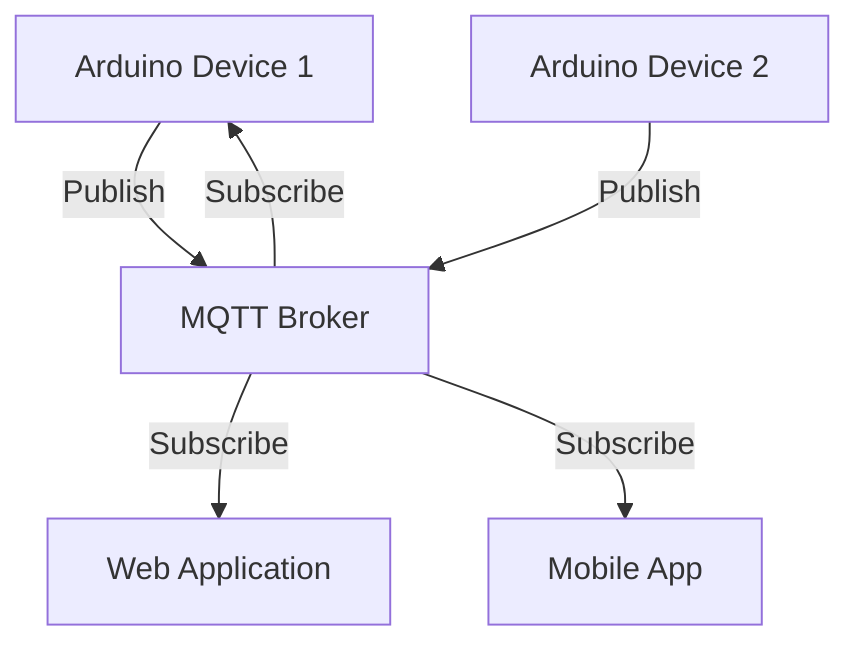

# Arduino MQTT Protocol

## Introduction

MQTT (Message Queuing Telemetry Transport) is a lightweight messaging protocol designed for constrained devices and low-bandwidth, high-latency networks. It's particularly well-suited for Internet of Things (IoT) applications, making it an excellent choice for Arduino projects that need to communicate over networks.

In this tutorial, you'll learn:
- What MQTT is and why it's valuable for IoT projects
- The core concepts of MQTT communication
- How to set up an Arduino to communicate using MQTT
- How to create practical IoT applications using Arduino and MQTT

## What is MQTT?

MQTT operates on a publish/subscribe model, which differs from the traditional client-server model. Instead of direct communication between devices, MQTT uses a central broker that manages all messages.



### Key MQTT Concepts

1. **Broker**: The central server that receives all messages and routes them to the appropriate subscribers.
2. **Client**: Any device that connects to the broker to publish or subscribe to messages (e.g., your Arduino).
3. **Topic**: A hierarchical string that the broker uses to filter messages for each client (e.g., `home/livingroom/temperature`).
4. **Publish**: Sending a message to a specific topic.
5. **Subscribe**: Registering interest in receiving messages from specific topics.
6. **QoS (Quality of Service)**: Determines the guarantee of message delivery (0, 1, or 2).

## Getting Started with MQTT on Arduino

### Required Hardware

- Arduino board (UNO, Mega, ESP8266, or ESP32)
- Network connectivity (Ethernet shield, WiFi shield, or built-in WiFi for ESP8266/ESP32)

### Required Libraries

Before diving into code, you'll need to install the appropriate libraries:

1. For Arduino with Ethernet Shield: PubSubClient
2. For ESP8266/ESP32: PubSubClient or AsyncMqttClient

You can install these libraries through the Arduino IDE by navigating to:

`Sketch > Include Library > Manage Libraries`

### Basic MQTT Connection with Arduino and Ethernet Shield

Here's a simple example to connect an Arduino with Ethernet shield to an MQTT broker:

```cpp
#include <SPI.h>
#include <Ethernet.h>
#include <PubSubClient.h>

// Network configuration
byte mac[] = { 0xDE, 0xAD, 0xBE, 0xEF, 0xFE, 0xED };
IPAddress ip(192, 168, 1, 100);
IPAddress mqttServer(192, 168, 1, 50);  // MQTT broker IP address

// MQTT configuration
const char* clientID = "arduinoClient";
const char* topic = "arduino/test";

EthernetClient ethClient;
PubSubClient client(ethClient);

void setup() {
  Serial.begin(9600);
  
  // Initialize Ethernet
  Ethernet.begin(mac, ip);
  Serial.println("Ethernet connected");
  
  // Set MQTT server and callback function
  client.setServer(mqttServer, 1883);
  client.setCallback(callback);
}

void loop() {
  if (!client.connected()) {
    reconnect();
  }
  client.loop();
  
  // Publish a message every 5 seconds
  static unsigned long lastMsg = 0;
  if (millis() - lastMsg > 5000) {
    lastMsg = millis();
    String message = "Hello from Arduino: " + String(lastMsg);
    client.publish(topic, message.c_str());
    Serial.println("Message published: " + message);
  }
}

void callback(char* topic, byte* payload, unsigned int length) {
  // Convert payload to string
  char message[length + 1];
  memcpy(message, payload, length);
  message[length] = '\0';
  
  Serial.print("Message received on topic: ");
  Serial.println(topic);
  Serial.print("Message: ");
  Serial.println(message);
}

void reconnect() {
  while (!client.connected()) {
    Serial.print("Attempting MQTT connection...");
    if (client.connect(clientID)) {
      Serial.println("connected");
      client.subscribe(topic);
    } else {
      Serial.print("failed, rc=");
      Serial.print(client.state());
      Serial.println(" retrying in 5 seconds");
      delay(5000);
    }
  }
}
```

#### Expected Output:

When running this code, you should see output similar to:

```
Ethernet connected
Attempting MQTT connection...connected
Message published: Hello from Arduino: 5000
Message published: Hello from Arduino: 10000
Message received on topic: arduino/test
Message: Hello from Arduino: 10000
```

### MQTT with ESP8266

If you're using an ESP8266 or ESP32, which come with built-in WiFi, the setup is slightly different:

```cpp
#include <ESP8266WiFi.h>
#include <PubSubClient.h>

// WiFi configuration
const char* ssid = "YourWiFiSSID";
const char* password = "YourWiFiPassword";

// MQTT configuration
const char* mqttServer = "broker.example.com";
const int mqttPort = 1883;
const char* mqttUser = "yourusername";  // Leave empty if no authentication
const char* mqttPassword = "yourpassword";  // Leave empty if no authentication
const char* clientID = "ESP8266Client";
const char* topic = "esp8266/test";

WiFiClient espClient;
PubSubClient client(espClient);

void setup() {
  Serial.begin(115200);
  
  // Connect to WiFi
  WiFi.begin(ssid, password);
  while (WiFi.status() != WL_CONNECTED) {
    delay(500);
    Serial.print(".");
  }
  Serial.println("WiFi connected");
  
  // Set MQTT server and callback
  client.setServer(mqttServer, mqttPort);
  client.setCallback(callback);
}

void loop() {
  if (!client.connected()) {
    reconnect();
  }
  client.loop();
  
  // Publish a message every 5 seconds
  static unsigned long lastMsg = 0;
  if (millis() - lastMsg > 5000) {
    lastMsg = millis();
    String message = "Hello from ESP8266: " + String(lastMsg);
    client.publish(topic, message.c_str());
    Serial.println("Message published: " + message);
  }
}

void callback(char* topic, byte* payload, unsigned int length) {
  // Convert payload to string
  char message[length + 1];
  memcpy(message, payload, length);
  message[length] = '\0';
  
  Serial.print("Message received on topic: ");
  Serial.println(topic);
  Serial.print("Message: ");
  Serial.println(message);
}

void reconnect() {
  while (!client.connected()) {
    Serial.print("Attempting MQTT connection...");
    if (client.connect(clientID, mqttUser, mqttPassword)) {
      Serial.println("connected");
      client.subscribe(topic);
    } else {
      Serial.print("failed, rc=");
      Serial.print(client.state());
      Serial.println(" retrying in 5 seconds");
      delay(5000);
    }
  }
}
```

## Practical MQTT Examples

Let's explore some practical applications of MQTT with Arduino.

### Example 1: Temperature and Humidity Monitoring

This example uses a DHT11 or DHT22 sensor to measure temperature and humidity, then publishes the data to MQTT topics.

```cpp
#include <ESP8266WiFi.h>
#include <PubSubClient.h>
#include <DHT.h>

// WiFi and MQTT configuration
const char* ssid = "YourWiFiSSID";
const char* password = "YourWiFiPassword";
const char* mqttServer = "broker.example.com";
const int mqttPort = 1883;
const char* clientID = "DHT11_Sensor";

// DHT sensor configuration
#define DHTPIN 2      // GPIO pin where the DHT11 is connected
#define DHTTYPE DHT11 // DHT 11 or DHT22
DHT dht(DHTPIN, DHTTYPE);

// MQTT topics
const char* tempTopic = "sensors/temperature";
const char* humidTopic = "sensors/humidity";

WiFiClient espClient;
PubSubClient client(espClient);

void setup() {
  Serial.begin(115200);
  dht.begin();
  
  // Connect to WiFi
  WiFi.begin(ssid, password);
  while (WiFi.status() != WL_CONNECTED) {
    delay(500);
    Serial.print(".");
  }
  Serial.println("WiFi connected");
  
  // Set MQTT server
  client.setServer(mqttServer, mqttPort);
}

void loop() {
  if (!client.connected()) {
    reconnect();
  }
  client.loop();
  
  // Read sensor data every 30 seconds
  static unsigned long lastMsg = 0;
  if (millis() - lastMsg > 30000) {
    lastMsg = millis();
    
    // Read temperature and humidity
    float temperature = dht.readTemperature();
    float humidity = dht.readHumidity();
    
    // Check if reading is valid
    if (!isnan(temperature) && !isnan(humidity)) {
      // Convert to string
      String tempStr = String(temperature);
      String humidStr = String(humidity);
      
      // Publish to MQTT
      client.publish(tempTopic, tempStr.c_str());
      client.publish(humidTopic, humidStr.c_str());
      
      Serial.println("Temperature: " + tempStr + "°C");
      Serial.println("Humidity: " + humidStr + "%");
    } else {
      Serial.println("Failed to read from DHT sensor!");
    }
  }
}

void reconnect() {
  while (!client.connected()) {
    Serial.print("Attempting MQTT connection...");
    if (client.connect(clientID)) {
      Serial.println("connected");
    } else {
      Serial.print("failed, rc=");
      Serial.print(client.state());
      Serial.println(" retrying in 5 seconds");
      delay(5000);
    }
  }
}
```

### Example 2: IoT LED Control

This example allows you to control an LED connected to your Arduino through MQTT messages:

```cpp
#include <ESP8266WiFi.h>
#include <PubSubClient.h>

// WiFi and MQTT configuration
const char* ssid = "YourWiFiSSID";
const char* password = "YourWiFiPassword";
const char* mqttServer = "broker.example.com";
const int mqttPort = 1883;
const char* clientID = "LED_Controller";

// LED configuration
const int ledPin = 5; // D1 on NodeMCU

// MQTT topics
const char* ledTopic = "arduino/led";
const char* statusTopic = "arduino/led/status";

WiFiClient espClient;
PubSubClient client(espClient);

void setup() {
  Serial.begin(115200);
  
  // Initialize LED pin
  pinMode(ledPin, OUTPUT);
  digitalWrite(ledPin, LOW);
  
  // Connect to WiFi
  WiFi.begin(ssid, password);
  while (WiFi.status() != WL_CONNECTED) {
    delay(500);
    Serial.print(".");
  }
  Serial.println("WiFi connected");
  
  // Set MQTT server and callback
  client.setServer(mqttServer, mqttPort);
  client.setCallback(callback);
}

void loop() {
  if (!client.connected()) {
    reconnect();
  }
  client.loop();
  
  // Publish LED status every 60 seconds (or when changed)
  static unsigned long lastStatus = 0;
  if (millis() - lastStatus > 60000) {
    lastStatus = millis();
    publishLedStatus();
  }
}

void callback(char* topic, byte* payload, unsigned int length) {
  // Convert payload to string
  char message[length + 1];
  memcpy(message, payload, length);
  message[length] = '\0';
  
  Serial.print("Message received on topic: ");
  Serial.println(topic);
  Serial.print("Message: ");
  Serial.println(message);
  
  // Check if message is for LED control
  if (strcmp(topic, ledTopic) == 0) {
    if (strcmp(message, "ON") == 0) {
      digitalWrite(ledPin, HIGH);
      Serial.println("LED turned ON");
    } 
    else if (strcmp(message, "OFF") == 0) {
      digitalWrite(ledPin, LOW);
      Serial.println("LED turned OFF");
    }
    
    // Publish updated status
    publishLedStatus();
  }
}

void publishLedStatus() {
  if (digitalRead(ledPin) == HIGH) {
    client.publish(statusTopic, "ON");
  } else {
    client.publish(statusTopic, "OFF");
  }
}

void reconnect() {
  while (!client.connected()) {
    Serial.print("Attempting MQTT connection...");
    if (client.connect(clientID)) {
      Serial.println("connected");
      client.subscribe(ledTopic);
      
      // Publish initial status
      publishLedStatus();
    } else {
      Serial.print("failed, rc=");
      Serial.print(client.state());
      Serial.println(" retrying in 5 seconds");
      delay(5000);
    }
  }
}
```

## MQTT Best Practices

When working with MQTT in Arduino projects, keep these best practices in mind:

1. **Topic Structure**: Use a hierarchical topic structure like `home/livingroom/temperature` to organize your data logically.

2. **QoS Levels**: Choose the appropriate Quality of Service:
   - QoS 0: "At most once" (fire and forget)
   - QoS 1: "At least once" (confirmed delivery)
   - QoS 2: "Exactly once" (assured delivery)

   For most Arduino applications, QoS 0 or 1 is sufficient.

3. **Retained Messages**: Set the retained flag to true for messages that need to be delivered to new subscribers immediately when they connect.

4. **Last Will and Testament (LWT)**: Use LWT to notify other clients when a device disconnects unexpectedly.

```cpp
// Example of setting up Last Will and Testament
client.connect(clientID, mqttUser, mqttPassword, "devices/status", 0, 1, "offline");
```

5. **Keep Alive**: Set an appropriate keep-alive interval based on your network conditions.

6. **Persistent Sessions**: Use persistent sessions to receive missed messages after reconnection.

## Setting Up an MQTT Broker

For testing or small projects, you can set up a local MQTT broker:

1. **Mosquitto**: A lightweight open-source MQTT broker
   - Installation on Windows: Download from the official Eclipse Mosquitto website
   - Installation on Linux: `sudo apt install mosquitto mosquitto-clients`
   - Installation on macOS: `brew install mosquitto`

2. **Public MQTT Brokers**: For testing, you can use public brokers like:
   - test.mosquitto.org
   - broker.hivemq.com
   - iot.eclipse.org

> ⚠️ **Important**: Do not use public brokers for sensitive data or production applications!

## Debugging MQTT Communications

When working with MQTT, these tools can help debug your communications:

1. **MQTT Explorer**: A graphical client that lets you visualize and interact with MQTT messages
2. **Mosquitto Client Tools**: Command-line tools to publish and subscribe to topics
   ```bash
   # Subscribe to a topic
   mosquitto_sub -h broker.example.com -t "arduino/test" -v
   
   # Publish to a topic
   mosquitto_pub -h broker.example.com -t "arduino/led" -m "ON"
   ```

## Summary

MQTT is a powerful protocol for IoT applications with Arduino. Its lightweight nature and publish/subscribe architecture make it ideal for constrained devices and networks.

In this tutorial, you've learned:
- The basic concepts of MQTT
- How to connect Arduino to an MQTT broker
- How to publish messages from Arduino
- How to subscribe to topics and process incoming messages
- Practical examples of MQTT in IoT projects

## Additional Resources

1. **Libraries:**
   - [PubSubClient Documentation](https://pubsubclient.knolleary.net/)
   - [AsyncMqttClient for ESP8266/ESP32](https://github.com/marvinroger/async-mqtt-client)

2. **Tools:**
   - [Mosquitto MQTT Broker](https://mosquitto.org/)
   - [MQTT Explorer](http://mqtt-explorer.com/)

## Exercises

1. Create an MQTT-based weather station that publishes temperature, humidity, and pressure readings.
2. Build a home automation system that controls multiple LEDs or relays via MQTT.
3. Develop a two-way communication system between two Arduinos using MQTT.
4. Create a data logger that subscribes to multiple sensors and saves the data to an SD card.
5. Build an MQTT-based alarm system that sends notifications when motion is detected.