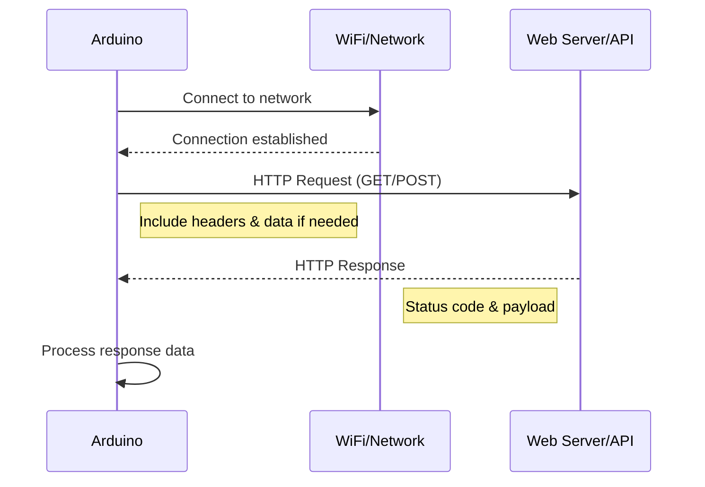

# Arduino HTTP Requests

## Introduction

In the world of Internet of Things (IoT), connecting your Arduino projects to the internet opens up endless possibilities. One of the fundamental ways Arduino devices communicate with web services is through HTTP requests - the same protocol that powers the web.

This guide will walk you through how to make HTTP requests with Arduino, allowing your projects to fetch weather data, send sensor readings to cloud platforms, control devices remotely, and much more.

## Prerequisites

Before you start making HTTP requests with your Arduino, you'll need:

- An Arduino board with internet connectivity (like ESP8266, ESP32, or Arduino with Ethernet/WiFi shield)
- Arduino IDE installed
- Basic understanding of Arduino programming
- A working internet connection

## Understanding HTTP Requests

HTTP (Hypertext Transfer Protocol) is the foundation of data communication on the web. When your Arduino makes an HTTP request, it's essentially asking a web server for information or sending data to it.

### Types of HTTP Requests

The most common HTTP request methods you'll use with Arduino are:

- **GET**: Retrieve data from a server
- **POST**: Send data to a server
- **PUT**: Update existing data on a server
- **DELETE**: Remove data from a server

For beginners, we'll focus primarily on GET and POST requests, as they cover most use cases.

## Hardware Setup

Different Arduino boards have different ways of connecting to the internet. Let's look at the most common options:

### ESP8266/ESP32

These boards have built-in WiFi capabilities, making them ideal for IoT projects.

### Arduino + WiFi Shield/Module

Traditional Arduino boards (Uno, Mega, etc.) need additional hardware like the official WiFi Shield or modules like ESP8266 connected via serial.

### Arduino + Ethernet Shield

For wired connections, the Ethernet shield is a reliable option.

## Required Libraries

Depending on your hardware, you'll need different libraries:

- For ESP8266: `ESP8266WiFi` and `ESP8266HTTPClient`
- For ESP32: `WiFi` and `HTTPClient`
- For Ethernet Shield: `Ethernet` and `EthernetClient`

Let's start with examples for each platform.

## Making HTTP GET Requests

### With ESP8266

First, let's create a simple example that connects to WiFi and makes a GET request to retrieve data:

```cpp
#include <ESP8266WiFi.h>
#include <ESP8266HTTPClient.h>
#include <WiFiClient.h>

const char* ssid = "YourNetworkName";
const char* password = "YourNetworkPassword";

void setup() {
  Serial.begin(115200);
  WiFi.begin(ssid, password);
  
  Serial.print("Connecting to WiFi");
  while (WiFi.status() != WL_CONNECTED) {
    delay(500);
    Serial.print(".");
  }
  Serial.println();
  Serial.print("Connected! IP address: ");
  Serial.println(WiFi.localIP());
  
  // Make HTTP request
  makeGetRequest();
}

void makeGetRequest() {
  WiFiClient client;
  HTTPClient http;
  
  Serial.print("Making HTTP GET request... ");
  
  // Specify the URL
  http.begin(client, "http://jsonplaceholder.typicode.com/posts/1");
  
  // Start the request
  int httpResponseCode = http.GET();
  
  if (httpResponseCode > 0) {
    Serial.print("HTTP Response code: ");
    Serial.println(httpResponseCode);
    String payload = http.getString();
    Serial.println(payload);
  }
  else {
    Serial.print("Error code: ");
    Serial.println(httpResponseCode);
  }
  
  // Free resources
  http.end();
}

void loop() {
  // For this example, we only make the request once in setup()
  delay(10000);
}
```

#### Output Example:

```
Connecting to WiFi.....
Connected! IP address: 192.168.1.104
Making HTTP GET request... 
HTTP Response code: 200
{
  "userId": 1,
  "id": 1,
  "title": "sunt aut facere repellat provident occaecati excepturi optio reprehenderit",
  "body": "quia et suscipit
suscipit recusandae consequuntur expedita et cum
reprehenderit molestiae ut ut quas totam
nostrum rerum est autem sunt rem eveniet architecto"
}
```

### With ESP32

The code for ESP32 is very similar:

```cpp
#include <WiFi.h>
#include <HTTPClient.h>

const char* ssid = "YourNetworkName";
const char* password = "YourNetworkPassword";

void setup() {
  Serial.begin(115200);
  WiFi.begin(ssid, password);
  
  Serial.print("Connecting to WiFi");
  while (WiFi.status() != WL_CONNECTED) {
    delay(500);
    Serial.print(".");
  }
  Serial.println();
  Serial.print("Connected! IP address: ");
  Serial.println(WiFi.localIP());
  
  // Make HTTP request
  makeGetRequest();
}

void makeGetRequest() {
  HTTPClient http;
  
  Serial.print("Making HTTP GET request... ");
  
  // Specify the URL
  http.begin("http://jsonplaceholder.typicode.com/posts/1");
  
  // Start the request
  int httpResponseCode = http.GET();
  
  if (httpResponseCode > 0) {
    Serial.print("HTTP Response code: ");
    Serial.println(httpResponseCode);
    String payload = http.getString();
    Serial.println(payload);
  }
  else {
    Serial.print("Error code: ");
    Serial.println(httpResponseCode);
  }
  
  // Free resources
  http.end();
}

void loop() {
  delay(10000);
}
```

## Making HTTP POST Requests

POST requests allow your Arduino to send data to servers. This is useful for uploading sensor readings or triggering actions on web services.

### ESP8266 POST Example

```cpp
#include <ESP8266WiFi.h>
#include <ESP8266HTTPClient.h>
#include <WiFiClient.h>

const char* ssid = "YourNetworkName";
const char* password = "YourNetworkPassword";

void setup() {
  Serial.begin(115200);
  WiFi.begin(ssid, password);
  
  Serial.print("Connecting to WiFi");
  while (WiFi.status() != WL_CONNECTED) {
    delay(500);
    Serial.print(".");
  }
  Serial.println();
  Serial.println("Connected!");
  
  // Make HTTP POST request
  makePostRequest();
}

void makePostRequest() {
  WiFiClient client;
  HTTPClient http;
  
  Serial.println("Making HTTP POST request...");
  
  // Your Domain name with URL path or IP address
  http.begin(client, "http://jsonplaceholder.typicode.com/posts");
  
  // Specify content-type header
  http.addHeader("Content-Type", "application/json");
  
  // Data to send with HTTP POST
  String httpRequestData = "{\"title\":\"Arduino POST Request\",\"body\":\"This is a test post from Arduino\",\"userId\":1}";
  
  // Send HTTP POST request
  int httpResponseCode = http.POST(httpRequestData);
  
  if (httpResponseCode > 0) {
    Serial.print("HTTP Response code: ");
    Serial.println(httpResponseCode);
    String response = http.getString();
    Serial.println(response);
  }
  else {
    Serial.print("Error code: ");
    Serial.println(httpResponseCode);
  }
  
  // Free resources
  http.end();
}

void loop() {
  delay(10000);
}
```

#### Output Example:

```
Connecting to WiFi.....
Connected!
Making HTTP POST request...
HTTP Response code: 201
{
  "title": "Arduino POST Request",
  "body": "This is a test post from Arduino",
  "userId": 1,
  "id": 101
}
```

## Working with HTTP Headers

HTTP headers provide additional information about the request or the response. Here's how to work with them:

```cpp
// Adding headers to your request
http.addHeader("Content-Type", "application/json");
http.addHeader("Authorization", "Bearer YourAccessToken");

// Getting response headers
String serverType = http.header("Server");
Serial.print("Server type: ");
Serial.println(serverType);
```

## Handling JSON Data

Many web APIs return data in JSON format. You can use the `ArduinoJson` library to parse and generate JSON data.

First, install the ArduinoJson library via the Arduino Library Manager.

```cpp
#include <ArduinoJson.h>

// After getting HTTP response payload
String payload = http.getString();

// Parse JSON
StaticJsonDocument<1024> doc;
DeserializationError error = deserializeJson(doc, payload);

if (error) {
  Serial.print("deserializeJson() failed: ");
  Serial.println(error.c_str());
  return;
}

// Access JSON data
const char* title = doc["title"];
Serial.print("Title: ");
Serial.println(title);
```

## Real-World Examples

### 1. Weather Data Application

This example fetches current weather data from OpenWeatherMap API:

```cpp
#include <ESP8266WiFi.h>
#include <ESP8266HTTPClient.h>
#include <WiFiClient.h>
#include <ArduinoJson.h>

const char* ssid = "YourNetworkName";
const char* password = "YourNetworkPassword";
const char* apiKey = "YourOpenWeatherMapAPIKey";
const char* city = "London";

void setup() {
  Serial.begin(115200);
  WiFi.begin(ssid, password);
  
  while (WiFi.status() != WL_CONNECTED) {
    delay(500);
    Serial.print(".");
  }
  Serial.println("");
  Serial.println("WiFi connected");
}

void loop() {
  if (WiFi.status() == WL_CONNECTED) {
    WiFiClient client;
    HTTPClient http;
    
    String url = "http://api.openweathermap.org/data/2.5/weather?q=";
    url += city;
    url += "&units=metric&appid=";
    url += apiKey;
    
    http.begin(client, url);
    int httpCode = http.GET();
    
    if (httpCode > 0) {
      String payload = http.getString();
      
      StaticJsonDocument<1024> doc;
      DeserializationError error = deserializeJson(doc, payload);
      
      if (!error) {
        float temp = doc["main"]["temp"];
        int humidity = doc["main"]["humidity"];
        const char* weather = doc["weather"][0]["main"];
        
        Serial.print("Temperature: ");
        Serial.print(temp);
        Serial.println("°C");
        
        Serial.print("Humidity: ");
        Serial.print(humidity);
        Serial.println("%");
        
        Serial.print("Weather: ");
        Serial.println(weather);
      }
    }
    
    http.end();
  }
  
  // Wait 10 minutes before next update
  delay(600000);
}
```

### 2. Sending Sensor Data to a Cloud Platform

This example reads a temperature sensor and sends the data to ThingSpeak:

```cpp
#include <ESP8266WiFi.h>
#include <ESP8266HTTPClient.h>
#include <WiFiClient.h>

const char* ssid = "YourNetworkName";
const char* password = "YourNetworkPassword";
const char* apiKey = "YourThingSpeakWriteAPIKey";
const int sensorPin = A0;

void setup() {
  Serial.begin(115200);
  WiFi.begin(ssid, password);
  
  while (WiFi.status() != WL_CONNECTED) {
    delay(500);
    Serial.print(".");
  }
  Serial.println("");
  Serial.println("WiFi connected");
}

void loop() {
  // Read sensor value (example using LM35 temperature sensor)
  int sensorValue = analogRead(sensorPin);
  float temperature = (sensorValue * 3.3 / 1024) * 100; // Convert to celsius
  
  if (WiFi.status() == WL_CONNECTED) {
    WiFiClient client;
    HTTPClient http;
    
    String url = "http://api.thingspeak.com/update?api_key=";
    url += apiKey;
    url += "&field1=";
    url += String(temperature);
    
    http.begin(client, url);
    int httpCode = http.GET();
    
    if (httpCode > 0) {
      String response = http.getString();
      Serial.println("Temperature uploaded: " + String(temperature) + "°C");
      Serial.println("Response: " + response);
    } else {
      Serial.println("Error on uploading");
    }
    
    http.end();
  }
  
  // Wait 2 minutes before next update
  delay(120000);
}
```

## Understanding HTTP Status Codes

HTTP response codes tell you about the status of your request:

- **2xx (Success)**: The request was successfully received and processed
  - 200: OK
  - 201: Created
  - 204: No Content

- **4xx (Client Error)**: There was a problem with the request
  - 400: Bad Request
  - 401: Unauthorized
  - 404: Not Found

- **5xx (Server Error)**: The server failed to process the request
  - 500: Internal Server Error
  - 503: Service Unavailable

## HTTP Request Flow Diagram

Here's a visualization of the HTTP request process:



## Best Practices

1. **Error Handling**: Always check HTTP response codes and handle errors gracefully.

2. **Minimize Requests**: Avoid making too many requests in a short time to prevent rate limiting.

3. **Power Considerations**: HTTP requests consume significant power. Use deep sleep between requests for battery-powered projects.

4. **Security**: 
   - Use HTTPS when available (requires additional libraries for TLS/SSL)
   - Don't hardcode sensitive credentials in your sketch
   - Consider using environment variables or external storage for API keys

5. **Timeout Management**: Set appropriate timeouts for HTTP requests:

```cpp
http.setTimeout(10000); // Set timeout to 10 seconds
```

## Common Issues and Troubleshooting

### Connection Problems

If you're having trouble connecting:
- Verify WiFi credentials
- Check your router settings
- Ensure the server/API is online
- Check for correct URL formatting

### Memory Issues

ESP8266 and ESP32 have limited memory:
- Use static buffers instead of dynamic memory when possible
- Be cautious with large JSON responses
- Free resources (http.end()) after each request

### SSL/HTTPS Issues

To make secure HTTPS requests:
- With ESP8266, use `WiFiClientSecure` instead of `WiFiClient`
- With ESP32, include certificate handling
- Consider fingerprint verification for additional security

## Summary

HTTP requests are essential for connecting Arduino projects to web services and APIs. In this guide, you've learned:

- The basics of HTTP and request types (GET, POST)
- How to connect different Arduino boards to the internet
- Making basic GET and POST requests
- Handling JSON data
- Real-world applications for IoT projects
- Best practices and troubleshooting techniques

With these skills, you can build Arduino projects that interact with weather services, cloud platforms, smart home systems, and countless other web-based applications.

## Further Learning

To deepen your knowledge:

1. Explore HTTPS for secure connections
2. Learn about webhooks for event-driven communication
3. Try different IoT platforms like AWS IoT, Google Cloud IoT, or Azure IoT
4. Create a RESTful API for your Arduino project
5. Implement websockets for real-time communication

## Practice Exercises

1. Create a digital weather station that displays current conditions on an LCD
2. Build a web-controlled LED that can be toggled from any browser
3. Design a data logger that sends sensor readings to Google Sheets
4. Create a Telegram bot that can be controlled via your Arduino
5. Build a home automation system that checks weather forecasts to control devices