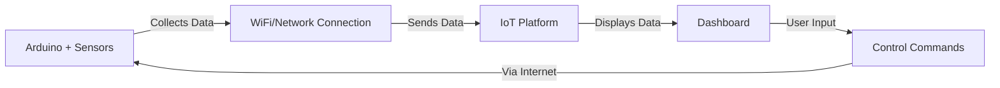
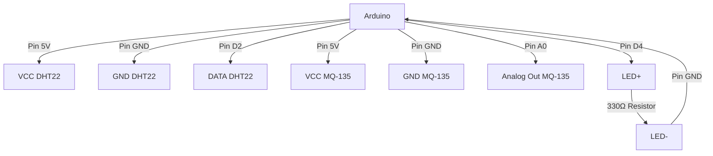

# Arduino IoT Dashboards

## Introduction

Arduino IoT dashboards are visual interfaces that allow you to monitor and control your Arduino-based Internet of Things (IoT) projects from anywhere in the world. These dashboards transform raw sensor data into meaningful visualizations and provide intuitive controls for your connected devices.

In this tutorial, you'll learn how to create interactive dashboards for your Arduino IoT projects, display sensor readings in real-time, and control your devices remotely through a web interface.

## What are IoT Dashboards?

IoT dashboards act as the control center for your connected devices. They provide:

- **Real-time monitoring**: View live sensor data in graphs, gauges, and other visual formats
- **Remote control**: Toggle outputs, adjust settings, and control your Arduino from anywhere
- **Data logging**: Store historical data for analysis and pattern recognition
- **Alerts and notifications**: Get notified when certain conditions are met

Here's how an IoT dashboard fits into your Arduino project:



## Getting Started with Arduino IoT Cloud

Arduino's official IoT Cloud platform is an excellent starting point for beginners. It offers a user-friendly interface to create dashboards without extensive coding knowledge.

### Prerequisites

- An Arduino board with WiFi capabilities (like MKR WiFi 1010, Nano 33 IoT, or ESP8266/ESP32)
- Arduino IDE installed on your computer
- Arduino IoT Cloud account (free tier available)
- Stable internet connection

### Step 1: Set Up Your Arduino IoT Cloud Account

1. Go to [Arduino IoT Cloud](https://create.arduino.cc/iot)
2. Create or log in to your Arduino account
3. Register your Arduino device

### Step 2: Create a New Thing

In Arduino IoT Cloud, a "Thing" represents your physical Arduino device:

1. Click "Create Thing" and give it a name (e.g., "WeatherStation")
2. Select your Arduino board
3. Click "Configure" to set up the device

### Step 3: Define Variables

Variables allow your dashboard to interact with your Arduino:

```arduino
// Example variables you might create
int temperature;        // For storing temperature readings
int humidity;           // For storing humidity readings
bool ledStatus = false; // For controlling an LED
```

In the IoT Cloud interface:

1. Click "Add Variable"
2. Name it (e.g., "temperature")
3. Choose the appropriate variable type (e.g., "Integer" for temperature)
4. Set permissions (Read for sensor data, Read & Write for controls)

### Step 4: Creating Your Dashboard

Now comes the fun part - building your dashboard:

1. Navigate to the "Dashboards" section
2. Click "Create Dashboard" and name it
3. Click "Build Dashboard"

Add widgets by dragging and dropping them onto your dashboard:

- **Gauge**: Perfect for temperature, humidity, or other numerical readings
- **Chart**: Shows data trends over time
- **Switch**: Toggle LEDs or other outputs on/off
- **Slider**: Control values like brightness or speed

### Step 5: Connect the Code

Arduino IoT Cloud automatically generates most of the code for you:

1. Go to "Sketch" in your Thing
2. Click "Edit Sketch" to open it in the Web Editor

You'll see the auto-generated code with setup and loop functions. Add your sensor reading code:

```arduino
#include "thingProperties.h"
#include "DHT.h"

#define DHTPIN 2      // DHT sensor connected to pin 2
#define DHTTYPE DHT22 // DHT22 sensor model
DHT dht(DHTPIN, DHTTYPE);

void setup() {
  Serial.begin(9600);
  delay(1500); 
  
  // Initialize Arduino IoT Cloud connection
  initProperties();
  ArduinoCloud.begin(ArduinoIoTPreferredConnection);
  
  // Initialize DHT sensor
  dht.begin();
  
  // Set callback function for the ledStatus variable
  ArduinoCloud.addCallback(ArduinoIoTCloudEvent::THING_PROPERTY_CHANGE, onLedStatusChange);
  
  pinMode(LED_BUILTIN, OUTPUT);
}

void loop() {
  ArduinoCloud.update();
  
  // Read sensor data every 2 seconds
  static unsigned long lastReadTime = 0;
  if (millis() - lastReadTime > 2000) {
    // Read temperature and humidity
    temperature = dht.readTemperature();
    humidity = dht.readHumidity();
    
    Serial.print("Temperature: ");
    Serial.print(temperature);
    Serial.print("°C, Humidity: ");
    Serial.println(humidity);
    
    lastReadTime = millis();
  }
}

// Callback function when ledStatus changes from the dashboard
void onLedStatusChange() {
  Serial.print("LED changed to: ");
  Serial.println(ledStatus);
  
  digitalWrite(LED_BUILTIN, ledStatus ? HIGH : LOW);
}
```

### Step 6: Upload and Test

1. Upload the sketch to your Arduino
2. Open your dashboard
3. Watch as real-time data appears in your widgets
4. Try controlling your Arduino by toggling switches or moving sliders

## Creating Advanced Dashboards

Once you're comfortable with the basics, you can create more sophisticated dashboards:

### Custom Widgets with HTML/CSS

Arduino IoT Cloud allows custom HTML widgets:

```arduino
// In your Arduino sketch
String customMessage = "Hello from Arduino!";
```

In your dashboard, add an HTML widget with:

```html
<div style="text-align: center; padding: 20px; background-color: #0066cc; color: white; border-radius: 10px;">
  <h2>Custom Message:</h2>
  <p style="font-size: 24px;">{customMessage}</p>
</div>
```

### Multi-device Dashboards

Connect multiple Arduino devices to display them all on a single dashboard:

1. Create separate Things for each device
2. Create a new dashboard
3. Add widgets from different Things to this dashboard

### Dashboard Logic with Cloud Functions

Arduino IoT Cloud allows you to add logic to your dashboard:

```javascript
// Example Cloud Function to calculate heat index
function calculateHeatIndex(temperature, humidity) {
  // Formula simplified for example
  return temperature + (humidity * 0.05);
}

// Use the function to update a dashboard variable
if (temperature && humidity) {
  heatIndex = calculateHeatIndex(temperature, humidity);
}
```

## Alternative Dashboard Platforms

While Arduino IoT Cloud is great for beginners, there are other platforms worth exploring:

### Blynk

Blynk offers a user-friendly mobile app interface:

```arduino
#include <BlynkSimpleEsp8266.h>
#define BLYNK_PRINT Serial

char auth[] = "YourAuthToken";
char ssid[] = "YourNetworkName";
char pass[] = "YourPassword";

void setup() {
  Serial.begin(9600);
  Blynk.begin(auth, ssid, pass);
}

void loop() {
  Blynk.run();
}

// Send sensor data to Blynk
BLYNK_READ(V5) {
  int sensorValue = analogRead(A0);
  Blynk.virtualWrite(V5, sensorValue);
}
```

### ThingsBoard

ThingsBoard provides powerful data visualization tools:

```arduino
#include <ESP8266WiFi.h>
#include <ThingsBoard.h>

#define WIFI_SSID "YourNetworkName"
#define WIFI_PASSWORD "YourPassword"

#define TOKEN "YourThingsboardDeviceToken"
#define THINGSBOARD_SERVER "demo.thingsboard.io"

WiFiClient espClient;
ThingsBoard tb(espClient);

void setup() {
  Serial.begin(9600);
  WiFi.begin(WIFI_SSID, WIFI_PASSWORD);
  
  // Connect to ThingsBoard
  if (tb.connect(THINGSBOARD_SERVER, TOKEN)) {
    Serial.println("Connected to ThingsBoard");
  }
}

void loop() {
  if (tb.connected()) {
    // Send telemetry data
    tb.sendTelemetryFloat("temperature", 25.7);
    tb.sendTelemetryFloat("humidity", 60.3);
  }
  
  tb.loop();
  delay(1000);
}
```

## Real-World Project: Home Environment Monitor

Let's build a complete project to monitor temperature, humidity, and air quality:

### Components Needed

- Arduino MKR WiFi 1010 or ESP8266/ESP32
- DHT22 temperature/humidity sensor
- MQ-135 air quality sensor
- LED (for status indication)

### Circuit Diagram



### Complete Code

```arduino
#include "thingProperties.h"
#include "DHT.h"

#define DHTPIN 2        // DHT22 connected to pin 2
#define DHTTYPE DHT22   // DHT22 sensor type
#define MQ135PIN A0     // MQ135 connected to analog pin A0
#define LEDPIN 4        // Status LED on pin 4

DHT dht(DHTPIN, DHTTYPE);

// These variables will be synchronized with the dashboard
int temperature;
int humidity;
int airQuality;
bool alertStatus = false;

void setup() {
  Serial.begin(9600);
  delay(1500);
  
  // Initialize pins
  pinMode(LEDPIN, OUTPUT);
  pinMode(MQ135PIN, INPUT);
  
  // Initialize sensors
  dht.begin();
  
  // Initialize connection to Arduino IoT Cloud
  initProperties();
  ArduinoCloud.begin(ArduinoIoTPreferredConnection);
  
  // Set callback function for alertStatus
  ArduinoCloud.addCallback(ArduinoIoTCloudEvent::THING_PROPERTY_CHANGE, onAlertStatusChange);
}

void loop() {
  ArduinoCloud.update();
  
  // Read sensors every 5 seconds
  static unsigned long lastReadTime = 0;
  if (millis() - lastReadTime > 5000) {
    // Read temperature and humidity
    temperature = round(dht.readTemperature());
    humidity = round(dht.readHumidity());
    
    // Read air quality (higher values = worse air quality)
    airQuality = analogRead(MQ135PIN);
    
    // Check for auto-alerts
    if (temperature > 30 || airQuality > 700) {
      alertStatus = true;
      digitalWrite(LEDPIN, HIGH);
    }
    
    // Log readings to serial
    Serial.print("Temperature: ");
    Serial.print(temperature);
    Serial.print("°C, Humidity: ");
    Serial.print(humidity);
    Serial.print("%, Air Quality: ");
    Serial.println(airQuality);
    
    lastReadTime = millis();
  }
}

// Callback when alertStatus changes from dashboard
void onAlertStatusChange() {
  Serial.print("Alert status changed to: ");
  Serial.println(alertStatus);
  
  digitalWrite(LEDPIN, alertStatus ? HIGH : LOW);
}
```

### Dashboard Setup

Create a dashboard with the following widgets:

1. **Card** for current temperature
2. **Gauge** for humidity (0-100%)
3. **Chart** showing temperature and humidity over time
4. **Gauge** for air quality with colored thresholds:
   - 0-300: Green (Good)
   - 300-500: Yellow (Moderate)
   - 500+: Red (Poor)
5. **Switch** for alert override

## Troubleshooting Common Issues

### Connection Problems

If your Arduino won't connect to the IoT platform:

1. Check your Wi-Fi credentials
2. Verify that your device is properly configured in the IoT Cloud
3. Check if your network has firewall restrictions
4. Try rebooting your router and Arduino

### Dashboard Not Updating

If your dashboard isn't showing new data:

1. Verify your Arduino is sending data (check Serial Monitor)
2. Check that variable names in code match those in the Cloud
3. Ensure your subscription hasn't reached API limits
4. Try refreshing the dashboard page

### Sensor Reading Errors

For incorrect or missing sensor readings:

1. Check sensor wiring connections
2. Verify you're using the correct pin numbers in code
3. Test sensors with a simple standalone sketch
4. Check if you need pull-up/pull-down resistors

## Best Practices for IoT Dashboards

1. **Prioritize information** - Place the most important data prominently
2. **Use appropriate visualizations** - Choose the right widget for each data type
3. **Implement error handling** - Add code to handle connectivity issues
4. **Consider mobile access** - Design with small screens in mind
5. **Secure your data** - Use encryption and strong passwords

## Summary

Arduino IoT dashboards provide a powerful way to visualize and control your IoT projects. By following this tutorial, you've learned:

- How to create basic and advanced dashboards
- The process of connecting Arduino sensors to cloud platforms
- How to display real-time data in multiple formats
- Methods for remote control of your Arduino
- Techniques for building a complete environmental monitoring system

With these skills, you can create sophisticated IoT applications that provide valuable insights and control capabilities for your projects.

## Exercises

1. Create a simple dashboard that displays temperature readings from a DHT sensor
2. Add a switch widget to control an LED remotely
3. Create a chart that shows temperature variations over 24 hours
4. Build a multi-sensor dashboard that monitors light, temperature, and motion
5. Implement a notification system that alerts you when sensor readings exceed thresholds

## Additional Resources

- [Arduino IoT Cloud Documentation](https://docs.arduino.cc/arduino-cloud/)
- [ESP8266/ESP32 IoT Development](https://randomnerdtutorials.com/projects-esp8266/)
- [MQTT Protocol for IoT Communication](https://mqtt.org/)
- [Web Dashboard Design Principles](https://www.uxpin.com/studio/blog/dashboard-design-principles/)