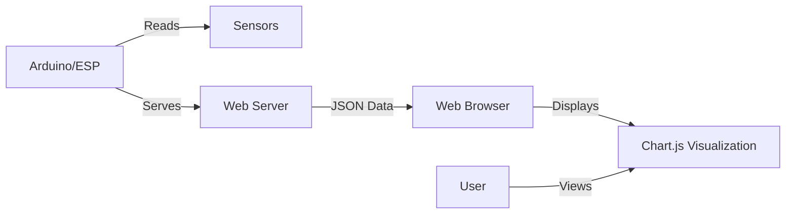

# Arduino Data Visualization

## Introduction

Data visualization is a crucial aspect of any IoT project. When your Arduino collects sensor data, being able to effectively visualize this information helps you understand patterns, identify anomalies, and communicate your findings. In this tutorial, we'll explore various methods to visualize data from Arduino sensors, starting with simple serial plotting and advancing to more sophisticated web-based dashboards.

## Why Visualize Arduino Data?

Before diving into the how, let's understand the why:

1. **Immediate Feedback**: Visualizations provide instant insight into sensor behavior
2. **Pattern Recognition**: Graphs make it easier to spot trends and anomalies
3. **Decision Making**: Visual data helps determine thresholds and trigger points
4. **Communication**: Visualizations effectively communicate your findings to others

## Basic Serial Plotter

The Arduino IDE comes with a built-in tool called the Serial Plotter that provides a quick way to visualize your data without additional libraries or platforms.

### How to Use the Serial Plotter

1. Connect your Arduino to your computer
2. Upload the following code to your Arduino:

```cpp
void setup() {
  Serial.begin(9600);
}

void loop() {
  // Read analog value from A0 (e.g., a potentiometer or light sensor)
  int sensorValue = analogRead(A0);
  
  // Send the value to Serial
  Serial.println(sensorValue);
  
  // Small delay to avoid flooding the serial port
  delay(100);
}
```

3. Open the Serial Plotter by navigating to Tools > Serial Plotter in the Arduino IDE
4. Watch as your sensor data is plotted in real-time!

### Plotting Multiple Values

You can visualize multiple sensor readings simultaneously by sending comma-separated values:

```cpp
void setup() {
  Serial.begin(9600);
}

void loop() {
  // Read from multiple sensors
  int sensor1 = analogRead(A0);
  int sensor2 = analogRead(A1);
  int sensor3 = analogRead(A2);
  
  // Send all values separated by commas
  Serial.print(sensor1);
  Serial.print(",");
  Serial.print(sensor2);
  Serial.print(",");
  Serial.println(sensor3);
  
  delay(100);
}
```

The Serial Plotter will automatically assign different colors to each value, making it easy to distinguish between different sensors.

## Processing for Arduino Visualization

For more customized visualizations, [Processing](https://processing.org/) is an excellent option. It's a flexible programming environment that works well with Arduino.

### Setting Up Processing with Arduino

1. Download and install Processing from [processing.org](https://processing.org/)
2. Upload this Arduino code:

```cpp
void setup() {
  Serial.begin(9600);
}

void loop() {
  // Read temperature from a TMP36 sensor
  int sensorVal = analogRead(A0);
  float voltage = sensorVal * (5.0 / 1023.0);
  float temperature = (voltage - 0.5) * 100;
  
  Serial.println(temperature);
  delay(100);
}
```

3. Create a new Processing sketch with this code:

```java
import processing.serial.*;

Serial myPort;
ArrayList<Float> tempData = new ArrayList<Float>();
float minTemp = 0;
float maxTemp = 40;

void setup() {
  size(800, 400);
  // Select the appropriate port for your Arduino
  String portName = Serial.list()[0]; // Change the index as needed
  myPort = new Serial(this, portName, 9600);
  myPort.bufferUntil('
');
}

void draw() {
  background(0);
  stroke(0, 255, 0);
  
  // Draw axes
  stroke(255);
  line(50, 50, 50, height-50);
  line(50, height-50, width-50, height-50);
  
  // Draw temperature data
  stroke(255, 0, 0);
  noFill();
  beginShape();
  
  for (int i = 0; i < tempData.size(); i++) {
    float x = map(i, 0, tempData.size()-1, 50, width-50);
    float y = map(tempData.get(i), minTemp, maxTemp, height-50, 50);
    vertex(x, y);
  }
  endShape();
  
  // Display labels
  fill(255);
  textSize(12);
  text("Temperature (°C)", 10, height/2);
  text("Time", width/2, height-20);
  
  // Display current temperature if available
  if (tempData.size() > 0) {
    text(tempData.get(tempData.size()-1) + "°C", width-100, 50);
  }
}

void serialEvent(Serial myPort) {
  String inString = myPort.readStringUntil('
');
  if (inString != null) {
    inString = trim(inString);
    float temp = float(inString);
    tempData.add(temp);
    
    // Keep only the most recent 100 readings
    if (tempData.size() > 100) {
      tempData.remove(0);
    }
  }
}
```

This Processing sketch creates a scrolling line graph of temperature data from your Arduino.

## Web-Based Visualization

For IoT projects, web-based visualizations allow you to monitor your Arduino from anywhere. Let's explore how to create a simple web dashboard using the ESP8266 or ESP32 with Arduino.

### Setting Up a Web Server on ESP8266/ESP32

```cpp
#include <ESP8266WiFi.h>
#include <ESP8266WebServer.h>

// WiFi credentials
const char* ssid = "YourWiFiName";
const char* password = "YourWiFiPassword";

ESP8266WebServer server(80);

// HTML with JavaScript for real-time updating
const char* html = R"=====(
<!DOCTYPE html>
<html>
<head>
  <title>Arduino Sensor Dashboard</title>
  <script src="https://cdn.jsdelivr.net/npm/chart.js"></script>
  <style>
    body { font-family: Arial; text-align: center; margin: 20px; }
    .chart-container { width: 80%; margin: 0 auto; }
  </style>
</head>
<body>
  <h1>Arduino Sensor Dashboard</h1>
  <div class="chart-container">
    <canvas id="sensorChart"></canvas>
  </div>
  
  <script>
    var ctx = document.getElementById('sensorChart').getContext('2d');
    var chart = new Chart(ctx, {
      type: 'line',
      data: {
        labels: [],
        datasets: [{
          label: 'Sensor Reading',
          data: [],
          borderColor: 'rgb(75, 192, 192)',
          tension: 0.1
        }]
      },
      options: {
        scales: {
          y: {
            beginAtZero: true
          }
        }
      }
    });
    
    // Fetch new data every second
    setInterval(function() {
      fetch('/data')
        .then(response => response.json())
        .then(data => {
          // Add new data point
          const now = new Date();
          const timeString = now.getHours() + ':' + now.getMinutes() + ':' + now.getSeconds();
          
          chart.data.labels.push(timeString);
          chart.data.datasets[0].data.push(data.value);
          
          // Keep only last 20 data points
          if (chart.data.labels.length > 20) {
            chart.data.labels.shift();
            chart.data.datasets[0].data.shift();
          }
          
          chart.update();
        });
    }, 1000);
  </script>
</body>
</html>
)=====";

void setup() {
  Serial.begin(115200);
  
  // Connect to WiFi
  WiFi.begin(ssid, password);
  while (WiFi.status() != WL_CONNECTED) {
    delay(500);
    Serial.print(".");
  }
  
  Serial.println("");
  Serial.print("Connected to WiFi. IP address: ");
  Serial.println(WiFi.localIP());
  
  // Set up web server routes
  server.on("/", HTTP_GET, []() {
    server.send(200, "text/html", html);
  });
  
  server.on("/data", HTTP_GET, []() {
    int sensorValue = analogRead(A0);
    String json = "{\"value\":" + String(sensorValue) + "}";
    server.send(200, "application/json", json);
  });
  
  server.begin();
  Serial.println("HTTP server started");
}

void loop() {
  server.handleClient();
}
```

This sketch creates a web server that serves an HTML page with a Chart.js visualization. It updates in real-time with sensor data from your Arduino.

### Data Flow Diagram



## Data Logging with Visualization

For long-term data collection and visualization, you might want to log data to an SD card or external service.

### Logging to SD Card

```cpp
#include <SPI.h>
#include <SD.h>

const int chipSelect = 4; // SD card CS pin
File dataFile;

void setup() {
  Serial.begin(9600);
  
  Serial.print("Initializing SD card...");
  if (!SD.begin(chipSelect)) {
    Serial.println("Card failed or not present!");
    while (1); // Don't proceed if no SD card
  }
  Serial.println("Card initialized.");
  
  // Create or open a data file
  dataFile = SD.open("sensor_log.csv", FILE_WRITE);
  if (dataFile) {
    // Write header if new file
    if (dataFile.size() == 0) {
      dataFile.println("Time,Temperature,Humidity,Light");
    }
    dataFile.close();
  } else {
    Serial.println("Error opening sensor_log.csv");
  }
}

void loop() {
  // Read sensor values
  int temperature = analogRead(A0); // Replace with actual temperature calculation
  int humidity = analogRead(A1);    // Replace with actual humidity calculation
  int light = analogRead(A2);       // Light sensor
  
  // Get timestamp (approximated by millis for this example)
  unsigned long timeStamp = millis();
  
  // Log data to SD card
  dataFile = SD.open("sensor_log.csv", FILE_WRITE);
  if (dataFile) {
    dataFile.print(timeStamp);
    dataFile.print(",");
    dataFile.print(temperature);
    dataFile.print(",");
    dataFile.print(humidity);
    dataFile.print(",");
    dataFile.println(light);
    dataFile.close();
    
    // Also print to Serial for debugging
    Serial.print(timeStamp);
    Serial.print(",");
    Serial.print(temperature);
    Serial.print(",");
    Serial.print(humidity);
    Serial.print(",");
    Serial.println(light);
  } else {
    Serial.println("Error opening sensor_log.csv");
  }
  
  delay(60000); // Log data every minute
}
```

This code logs sensor data to an SD card in CSV format, which can be imported into Excel, Google Sheets, or other visualization tools later.

## Cloud-Based IoT Platforms

For more advanced visualization, consider using IoT platforms that provide dashboards and analytics tools.

### ThingSpeak Integration

```cpp
#include <ESP8266WiFi.h>
#include <ThingSpeak.h>

// WiFi and ThingSpeak settings
const char* ssid = "YourWiFiName";
const char* password = "YourWiFiPassword";
unsigned long channelID = 123456;  // Replace with your ThingSpeak channel ID
const char* apiKey = "ABCDEFGHIJKLMNOP"; // Replace with your Write API Key

WiFiClient client;

void setup() {
  Serial.begin(115200);
  
  // Connect to WiFi
  WiFi.begin(ssid, password);
  while (WiFi.status() != WL_CONNECTED) {
    delay(500);
    Serial.print(".");
  }
  Serial.println("");
  Serial.println("WiFi connected");
  
  // Initialize ThingSpeak
  ThingSpeak.begin(client);
}

void loop() {
  // Read sensor data
  float temperature = analogRead(A0) * 0.48828125; // Convert to Celsius (for TMP36)
  int humidity = map(analogRead(A1), 0, 1023, 0, 100); // Map to 0-100%
  int light = analogRead(A2);
  
  // Set ThingSpeak fields
  ThingSpeak.setField(1, temperature);
  ThingSpeak.setField(2, humidity);
  ThingSpeak.setField(3, light);
  
  // Send data to ThingSpeak
  int response = ThingSpeak.writeFields(channelID, apiKey);
  
  if (response == 200) {
    Serial.println("Data sent to ThingSpeak successfully");
  } else {
    Serial.println("Error sending data to ThingSpeak. HTTP error code: " + String(response));
  }
  
  // ThingSpeak requires at least a 15-second delay between updates
  delay(15000);
}
```

This code sends data to ThingSpeak, which provides ready-to-use dashboards for visualizing your Arduino data.

## Creating an Interactive Dashboard

For a completely custom solution, you can build a full-stack application. Here's a simplified example of a Node.js server that receives Arduino data and serves a dashboard:

### Arduino Code (ESP8266/ESP32)

```cpp
#include <ESP8266WiFi.h>
#include <ESP8266HTTPClient.h>
#include <ArduinoJson.h>

const char* ssid = "YourWiFiName";
const char* password = "YourWiFiPassword";
const char* serverUrl = "http://your-server-ip:3000/data";

void setup() {
  Serial.begin(115200);
  
  // Connect to WiFi
  WiFi.begin(ssid, password);
  while (WiFi.status() != WL_CONNECTED) {
    delay(500);
    Serial.print(".");
  }
  Serial.println("");
  Serial.println("WiFi connected");
}

void loop() {
  if (WiFi.status() == WL_CONNECTED) {
    // Read sensors
    float temperature = analogRead(A0) * 0.48828125;
    int humidity = map(analogRead(A1), 0, 1023, 0, 100);
    int light = analogRead(A2);
    
    // Create JSON document
    StaticJsonDocument<200> doc;
    doc["temperature"] = temperature;
    doc["humidity"] = humidity;
    doc["light"] = light;
    doc["timestamp"] = millis();
    
    // Serialize JSON to string
    String jsonString;
    serializeJson(doc, jsonString);
    
    // Send HTTP POST request
    HTTPClient http;
    http.begin(client, serverUrl);
    http.addHeader("Content-Type", "application/json");
    
    int httpResponseCode = http.POST(jsonString);
    
    if (httpResponseCode > 0) {
      String response = http.getString();
      Serial.println("HTTP Response: " + response);
    } else {
      Serial.print("Error on sending POST: ");
      Serial.println(httpResponseCode);
    }
    
    http.end();
  }
  
  delay(30000); // Send data every 30 seconds
}
```

Combined with a simple Node.js server and a frontend using D3.js or another visualization library, you can create powerful custom dashboards.

## Real-World Applications

Let's look at some practical applications of Arduino data visualization:

### Weather Station Dashboard

A weather station that collects temperature, humidity, pressure, and rainfall data can use visualization to:

1. Show daily, weekly, and monthly trends
2. Compare current conditions to historical averages
3. Generate forecasts based on barometric trends
4. Alert users to extreme conditions

### Plant Monitoring System

For a smart garden system, visualizations help you:

1. Track soil moisture levels over time
2. Correlate sunlight exposure with plant growth
3. Optimize watering schedules based on historical data
4. Monitor temperature and humidity in a greenhouse

### Home Energy Monitor

An energy monitoring system can visualize:

1. Real-time power consumption
2. Daily/weekly/monthly energy usage patterns
3. Cost calculations and projections
4. Comparisons between different appliances or circuits

## Best Practices for Arduino Data Visualization

To create effective visualizations with Arduino:

1. **Choose the right visualization type**:
   - Line charts for time-series data
   - Bar charts for comparisons
   - Gauges for current readings against a range
   - Heatmaps for spatial data

2. **Clean your data**:
   - Filter out noise and anomalies
   - Smooth readings with rolling averages
   - Calibrate sensors properly

3. **Design for clarity**:
   - Use appropriate scales
   - Add clear labels and units
   - Use color meaningfully
   - Include context (min/max values, averages)

4. **Consider the audience**:
   - Technical users may want detailed data
   - Non-technical users need simpler, more intuitive visuals
   - Mobile users need responsive designs

## Summary

Arduino data visualization transforms raw sensor readings into meaningful insights. We've explored various methods, from the simple Serial Plotter to sophisticated web dashboards and cloud platforms. Each approach has its advantages depending on your project's complexity, connectivity options, and visualization needs.

By effectively visualizing your Arduino data, you can:
- Better understand your sensor readings
- Identify patterns and anomalies
- Make informed decisions based on data
- Share your findings in a compelling way

## Exercises and Projects

1. Create a temperature and humidity monitor that displays a real-time graph using the Serial Plotter.
2. Build a light intensity logger that saves data to an SD card and visualize it in Excel.
3. Develop a web dashboard for a multi-sensor Arduino project using ESP8266/ESP32.
4. Connect your Arduino to ThingSpeak and create custom visualizations of your data.
5. Design an interactive visualization that allows users to set thresholds and receive alerts.

## Additional Resources

- Arduino's official guide to the [Serial Plotter](https://docs.arduino.cc/software/ide-v2/tutorials/ide-v2-serial-plotter)
- [Processing.org](https://processing.org/) for creating custom visualizations
- [ThingSpeak](https://thingspeak.com/) documentation for IoT analytics
- [D3.js](https://d3js.org/) for creating custom web-based visualizations
- [Node-RED](https://nodered.org/) for flow-based IoT programming and visualization