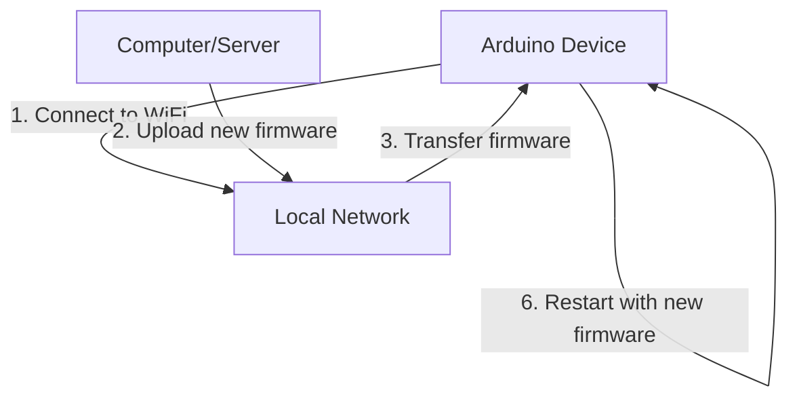

# Arduino Over-the-Air Updates

## Introduction

Imagine you've deployed an Arduino-based IoT device in a hard-to-reach location, perhaps inside a wall, on a rooftop, or at a remote monitoring station. Now you need to update its firmware with critical bug fixes or new features. Without Over-the-Air (OTA) update capability, you'd need physical access to connect your device to a computer via USB.

OTA updates solve this problem by allowing you to wirelessly send new firmware to your Arduino devices over WiFi, Bluetooth, or other wireless protocols. This capability transforms how you maintain and upgrade IoT deployments, making it possible to manage dozens or even hundreds of devices efficiently.

In this guide, we'll explore how to implement OTA updates for Arduino-compatible boards, focusing primarily on ESP8266 and ESP32 platforms which have built-in WiFi capabilities.

## Prerequisites

Before we begin, you'll need:

- An ESP8266 or ESP32 board (standard Arduino boards don't have built-in WiFi)
- Arduino IDE installed on your computer
- Basic knowledge of Arduino programming
- A WiFi network
- ESP8266 or ESP32 board support package installed in Arduino IDE

## How OTA Updates Work

Before diving into the implementation, let's understand the basic workflow of OTA updates:



The process involves:

1. **Connectivity**: Your Arduino device connects to a WiFi network
2. **Discovery**: Your computer locates the device on the network
3. **Transfer**: The new firmware is transferred to the device
4. **Verification**: The device verifies the integrity of the received firmware
5. **Installation**: The new firmware is written to flash memory
6. **Restart**: The device restarts with the new firmware

## Basic OTA Implementation for ESP8266/ESP32

Let's start with a basic example of OTA updates for ESP8266/ESP32 devices.

### Step 1: Initial Firmware with OTA Capability

The first firmware must be uploaded via USB. After that, subsequent updates can be performed wirelessly.

```cpp
#include <ESP8266WiFi.h>
#include <ESP8266mDNS.h>
#include <WiFiUdp.h>
#include <ArduinoOTA.h>

const char* ssid = "YOUR_WIFI_SSID";
const char* password = "YOUR_WIFI_PASSWORD";

void setup() {
  Serial.begin(115200);
  Serial.println("Booting");
  
  // Connect to WiFi
  WiFi.mode(WIFI_STA);
  WiFi.begin(ssid, password);
  
  while (WiFi.waitForConnectResult() != WL_CONNECTED) {
    Serial.println("Connection Failed! Rebooting...");
    delay(5000);
    ESP.restart();
  }

  // Port defaults to 8266
  // ArduinoOTA.setPort(8266);

  // Hostname defaults to esp8266-[ChipID]
  // ArduinoOTA.setHostname("myesp8266");

  // No authentication by default
  // ArduinoOTA.setPassword("admin");

  ArduinoOTA.onStart([]() {
    String type;
    if (ArduinoOTA.getCommand() == U_FLASH) {
      type = "sketch";
    } else { // U_FS
      type = "filesystem";
    }
    
    // NOTE: if updating FS this would be the place to unmount FS using FS.end()
    Serial.println("Start updating " + type);
  });
  
  ArduinoOTA.onEnd([]() {
    Serial.println("
End");
  });
  
  ArduinoOTA.onProgress([](unsigned int progress, unsigned int total) {
    Serial.printf("Progress: %u%%\r", (progress / (total / 100)));
  });
  
  ArduinoOTA.onError([](ota_error_t error) {
    Serial.printf("Error[%u]: ", error);
    if (error == OTA_AUTH_ERROR) {
      Serial.println("Auth Failed");
    } else if (error == OTA_BEGIN_ERROR) {
      Serial.println("Begin Failed");
    } else if (error == OTA_CONNECT_ERROR) {
      Serial.println("Connect Failed");
    } else if (error == OTA_RECEIVE_ERROR) {
      Serial.println("Receive Failed");
    } else if (error == OTA_END_ERROR) {
      Serial.println("End Failed");
    }
  });
  
  ArduinoOTA.begin();
  Serial.println("Ready");
  Serial.print("IP address: ");
  Serial.println(WiFi.localIP());
}

void loop() {
  ArduinoOTA.handle();
  
  // Your regular code goes here
  // ...
  
  delay(10);
}
```

### Step 2: Uploading Updates Over-the-Air

Once you've uploaded the initial firmware via USB, you can upload subsequent updates wirelessly:

1. Keep your device powered and connected to WiFi
2. In Arduino IDE, go to Tools > Port
3. You should see your ESP device listed as a network port
4. Select it and upload your sketch as you normally would

## Practical Considerations for OTA Updates

### Security Considerations

OTA updates open a potential security vulnerability. Consider these precautions:

```cpp
// Add password protection to your OTA updates
ArduinoOTA.setPassword("your-secure-password");

// Optionally, set the port (default is 8266 for ESP8266 and 3232 for ESP32)
ArduinoOTA.setPort(8266);
```

### Memory Management

OTA updates require enough free space to receive and store the new firmware. The ESP8266/ESP32 needs twice the space of your sketch since it stores both the running version and the incoming version.

```cpp
// Check available space before OTA
uint32_t maxSketchSpace = (ESP.getFreeSketchSpace() - 0x1000) & 0xFFFFF000;
if (newFirmwareSize > maxSketchSpace) {
  Serial.println("Not enough space for OTA");
  // Handle the error
}
```

### Persistent Configuration

When updating firmware, you might want to preserve certain settings:

```cpp
#include <EEPROM.h>

struct Settings {
  int sensorInterval;
  float calibrationValue;
  char deviceName[32];
  // Add other settings as needed
};

void saveSettings(Settings settings) {
  EEPROM.begin(sizeof(Settings));
  EEPROM.put(0, settings);
  EEPROM.commit();
  EEPROM.end();
}

Settings loadSettings() {
  Settings settings;
  EEPROM.begin(sizeof(Settings));
  EEPROM.get(0, settings);
  EEPROM.end();
  return settings;
}
```

## Real-World Example: Weather Station with OTA Updates

Let's create a more complete example of a weather station with OTA update capability:

```cpp
#include <ESP8266WiFi.h>
#include <ESP8266mDNS.h>
#include <WiFiUdp.h>
#include <ArduinoOTA.h>
#include <DHT.h>
#include <EEPROM.h>

#define DHTPIN 2      // Digital pin connected to the DHT sensor
#define DHTTYPE DHT22 // DHT 22 (AM2302)

const char* ssid = "YOUR_WIFI_SSID";
const char* password = "YOUR_WIFI_PASSWORD";
const int LED_PIN = 4;

// Version tracking for OTA updates
const char* firmwareVersion = "1.0.0";

// Structure to store settings in EEPROM
struct Settings {
  int readingInterval;  // in seconds
  char deviceName[32];  // device identifier
  bool ledEnabled;      // LED indicator setting
};

Settings deviceSettings;
DHT dht(DHTPIN, DHTTYPE);

unsigned long lastReading = 0;

void setup() {
  pinMode(LED_PIN, OUTPUT);
  digitalWrite(LED_PIN, LOW);
  
  Serial.begin(115200);
  Serial.println("
Booting Weather Station");
  Serial.print("Firmware version: ");
  Serial.println(firmwareVersion);
  
  // Load settings from EEPROM
  loadSettings();
  
  // Connect to WiFi
  WiFi.mode(WIFI_STA);
  WiFi.begin(ssid, password);
  
  while (WiFi.waitForConnectResult() != WL_CONNECTED) {
    Serial.println("Connection Failed! Rebooting...");
    delay(5000);
    ESP.restart();
  }

  // OTA Hostname based on settings
  ArduinoOTA.setHostname(deviceSettings.deviceName);
  
  // Password protection for OTA
  ArduinoOTA.setPassword("weather-station-secure");
  
  // OTA callbacks
  ArduinoOTA.onStart([]() {
    String type;
    if (ArduinoOTA.getCommand() == U_FLASH) {
      type = "sketch";
    } else { // U_FS
      type = "filesystem";
    }
    Serial.println("Start updating " + type);
    
    // Turn on LED to indicate update in progress
    digitalWrite(LED_PIN, HIGH);
  });
  
  ArduinoOTA.onEnd([]() {
    Serial.println("
Update complete");
    digitalWrite(LED_PIN, LOW);
  });
  
  ArduinoOTA.onProgress([](unsigned int progress, unsigned int total) {
    Serial.printf("Progress: %u%%\r", (progress / (total / 100)));
  });
  
  ArduinoOTA.onError([](ota_error_t error) {
    Serial.printf("Error[%u]: ", error);
    digitalWrite(LED_PIN, LOW);
    
    if (error == OTA_AUTH_ERROR) {
      Serial.println("Auth Failed");
    } else if (error == OTA_BEGIN_ERROR) {
      Serial.println("Begin Failed");
    } else if (error == OTA_CONNECT_ERROR) {
      Serial.println("Connect Failed");
    } else if (error == OTA_RECEIVE_ERROR) {
      Serial.println("Receive Failed");
    } else if (error == OTA_END_ERROR) {
      Serial.println("End Failed");
    }
  });
  
  ArduinoOTA.begin();
  
  // Initialize DHT sensor
  dht.begin();
  
  Serial.println("Ready");
  Serial.print("IP address: ");
  Serial.println(WiFi.localIP());
  Serial.print("Hostname: ");
  Serial.println(deviceSettings.deviceName);
}

void loop() {
  // Handle OTA updates
  ArduinoOTA.handle();
  
  // Regular weather station functionality
  unsigned long currentMillis = millis();
  if (currentMillis - lastReading >= deviceSettings.readingInterval * 1000) {
    lastReading = currentMillis;
    
    // Read sensor data
    float humidity = dht.readHumidity();
    float temperature = dht.readTemperature();
    
    // Blink LED if enabled in settings
    if (deviceSettings.ledEnabled) {
      digitalWrite(LED_PIN, HIGH);
      delay(100);
      digitalWrite(LED_PIN, LOW);
    }
    
    // Check if reading was successful
    if (isnan(humidity) || isnan(temperature)) {
      Serial.println("Failed to read from DHT sensor!");
    } else {
      Serial.print("Humidity: ");
      Serial.print(humidity);
      Serial.print("%, Temperature: ");
      Serial.print(temperature);
      Serial.println("°C");
      
      // Here you would normally send this data to a server
    }
  }
  
  // Small delay to prevent watchdog timer issues
  delay(10);
}

void loadSettings() {
  EEPROM.begin(sizeof(Settings));
  EEPROM.get(0, deviceSettings);
  EEPROM.end();
  
  // If EEPROM is uninitialized (first run), set defaults
  if (deviceSettings.readingInterval <= 0 || deviceSettings.readingInterval > 3600) {
    strcpy(deviceSettings.deviceName, "WeatherStation-");
    char chipId[8];
    sprintf(chipId, "%06X", ESP.getChipId());
    strcat(deviceSettings.deviceName, chipId);
    
    deviceSettings.readingInterval = 60; // Default to 60 seconds
    deviceSettings.ledEnabled = true;
    
    saveSettings();
  }
  
  Serial.print("Device Name: ");
  Serial.println(deviceSettings.deviceName);
  Serial.print("Reading Interval: ");
  Serial.print(deviceSettings.readingInterval);
  Serial.println(" seconds");
}

void saveSettings() {
  EEPROM.begin(sizeof(Settings));
  EEPROM.put(0, deviceSettings);
  EEPROM.commit();
  EEPROM.end();
}
```

## Advanced OTA Techniques

### Web-Based OTA Updates

For more complex projects, you might want to implement a web interface to manage your OTA updates:

```cpp
#include <ESP8266WiFi.h>
#include <ESP8266WebServer.h>
#include <ESP8266HTTPUpdateServer.h>

const char* ssid = "YOUR_WIFI_SSID";
const char* password = "YOUR_WIFI_PASSWORD";

ESP8266WebServer httpServer(80);
ESP8266HTTPUpdateServer httpUpdater;

void setup() {
  Serial.begin(115200);
  Serial.println("Booting");
  
  WiFi.mode(WIFI_STA);
  WiFi.begin(ssid, password);
  
  while (WiFi.waitForConnectResult() != WL_CONNECTED) {
    Serial.println("Connection Failed! Rebooting...");
    delay(5000);
    ESP.restart();
  }

  // Set up web server update portal
  httpUpdater.setup(&httpServer);
  httpServer.begin();

  Serial.println("Web update server started");
  Serial.print("Open http://");
  Serial.print(WiFi.localIP());
  Serial.println("/update in your browser");
}

void loop() {
  httpServer.handleClient();
  
  // Your regular code goes here
}
```

With this approach, you access the update page through a web browser at `http://[device-ip]/update`.

### Scheduled OTA Updates

For devices deployed in the field, you might want to implement a scheduled update check:

```cpp
#include <ESP8266WiFi.h>
#include <ESP8266HTTPClient.h>
#include <ESP8266httpUpdate.h>
#include <time.h>

const char* ssid = "YOUR_WIFI_SSID";
const char* password = "YOUR_WIFI_PASSWORD";
const char* updateServer = "http://your-update-server.com/firmware/";
const char* currentVersion = "1.0.0";

// Check for updates once per day
const long updateCheckInterval = 24 * 60 * 60 * 1000; // 24 hours in milliseconds
unsigned long lastUpdateCheck = 0;

void setup() {
  Serial.begin(115200);
  WiFi.begin(ssid, password);
  
  // Your regular setup code
  
  // Set time via NTP
  configTime(0, 0, "pool.ntp.org");
}

void loop() {
  // Your regular code
  
  unsigned long currentMillis = millis();
  
  // Check for updates on schedule
  if (currentMillis - lastUpdateCheck >= updateCheckInterval) {
    lastUpdateCheck = currentMillis;
    checkForUpdates();
  }
}

void checkForUpdates() {
  if (WiFi.status() == WL_CONNECTED) {
    Serial.println("Checking for firmware updates...");
    
    // Construct URL with device info for server-side logic
    String url = String(updateServer) + "?device=weatherstation&version=" + currentVersion;
    
    WiFiClient client;
    ESPhttpUpdate.setLedPin(LED_BUILTIN, LOW);
    
    t_httpUpdate_return ret = ESPhttpUpdate.update(client, url);
    
    switch (ret) {
      case HTTP_UPDATE_FAILED:
        Serial.printf("HTTP_UPDATE_FAILED Error (%d): %s
", 
                     ESPhttpUpdate.getLastError(),
                     ESPhttpUpdate.getLastErrorString().c_str());
        break;
        
      case HTTP_UPDATE_NO_UPDATES:
        Serial.println("No updates available");
        break;
        
      case HTTP_UPDATE_OK:
        Serial.println("Update successful");
        // The device will restart automatically after successful update
        break;
    }
  }
}
```

This code checks daily with your server to see if a new firmware version is available.

## Troubleshooting OTA Updates

When implementing OTA updates, you might encounter some common issues:

### Device Not Appearing in Port List

- Ensure your computer and device are on the same network
- Check that the device has successfully connected to WiFi (monitor serial output)
- Verify mDNS is working (might be blocked by some networks)
- Try restarting the Arduino IDE

### Update Fails

- Verify you have enough memory available on the device
- Check your code doesn't disable the WiFi connection
- Ensure your sketch size isn't too large
- Add debug code to print OTA error messages

### Security Issues

- Use password protection for OTA updates
- Consider using HTTPS for web-based updates
- Implement firmware signature verification

```cpp
// Example of verifying a simple checksum
uint32_t expectedChecksum = 0x12345678; // This would come from your server
uint32_t calculatedChecksum = calculateFirmwareChecksum(receivedFirmware);

if (expectedChecksum != calculatedChecksum) {
  Serial.println("Firmware verification failed!");
  return false;
}
```

## Summary

Over-the-Air updates are a powerful feature for IoT devices, enabling remote maintenance and feature deployment without physical access. In this guide, we've covered:

- The basics of OTA updates for Arduino IoT devices
- Implementation for ESP8266/ESP32 boards
- Security considerations and best practices
- Real-world examples and advanced techniques
- Troubleshooting common issues

With these tools and knowledge, you can deploy IoT devices with confidence, knowing you can update them remotely as needed.

## Additional Resources

- [Arduino OTA Documentation](https://arduino-esp8266.readthedocs.io/en/latest/ota_updates/readme.html)
- [ESP32 OTA Updates](https://docs.espressif.com/projects/esp-idf/en/latest/esp32/api-reference/system/ota.html)
- [ESP8266HTTPUpdateServer Library](https://github.com/esp8266/Arduino/tree/master/libraries/ESP8266HTTPUpdateServer)

## Exercises

1. **Basic OTA**: Implement a simple OTA-capable sketch and successfully update it over WiFi.
2. **Security Enhancement**: Modify the basic example to include secure password protection.
3. **Web Interface**: Create a custom web interface for updating your device that shows the current firmware version.
4. **Multi-device Management**: Develop a system to manage OTA updates for multiple ESP devices on your network.
5. **Fallback Mechanism**: Implement a failsafe system that reverts to the previous firmware version if the new one fails to boot properly.