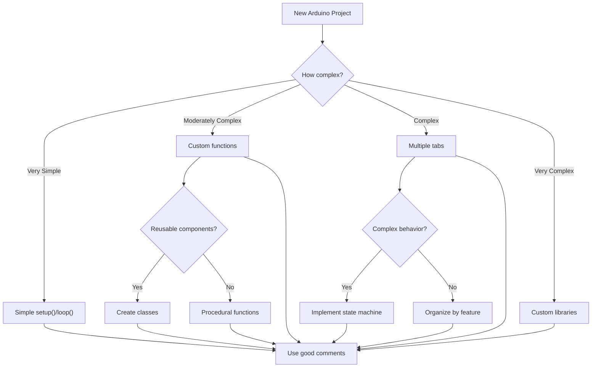

# Arduino Code Organization

As your Arduino projects grow in complexity, proper code organization becomes increasingly important. This guide will help you learn how to structure your Arduino sketches in a way that makes them easier to understand, debug, and extend.

## Introduction

When you first start with Arduino programming, it's common to write all your code within the `setup()` and `loop()` functions. While this works for simple projects, more complex applications benefit significantly from better organization techniques. Good code organization:

- Makes your code more readable
- Reduces duplication
- Makes debugging easier
- Allows code to be reused across projects
- Helps multiple people work on the same project

Let's explore various techniques to improve your Arduino code organization.

## Basic Structure of an Arduino Sketch

Before diving into advanced organization, let's revisit the basic structure of an Arduino sketch:

```cpp
// Global variables and constants
int ledPin = 13;

void setup() {
  // Initialization code
  pinMode(ledPin, OUTPUT);
}

void loop() {
  // Main program code that repeats
  digitalWrite(ledPin, HIGH);
  delay(1000);
  digitalWrite(ledPin, LOW);
  delay(1000);
}
```

This structure works well for simple projects, but as complexity increases, we need better organization.

## Using Comments Effectively

Good commenting is the simplest way to improve code organization:

```cpp
// ===== LED Control Variables =====
const int LED_PIN = 13;        // Pin connected to the built-in LED
const int BLINK_INTERVAL = 1000; // Blink interval in milliseconds

// ===== Timing Variables =====
unsigned long previousMillis = 0; // Stores the last time LED was updated

void setup() {
  // Configure pins
  pinMode(LED_PIN, OUTPUT);
  
  // Initialize serial communication
  Serial.begin(9600);
  Serial.println("Program started!");
}
```

Using consistent commenting patterns makes your code much easier to navigate and understand.

## Creating Custom Functions

Breaking your code into functions is one of the most effective ways to organize your Arduino sketches:

```cpp
const int LED_PIN = 13;
const int BLINK_INTERVAL = 1000;
unsigned long previousMillis = 0;
bool ledState = LOW;

void setup() {
  pinMode(LED_PIN, OUTPUT);
  Serial.begin(9600);
}

void loop() {
  blinkLedWithoutDelay();
  // Other code can run here without being blocked by delay()
}

void blinkLedWithoutDelay() {
  unsigned long currentMillis = millis();
  
  if (currentMillis - previousMillis >= BLINK_INTERVAL) {
    previousMillis = currentMillis;
    ledState = !ledState;
    digitalWrite(LED_PIN, ledState);
    
    printLedStatus();
  }
}

void printLedStatus() {
  Serial.print("LED is now ");
  Serial.println(ledState ? "ON" : "OFF");
}
```

By creating dedicated functions like `blinkLedWithoutDelay()` and `printLedStatus()`, we:

1. Make the `loop()` function much cleaner and easier to understand
2. Create reusable blocks of code
3. Make each function focused on a single task
4. Make debugging easier by isolating functionality

## Using Multiple Files with Tabs

For larger projects, Arduino IDE allows you to split your code across multiple tabs:

1. Click the dropdown arrow at the right end of the tabs
2. Select "New Tab"
3. Name your new tab (e.g., "LedControl.ino")

Here's how you might organize a project with multiple tabs:

**Main Sketch (YourProject.ino):**
```cpp
// YourProject.ino - Main program file
#include "LedControl.h"
#include "SerialCommunication.h"

void setup() {
  setupLeds();
  setupSerial();
}

void loop() {
  updateLeds();
  handleSerialCommands();
}
```

**LedControl Tab (LedControl.h):**
```cpp
// LedControl.h - Header file for LED control functions
#ifndef LED_CONTROL_H
#define LED_CONTROL_H

void setupLeds();
void updateLeds();
bool isLedOn();

#endif
```

**LedControl Tab (LedControl.ino):**
```cpp
// LedControl.ino - Implementation of LED control functions
#include "LedControl.h"

const int LED_PIN = 13;
const int BLINK_INTERVAL = 1000;
unsigned long previousMillis = 0;
bool ledState = LOW;

void setupLeds() {
  pinMode(LED_PIN, OUTPUT);
}

void updateLeds() {
  unsigned long currentMillis = millis();
  
  if (currentMillis - previousMillis >= BLINK_INTERVAL) {
    previousMillis = currentMillis;
    ledState = !ledState;
    digitalWrite(LED_PIN, ledState);
  }
}

bool isLedOn() {
  return ledState;
}
```

Using multiple files helps keep your code organized by logical components, making it easier to manage complex projects.

## Creating Custom Libraries

For functions you use across multiple projects, creating custom libraries is the best approach:

1. Create a new folder in your Arduino libraries directory (e.g., `MyLedLibrary`)
2. Create these files inside that folder:
   - `MyLedLibrary.h` (header file)
   - `MyLedLibrary.cpp` (implementation file)
   - `keywords.txt` (optional, for syntax highlighting)

**MyLedLibrary.h:**
```cpp
// MyLedLibrary.h
#ifndef MY_LED_LIBRARY_H
#define MY_LED_LIBRARY_H

#include <Arduino.h>

class LedController {
  private:
    int _pin;
    int _interval;
    unsigned long _previousMillis;
    bool _state;
    
  public:
    LedController(int pin, int interval);
    void begin();
    void update();
    bool getState();
    void setState(bool state);
};

#endif
```

**MyLedLibrary.cpp:**
```cpp
// MyLedLibrary.cpp
#include "MyLedLibrary.h"

LedController::LedController(int pin, int interval) {
  _pin = pin;
  _interval = interval;
  _previousMillis = 0;
  _state = LOW;
}

void LedController::begin() {
  pinMode(_pin, OUTPUT);
  digitalWrite(_pin, _state);
}

void LedController::update() {
  unsigned long currentMillis = millis();
  
  if (currentMillis - _previousMillis >= _interval) {
    _previousMillis = currentMillis;
    _state = !_state;
    digitalWrite(_pin, _state);
  }
}

bool LedController::getState() {
  return _state;
}

void LedController::setState(bool state) {
  _state = state;
  digitalWrite(_pin, _state);
}
```

**Using the library in your sketch:**
```cpp
#include <MyLedLibrary.h>

LedController led(13, 1000);  // LED on pin 13, blink every 1 second

void setup() {
  led.begin();
  Serial.begin(9600);
}

void loop() {
  led.update();
  
  // Other code can run here
}
```

Libraries provide maximum reusability and organization, allowing you to use the same code across multiple projects.

## Object-Oriented Programming (OOP) Approach

For more advanced users, implementing object-oriented programming techniques can greatly improve code organization:

```cpp
class Button {
  private:
    int _pin;
    bool _lastState;
    bool _currentState;
    unsigned long _debounceTime;
    unsigned long _lastDebounceTime;
    
  public:
    Button(int pin, unsigned long debounceTime = 50) {
      _pin = pin;
      _debounceTime = debounceTime;
      _lastState = HIGH;
      _currentState = HIGH;
      _lastDebounceTime = 0;
    }
    
    void begin() {
      pinMode(_pin, INPUT_PULLUP);
    }
    
    bool isPressed() {
      bool reading = digitalRead(_pin);
      
      if (reading != _lastState) {
        _lastDebounceTime = millis();
      }
      
      if ((millis() - _lastDebounceTime) > _debounceTime) {
        if (reading != _currentState) {
          _currentState = reading;
        }
      }
      
      _lastState = reading;
      return _currentState == LOW;
    }
};

// Using the Button class
Button buttonA(2, 50);  // Button connected to pin 2, 50ms debounce
Button buttonB(3, 50);  // Button connected to pin 3, 50ms debounce

void setup() {
  buttonA.begin();
  buttonB.begin();
  Serial.begin(9600);
}

void loop() {
  if (buttonA.isPressed()) {
    Serial.println("Button A is pressed!");
  }
  
  if (buttonB.isPressed()) {
    Serial.println("Button B is pressed!");
  }
}
```

OOP encapsulates related data and functions, making your code more modular and reusable.

## State Machines

State machines are an excellent organization pattern for complex behaviors:

```cpp
// Traffic light state machine
enum TrafficLightState {
  RED,
  GREEN,
  YELLOW
};

const int RED_PIN = 3;
const int YELLOW_PIN = 4;
const int GREEN_PIN = 5;

TrafficLightState currentState = RED;
unsigned long stateStartTime;

void setup() {
  pinMode(RED_PIN, OUTPUT);
  pinMode(YELLOW_PIN, OUTPUT);
  pinMode(GREEN_PIN, OUTPUT);
  
  // Initialize all lights off
  digitalWrite(RED_PIN, LOW);
  digitalWrite(YELLOW_PIN, LOW);
  digitalWrite(GREEN_PIN, LOW);
  
  // Start with red light on
  digitalWrite(RED_PIN, HIGH);
  stateStartTime = millis();
}

void loop() {
  // State machine implementation
  switch (currentState) {
    case RED:
      // If 3 seconds have passed, change to GREEN
      if (millis() - stateStartTime >= 3000) {
        // Turn off red, turn on green
        digitalWrite(RED_PIN, LOW);
        digitalWrite(GREEN_PIN, HIGH);
        
        // Update state
        currentState = GREEN;
        stateStartTime = millis();
      }
      break;
      
    case GREEN:
      // If 3 seconds have passed, change to YELLOW
      if (millis() - stateStartTime >= 3000) {
        // Turn off green, turn on yellow
        digitalWrite(GREEN_PIN, LOW);
        digitalWrite(YELLOW_PIN, HIGH);
        
        // Update state
        currentState = YELLOW;
        stateStartTime = millis();
      }
      break;
      
    case YELLOW:
      // If 1 second has passed, change to RED
      if (millis() - stateStartTime >= 1000) {
        // Turn off yellow, turn on red
        digitalWrite(YELLOW_PIN, LOW);
        digitalWrite(RED_PIN, HIGH);
        
        // Update state
        currentState = RED;
        stateStartTime = millis();
      }
      break;
  }
}
```

State machines make complex sequences of operations much easier to manage and understand.

## Code Organization Flowchart

Here's a flowchart showing how to decide which organization method to use based on project complexity:



## Practical Example: Weather Station

Let's look at a practical example of a simple weather station using proper code organization:

```cpp
// ===== Libraries =====
#include <DHT.h>
#include <Wire.h>
#include <LiquidCrystal_I2C.h>

// ===== Constants =====
const int DHT_PIN = 7;
const int DHT_TYPE = DHT22;
const unsigned long SENSOR_READ_INTERVAL = 2000;  // Read every 2 seconds
const unsigned long DISPLAY_UPDATE_INTERVAL = 1000;  // Update every 1 second

// ===== Objects =====
DHT dhtSensor(DHT_PIN, DHT_TYPE);
LiquidCrystal_I2C lcd(0x27, 16, 2);  // LCD at address 0x27, 16x2 display

// ===== Global Variables =====
float temperature = 0.0;
float humidity = 0.0;
unsigned long lastSensorReadTime = 0;
unsigned long lastDisplayUpdateTime = 0;
bool displayMode = false;  // false = temperature, true = humidity

// ===== Setup =====
void setup() {
  initSensors();
  initDisplay();
  Serial.begin(9600);
  Serial.println("Weather Station Starting...");
}

// ===== Main Loop =====
void loop() {
  readSensorsIfNeeded();
  updateDisplayIfNeeded();
}

// ===== Initialization Functions =====
void initSensors() {
  dhtSensor.begin();
}

void initDisplay() {
  lcd.init();
  lcd.backlight();
  lcd.setCursor(0, 0);
  lcd.print("Weather Station");
  lcd.setCursor(0, 1);
  lcd.print("Initializing...");
  delay(1000);
}

// ===== Sensor Functions =====
void readSensorsIfNeeded() {
  unsigned long currentTime = millis();
  
  if (currentTime - lastSensorReadTime >= SENSOR_READ_INTERVAL) {
    lastSensorReadTime = currentTime;
    
    // Read temperature and humidity
    humidity = dhtSensor.readHumidity();
    temperature = dhtSensor.readTemperature();
    
    // Check if any reads failed
    if (isnan(humidity) || isnan(temperature)) {
      Serial.println("Failed to read from DHT sensor!");
      return;
    }
    
    // Log to serial
    logSensorData();
  }
}

void logSensorData() {
  Serial.print("Humidity: ");
  Serial.print(humidity);
  Serial.print("%, Temperature: ");
  Serial.print(temperature);
  Serial.println("°C");
}

// ===== Display Functions =====
void updateDisplayIfNeeded() {
  unsigned long currentTime = millis();
  
  if (currentTime - lastDisplayUpdateTime >= DISPLAY_UPDATE_INTERVAL) {
    lastDisplayUpdateTime = currentTime;
    
    // Toggle display mode
    displayMode = !displayMode;
    
    // Update display
    lcd.clear();
    
    if (displayMode) {
      displayTemperature();
    } else {
      displayHumidity();
    }
  }
}

void displayTemperature() {
  lcd.setCursor(0, 0);
  lcd.print("Temperature:");
  lcd.setCursor(0, 1);
  lcd.print(temperature);
  lcd.print(" C");
}

void displayHumidity() {
  lcd.setCursor(0, 0);
  lcd.print("Humidity:");
  lcd.setCursor(0, 1);
  lcd.print(humidity);
  lcd.print(" %");
}
```

This example demonstrates several principles of good code organization:
- Grouping related variables and constants
- Breaking functionality into purpose-specific functions
- Using descriptive function and variable names
- Implementing non-blocking code with millis()
- Separating initialization from main functionality

## Summary

Proper code organization is essential for creating maintainable and scalable Arduino projects. As your projects grow in complexity, consider using these techniques to keep your code clean and understandable:

1. **Effective commenting** - Use clear comments to explain your code's purpose and behavior
2. **Custom functions** - Break your code into smaller, focused functions
3. **Multiple tabs** - Separate code into logical modules using Arduino IDE's tabs feature
4. **Custom libraries** - Create reusable libraries for code used across multiple projects
5. **Object-oriented programming** - Use classes to encapsulate related data and functionality
6. **State machines** - Implement state machines for complex sequential behaviors

By applying these techniques, you'll create code that's easier to read, debug, and extend, making your Arduino journey more productive and enjoyable.

## Exercises

1. Take a simple Arduino sketch that blinks multiple LEDs and refactor it to use custom functions.
2. Create a simple library for a sensor you frequently use (e.g., ultrasonic sensor, temperature sensor).
3. Implement a state machine for a traffic light system with pedestrian crossing button.
4. Take an existing complex project and reorganize it using multiple tabs.
5. Convert a procedural implementation of a component (e.g., button handling) to an object-oriented approach.

## Additional Resources

- [Arduino - Libraries](https://www.arduino.cc/en/Hacking/Libraries)
- [Arduino - Writing a Library for Arduino](https://docs.arduino.cc/hacking/software/LibraryTutorial)
- [Using millis() Instead of delay()](https://www.arduino.cc/reference/en/language/functions/time/millis/)
- [State Machine Basics](https://StatePattern.com)