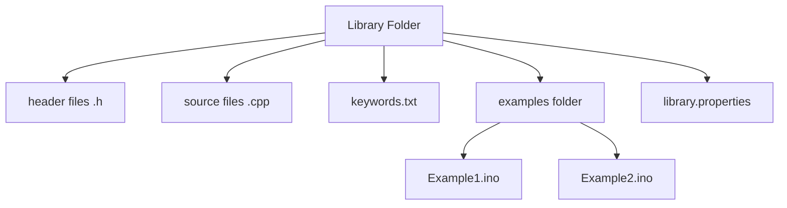

# Arduino Custom Libraries

## Introduction

When working on Arduino projects, you'll often find yourself reusing the same code across multiple sketches. Instead of copying and pasting code, Arduino allows you to create custom libraries to organize and reuse your code efficiently. Custom libraries are collections of code that provide specific functionality and can be easily included in any Arduino project.

In this guide, we'll explore how to create, organize, and use custom libraries in your Arduino projects. By the end, you'll understand how to structure your code better and improve reusability.

## Why Use Custom Libraries?

Before diving into the how-to, let's understand why custom libraries are valuable:

- **Code Reusability**: Write once, use anywhere
- **Better Organization**: Separate functionality into logical components
- **Simplified Maintenance**: Fix bugs in one place
- **Cleaner Sketches**: Keep your main sketch focused and concise
- **Collaboration**: Share your libraries with the Arduino community

## Library Structure

An Arduino library typically follows this structure:



Each component serves a specific purpose:
- **Header files (.h)**: Declare the library's classes, functions, and variables
- **Source files (.cpp)**: Contain the implementation of functions declared in the header
- **keywords.txt**: Define syntax highlighting for the library's functions and constants
- **examples folder**: Contains example sketches showing how to use the library
- **library.properties**: Metadata about the library for the Library Manager

## Creating Your First Library

Let's create a simple LED control library to demonstrate the process. We'll call it `SimpleLED`.

### Step 1: Create the Library Directory Structure

First, create the following directory structure in your Arduino libraries folder (usually found at `Documents/Arduino/libraries/`):

```
SimpleLED/
├── SimpleLED.h
├── SimpleLED.cpp
├── keywords.txt
├── library.properties
└── examples/
    └── Blink/
        └── Blink.ino
```

### Step 2: Create the Header File (SimpleLED.h)

The header file declares all the functions and constants that will be available to users of your library.

```cpp
#ifndef SIMPLE_LED_H
#define SIMPLE_LED_H

#include <Arduino.h>

class SimpleLED {
  public:
    // Constructor
    SimpleLED(int pin);
    
    // Methods
    void begin();
    void turnOn();
    void turnOff();
    void toggle();
    void blink(int onTime, int offTime, int cycles);
    
  private:
    int _pin;
    bool _state;
};

#endif
```

### Step 3: Create the Source File (SimpleLED.cpp)

The source file contains the implementation of the functions declared in the header.

```cpp
#include "SimpleLED.h"

// Constructor
SimpleLED::SimpleLED(int pin) {
  _pin = pin;
  _state = false;
}

// Initialize the LED pin
void SimpleLED::begin() {
  pinMode(_pin, OUTPUT);
  turnOff();
}

// Turn the LED on
void SimpleLED::turnOn() {
  digitalWrite(_pin, HIGH);
  _state = true;
}

// Turn the LED off
void SimpleLED::turnOff() {
  digitalWrite(_pin, LOW);
  _state = false;
}

// Toggle the LED state
void SimpleLED::toggle() {
  if (_state) {
    turnOff();
  } else {
    turnOn();
  }
}

// Blink the LED
void SimpleLED::blink(int onTime, int offTime, int cycles) {
  for (int i = 0; i < cycles; i++) {
    turnOn();
    delay(onTime);
    turnOff();
    delay(offTime);
  }
}
```

### Step 4: Create the keywords.txt File

The keywords.txt file helps the Arduino IDE provide syntax highlighting for your library.

```
# Syntax Coloring Map for SimpleLED library

# Classes and Objects (KEYWORD1)
SimpleLED	KEYWORD1

# Methods and Functions (KEYWORD2)
begin	KEYWORD2
turnOn	KEYWORD2
turnOff	KEYWORD2
toggle	KEYWORD2
blink	KEYWORD2

# Constants (LITERAL1)
```

### Step 5: Create the library.properties File

This file contains metadata about your library for the Arduino Library Manager.

```
name=SimpleLED
version=1.0.0
author=Your Name <your.email@example.com>
maintainer=Your Name <your.email@example.com>
sentence=A simple library for controlling LEDs on Arduino.
paragraph=This library provides an easy way to control LEDs, including turning them on/off, toggling, and blinking with timing control.
category=Device Control
url=https://github.com/yourusername/SimpleLED
architectures=*
includes=SimpleLED.h
```

### Step 6: Create an Example Sketch

Let's create an example that demonstrates how to use our library:

```cpp
#include <SimpleLED.h>

// Create an instance of SimpleLED on pin 13
SimpleLED led(13);

void setup() {
  // Initialize the LED
  led.begin();
  
  // Serial for debugging
  Serial.begin(9600);
  Serial.println("SimpleLED Library Example");
}

void loop() {
  Serial.println("LED on");
  led.turnOn();
  delay(1000);
  
  Serial.println("LED off");
  led.turnOff();
  delay(1000);
  
  Serial.println("LED toggle (on)");
  led.toggle();
  delay(1000);
  
  Serial.println("LED toggle (off)");
  led.toggle();
  delay(1000);
  
  Serial.println("LED blink 5 times");
  led.blink(200, 200, 5);
  delay(1000);
}
```

## Using Your Custom Library

Now that you've created your library, let's see how to use it in a new sketch:

1. If you created the library in the correct location (`Documents/Arduino/libraries/`), it should automatically be available in the Arduino IDE.

2. To use the library, go to `Sketch > Include Library` and select your library from the list, or add an include statement manually:

```cpp
#include <SimpleLED.h>
```

3. Then you can use the library's functionality in your sketch:

```cpp
// Create an instance of SimpleLED
SimpleLED led(13);

void setup() {
  // Initialize the LED
  led.begin();
}

void loop() {
  // Use library functions
  led.blink(500, 500, 3);
  delay(2000);
}
```

## Creating More Complex Libraries

For more complex libraries, you might want to include multiple files or use preprocessor directives to provide conditional functionality. Here are some advanced techniques:

### Multiple Classes in One Library

You can include multiple related classes in a single library:

```cpp
// LEDControl.h
#ifndef LED_CONTROL_H
#define LED_CONTROL_H

#include <Arduino.h>

class SimpleLED {
  // SimpleLED class implementation
};

class RGBLed {
  public:
    RGBLed(int redPin, int greenPin, int bluePin);
    void begin();
    void setColor(int red, int green, int blue);
    // other methods
  
  private:
    int _redPin, _greenPin, _bluePin;
};

#endif
```

### Using Conditional Compilation

You can use preprocessor directives to make your library compatible with different Arduino boards:

```cpp
#if defined(ARDUINO_AVR_UNO)
  // Code specific to Arduino Uno
#elif defined(ARDUINO_ESP8266_NODEMCU)
  // Code specific to NodeMCU
#else
  // Default code
#endif
```

## Sharing Your Library

Once your library is tested and working, you can share it with the Arduino community:

1. Create a GitHub repository for your library
2. Include comprehensive documentation in a README.md file
3. Add more examples showing different use cases
4. Submit it to the Arduino Library Manager by following the [contribution guidelines](https://github.com/arduino/Arduino/wiki/Library-Manager-FAQ)

## Real-World Applications

Let's look at some practical applications of custom libraries:

### Sensor Reading Library

Imagine you're working with multiple temperature sensors. You could create a library that handles the communication, calibration, and data processing:

```cpp
// TemperatureSensor.h
class TemperatureSensor {
  public:
    TemperatureSensor(int pin);
    void begin();
    float readCelsius();
    float readFahrenheit();
    void calibrate(float knownTemp);
  
  private:
    int _pin;
    float _calibrationOffset;
};
```

### Motor Control Library

For robotics projects, a motor control library could simplify movement commands:

```cpp
// RobotMotors.h
class RobotMotors {
  public:
    RobotMotors(int leftForward, int leftBackward, int rightForward, int rightBackward);
    void begin();
    void forward(int speed);
    void backward(int speed);
    void turnLeft(int speed);
    void turnRight(int speed);
    void stop();
  
  private:
    int _leftForward, _leftBackward, _rightForward, _rightBackward;
};
```

## Debugging Libraries

When developing libraries, debugging is crucial. Here are some tips:

1. **Serial Output**: Include optional debug output in your library:

```cpp
#ifdef DEBUG_LIBRARY
  Serial.println("Debug message");
#endif
```

2. **Error Handling**: Provide meaningful error messages and return codes:

```cpp
bool SimpleLED::setPattern(int patternID) {
  if (patternID < 0 || patternID > MAX_PATTERNS) {
    return false;  // Invalid pattern
  }
  // Set the pattern
  return true;  // Success
}
```

3. **Version Information**: Include version methods to help with troubleshooting:

```cpp
String SimpleLED::getVersion() {
  return "1.0.0";
}
```

## Summary

Creating custom libraries for Arduino is a powerful way to organize your code, improve reusability, and simplify complex projects. By following the structure and practices outlined in this guide, you can develop libraries that are both useful for your projects and potentially valuable to the broader Arduino community.

Custom libraries help you transition from writing simple sketches to developing more sophisticated Arduino applications with better structure and maintainability.

## Exercises

To practice what you've learned, try these exercises:

1. Create a basic library for a button that handles debouncing and detects different press types (short press, long press, double press)
2. Extend the SimpleLED library to support PWM brightness control
3. Develop a library for a specific sensor you use frequently
4. Create a utility library with useful functions for string manipulation or math operations specific to your projects

## Additional Resources

- [Arduino's Official Library Guide](https://www.arduino.cc/en/Hacking/LibraryTutorial)
- [Writing a Library for Arduino](https://www.arduino.cc/en/guide/libraries)
- [Arduino Library Manager FAQ](https://github.com/arduino/Arduino/wiki/Library-Manager-FAQ)
- [PlatformIO Library Management](https://platformio.org/lib) (an alternative to Arduino IDE with advanced library management)