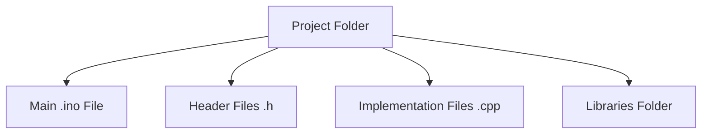

# Arduino Multiple Files

When your Arduino projects grow in size and complexity, keeping all your code in a single `.ino` file can become unwieldy and difficult to maintain. Breaking your code into multiple files is a powerful technique that improves readability, reusability, and organization. This guide will show you how to structure Arduino projects across multiple files.

## Why Use Multiple Files?

Before diving into implementation, let's understand the benefits:

- **Improved readability**: Smaller files focused on specific functionality are easier to read and understand
- **Better organization**: Logical separation of code based on functionality
- **Code reusability**: Create libraries that can be used across multiple projects
- **Collaboration**: Easier for multiple developers to work on different parts of the project
- **Maintainability**: Simpler to debug and update specific components

## Arduino Project Structure Basics

A multi-file Arduino project typically consists of:



Let's explore each component:

1. **Main .ino file** - Contains `setup()` and `loop()` functions and ties everything together
2. **Header files (.h)** - Declare functions, classes, and variables
3. **Implementation files (.cpp)** - Contain the actual implementation of functions/classes
4. **Libraries** - External code packages that can be included

## Creating Your First Multi-File Project

Let's create a simple LED control project that uses multiple files:

### Step 1: Create the Project Structure

```
LEDProject/
├── LEDProject.ino
├── LEDControl.h
└── LEDControl.cpp
```

### Step 2: Define the Header File (LEDControl.h)

```cpp
#ifndef LED_CONTROL_H
#define LED_CONTROL_H

// Define the class for LED control
class LEDControl {
  private:
    int ledPin;
    bool state;
    unsigned long lastToggleTime;
    unsigned long toggleInterval;
  
  public:
    // Constructor
    LEDControl(int pin, unsigned long interval);
    
    // Methods
    void initialize();
    void toggle();
    void update();
    void setInterval(unsigned long interval);
};

#endif
```

### Step 3: Implement the Class (LEDControl.cpp)

```cpp
#include "LEDControl.h"
#include <Arduino.h>

// Constructor implementation
LEDControl::LEDControl(int pin, unsigned long interval) {
  ledPin = pin;
  toggleInterval = interval;
  state = false;
  lastToggleTime = 0;
}

// Initialize the LED pin
void LEDControl::initialize() {
  pinMode(ledPin, OUTPUT);
  digitalWrite(ledPin, LOW);
}

// Toggle LED state
void LEDControl::toggle() {
  state = !state;
  digitalWrite(ledPin, state ? HIGH : LOW);
}

// Update function to be called in the loop
void LEDControl::update() {
  unsigned long currentTime = millis();
  
  if (currentTime - lastToggleTime >= toggleInterval) {
    toggle();
    lastToggleTime = currentTime;
  }
}

// Change the toggle interval
void LEDControl::setInterval(unsigned long interval) {
  toggleInterval = interval;
}
```

### Step 4: Create the Main Sketch (LEDProject.ino)

```cpp
#include "LEDControl.h"

// Create two LED controllers
LEDControl led1(13, 1000);  // Built-in LED, 1 second interval
LEDControl led2(12, 500);   // Another LED on pin 12, 0.5 second interval

void setup() {
  Serial.begin(9600);
  Serial.println("LED Controller Starting...");
  
  // Initialize both LEDs
  led1.initialize();
  led2.initialize();
}

void loop() {
  // Update both LEDs
  led1.update();
  led2.update();
}
```

## Understanding How Multiple Files Work in Arduino

When you compile an Arduino sketch with multiple files:

1. The Arduino IDE combines all the files into a single C++ program
2. The preprocessor handles all `#include` directives, essentially copying the content of included files
3. The compiler then compiles this combined code

### Important Rules

- Header files (.h) must include **guards** to prevent multiple inclusion:
  ```cpp
  #ifndef FILENAME_H
  #define FILENAME_H
  // Header content here
  #endif
  ```
- Implementation files (.cpp) must include their corresponding header:
  ```cpp
  #include "MyHeader.h"
  ```
- The main .ino file must include any headers it uses:
  ```cpp
  #include "MyHeader.h"
  ```

## Creating a More Complex Example: Temperature Monitor

Let's build a more practical example - a temperature monitoring system with:
- Temperature sensor reading
- Display output
- Alarm functionality

### Project Structure

```
TempMonitor/
├── TempMonitor.ino
├── SensorReader.h
├── SensorReader.cpp
├── DisplayControl.h
├── DisplayControl.cpp
├── AlarmSystem.h
└── AlarmSystem.cpp
```

### SensorReader.h

```cpp
#ifndef SENSOR_READER_H
#define SENSOR_READER_H

class SensorReader {
  private:
    int sensorPin;
    float lastTemperature;
    unsigned long readInterval;
    unsigned long lastReadTime;
    
  public:
    SensorReader(int pin, unsigned long interval);
    void initialize();
    void update();
    float getTemperature();
};

#endif
```

### SensorReader.cpp

```cpp
#include "SensorReader.h"
#include <Arduino.h>

SensorReader::SensorReader(int pin, unsigned long interval) {
  sensorPin = pin;
  readInterval = interval;
  lastTemperature = 0.0;
  lastReadTime = 0;
}

void SensorReader::initialize() {
  pinMode(sensorPin, INPUT);
}

void SensorReader::update() {
  unsigned long currentTime = millis();
  
  if (currentTime - lastReadTime >= readInterval) {
    // Read analog value
    int sensorValue = analogRead(sensorPin);
    
    // Convert to voltage
    float voltage = sensorValue * (5.0 / 1023.0);
    
    // Convert to temperature (assuming TMP36 sensor)
    lastTemperature = (voltage - 0.5) * 100;
    
    lastReadTime = currentTime;
  }
}

float SensorReader::getTemperature() {
  return lastTemperature;
}
```

### DisplayControl.h

```cpp
#ifndef DISPLAY_CONTROL_H
#define DISPLAY_CONTROL_H

class DisplayControl {
  private:
    unsigned long updateInterval;
    unsigned long lastUpdateTime;
    
  public:
    DisplayControl(unsigned long interval);
    void initialize();
    void update(float temperature);
};

#endif
```

### DisplayControl.cpp

```cpp
#include "DisplayControl.h"
#include <Arduino.h>

DisplayControl::DisplayControl(unsigned long interval) {
  updateInterval = interval;
  lastUpdateTime = 0;
}

void DisplayControl::initialize() {
  Serial.begin(9600);
  Serial.println("Temperature Monitor Starting...");
}

void DisplayControl::update(float temperature) {
  unsigned long currentTime = millis();
  
  if (currentTime - lastUpdateTime >= updateInterval) {
    Serial.print("Current temperature: ");
    Serial.print(temperature);
    Serial.println(" °C");
    
    lastUpdateTime = currentTime;
  }
}
```

### AlarmSystem.h

```cpp
#ifndef ALARM_SYSTEM_H
#define ALARM_SYSTEM_H

class AlarmSystem {
  private:
    int buzzerPin;
    int ledPin;
    float threshold;
    bool alarmState;
    
  public:
    AlarmSystem(int buzzerPin, int ledPin, float threshold);
    void initialize();
    void check(float temperature);
    void setThreshold(float newThreshold);
};

#endif
```

### AlarmSystem.cpp

```cpp
#include "AlarmSystem.h"
#include <Arduino.h>

AlarmSystem::AlarmSystem(int bPin, int lPin, float thresh) {
  buzzerPin = bPin;
  ledPin = lPin;
  threshold = thresh;
  alarmState = false;
}

void AlarmSystem::initialize() {
  pinMode(buzzerPin, OUTPUT);
  pinMode(ledPin, OUTPUT);
  digitalWrite(buzzerPin, LOW);
  digitalWrite(ledPin, LOW);
}

void AlarmSystem::check(float temperature) {
  if (temperature > threshold && !alarmState) {
    // Temperature exceeded threshold, activate alarm
    digitalWrite(buzzerPin, HIGH);
    digitalWrite(ledPin, HIGH);
    alarmState = true;
    Serial.println("ALARM: Temperature threshold exceeded!");
  } 
  else if (temperature <= threshold && alarmState) {
    // Temperature back to normal, deactivate alarm
    digitalWrite(buzzerPin, LOW);
    digitalWrite(ledPin, LOW);
    alarmState = false;
    Serial.println("Temperature back to normal range.");
  }
}

void AlarmSystem::setThreshold(float newThreshold) {
  threshold = newThreshold;
  Serial.print("Alarm threshold set to: ");
  Serial.print(threshold);
  Serial.println(" °C");
}
```

### TempMonitor.ino (Main File)

```cpp
#include "SensorReader.h"
#include "DisplayControl.h"
#include "AlarmSystem.h"

// Create objects
SensorReader sensor(A0, 1000);      // Read from A0 every 1 second
DisplayControl display(2000);       // Update display every 2 seconds
AlarmSystem alarm(9, 13, 30.0);     // Buzzer on pin 9, LED on pin 13, threshold at 30°C

void setup() {
  // Initialize all components
  sensor.initialize();
  display.initialize();
  alarm.initialize();
}

void loop() {
  // Update sensor readings
  sensor.update();
  
  // Get current temperature
  float currentTemp = sensor.getTemperature();
  
  // Update display
  display.update(currentTemp);
  
  // Check alarm conditions
  alarm.check(currentTemp);
  
  // Small delay to prevent overwhelming the processor
  delay(10);
}
```

## Best Practices for Arduino Multi-File Projects

1. **Meaningful naming**: Give your files clear, descriptive names
2. **Single responsibility**: Each class should have a single, well-defined purpose
3. **Proper documentation**: Comment your code thoroughly
4. **Consistent style**: Follow a consistent coding style throughout your project
5. **Include guards**: Always use include guards in header files
6. **Minimize dependencies**: Reduce dependencies between classes when possible
7. **Organize by functionality**: Group related classes in the same directory

## Advanced Techniques

### Creating Your Own Library

When you've created a set of files that you want to reuse across multiple projects, consider making them into a library:

1. Create a folder with the library name inside your Arduino libraries folder
2. Add a header file with the same name as the library folder
3. Add implementation files (.cpp) for your library functions
4. Optionally, add examples in an "examples" subfolder
5. Create a keywords.txt file for syntax highlighting
6. Add a README.md file with documentation

Example library structure:

```
libraries/
└── LEDControl/
    ├── LEDControl.h
    ├── LEDControl.cpp
    ├── keywords.txt
    ├── README.md
    └── examples/
        ├── BasicBlink/
        │   └── BasicBlink.ino
        └── MultipleLEDs/
            └── MultipleLEDs.ino
```

### Using Namespaces

For more complex projects, consider using namespaces to organize your code:

```cpp
// In header file
namespace SensorUtils {
  float convertToTemperature(int rawValue);
  float calibrate(float value);
}

// In implementation file
namespace SensorUtils {
  float convertToTemperature(int rawValue) {
    // Implementation
  }
  
  float calibrate(float value) {
    // Implementation
  }
}

// In main file
float temp = SensorUtils::convertToTemperature(sensorValue);
```

## Troubleshooting Common Issues

### "No such file or directory" Errors

This occurs when the compiler can't find an included file. Make sure:
- The file exists in the correct location
- The filename is spelled correctly and matches the case
- You're using the correct include syntax (quotes for local files, angle brackets for system files)

### Undefined Reference Errors

This happens when functions are declared but not defined:
- Check that all functions declared in .h files are implemented in .cpp files
- Make sure the function signatures match exactly
- Verify that all .cpp files are being included in your build

### Multiple Definition Errors

This occurs when something is defined more than once:
- Make sure you're using include guards in all header files
- Avoid defining variables in header files without using `extern`
- Check for duplicate function implementations

## Summary

Using multiple files in Arduino projects allows you to:
- Create more organized, maintainable code
- Reuse code across different projects
- Collaborate more effectively with other developers
- Build more complex applications

By separating your code into header files (.h) and implementation files (.cpp), you create a cleaner structure that follows good software engineering practices. The main sketch (.ino) then ties everything together, creating a cohesive application.

## Exercises

1. Convert an existing single-file Arduino project to use multiple files
2. Create a simple library for a sensor you use frequently
3. Build a multi-file project that combines at least three different functionalities (input, processing, output)
4. Modify the temperature monitoring example to add data logging to an SD card in a separate module
5. Create a project that uses multiple instances of the same class to control different hardware components

## Additional Resources

- [Arduino - Build Process](https://arduino.github.io/arduino-cli/0.31/sketch-build-process/)
- [C++ Header Files](https://www.learncpp.com/cpp-tutorial/header-files/)
- [Creating Arduino Libraries](https://www.arduino.cc/en/Hacking/LibraryTutorial)
- [Object-Oriented Programming with Arduino](https://www.arduino.cc/en/Guide/ObjectOrientedProgramming)

Remember that organizing your code effectively is a skill that develops with practice. Start with simple multi-file projects and gradually work your way up to more complex architectures.