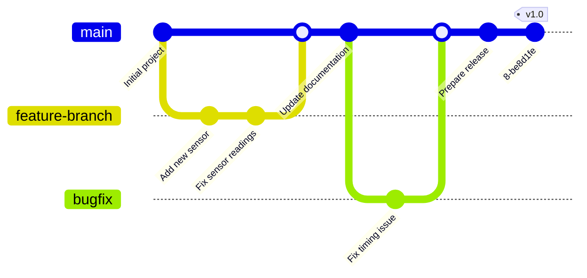

# Arduino Version Control

## Introduction

When working on Arduino projects, especially as they grow in complexity or when collaborating with others, keeping track of changes becomes crucial. Version control systems provide a structured way to manage these changes, allowing you to roll back to previous versions, experiment with new features without breaking existing functionality, and collaborate efficiently with team members.

In this guide, we'll explore how to implement version control for Arduino projects, focusing primarily on Git, the most widely used version control system in software development.

## Why Use Version Control for Arduino Projects?

Arduino projects often evolve over time - you might add new features, optimize code, or fix bugs. Without version control:

- It's difficult to track what changes were made and when
- Rolling back to a previously working version becomes challenging
- Collaborating with others can lead to confusion and code conflicts
- Backing up different versions manually becomes cumbersome

Version control solves these problems by providing:

1. A complete history of your project
2. The ability to revert to previous states
3. A structured way to collaborate
4. Branch-based development for experimenting without affecting the main code

## Getting Started with Git for Arduino

### Installing Git

Before using Git with Arduino, you need to install Git on your computer:

- **Windows**: Download and install Git from [git-scm.com](https://git-scm.com)
- **macOS**: Install using Homebrew with `brew install git` or download the installer
- **Linux**: Use your package manager, e.g., `sudo apt-get install git` for Ubuntu

### Initializing a Git Repository for Your Arduino Project

1. Navigate to your Arduino project folder in the terminal/command prompt
2. Initialize the repository:

```bash
cd ~/Arduino/MyProject
git init
```

### Basic Git Configuration

Configure your identity in Git:

```bash
git config --global user.name "Your Name"
git config --global user.email "your.email@example.com"
```

## Creating a .gitignore File for Arduino Projects

When using version control with Arduino, certain files should be excluded. Create a `.gitignore` file in your project root with the following content:

```
# Arduino build files
build/
*.hex
*.elf
*.bin

# Arduino IDE temporary files
.build/
.vscode/
.DS_Store

# Platform-specific
desktop.ini
Thumbs.db

# Personal configuration
arduino_secrets.h
credentials.h
```

This prevents temporary build files and sensitive information from being tracked.

## Basic Git Workflow for Arduino Projects

### 1. Tracking Files

After initializing your repository, add your files and make an initial commit:

```bash
git add .
git commit -m "Initial commit of Arduino project"
```

### 2. Making Changes and Committing

After modifying your Arduino code:

```bash
git add sketch.ino
git commit -m "Add temperature sensor functionality"
```

### 3. Viewing Project History

To see the history of changes:

```bash
git log
```

For a more concise view:

```bash
git log --oneline
```

## Branching for Feature Development

Branching allows you to work on new features without affecting your main code:

```bash
# Create a new branch for a feature
git branch add-display-support

# Switch to the new branch
git checkout add-display-support

# Or do both at once
git checkout -b add-display-support
```

After developing and testing your feature:

```bash
# Switch back to main branch
git checkout main

# Merge your feature
git merge add-display-support
```

## Practical Example: Version Control for an Arduino Weather Station

Let's walk through an example of how to use Git with an evolving Arduino project.

### Initial Project Setup

First, create your basic Arduino weather station sketch:

```cpp
// WeatherStation.ino - Version 1.0
#include <DHT.h>

#define DHTPIN 2
#define DHTTYPE DHT22

DHT dht(DHTPIN, DHTTYPE);

void setup() {
  Serial.begin(9600);
  dht.begin();
  Serial.println("Weather Station - v1.0");
}

void loop() {
  delay(2000); // Wait between measurements
  
  float humidity = dht.readHumidity();
  float temperature = dht.readTemperature();
  
  if (isnan(humidity) || isnan(temperature)) {
    Serial.println("Failed to read from DHT sensor!");
    return;
  }
  
  Serial.print("Humidity: ");
  Serial.print(humidity);
  Serial.print("%\t");
  Serial.print("Temperature: ");
  Serial.print(temperature);
  Serial.println("°C");
}
```

Initialize and commit this basic project:

```bash
git init
git add .
git commit -m "Initial weather station with temperature and humidity sensing"
```

### Adding Barometric Pressure Feature

Create a new branch for adding barometric pressure functionality:

```bash
git checkout -b add-pressure-sensor
```

Modify your code to add a BMP280 pressure sensor:

```cpp
// WeatherStation.ino - Version 1.1
#include <DHT.h>
#include <Adafruit_BMP280.h>

#define DHTPIN 2
#define DHTTYPE DHT22

DHT dht(DHTPIN, DHTTYPE);
Adafruit_BMP280 bmp;

void setup() {
  Serial.begin(9600);
  dht.begin();
  
  if (!bmp.begin(0x76)) {
    Serial.println("Could not find BMP280 sensor!");
  }
  
  Serial.println("Weather Station - v1.1");
}

void loop() {
  delay(2000);
  
  float humidity = dht.readHumidity();
  float temperature = dht.readTemperature();
  float pressure = bmp.readPressure() / 100.0F; // Convert Pa to hPa
  
  if (isnan(humidity) || isnan(temperature)) {
    Serial.println("Failed to read from DHT sensor!");
    return;
  }
  
  Serial.print("Humidity: ");
  Serial.print(humidity);
  Serial.print("%\t");
  Serial.print("Temperature: ");
  Serial.print(temperature);
  Serial.print("°C\t");
  Serial.print("Pressure: ");
  Serial.print(pressure);
  Serial.println(" hPa");
}
```

Commit these changes:

```bash
git add WeatherStation.ino
git commit -m "Add barometric pressure sensing with BMP280"
```

After testing and verifying this works, merge it back to the main branch:

```bash
git checkout main
git merge add-pressure-sensor
```

### Adding Data Logging

Create another branch for adding SD card logging:

```bash
git checkout -b add-data-logging
```

Update your code:

```cpp
// WeatherStation.ino - Version 1.2
#include <DHT.h>
#include <Adafruit_BMP280.h>
#include <SPI.h>
#include <SD.h>
#include <RTClib.h>

#define DHTPIN 2
#define DHTTYPE DHT22
#define CHIP_SELECT 10

DHT dht(DHTPIN, DHTTYPE);
Adafruit_BMP280 bmp;
RTC_DS3231 rtc;
File dataFile;

void setup() {
  Serial.begin(9600);
  dht.begin();
  
  if (!bmp.begin(0x76)) {
    Serial.println("Could not find BMP280 sensor!");
  }
  
  if (!rtc.begin()) {
    Serial.println("Could not find RTC!");
  }
  
  if (!SD.begin(CHIP_SELECT)) {
    Serial.println("SD card initialization failed!");
  }
  
  Serial.println("Weather Station - v1.2 with data logging");
}

void loop() {
  delay(2000);
  
  DateTime now = rtc.now();
  float humidity = dht.readHumidity();
  float temperature = dht.readTemperature();
  float pressure = bmp.readPressure() / 100.0F;
  
  if (isnan(humidity) || isnan(temperature)) {
    Serial.println("Failed to read from DHT sensor!");
    return;
  }
  
  // Print to Serial
  Serial.print("Humidity: ");
  Serial.print(humidity);
  Serial.print("%\t");
  Serial.print("Temperature: ");
  Serial.print(temperature);
  Serial.print("°C\t");
  Serial.print("Pressure: ");
  Serial.print(pressure);
  Serial.println(" hPa");
  
  // Log to SD card
  dataFile = SD.open("weather.csv", FILE_WRITE);
  if (dataFile) {
    dataFile.print(now.year());
    dataFile.print("/");
    dataFile.print(now.month());
    dataFile.print("/");
    dataFile.print(now.day());
    dataFile.print(" ");
    dataFile.print(now.hour());
    dataFile.print(":");
    dataFile.print(now.minute());
    dataFile.print(",");
    dataFile.print(temperature);
    dataFile.print(",");
    dataFile.print(humidity);
    dataFile.print(",");
    dataFile.println(pressure);
    dataFile.close();
  } else {
    Serial.println("Error opening log file!");
  }
}
```

Commit the changes:

```bash
git add WeatherStation.ino
git commit -m "Add SD card data logging and RTC for timestamping"
```

Merge back to main:

```bash
git checkout main
git merge add-data-logging
```

## Tagging Releases

When you have a stable version of your Arduino project, you can tag it as a release:

```bash
# Tag the current state as version 1.0
git tag -a v1.0 -m "Weather station version 1.0 - basic functionality"

# Tag version 1.2 with data logging
git tag -a v1.2 -m "Weather station version 1.2 with data logging"
```

To list all tags:

```bash
git tag
```

To revert to a specific tagged version:

```bash
git checkout v1.0
```

## Working with Remote Repositories

To share your Arduino project or back it up online, you can use GitHub, GitLab, or other Git hosting services.

### Adding a Remote Repository

```bash
git remote add origin https://github.com/yourusername/arduino-weather-station.git
git branch -M main
git push -u origin main
```

### Pushing and Pulling Changes

When you make local changes:

```bash
git push origin main
```

When someone else makes changes:

```bash
git pull origin main
```

## Visual Representation of Git Workflow

Here's a diagram showing a typical Git workflow for Arduino projects:



## Best Practices for Arduino Version Control

1. **Commit Frequently**: Make small, focused commits that address a single change
2. **Write Meaningful Commit Messages**: Clearly describe what each commit does
3. **Use Branches**: Create branches for new features or experiments
4. **Tag Stable Versions**: Tag stable releases of your Arduino project
5. **Don't Commit Binary Files**: Avoid committing compiled binaries or large libraries
6. **Document Hardware Changes**: Use commit messages to document hardware changes alongside code changes
7. **Include Circuit Diagrams**: Store circuit diagrams in your repository to track hardware evolution

## Handling Arduino Libraries

There are two approaches for managing libraries:

1. **Library Manager**: Let Arduino IDE manage libraries (exclude them from Git)
2. **Vendor Libraries**: Include specific libraries in your project (include them in Git)

For option 2, create a `libraries` folder in your project:

```
MyArduinoProject/
├── MyArduinoProject.ino
├── README.md
└── libraries/
    ├── DHT_sensor_library/
    └── Adafruit_BMP280_Library/
```

## Summary

Version control is an essential practice for Arduino developers, especially as projects grow in complexity or when collaborating with others. Git provides a powerful system for tracking changes, managing different versions, and collaborating effectively.

By implementing version control in your Arduino workflow, you can:

- Track the evolution of your project
- Experiment safely with new features
- Collaborate with other developers
- Maintain stable releases
- Document your development process

## Exercises

1. Initialize a Git repository for an existing Arduino project
2. Create a `.gitignore` file appropriate for your project
3. Make changes to your code and commit them with meaningful messages
4. Create a branch for a new feature, implement it, and merge it back
5. Create a GitHub repository and push your local repository to it
6. Tag a stable version of your project
7. Clone your repository to another computer and make changes

## Additional Resources

- [Git Documentation](https://git-scm.com/doc)
- [GitHub Guides](https://guides.github.com/)
- [Pro Git Book](https://git-scm.com/book/en/v2) (free online)
- [Arduino Project Handbook](https://store.arduino.cc/products/arduino-projects-handbook) for project ideas to practice version control