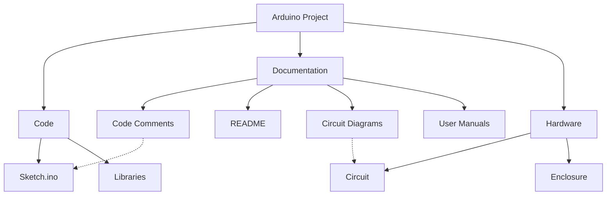

# Arduino Documentation

## Introduction

Documentation is a crucial but often overlooked aspect of Arduino programming. Good documentation makes your code more accessible, maintainable, and reusable—both for others and for your future self. This guide will explore various techniques and best practices for documenting your Arduino projects effectively, from commenting your code to creating comprehensive project documentation.

## Why Documentation Matters

When you're deeply involved in creating a project, the logic and purpose behind each component might seem obvious. However, when you or someone else revisits the code weeks, months, or even years later, that clarity often disappears. Good documentation:

- Helps others understand your project
- Makes it easier to maintain and update your code
- Facilitates collaboration
- Serves as a learning resource
- Preserves knowledge about your project

## Code Comments

### Basic Commenting

Comments in Arduino code (based on C/C++) come in two forms:

```cpp
// Single line comment

/* Multi-line comment
   that can span
   several lines */
```

### Effective Comment Practices

Rather than simply restating what code does, focus on explaining *why* certain decisions were made:

```cpp
// BAD: Increments counter by 1
counter++;

// GOOD: Increment reading counter to track number of sensor readings taken
counter++;
```

### Function Documentation

Document functions with a consistent format that explains purpose, parameters, and return values:

```cpp
/**
 * Calculates the average of sensor readings over specified time
 * 
 * @param sensorPin The analog pin where sensor is connected
 * @param seconds Duration to collect readings (in seconds)
 * @return The average sensor reading as a float
 */
float getAverageSensorReading(int sensorPin, int seconds) {
  // Function implementation
}
```

## Project Header Documentation

Every Arduino sketch should include a header comment section with essential project information:

```cpp
/*
 * Temperature Monitoring System
 * 
 * This sketch reads temperature from a DHT22 sensor and displays
 * the readings on an LCD screen. It also triggers an alarm when
 * the temperature exceeds a set threshold.
 * 
 * Created: 2023-05-15
 * Author: Jane Doe
 * 
 * Hardware:
 * - Arduino Uno
 * - DHT22 Temperature Sensor
 * - 16x2 LCD Display
 * - Piezo buzzer
 * 
 * Connections:
 * - DHT22 data pin -> Arduino pin 7
 * - LCD RS -> Arduino pin 12
 * - LCD E -> Arduino pin 11
 * - LCD D4 -> Arduino pin 5
 * - LCD D5 -> Arduino pin 4
 * - LCD D6 -> Arduino pin 3
 * - LCD D7 -> Arduino pin 2
 * - Buzzer -> Arduino pin 8
 */
```

## Code Organization for Readability

Organize your code into logical sections with header comments:

```cpp
//=============================================
// PIN DEFINITIONS
//=============================================
#define TEMP_SENSOR_PIN 7
#define LCD_RS_PIN 12
#define LCD_EN_PIN 11
// More pin definitions...

//=============================================
// GLOBAL VARIABLES
//=============================================
float temperatureThreshold = 30.0;
unsigned long lastReadingTime = 0;
// More variables...

//=============================================
// SETUP
//=============================================
void setup() {
  // Setup code...
}
```

## External Project Documentation

### README Files

Every project should include a README.md file with:

1. Project title and brief description
2. Required components/materials
3. Software dependencies (libraries needed)
4. Installation instructions
5. Usage instructions
6. Circuit diagram or connection instructions
7. Troubleshooting tips
8. License information

Here's a simplified example:

```markdown
# Smart Plant Watering System

An automated system that monitors soil moisture and waters plants when needed.

## Components
- Arduino Nano
- Soil moisture sensor
- 5V relay module
- 12V water pump
- 12V power supply

## Libraries Required
- `Wire.h`
- `LiquidCrystal_I2C.h`

## Setup Instructions
1. Connect components according to the circuit diagram
2. Upload the sketch to your Arduino
3. Adjust the `moistureThreshold` variable if needed

## Usage
Place the moisture sensor in the soil. The system will automatically water 
the plant when soil becomes too dry.
```

### Circuit Diagrams

Document your hardware connections with clear diagrams. For simple projects, ASCII art can work:

```
+-------------+          +----------------+
|             |          |                |
| SOIL SENSOR +----------+ ANALOG PIN A0  |
|             |          |                |
+-------------+          |                |
                         |    ARDUINO     |
+-------------+          |                |
|             |          |                |
|   RELAY     +----------+ DIGITAL PIN 3  |
|             |          |                |
+-------------+          +----------------+
      |
      v
+-------------+
|   WATER     |
|    PUMP     |
+-------------+
```

For more complex projects, use proper circuit drawing tools and include the image or a link to it in your documentation.

## Project Structure Visualization

The relationship between code, documentation, and hardware can be visualized:



## Version History Documentation

Track changes in your project by maintaining a version history section:

```cpp
/*
 * Version History:
 * v1.0.0 (2023-05-15) - Initial release
 * v1.0.1 (2023-05-20) - Fixed temperature reading bug
 * v1.1.0 (2023-06-05) - Added humidity monitoring
 * v2.0.0 (2023-07-10) - Implemented WiFi connectivity and web interface
 */
```

## Practical Example: Documenting a Temperature Monitor

Let's walk through documenting a simple temperature monitoring project:

### 1. Code with Comprehensive Comments

```cpp
/*
 * Basic Temperature Monitor
 * 
 * This sketch reads temperature from an LM35 sensor and
 * displays it on the Serial Monitor. If temperature exceeds
 * a threshold, it activates a warning LED.
 * 
 * Created: 2023-07-20
 * Author: John Smith
 * 
 * Hardware:
 * - Arduino Uno
 * - LM35 temperature sensor
 * - Red LED
 * - 220 ohm resistor
 * 
 * Connections:
 * - LM35 output -> Arduino A0
 * - LED (+) -> 220 ohm resistor -> Arduino pin 13
 * - LED (-) -> GND
 */

// Pin definitions
#define TEMP_SENSOR_PIN A0
#define WARNING_LED_PIN 13

// Constants
const float TEMP_THRESHOLD = 30.0;  // Temperature threshold in Celsius
const unsigned long READING_INTERVAL = 1000;  // Reading interval in milliseconds

// Global variables
unsigned long lastReadingTime = 0;

void setup() {
  // Initialize serial communication for debugging and data output
  Serial.begin(9600);
  
  // Configure the warning LED pin as output
  pinMode(WARNING_LED_PIN, OUTPUT);
  
  Serial.println("Temperature Monitor initialized");
  Serial.println("Temperature readings will display every second");
  Serial.println("---------------------------------------------");
}

void loop() {
  // Check if it's time to take a new reading
  unsigned long currentTime = millis();
  if (currentTime - lastReadingTime >= READING_INTERVAL) {
    lastReadingTime = currentTime;
    
    // Get temperature reading
    float temperature = readTemperature();
    
    // Display temperature
    Serial.print("Temperature: ");
    Serial.print(temperature);
    Serial.println(" °C");
    
    // Check if temperature exceeds threshold
    if (temperature > TEMP_THRESHOLD) {
      // Activate warning
      digitalWrite(WARNING_LED_PIN, HIGH);
      Serial.println("WARNING: Temperature threshold exceeded!");
    } else {
      // Turn off warning
      digitalWrite(WARNING_LED_PIN, LOW);
    }
  }
}

/**
 * Reads the temperature from the LM35 sensor
 * 
 * The LM35 provides a voltage output proportional to temperature
 * with a scale factor of 10mV/°C
 * 
 * @return Temperature in degrees Celsius
 */
float readTemperature() {
  // Read the analog value from the sensor
  int sensorValue = analogRead(TEMP_SENSOR_PIN);
  
  // Convert the analog reading to voltage (0-5V corresponds to 0-1023)
  float voltage = sensorValue * (5.0 / 1023.0);
  
  // Convert voltage to temperature (LM35 scale: 10mV/°C)
  float temperature = voltage * 100.0;
  
  return temperature;
}
```

### 2. README for the Project

Creating a clear README file helps others understand and use your project. Here's an example for our temperature monitor:

```markdown
# Arduino Temperature Monitor

A simple temperature monitoring system that alerts when temperature exceeds a predefined threshold.

## Materials Needed
- Arduino Uno or compatible board
- LM35 temperature sensor
- Red LED (any color works)
- 220 ohm resistor
- Breadboard and jumper wires

## Features
- Real-time temperature monitoring
- Visual alert when temperature exceeds threshold
- Serial output for logging and monitoring

## Installation
1. Connect the LM35 output pin to Arduino analog pin A0
2. Connect the LED to digital pin 13 through a 220 ohm resistor
3. Upload the sketch to your Arduino

## Configuration
You can modify these constants in the code:
- `TEMP_THRESHOLD`: Temperature threshold in Celsius (default: 30°C)
- `READING_INTERVAL`: How often to take readings (default: 1000ms)

## Serial Monitor
Open the Serial Monitor at 9600 baud to view temperature readings.

## Extending the Project
Consider these enhancements:
- Add an LCD display for standalone operation
- Include additional sensors (humidity, etc.)
- Implement data logging to SD card
- Add a buzzer for audible alerts
```

## Best Practices Summary

1. **Be Consistent**: Use the same style and format throughout your documentation
2. **Document As You Go**: Don't leave documentation for the end of the project
3. **Explain Why, Not Just What**: Focus on explaining reasoning, not just restating code
4. **Update Documentation**: When you change code, update the documentation too
5. **Use Templates**: Create templates for project headers and README files
6. **Consider The Audience**: Tailor documentation to your intended audience
7. **Include Diagrams**: Visual aids significantly improve understanding
8. **Document Hardware Connections**: Clearly specify how components connect
9. **Version Your Documentation**: Track changes to both code and documentation

## Exercises

1. Take an existing Arduino sketch and improve its documentation by adding:
   - A proper header comment
   - Function documentation
   - Section organization

2. Create a README.md file for one of your Arduino projects that includes all the recommended sections.

3. Draw a circuit diagram for a simple Arduino project using either ASCII art or a drawing tool.

## Additional Resources

- [Arduino Style Guide for Writing Documentation](https://www.arduino.cc/en/Reference/StyleGuide)
- [Doxygen](https://www.doxygen.nl/): A tool for generating documentation from annotated code
- [GitHub's Guide to Mastering Markdown](https://guides.github.com/features/mastering-markdown/)
- [Fritzing](https://fritzing.org/): Software for creating circuit diagrams

## Conclusion

Documentation might seem tedious when you're eager to build and code, but it's an investment that pays dividends throughout the lifecycle of your project. Well-documented Arduino projects are more likely to be used, adapted, and appreciated by the wider community. For beginners, developing good documentation habits early will make your learning journey smoother and more productive.

Remember that documentation isn't just for others—it's also for your future self, who might not remember the details of what you built today. As the saying goes: "Always code as if the person who will maintain your code is a violent psychopath who knows where you live."