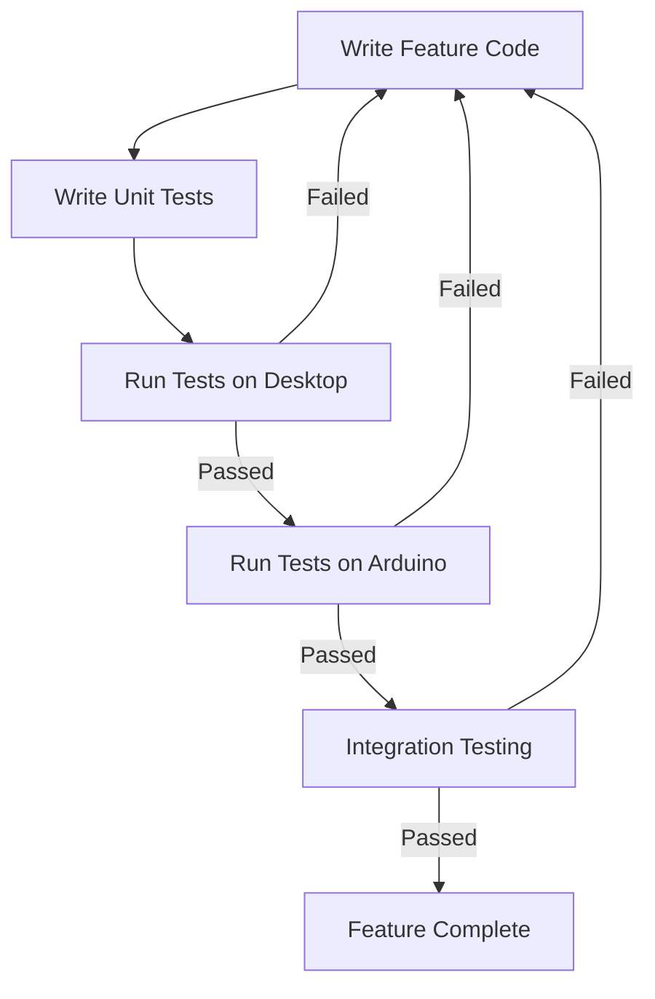

# Arduino Testing

## Introduction

Testing is a crucial part of any software development process, including Arduino projects. Despite the embedded nature of Arduino programming, implementing proper testing methodologies can significantly improve code quality, reduce debugging time, and ensure your projects work reliably in various conditions. This guide will introduce you to various testing approaches for Arduino projects, from simple serial monitor debugging to more sophisticated unit and integration testing frameworks.

## Why Test Your Arduino Code?

Arduino projects often control physical systems where failures can have real consequences:

- A smart home system malfunction could affect security or comfort
- An automated garden watering system bug might kill your plants
- A wearable health monitor error could provide incorrect readings

By implementing testing in your Arduino development workflow, you can:

- Catch bugs early in the development process
- Ensure your code works as expected under different conditions
- Make changes with confidence, knowing existing functionality remains intact
- Build more reliable and robust Arduino applications

## Basic Testing with Serial Monitor

The simplest way to test Arduino code is by using the Serial Monitor for debugging output.

```cpp
void setup() {
  Serial.begin(9600);
  Serial.println("Starting temperature sensor test...");
  
  float temperature = readTemperature();
  Serial.print("Temperature reading: ");
  Serial.print(temperature);
  Serial.println(" °C");
  
  if (temperature > -40 && temperature < 125) {
    Serial.println("TEST PASSED: Temperature in valid range");
  } else {
    Serial.println("TEST FAILED: Temperature out of expected range!");
  }
}

void loop() {
  // Empty for this test
}

float readTemperature() {
  // Replace with your actual sensor reading code
  int sensorValue = analogRead(A0);
  float voltage = sensorValue * (5.0 / 1023.0);
  float temperature = (voltage - 0.5) * 100;
  return temperature;
}
```

**Output example:**
```
Starting temperature sensor test...
Temperature reading: 23.45 °C
TEST PASSED: Temperature in valid range
```

While this approach is simple, it has limitations:
- Tests run on the actual hardware
- Manual verification is required
- Limited to simple assertions
- No automatic test organization or reporting

## Unit Testing for Arduino

Unit testing focuses on testing individual functions or components in isolation. Several frameworks exist specifically for Arduino unit testing.

### Arduino Unit Testing with ArduinoUnit

[ArduinoUnit](https://github.com/mmurdoch/arduinounit) is a popular library for unit testing Arduino code.

First, install the ArduinoUnit library through the Arduino Library Manager.

Here's a simple example testing a function that converts temperature from Celsius to Fahrenheit:

```cpp
#include <ArduinoUnit.h>

// Function to test
float celsiusToFahrenheit(float celsius) {
  return celsius * 9.0 / 5.0 + 32.0;
}

// Test case
test(celsiusToFahrenheitConversion) {
  // Test freezing point of water
  assertEqual(celsiusToFahrenheit(0), 32.0);
  
  // Test boiling point of water
  assertEqual(celsiusToFahrenheit(100), 212.0);
  
  // Test body temperature
  assertNear(celsiusToFahrenheit(37), 98.6, 0.1);
}

void setup() {
  Serial.begin(9600);
  while(!Serial); // Wait for serial port to connect
}

void loop() {
  Test::run();
}
```

**Output example:**
```
Test celsiusToFahrenheitConversion passed.
```

### Desktop Unit Testing with PlatformIO

[PlatformIO](https://platformio.org/) allows you to run unit tests on your desktop computer without needing physical Arduino hardware for every test.

Create a test file in the `test` directory of your PlatformIO project:

```cpp
// test/test_temperature_conversion.cpp
#include <unity.h>
#include <temperature.h> // Your module to test

void test_celsius_to_fahrenheit_conversion(void) {
    TEST_ASSERT_EQUAL_FLOAT(32.0, celsiusToFahrenheit(0));
    TEST_ASSERT_EQUAL_FLOAT(212.0, celsiusToFahrenheit(100));
    TEST_ASSERT_FLOAT_WITHIN(0.1, 98.6, celsiusToFahrenheit(37));
}

void setup() {
    UNITY_BEGIN();
    RUN_TEST(test_celsius_to_fahrenheit_conversion);
    UNITY_END();
}

void loop() {
    // Empty
}

#ifndef ARDUINO
int main(int argc, char **argv) {
    setup();
    return 0;
}
#endif
```

The advantage here is that you can run tests both on your desktop during development and on the actual hardware to verify everything works correctly in the real environment.

## Integration Testing

Integration testing verifies that different components of your Arduino project work correctly together. This is particularly important for projects with multiple sensors, actuators, or communication interfaces.

```cpp
#include <ArduinoUnit.h>

// Define pin connections
const int TEMP_SENSOR_PIN = A0;
const int RELAY_PIN = 7;

// Setup the components
void setupThermostat() {
  pinMode(TEMP_SENSOR_PIN, INPUT);
  pinMode(RELAY_PIN, OUTPUT);
  digitalWrite(RELAY_PIN, LOW); // Relay off initially
}

// Function to read temperature from sensor
float readTemperature() {
  int sensorValue = analogRead(TEMP_SENSOR_PIN);
  float voltage = sensorValue * (5.0 / 1023.0);
  float temperature = (voltage - 0.5) * 100;
  return temperature;
}

// Function that controls the relay based on temperature
bool controlHeater(float temperature, float threshold) {
  if (temperature < threshold) {
    digitalWrite(RELAY_PIN, HIGH); // Turn heater on
    return true;
  } else {
    digitalWrite(RELAY_PIN, LOW); // Turn heater off
    return false;
  }
}

// Integration test for thermostat system
test(thermostatSystem) {
  setupThermostat();
  
  // We can use a fake temperature for testing
  // In a more advanced setup, you might mock the sensor reading
  float fakeTemp = 18.0;
  float threshold = 20.0;
  
  // Heater should turn on when temp is below threshold
  assertTrue(controlHeater(fakeTemp, threshold));
  assertEqual(digitalRead(RELAY_PIN), HIGH);
  
  // Heater should turn off when temp is at or above threshold
  fakeTemp = 22.0;
  assertFalse(controlHeater(fakeTemp, threshold));
  assertEqual(digitalRead(RELAY_PIN), LOW);
}

void setup() {
  Serial.begin(9600);
  while(!Serial);
}

void loop() {
  Test::run();
}
```

## Mocking Hardware Components

For more advanced testing, you might want to "mock" or simulate hardware components:

```cpp
// Mock for a temperature sensor
class MockTemperatureSensor {
  private:
    float _mockTemperature;
  
  public:
    MockTemperatureSensor(float initialTemp = 25.0) {
      _mockTemperature = initialTemp;
    }
    
    void setTemperature(float temp) {
      _mockTemperature = temp;
    }
    
    float readTemperature() {
      return _mockTemperature;
    }
};

// Class that uses the sensor
class Thermostat {
  private:
    MockTemperatureSensor* _sensor;
    int _relayPin;
    float _threshold;
  
  public:
    Thermostat(MockTemperatureSensor* sensor, int relayPin, float threshold) {
      _sensor = sensor;
      _relayPin = relayPin;
      _threshold = threshold;
      pinMode(_relayPin, OUTPUT);
    }
    
    bool checkAndControl() {
      float currentTemp = _sensor->readTemperature();
      if (currentTemp < _threshold) {
        digitalWrite(_relayPin, HIGH);
        return true;
      } else {
        digitalWrite(_relayPin, LOW);
        return false;
      }
    }
};

// Test with the mock
test(thermostatWithMock) {
  MockTemperatureSensor mockSensor(15.0); // Start with 15 degrees
  Thermostat thermostat(&mockSensor, 7, 20.0);
  
  // Should turn heater on at 15 degrees
  assertTrue(thermostat.checkAndControl());
  
  // Change temperature and check again
  mockSensor.setTemperature(25.0);
  assertFalse(thermostat.checkAndControl());
}
```

## Testing Best Practices for Arduino

1. **Start simple**: Begin with basic serial debugging before moving to testing frameworks
2. **Test early, test often**: Write tests as you develop, not as an afterthought
3. **Separate concerns**: Design your code with testing in mind by separating logic from hardware interactions when possible
4. **Use dependency injection**: Pass sensors and actuators to your functions/classes instead of hardcoding them
5. **Test boundary conditions**: Test edge cases like minimum/maximum values, buffer overflows, etc.
6. **Automate when possible**: Set up continuous integration for your projects

## Testing Workflow Diagram



## Real-world Example: Weather Station Testing

Let's consider a complete example of testing a weather station project:

```cpp
#include <ArduinoUnit.h>
#include <DHT.h>
#include <LiquidCrystal_I2C.h>

// Hardware definitions
#define DHT_PIN 2
#define DHT_TYPE DHT22
#define RAIN_SENSOR_PIN A0
#define LCD_ADDRESS 0x27
#define LCD_COLS 16
#define LCD_ROWS 2

// Initialize components
DHT dht(DHT_PIN, DHT_TYPE);
LiquidCrystal_I2C lcd(LCD_ADDRESS, LCD_COLS, LCD_ROWS);

// Weather data structure
struct WeatherData {
  float temperature;
  float humidity;
  int rainLevel;
  String weatherCondition;
};

// Function to read sensors and determine weather condition
WeatherData readWeatherData() {
  WeatherData data;
  
  // Read from DHT sensor
  data.temperature = dht.readTemperature();
  data.humidity = dht.readHumidity();
  
  // Read rain sensor (higher value = more rain)
  data.rainLevel = analogRead(RAIN_SENSOR_PIN);
  
  // Determine weather condition
  if (data.rainLevel > 500) {
    data.weatherCondition = "Raining";
  } else if (data.humidity > 80) {
    data.weatherCondition = "Foggy";
  } else if (data.temperature > 30) {
    data.weatherCondition = "Hot";
  } else if (data.temperature < 10) {
    data.weatherCondition = "Cold";
  } else {
    data.weatherCondition = "Pleasant";
  }
  
  return data;
}

// Function to display weather data on LCD
void displayWeatherData(const WeatherData& data) {
  lcd.clear();
  lcd.setCursor(0, 0);
  lcd.print(String(data.temperature, 1) + "C " + 
            String(data.humidity, 0) + "%");
  lcd.setCursor(0, 1);
  lcd.print(data.weatherCondition);
}

// Mock class for DHT sensor
class MockDHT {
  private:
    float _mockTemp;
    float _mockHumidity;
    
  public:
    MockDHT(float temp = 25.0, float humidity = 50.0) {
      _mockTemp = temp;
      _mockHumidity = humidity;
    }
    
    void setReadings(float temp, float humidity) {
      _mockTemp = temp;
      _mockHumidity = humidity;
    }
    
    float readTemperature() {
      return _mockTemp;
    }
    
    float readHumidity() {
      return _mockHumidity;
    }
};

// Test the weather condition logic
test(weatherConditionLogic) {
  // We'll manually create weather data to test the logic
  WeatherData testData;
  
  // Test rainy condition
  testData.temperature = 20.0;
  testData.humidity = 70.0;
  testData.rainLevel = 600; // Above rain threshold
  assertEqual(determineWeatherCondition(testData), "Raining");
  
  // Test foggy condition
  testData.rainLevel = 100; // Below rain threshold
  testData.humidity = 85.0; // Above humidity threshold
  assertEqual(determineWeatherCondition(testData), "Foggy");
  
  // Test hot condition
  testData.humidity = 50.0; // Below humidity threshold
  testData.temperature = 32.0; // Above hot threshold
  assertEqual(determineWeatherCondition(testData), "Hot");
  
  // Test cold condition
  testData.temperature = 5.0; // Below cold threshold
  assertEqual(determineWeatherCondition(testData), "Cold");
  
  // Test pleasant condition
  testData.temperature = 20.0; // Between hot and cold thresholds
  assertEqual(determineWeatherCondition(testData), "Pleasant");
}

// Helper function to determine weather condition (extracted for testing)
String determineWeatherCondition(const WeatherData& data) {
  if (data.rainLevel > 500) {
    return "Raining";
  } else if (data.humidity > 80) {
    return "Foggy";
  } else if (data.temperature > 30) {
    return "Hot";
  } else if (data.temperature < 10) {
    return "Cold";
  } else {
    return "Pleasant";
  }
}

void setup() {
  Serial.begin(9600);
  while(!Serial);
  
  // Initialize LCD for real operation
  lcd.init();
  lcd.backlight();
  
  // Initialize DHT sensor for real operation
  dht.begin();
}

void loop() {
  Test::run();
}
```

## Continuous Integration for Arduino Projects

For larger projects, consider setting up continuous integration (CI) to run tests automatically:

1. Use PlatformIO with GitHub Actions or Travis CI
2. Set up automatic test runs when you push code to your repository
3. Include both desktop tests and hardware tests if possible
4. Generate test reports to track project health over time

## Summary

Testing Arduino projects might seem challenging at first, but it brings significant benefits to your development process:

- Improved code quality and reliability
- Faster debugging and development cycles
- Greater confidence when modifying existing code
- Documentation of expected behavior through test cases

By incorporating some of the testing techniques covered in this guide—from simple serial debugging to comprehensive unit and integration testing frameworks—you can build more robust Arduino projects and spend less time troubleshooting issues.

## Exercise: Create a Test Suite for a Light Sensor Project

Try creating a simple test suite for an Arduino project that reads a light sensor (LDR) and controls an LED based on the light level:

1. Write a function to read the light sensor
2. Write a function to control the LED based on a threshold
3. Create unit tests for both functions
4. Create an integration test for the complete system
5. Implement a mock for the light sensor to test different light conditions

## Additional Resources

- [ArduinoUnit GitHub Repository](https://github.com/mmurdoch/arduinounit)
- [PlatformIO Unit Testing Documentation](https://docs.platformio.org/en/latest/plus/unit-testing.html)
- [AUnit - Another Arduino Unit Testing Library](https://github.com/bxparks/AUnit)
- [Embedded TDD - Test Driven Development for Embedded C](http://www.embedded-tdd.com/)