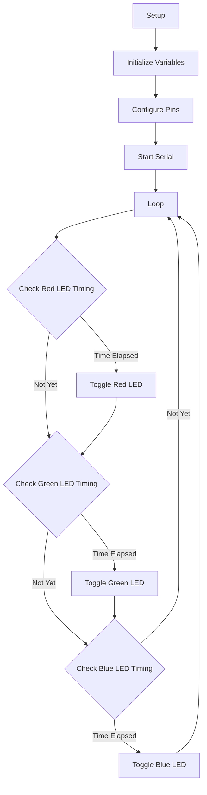

# Arduino Coding Style

## Introduction

Writing code is not just about making it work; it's about making it readable, maintainable, and consistent. A good coding style is especially important in Arduino projects, which can grow from simple prototypes to complex systems. This guide covers the essential style practices that will help you write better Arduino code from day one.

Whether you're a beginner just starting out or an experienced programmer adapting to the Arduino environment, following these coding style guidelines will make your code more professional and easier to work with.

## Why Coding Style Matters

Before diving into the specific style rules, let's understand why coding style is crucial:

- **Readability**: Well-formatted code is easier to read and understand
- **Maintainability**: When you revisit your code months later, good style will help you understand what you did
- **Collaboration**: Others can more easily understand and contribute to your code
- **Error Prevention**: Consistent formatting helps spot logical errors and bugs

## Naming Conventions

### Variable Naming

In Arduino programming, using descriptive and consistent variable names is essential.

```cpp
// Poor naming
int x = 0;
int t = 0;
int btnPin = 7;

// Better naming
int ledState = LOW;
unsigned long previousMillis = 0;
const int buttonPin = 7;
```

### Rules for Good Variable Names

1. Use camelCase for variables (first word lowercase, subsequent words capitalized)
2. Use ALL_CAPS for constants (with underscores between words)
3. Be specific and descriptive
4. Prefix boolean variables with "is" or "has"
5. Use consistent plural forms for arrays or collections

```cpp
// Constants
const int LED_PIN = 13;
const long BLINK_INTERVAL = 1000;

// Regular variables
int sensorValue = 0;
float temperatureReading = 0.0;

// Booleans
bool isButtonPressed = false;
bool hasReceivedData = false;

// Arrays
int sensorValues[3] = {0, 0, 0};
```

## Code Structure and Organization

### File Organization

A well-structured Arduino sketch typically follows this pattern:

```cpp
/*
 * Project: Temperature Monitor
 * Author: Your Name
 * Date: March 12, 2025
 * Description: Monitors temperature and displays on LCD
 */

// Include necessary libraries
#include <LiquidCrystal.h>

// Define constants
const int TEMP_SENSOR_PIN = A0;
const int LCD_RS = 12;
const int LCD_EN = 11;
// ... more constants

// Global variables
float currentTemperature = 0.0;
LiquidCrystal lcd(LCD_RS, LCD_EN, 5, 4, 3, 2);

// Function declarations (if needed)
float convertToFahrenheit(float celsius);

void setup() {
  // Initialize hardware
  Serial.begin(9600);
  lcd.begin(16, 2);
  pinMode(TEMP_SENSOR_PIN, INPUT);
}

void loop() {
  // Main program logic
  readTemperature();
  displayTemperature();
  delay(1000);
}

// Custom function definitions
void readTemperature() {
  int sensorValue = analogRead(TEMP_SENSOR_PIN);
  currentTemperature = map(sensorValue, A0, 1023, 0, 100);
}

void displayTemperature() {
  lcd.clear();
  lcd.setCursor(0, 0);
  lcd.print("Temp: " + String(currentTemperature) + "C");
  lcd.setCursor(0, 1);
  lcd.print(String(convertToFahrenheit(currentTemperature)) + "F");
}

float convertToFahrenheit(float celsius) {
  return (celsius * 9.0 / 5.0) + 32.0;
}
```

### Function Organization

Organize your functions in a logical way:

1. Keep the `setup()` and `loop()` functions at the top
2. Group related functions together
3. Place helper functions near the functions that use them
4. Keep functions short and focused on a single task

## Indentation and Spacing

Proper indentation makes code structure visually clear. The standard in Arduino is to use 2 spaces for each level of indentation.

```cpp
void loop() {
  if (digitalRead(buttonPin) == HIGH) {
    if (ledState == LOW) {
      ledState = HIGH;
    } else {
      ledState = LOW;
    }
    digitalWrite(ledPin, ledState);
    delay(50);  // Debounce delay
  }
}
```

### Spacing Rules

Use spaces to make your code more readable:

- Place a space after keywords (`if`, `for`, `while`)
- Place a space around operators (`=`, `+`, `-`, `*`, `/`, `==`, `!=`)
- Don't put spaces inside parentheses
- Put a space after commas in parameter lists

```cpp
// Poor spacing
for(int i=0;i<10;i++){
  int result=analogRead(A0)/2;
  if(result>500){
    digitalWrite(ledPin,HIGH);
  }
}

// Better spacing
for (int i = 0; i < 10; i++) {
  int result = analogRead(A0) / 2;
  if (result > 500) {
    digitalWrite(ledPin, HIGH);
  }
}
```

## Comments

Comments make your code more understandable to others (and your future self).

### Types of Comments

1. **File Header Comments** - Explain the purpose of the sketch

```cpp
/*
 * Automatic Plant Watering System
 * Created: March 12, 2025
 * Author: Your Name
 * 
 * This sketch monitors soil moisture and activates
 * a water pump when the soil is too dry.
 */
```

2. **Function Comments** - Explain what a function does, its parameters, and its return value

```cpp
/**
 * Read the soil moisture level from the sensor
 * @return Moisture percentage (0-100)
 */
int readMoisture() {
  int sensorValue = analogRead(MOISTURE_SENSOR_PIN);
  return map(sensorValue, 0, 1023, 0, 100);
}
```

3. **Inline Comments** - Explain complex logic

```cpp
// Only water if moisture is below threshold and it's been at least 6 hours
if (moisture < MOISTURE_THRESHOLD && (currentMillis - lastWateringTime > 6 * 60 * 60 * 1000)) {
  activatePump();
}
```

## Using Constants

Using named constants makes your code more readable and easier to modify.

```cpp
// Poor practice - using "magic numbers"
void setup() {
  pinMode(13, OUTPUT);
  Serial.begin(9600);
}

void loop() {
  digitalWrite(13, HIGH);
  delay(1000);
  digitalWrite(13, LOW);
  delay(1000);
}

// Better practice - using constants
const int LED_PIN = 13;
const int BLINK_DELAY = 1000; // in milliseconds

void setup() {
  pinMode(LED_PIN, OUTPUT);
  Serial.begin(9600);
}

void loop() {
  digitalWrite(LED_PIN, HIGH);
  delay(BLINK_DELAY);
  digitalWrite(LED_PIN, LOW);
  delay(BLINK_DELAY);
}
```

## Practical Example: Blinking Multiple LEDs

Let's apply these style guidelines to a practical example:

```cpp
/*
 * Multi-LED Blinker
 * Description: Blinks three LEDs at different intervals
 */

// Pin definitions
const int LED_RED_PIN = 9;
const int LED_GREEN_PIN = 10;
const int LED_BLUE_PIN = 11;

// Timing constants
const unsigned long RED_BLINK_INTERVAL = 1000;   // 1 second
const unsigned long GREEN_BLINK_INTERVAL = 2000; // 2 seconds
const unsigned long BLUE_BLINK_INTERVAL = 3000;  // 3 seconds

// Variables to track the timing
unsigned long redPreviousMillis = 0;
unsigned long greenPreviousMillis = 0;
unsigned long bluePreviousMillis = 0;

// Variables to track LED states
int redLedState = LOW;
int greenLedState = LOW;
int blueLedState = LOW;

void setup() {
  // Initialize the LED pins as outputs
  pinMode(LED_RED_PIN, OUTPUT);
  pinMode(LED_GREEN_PIN, OUTPUT);
  pinMode(LED_BLUE_PIN, OUTPUT);
  
  // Initialize serial for debugging
  Serial.begin(9600);
  Serial.println("Multi-LED Blinker Started");
}

void loop() {
  // Get the current time
  unsigned long currentMillis = millis();
  
  // Check if it's time to blink the red LED
  if (currentMillis - redPreviousMillis >= RED_BLINK_INTERVAL) {
    // Save the last time the LED blinked
    redPreviousMillis = currentMillis;
    
    // Toggle the LED state
    redLedState = (redLedState == LOW) ? HIGH : LOW;
    digitalWrite(LED_RED_PIN, redLedState);
    
    // Log the change
    Serial.print("Red LED: ");
    Serial.println(redLedState == HIGH ? "ON" : "OFF");
  }
  
  // Check if it's time to blink the green LED
  if (currentMillis - greenPreviousMillis >= GREEN_BLINK_INTERVAL) {
    greenPreviousMillis = currentMillis;
    greenLedState = (greenLedState == LOW) ? HIGH : LOW;
    digitalWrite(LED_GREEN_PIN, greenLedState);
    
    Serial.print("Green LED: ");
    Serial.println(greenLedState == HIGH ? "ON" : "OFF");
  }
  
  // Check if it's time to blink the blue LED
  if (currentMillis - bluePreviousMillis >= BLUE_BLINK_INTERVAL) {
    bluePreviousMillis = currentMillis;
    blueLedState = (blueLedState == LOW) ? HIGH : LOW;
    digitalWrite(LED_BLUE_PIN, blueLedState);
    
    Serial.print("Blue LED: ");
    Serial.println(blueLedState == HIGH ? "ON" : "OFF");
  }
}
```

### Input and Output

For this sketch, there is no direct input from the user. The output can be seen in the behavior of the LEDs and in the Serial Monitor:

Serial Monitor Output:
```
Multi-LED Blinker Started
Red LED: ON
Green LED: ON
Red LED: OFF
Blue LED: ON
Red LED: ON
Green LED: OFF
Red LED: OFF
Blue LED: OFF
```

## Style for More Complex Programs

As your Arduino projects grow in complexity, additional style guidelines become important:

### State Machines

For complex behaviors, consider using state machines:

```cpp
// Define states
enum TrafficLightState {
  RED,
  GREEN,
  YELLOW
};

// Current state
TrafficLightState currentState = RED;

// Timing
unsigned long stateStartTime = 0;
const unsigned long RED_DURATION = 5000;    // 5 seconds
const unsigned long GREEN_DURATION = 4000;  // 4 seconds
const unsigned long YELLOW_DURATION = 1000; // 1 second

void loop() {
  unsigned long currentTime = millis();
  unsigned long elapsedTime = currentTime - stateStartTime;
  
  // State machine
  switch (currentState) {
    case RED:
      // Handle RED state
      digitalWrite(RED_PIN, HIGH);
      digitalWrite(YELLOW_PIN, LOW);
      digitalWrite(GREEN_PIN, LOW);
      
      if (elapsedTime >= RED_DURATION) {
        currentState = GREEN;
        stateStartTime = currentTime;
      }
      break;
      
    case GREEN:
      // Handle GREEN state
      digitalWrite(RED_PIN, LOW);
      digitalWrite(YELLOW_PIN, LOW);
      digitalWrite(GREEN_PIN, HIGH);
      
      if (elapsedTime >= GREEN_DURATION) {
        currentState = YELLOW;
        stateStartTime = currentTime;
      }
      break;
      
    case YELLOW:
      // Handle YELLOW state
      digitalWrite(RED_PIN, LOW);
      digitalWrite(YELLOW_PIN, HIGH);
      digitalWrite(GREEN_PIN, LOW);
      
      if (elapsedTime >= YELLOW_DURATION) {
        currentState = RED;
        stateStartTime = currentTime;
      }
      break;
  }
}
```

### Non-Blocking Code

Avoid using `delay()` in complex projects as it blocks all other operations:

```cpp
// Poor practice - blocks execution
void loop() {
  digitalWrite(ledPin, HIGH);
  delay(1000);
  digitalWrite(ledPin, LOW);
  delay(1000);
  
  // This code is blocked while waiting
  checkButton();
  readSensors();
}

// Better practice - non-blocking
unsigned long previousMillis = 0;
const long interval = 1000;
int ledState = LOW;

void loop() {
  unsigned long currentMillis = millis();
  
  // Blink LED without blocking
  if (currentMillis - previousMillis >= interval) {
    previousMillis = currentMillis;
    ledState = (ledState == LOW) ? HIGH : LOW;
    digitalWrite(ledPin, ledState);
  }
  
  // These functions run without being blocked
  checkButton();
  readSensors();
}
```

### Visualizing Program Flow

For complex programs, it can be helpful to visualize the flow using diagrams:



## Summary

Following good coding style practices when programming Arduino:

1. **Use descriptive variable names** that follow camelCase for variables and ALL_CAPS for constants
2. **Structure your code** with meaningful comments and logical organization
3. **Use consistent indentation and spacing** to make your code readable
4. **Avoid magic numbers** by using named constants
5. **Write modular code** with functions that perform specific tasks
6. **Use non-blocking programming techniques** for complex projects
7. **Document your code** with appropriate comments

By adopting these coding style practices, your Arduino projects will be more readable, maintainable, and professional. Good coding habits developed early will serve you well as you tackle more complex projects.

## Additional Resources and Exercises

### Resources

- [Arduino Reference](https://www.arduino.cc/reference/en/)
- [Arduino Style Guide for Writing Libraries](https://docs.arduino.cc/learn/contributions/arduino-library-style-guide)

### Exercises

1. **Style Refactoring**: Take an existing Arduino sketch and refactor it to follow the style guidelines.

2. **Non-Blocking Challenge**: Convert a sketch that uses `delay()` to use non-blocking timing techniques.

3. **Documentation Practice**: Write comprehensive comments for an Arduino library you use frequently.

4. **State Machine Implementation**: Create a simple project (like a traffic light or a vending machine) using a state machine approach.

5. **Code Review**: Share your code with a fellow Arduino enthusiast and review each other's code for style improvements.

By consistently applying these style practices, you'll develop cleaner, more professional Arduino code that will be easier to maintain and share with others.