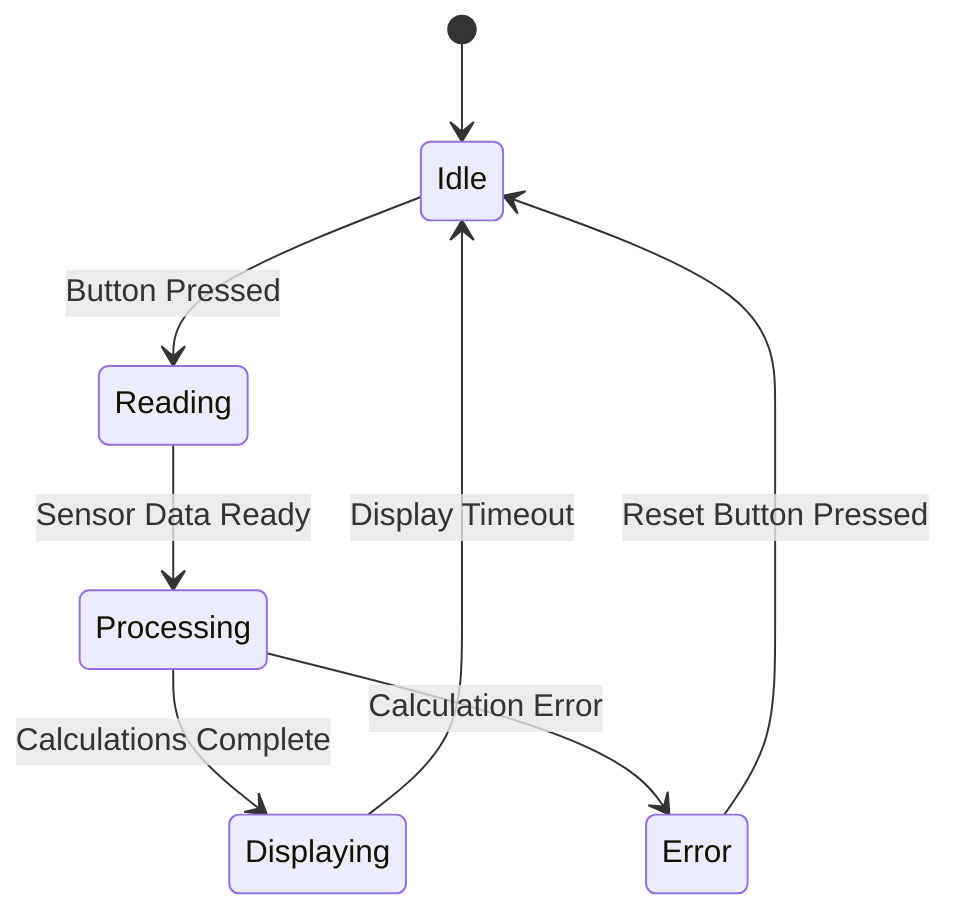
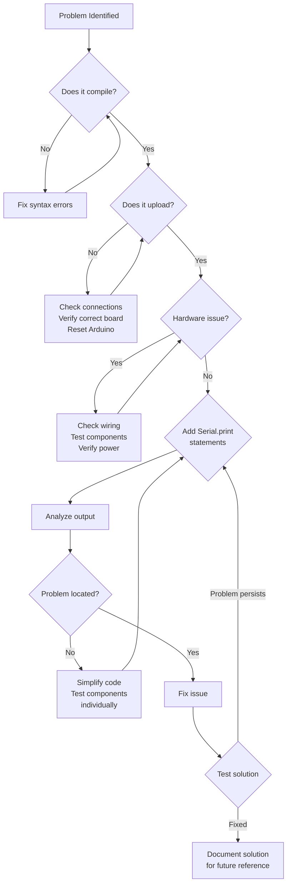

# Arduino Debugging Techniques

## Introduction

When working with Arduino projects, things don't always go according to plan. Your LED might not blink, your sensor readings could be erratic, or your motor might spin in the wrong direction. Debugging is the process of finding and fixing these issues in your code and hardware setup. This guide will walk you through various techniques to effectively debug your Arduino projects, helping you become more self-sufficient and confident in your programming journey.

## Why Debugging Skills Matter

Debugging is perhaps the most valuable skill you can develop as a programmer. On average, developers spend 50-75% of their time debugging rather than writing new code. Learning how to systematically find and fix problems will:

- Save you countless hours of frustration
- Deepen your understanding of how your code works
- Help you write better code from the start
- Build problem-solving skills that transfer to all programming projects

## Common Arduino Problems

Before diving into specific techniques, let's look at the most common issues you might encounter:

1. **Compile errors** - Syntax problems that prevent your code from uploading
2. **Logic errors** - Code that compiles but doesn't behave as expected
3. **Hardware issues** - Incorrect wiring, faulty components, or power problems
4. **Timing problems** - Issues with delays, interrupts, or race conditions
5. **Communication errors** - Problems with serial, I2C, SPI, or other protocols

## Basic Debugging Techniques

### 1. Serial Monitor Debugging

The Serial Monitor is your best friend when debugging Arduino projects. It allows you to send data from your Arduino to your computer, making invisible program states visible.

```cpp
void setup() {
  Serial.begin(9600);  // Initialize serial communication at 9600 bits per second
  Serial.println("Arduino is starting up...");
  
  pinMode(LED_BUILTIN, OUTPUT);
  Serial.println("LED pin configured");
}

void loop() {
  Serial.println("Turning LED ON");
  digitalWrite(LED_BUILTIN, HIGH);
  delay(1000);
  
  Serial.println("Turning LED OFF");
  digitalWrite(LED_BUILTIN, LOW);
  delay(1000);
}
```

**Key practices for effective serial debugging:**

- Always include a descriptive message with your values
- Use consistent formatting for easier reading
- Print variable values at critical points in your code
- Consider using a timestamp for timing-related issues

### 2. The Divide and Conquer Method

When facing a complex problem, break it down into smaller parts that you can test individually:

1. Comment out sections of code to isolate the problem area
2. Test individual functions separately
3. Simplify your circuit by removing components temporarily
4. Create minimal test programs for specific hardware

### 3. LED Debugging

Sometimes the simplest methods are the most effective. Use LEDs to signal the state of your program:

```cpp
void setup() {
  pinMode(LED_BUILTIN, OUTPUT);
  pinMode(7, INPUT_PULLUP);  // Button connected to pin 7
}

void loop() {
  // Blink once at the start of each loop iteration
  digitalWrite(LED_BUILTIN, HIGH);
  delay(50);
  digitalWrite(LED_BUILTIN, LOW);
  
  // Your code here
  if (digitalRead(7) == LOW) {
    // Button pressed - blink rapidly 3 times to indicate
    for (int i = 0; i < 3; i++) {
      digitalWrite(LED_BUILTIN, HIGH);
      delay(100);
      digitalWrite(LED_BUILTIN, LOW);
      delay(100);
    }
  }
  
  delay(500);  // Pause before next loop iteration
}
```

This technique is especially valuable when working with:
- Interrupt routines
- State machines
- Timing-sensitive code
- Projects where serial debugging might interfere with normal operation

## Intermediate Debugging Techniques

### 1. Creating a State Machine Diagram

For complex programs, visualizing your code as a state machine can help identify logical errors:



When implementing this state machine in code, you can add debug output at each state transition:

```cpp
enum States { IDLE, READING, PROCESSING, DISPLAYING, ERROR };
States currentState = IDLE;

void loop() {
  switch(currentState) {
    case IDLE:
      // State code here
      if (buttonPressed()) {
        Serial.println("State transition: IDLE -> READING");
        currentState = READING;
      }
      break;
      
    case READING:
      // State code here
      if (sensorDataReady()) {
        Serial.println("State transition: READING -> PROCESSING");
        currentState = PROCESSING;
      }
      break;
      
    // Additional states...
  }
}
```

### 2. Timing Analysis with Micros() and Millis()

Understanding how long different parts of your code take to execute is crucial for real-time applications:

```cpp
unsigned long startTime;
unsigned long elapsedTime;

void setup() {
  Serial.begin(9600);
}

void loop() {
  startTime = micros();  // Start timing
  
  // Function or code block to measure
  readSensors();
  
  elapsedTime = micros() - startTime;  // Calculate elapsed time
  Serial.print("readSensors() took ");
  Serial.print(elapsedTime);
  Serial.println(" microseconds");
  
  startTime = millis();  // Reset timing using milliseconds for longer operations
  
  // Another function to measure
  processData();
  
  elapsedTime = millis() - startTime;
  Serial.print("processData() took ");
  Serial.print(elapsedTime);
  Serial.println(" milliseconds");
  
  delay(1000);
}
```

### 3. Watchdog Timer for Detecting Hangs

The watchdog timer can automatically reset your Arduino if your program gets stuck in an infinite loop:

```cpp
#include <avr/wdt.h>

void setup() {
  Serial.begin(9600);
  Serial.println("System starting...");
  
  // Enable the watchdog timer with a 2-second timeout
  wdt.enable(WDTO_2S);
  
  pinMode(LED_BUILTIN, OUTPUT);
}

void loop() {
  Serial.println("Loop running");
  digitalWrite(LED_BUILTIN, HIGH);
  delay(500);
  digitalWrite(LED_BUILTIN, LOW);
  delay(500);
  
  // Reset the watchdog timer to prevent a reset
  wdt_reset();
  
  // Uncomment to simulate a hang condition
  // while(1) { } // This would trigger the watchdog reset
}
```

## Advanced Debugging Techniques

### 1. External Logic Analyzer

For complex timing issues or protocol debugging, a logic analyzer can capture digital signals and help you visualize their timing relationships:

```cpp
// Example code that would benefit from logic analyzer debugging
void setup() {
  pinMode(2, OUTPUT);  // Clock signal
  pinMode(3, OUTPUT);  // Data signal
  pinMode(4, OUTPUT);  // Latch signal
}

void loop() {
  // Send a byte of data using a custom protocol
  sendByte(0xA5);
  delay(1000);
}

void sendByte(byte data) {
  // Pull latch low to begin
  digitalWrite(4, LOW);
  
  // Send 8 bits, MSB first
  for (int i = 7; i >= 0; i--) {
    // Set data bit
    digitalWrite(3, (data >> i) & 0x01);
    
    // Pulse clock
    digitalWrite(2, HIGH);
    delayMicroseconds(5);
    digitalWrite(2, LOW);
    delayMicroseconds(5);
  }
  
  // Pull latch high to complete
  digitalWrite(4, HIGH);
}
```

Connect a logic analyzer to pins 2, 3, and 4 to visualize the actual timing of these signals and verify they meet your protocol requirements.

### 2. Remote Debugging with Bluetooth or WiFi

For projects that need to be mobile or are difficult to access with a USB cable, wireless debugging can be invaluable:

```cpp
#include <SoftwareSerial.h>

// Create a software serial port on pins 10 (RX) and 11 (TX)
SoftwareSerial bluetoothSerial(10, 11);

void setup() {
  // Start both serial connections
  Serial.begin(9600);           // For USB connection
  bluetoothSerial.begin(9600);  // For Bluetooth module
  
  Serial.println("Dual serial debugging ready");
  bluetoothSerial.println("Bluetooth debugging connected");
}

void loop() {
  // Your regular code here
  int sensorValue = analogRead(A0);
  
  // Send debug info to both serial connections
  Serial.print("Sensor value: ");
  Serial.println(sensorValue);
  
  bluetoothSerial.print("Sensor value: ");
  bluetoothSerial.println(sensorValue);
  
  delay(1000);
}
```

### 3. Assertions for Runtime Validation

Assertions help catch logical errors by verifying assumptions in your code:

```cpp
#define ASSERT(condition, message) \
  if (!(condition)) { \
    Serial.print("Assertion failed: "); \
    Serial.print(message); \
    Serial.print(" in file "); \
    Serial.print(__FILE__); \
    Serial.print(" at line "); \
    Serial.println(__LINE__); \
    while (1); \
  }

void setup() {
  Serial.begin(9600);
  
  int sensorPin = A0;
  int sensorValue = analogRead(sensorPin);
  
  // Verify sensor reading is within expected range
  ASSERT(sensorValue >= 0 && sensorValue <= 1023, "Sensor value out of range");
  
  // More setup code...
}

void loop() {
  int temperature = readTemperature();
  
  // Verify temperature is physically possible
  ASSERT(temperature > -50 && temperature < 150, "Temperature value implausible");
  
  // More code...
}
```

## Hardware Debugging Techniques

### 1. Voltage and Continuity Testing

Before assuming a software problem, verify your hardware:

1. **Use a multimeter to check:**
   - Power supply voltages (should be within 10% of expected values)
   - Continuity of connections (no unexpected shorts or opens)
   - Resistance of pull-up/pull-down resistors

2. **Common hardware issues to check:**
   - Loose connections or cold solder joints
   - Incorrect resistor values
   - Reversed polarity on components
   - Bent pins on ICs or modules

### 2. Power Supply Debugging

Power issues can cause strange, intermittent behaviors:

```cpp
void setup() {
  Serial.begin(9600);
  // Use internal reference to measure VCC (power supply)
  // This works on many AVR-based Arduinos
  
  // Read 1.1V reference against AVcc
  ADMUX = _BV(REFS0) | _BV(MUX3) | _BV(MUX2) | _BV(MUX1);
  delay(2); // Wait for Vref to settle
  ADCSRA |= _BV(ADSC); // Start conversion
  while (bit_is_set(ADCSRA, ADSC)); // Wait for conversion to complete
  
  uint8_t low = ADCL; // Must read ADCL first - it then locks ADCH
  uint8_t high = ADCH; // Unlocks both
  long result = (high << 8) | low;
  
  // Calculate Vcc (in mV)
  long vcc = 1125300L / result; 
  
  Serial.print("VCC = ");
  Serial.print(vcc / 1000.0);
  Serial.println(" V");
  
  // Check if power is sufficient
  if (vcc < 4500) {
    Serial.println("WARNING: Power supply voltage is low!");
  }
}
```

### 3. Signal Visualization Techniques

For analog signals, visualizing the data can reveal problems that aren't obvious from raw numbers:

```cpp
void setup() {
  Serial.begin(9600);
}

void loop() {
  // Read sensor
  int sensorValue = analogRead(A0);
  
  // Convert to voltage (0-5V)
  float voltage = sensorValue * (5.0 / 1023.0);
  
  // Print a simple ASCII bar graph
  Serial.print("Sensor: ");
  Serial.print(voltage);
  Serial.print("V [");
  
  // Create visual bar graph with length proportional to reading
  int barLength = map(sensorValue, 0, 1023, 0, 50);
  for (int i = 0; i < 50; i++) {
    if (i < barLength) {
      Serial.print("#");
    } else {
      Serial.print(" ");
    }
  }
  
  Serial.println("]");
  delay(100);
}
```

## Debugging Common Arduino Libraries

### I2C (Wire Library) Debugging

```cpp
#include <Wire.h>

void setup() {
  Serial.begin(9600);
  Wire.begin();
  
  Serial.println("Scanning I2C bus for devices...");
  
  byte error, address;
  int deviceCount = 0;
  
  for (address = 1; address < 127; address++) {
    // Use Wire.beginTransmission to ping device
    Wire.beginTransmission(address);
    error = Wire.endTransmission();
    
    if (error == 0) {
      Serial.print("Device found at address 0x");
      if (address < 16) {
        Serial.print("0");
      }
      Serial.print(address, HEX);
      Serial.println();
      
      deviceCount++;
    } else if (error == 4) {
      Serial.print("Unknown error at address 0x");
      if (address < 16) {
        Serial.print("0");
      }
      Serial.println(address, HEX);
    }
  }
  
  if (deviceCount == 0) {
    Serial.println("No I2C devices found");
  } else {
    Serial.print("Found ");
    Serial.print(deviceCount);
    Serial.println(" device(s)");
  }
}

void loop() {
  // Your I2C code here
}
```

### SPI Debugging

```cpp
#include <SPI.h>

const int SS_PIN = 10;

void setup() {
  Serial.begin(9600);
  
  // Configure SPI pins
  pinMode(SS_PIN, OUTPUT);
  digitalWrite(SS_PIN, HIGH); // Deselect slave initially
  
  // Initialize SPI
  SPI.begin();
  SPI.setClockDivider(SPI_CLOCK_DIV16); // Slower speed for debugging
  
  Serial.println("SPI debugging ready");
}

void loop() {
  // Test SPI communication with debug output
  Serial.println("Sending test data via SPI...");
  
  digitalWrite(SS_PIN, LOW); // Select slave
  
  // Send a test byte and capture response
  byte response = SPI.transfer(0x55); // 01010101 binary pattern
  
  digitalWrite(SS_PIN, HIGH); // Deselect slave
  
  // Display response in binary format
  Serial.print("Sent: 0x55, Received: 0x");
  Serial.print(response, HEX);
  Serial.print(" (Binary: ");
  for (int i = 7; i >= 0; i--) {
    Serial.print((response >> i) & 0x01);
  }
  Serial.println(")");
  
  delay(1000);
}
```

## Systematic Debugging Process

Follow this step-by-step process to approach any Arduino problem:



## Case Study: Debugging a Temperature Sensor Project

Let's walk through debugging a common project - a temperature monitoring system with an LCD display:

**Original problematic code:**

```cpp
#include <LiquidCrystal.h>

// LCD pins: RS, E, D4, D5, D6, D7
LiquidCrystal lcd(12, 11, 5, 4, 3, 2);
const int tempPin = A0;

void setup() {
  lcd.begin(16, 2);
  lcd.print("Temp Monitor");
}

void loop() {
  int reading = analogRead(tempPin);
  float voltage = reading * 5.0 / 1024.0;
  float tempC = (voltage - 0.5) * 100;
  
  lcd.setCursor(0, 1);
  lcd.print(tempC);
  lcd.print(" C");
  
  delay(500);
}
```

**Problem symptoms:**
- Temperature readings are unstable
- LCD occasionally shows garbled text
- System sometimes freezes

**Step 1: Add serial debugging**

```cpp
#include <LiquidCrystal.h>

// LCD pins: RS, E, D4, D5, D6, D7
LiquidCrystal lcd(12, 11, 5, 4, 3, 2);
const int tempPin = A0;

void setup() {
  Serial.begin(9600);
  Serial.println("Temperature monitor starting...");
  
  lcd.begin(16, 2);
  lcd.print("Temp Monitor");
  
  Serial.println("LCD initialized");
}

void loop() {
  int reading = analogRead(tempPin);
  Serial.print("Raw analog reading: ");
  Serial.println(reading);
  
  float voltage = reading * 5.0 / 1024.0;
  Serial.print("Voltage: ");
  Serial.println(voltage);
  
  float tempC = (voltage - 0.5) * 100;
  Serial.print("Temperature: ");
  Serial.print(tempC);
  Serial.println(" C");
  
  lcd.setCursor(0, 1);
  lcd.print(tempC);
  lcd.print(" C");
  
  delay(500);
  Serial.println("---");
}
```

**Step 2: Analyze the serial output**
- Noticed that raw readings fluctuate significantly
- Voltage calculations seem correct
- Temperature occasionally shows implausible values

**Step 3: Improve the code with fixes**

```cpp
#include <LiquidCrystal.h>

// LCD pins: RS, E, D4, D5, D6, D7
LiquidCrystal lcd(12, 11, 5, 4, 3, 2);
const int tempPin = A0;

// Moving average variables
const int numReadings = 10;
int readings[numReadings];
int readIndex = 0;
int total = 0;
int average = 0;

void setup() {
  Serial.begin(9600);
  Serial.println("Temperature monitor starting...");
  
  // Initialize the LCD
  lcd.begin(16, 2);
  lcd.print("Temp Monitor");
  
  // Initialize all readings to 0
  for (int i = 0; i < numReadings; i++) {
    readings[i] = 0;
  }
  
  Serial.println("System initialized");
}

void loop() {
  // Subtract the last reading
  total = total - readings[readIndex];
  
  // Read from the sensor
  readings[readIndex] = analogRead(tempPin);
  Serial.print("Raw reading: ");
  Serial.println(readings[readIndex]);
  
  // Add the reading to the total
  total = total + readings[readIndex];
  
  // Advance to the next position in the array
  readIndex = (readIndex + 1) % numReadings;
  
  // Calculate the average
  average = total / numReadings;
  Serial.print("Averaged reading: ");
  Serial.println(average);
  
  // Convert to voltage and temperature
  float voltage = average * 5.0 / 1024.0;
  float tempC = (voltage - 0.5) * 100;
  
  // Validate temperature is in reasonable range
  if (tempC < -40 || tempC > 125) {
    Serial.println("WARNING: Temperature out of reasonable range!");
    lcd.setCursor(0, 1);
    lcd.print("Sensor Error   ");
  } else {
    Serial.print("Temperature: ");
    Serial.print(tempC);
    Serial.println(" C");
    
    // Clear LCD line before writing
    lcd.setCursor(0, 1);
    lcd.print("                ");
    
    // Display temperature with one decimal place
    lcd.setCursor(0, 1);
    lcd.print(tempC, 1);
    lcd.print(" C");
  }
  
  delay(100);
  Serial.println("---");
}
```

**The fixes implemented:**
1. Added a moving average filter to stabilize readings
2. Added validation to catch implausible temperature values
3. Improved LCD handling to prevent garbled text
4. Added more comprehensive serial debugging output

## Preventive Debugging Practices

### 1. Code Structure Best Practices

- **Use meaningful variable and function names**
- **Keep functions small and focused on a single task**
- **Comment your code clearly, especially complex sections**
- **Use consistent indentation and formatting**

### 2. Design Robustness

- **Always validate input ranges**
- **Include timeout mechanisms for operations that might hang**
- **Use state machines for complex behaviors**
- **Implement graceful error handling**

### 3. Development Workflow

- **Make small, incremental changes**
- **Test each component in isolation before integration**
- **Document known issues and their solutions**
- **Use version control to track changes**

## Summary

Debugging is a critical skill that will help you overcome obstacles in your Arduino projects. By systematically applying the techniques covered in this guide, you'll be able to:

1. **Find problems efficiently** using serial monitoring, LED indicators, and structured debugging approaches
2. **Fix issues correctly** by understanding the root cause rather than applying band-aid solutions
3. **Prevent future bugs** by writing more robust code and following best practices

Remember that debugging is not just about fixing errors—it's an opportunity to deepen your understanding of how your code and hardware interact. Each debugging session makes you a stronger programmer.

## Additional Resources

### Books
- "Debugging: The 9 Indispensable Rules for Finding Even the Most Elusive Software and Hardware Problems" by David J. Agans
- "The Art of Debugging with GDB, DDD, and Eclipse" by Norman Matloff and Peter Jay Salzman

### Online Resources
- [Arduino Troubleshooting Guide](https://www.arduino.cc/en/Guide/Troubleshooting)
- [Adafruit's Debugging with Serial](https://learn.adafruit.com/debugging-with-arduino-serial-output)
- [SparkFun's Arduino Troubleshooting Tips](https://learn.sparkfun.com/tutorials/arduino-troubleshooting)

## Exercises

To practice your debugging skills, try these challenges:

1. **The Flickering LED**: Upload the example blink sketch, but add a random number generator that occasionally changes the delay time. Debug this to create a stable blinking pattern.

2. **Serial Sleuth**: Create a program that reads an analog sensor and converts the value using a flawed formula. Use serial debugging to identify and fix the formula.

3. **State Machine Debugger**: Implement a traffic light controller with four states. Intentionally create a logic error in the state transitions, then use debugging techniques to find and fix it.

4. **Hardware Hunt**: Set up a simple circuit with an intentional wiring error. Use systematic hardware debugging techniques to identify the problem.

By practicing these exercises, you'll develop the debugging intuition that separates novice makers from experienced Arduino developers.