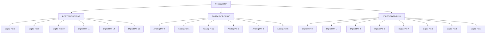

# Arduino Performance Optimization

## Introduction

When working with Arduino microcontrollers, you're often dealing with limited resources: processing power, memory, and sometimes battery life. As your projects grow in complexity, you may encounter performance bottlenecks that cause your sketch to run slowly or behave unpredictably.

This guide will walk you through various techniques to optimize your Arduino sketches, making them faster, more memory-efficient, and more energy-conservative. These optimization techniques are especially important for projects with real-time requirements, battery-powered applications, or when you're pushing the limits of what your Arduino board can handle.

## Understanding Arduino Limitations

Before diving into optimization techniques, it's important to understand the constraints we're working with:

| Arduino Model | Microcontroller | Clock Speed | Flash Memory | SRAM |
|---------------|----------------|-------------|--------------|------|
| UNO           | ATmega328P     | 16 MHz      | 32 KB        | 2 KB |
| Nano          | ATmega328P     | 16 MHz      | 32 KB        | 2 KB |
| Mega 2560     | ATmega2560     | 16 MHz      | 256 KB       | 8 KB |
| Leonardo      | ATmega32u4     | 16 MHz      | 32 KB        | 2.5 KB |
| ESP32         | Xtensa LX6     | Up to 240 MHz | 4 MB       | 520 KB |

As you can see, most Arduino boards have limited memory and processing power compared to modern computers. Let's explore how to make the most of these resources.

## Code Optimization Techniques

### 1. Use Appropriate Data Types

Choose the smallest data type that can accommodate your needs:

```cpp
// Inefficient use of data types
long counter = 0; // Uses 4 bytes, overkill for small counters

// Optimized version
byte counter = 0; // Uses only 1 byte, sufficient for values 0-255
```

Here's a table of Arduino data types and their sizes:

| Data Type | Size (bytes) | Range |
|-----------|--------------|-------|
| boolean   | 1            | true/false |
| byte      | 1            | 0 to 255 |
| char      | 1            | -128 to 127 |
| int       | 2            | -32,768 to 32,767 |
| unsigned int | 2         | 0 to 65,535 |
| long      | 4            | -2,147,483,648 to 2,147,483,647 |
| float     | 4            | -3.4028235E+38 to 3.4028235E+38 |

### 2. Avoid Floating Point Operations

Floating point math is significantly slower than integer math on microcontrollers without a floating-point unit:

```cpp
// Slow - uses floating point
float temperature = 22.5;
float adjustment = 1.5;
float result = temperature + adjustment;

// Faster - use integer math with scaling
int temperature = 225; // Scaled by 10
int adjustment = 15;   // Scaled by 10
int result = temperature + adjustment; // Work with integers
float finalResult = result / 10.0; // Convert back only when needed
```

### 3. Use Bitwise Operations

Bitwise operations are much faster than regular arithmetic operations:

```cpp
// Slow
int value = number / 2;

// Faster
int value = number >> 1;

// Example: Using bitwise operations to control multiple LEDs
byte ledStatus = 0;

// Turn on LED at position 3 (0-indexed)
ledStatus |= (1 << 3);

// Turn off LED at position 3
ledStatus &= ~(1 << 3);

// Toggle LED at position 3
ledStatus ^= (1 << 3);

// Check if LED at position 3 is on
if (ledStatus & (1 << 3)) {
  // LED is on
}
```

### 4. Use Efficient Loop Structures

Optimize your loops to minimize overhead:

```cpp
// Less efficient
for (int i = 0; i < 10; i++) {
  // Loop body
}

// More efficient
int i = 10;
while (i--) {
  // Loop body
}
```

### 5. Use Lookup Tables for Complex Calculations

Precalculate values instead of computing them repeatedly:

```cpp
// Slow - calculating sine values on the fly
float sinValue = sin(angle);

// Fast - using a lookup table
const byte SIN_TABLE[91] = {
  0, 4, 9, 13, 18, 22, 27, 31, 35, 40, 44, 49, 53, 57, 62, 66, 70, 75, 79, 83, 
  87, 91, 96, 100, 104, 108, 112, 116, 120, 124, 128, 131, 135, 139, 143, 146, 
  150, 153, 157, 160, 164, 167, 171, 174, 177, 180, 183, 186, 190, 192, 195, 
  198, 201, 204, 206, 209, 211, 214, 216, 219, 221, 223, 225, 227, 229, 231, 
  233, 235, 236, 238, 240, 241, 243, 244, 245, 246, 247, 248, 249, 250, 251, 
  252, 253, 253, 254, 254, 254, 255, 255
};

// Function to get sine value (scaled to 0-255)
byte getSine(int angle) {
  // Normalize angle to 0-360
  angle = angle % 360;
  if (angle < 0) angle += 360;
  
  // Get sine value using lookup table
  if (angle <= 90) return SIN_TABLE[angle];
  else if (angle <= 180) return SIN_TABLE[180 - angle];
  else if (angle <= 270) return -SIN_TABLE[angle - 180];
  else return -SIN_TABLE[360 - angle];
}
```

## Memory Optimization

### 1. Use Program Memory for Constant Data

Store constant data in program memory (flash) instead of SRAM:

```cpp
// Inefficient - string stored in SRAM
const char message[] = "This is a long message that takes up valuable SRAM";

// Efficient - string stored in program memory (flash)
const char message[] PROGMEM = "This is a long message stored in program memory";

// To read from program memory
char buffer[10];
strcpy_P(buffer, message); // Copy a portion to SRAM before use
```

### 2. Minimize String Usage

Avoid using the String class which can cause memory fragmentation:

```cpp
// Inefficient - uses String class
String message = "Hello";
message += " World";
Serial.println(message);

// Efficient - uses character arrays
char message[12];
strcpy(message, "Hello");
strcat(message, " World");
Serial.println(message);
```

### 3. Free Dynamic Memory When Done

If you must use dynamic memory allocation, be sure to free it:

```cpp
// Allocate memory
char* buffer = (char*) malloc(128);

// Use the buffer
// ...

// Free memory when done
free(buffer);
```

### 4. Check Available Memory

Monitor free memory during development to catch memory leaks:

```cpp
// Function to check free SRAM
int freeRam() {
  extern int __heap_start, *__brkval;
  int v;
  return (int) &v - (__brkval == 0 ? (int) &__heap_start : (int) __brkval);
}

void setup() {
  Serial.begin(9600);
  Serial.print("Free RAM: ");
  Serial.println(freeRam());
}
```

## Power Optimization

### 1. Use Sleep Modes

Put the Arduino to sleep when not in use:

```cpp
#include <avr/sleep.h>
#include <avr/power.h>

void setup() {
  // Setup code here
}

void loop() {
  // Do some work
  
  // Now go to sleep
  enterSleepMode();
  
  // Code continues here after waking up
}

void enterSleepMode() {
  // Disable ADC
  ADCSRA = 0;
  
  // Set sleep mode
  set_sleep_mode(SLEEP_MODE_PWR_DOWN);
  
  // Enable sleep
  sleep_enable();
  
  // Enter sleep mode
  sleep_mode();
  
  // Code execution resumes here after waking up
  sleep_disable();
  
  // Re-enable ADC
  ADCSRA = bit(ADEN);
}
```

### 2. Disable Unused Peripherals

Turn off components you're not using:

```cpp
void setup() {
  // Disable the ADC to save power
  ADCSRA &= ~bit(ADEN);
  
  // Disable the digital input buffers on analog pins not used as digital
  DIDR0 = 0x3F; // Disable digital input buffers on all analog pins
  
  // Disable unused peripherals
  power_adc_disable();      // Disable the ADC
  power_spi_disable();      // Disable the SPI module
  power_twi_disable();      // Disable the TWI (I2C) module
  power_timer1_disable();   // Disable Timer1
  power_timer2_disable();   // Disable Timer2
}
```

## Real-World Example: Optimized Temperature Logger

Let's put these techniques together in a practical example:

```cpp
#include <avr/sleep.h>
#include <avr/power.h>
#include <avr/pgmspace.h>

// Constants stored in program memory
const char TEMP_MSG[] PROGMEM = "Temperature: ";
const char HUMID_MSG[] PROGMEM = "Humidity: ";
const char PERCENT[] PROGMEM = "%";

// Pin definitions
#define SENSOR_PIN A0
#define LED_PIN 13

// Global variables with appropriate sizes
byte sampleCount = 0;
int temperature = 0;
unsigned long lastReadTime = 0;
bool ledState = false;

void setup() {
  Serial.begin(9600);
  pinMode(LED_PIN, OUTPUT);
  
  // Disable unused peripherals
  power_twi_disable();
  power_spi_disable();
  power_timer1_disable();
  
  // Print available memory
  Serial.print(F("Free memory: "));
  Serial.println(freeMemory());
}

void loop() {
  unsigned long currentTime = millis();
  
  // Read sensor every 5 seconds
  if (currentTime - lastReadTime >= 5000) {
    lastReadTime = currentTime;
    
    // Wake up ADC
    power_adc_enable();
    
    // Read sensor (using integer math)
    int rawValue = analogRead(SENSOR_PIN);
    temperature = (rawValue * 5000L) / 1024; // Convert to millivolts
    temperature = temperature / 10; // Convert to temperature in Celsius
    
    // Display result
    char buffer[16];
    strcpy_P(buffer, TEMP_MSG);
    Serial.print(buffer);
    Serial.print(temperature);
    Serial.println(F("°C"));
    
    // Disable ADC again to save power
    power_adc_disable();
    
    // Toggle LED using bitwise XOR
    ledState ^= 1;
    digitalWrite(LED_PIN, ledState);
    
    // Increment sample counter with overflow protection
    if (sampleCount < 255) {
      sampleCount++;
    }
  }
  
  // If nothing to do, sleep to save power
  if (currentTime - lastReadTime >= 1000) {
    enterSleepMode();
  }
}

void enterSleepMode() {
  // Configure sleep mode
  set_sleep_mode(SLEEP_MODE_IDLE);
  sleep_enable();
  
  // Enter sleep
  sleep_mode();
  
  // Resume after wake up
  sleep_disable();
}

// Function to check available memory
int freeMemory() {
  extern int __heap_start, *__brkval;
  int v;
  return (int) &v - (__brkval == 0 ? (int) &__heap_start : (int) __brkval);
}
```

## Performance Monitoring

To identify bottlenecks in your code, you can measure execution time:

```cpp
void loop() {
  unsigned long startTime = micros();
  
  // Code to test
  for (int i = 0; i < 1000; i++) {
    analogRead(A0);
  }
  
  unsigned long endTime = micros();
  Serial.print(F("Execution time: "));
  Serial.print(endTime - startTime);
  Serial.println(F(" microseconds"));
  
  delay(5000);
}
```

## Advanced Optimization: Direct Port Manipulation

For ultimate speed, you can manipulate hardware ports directly:

```cpp
// Standard Arduino digitalWrite (slower)
digitalWrite(13, HIGH);
digitalWrite(13, LOW);

// Direct port manipulation (much faster)
PORTB |= B00100000;  // Set pin 13 HIGH (pin 13 is PB5)
PORTB &= B11011111;  // Set pin 13 LOW
```

The following diagram shows the relationship between Arduino pins and AVR ports:



## Summary

Optimizing Arduino sketches involves:

1. **Code Optimization**:
   - Use appropriate data types
   - Avoid floating-point operations
   - Use bitwise operations
   - Optimize loop structures
   - Use lookup tables for complex calculations

2. **Memory Optimization**:
   - Store constants in program memory
   - Minimize String usage
   - Free dynamic memory
   - Monitor available memory

3. **Power Optimization**:
   - Use sleep modes
   - Disable unused peripherals
   - Reduce sensor polling frequency

4. **Advanced Techniques**:
   - Direct port manipulation
   - Inline assembly (for experts)

By applying these techniques, you can make your Arduino projects run faster, use less memory, and consume less power, extending battery life for portable applications.

## Additional Resources and Exercises

### Resources
- [Arduino Reference](https://www.arduino.cc/reference/en/)
- [AVR Libc Reference](https://www.nongnu.org/avr-libc/user-manual/index.html)
- [AVR Freaks Forum](https://www.avrfreaks.net/)

### Exercises

1. **Memory Benchmark**: Create a sketch that measures and reports available SRAM at different points in your program.

2. **Speed Comparison**: Write two versions of the same functionality (e.g., reading 100 sensor values) - one using standard Arduino functions and another using optimized techniques. Compare execution times.

3. **Power Optimization Challenge**: Build a battery-powered temperature sensor that can run for at least a week on a single set of AA batteries by implementing sleep modes and power management techniques.

4. **Direct Port Manipulation**: Rewrite the Blink sketch using direct port manipulation instead of digitalWrite/digitalRead and measure the speed improvement.

Happy optimizing!