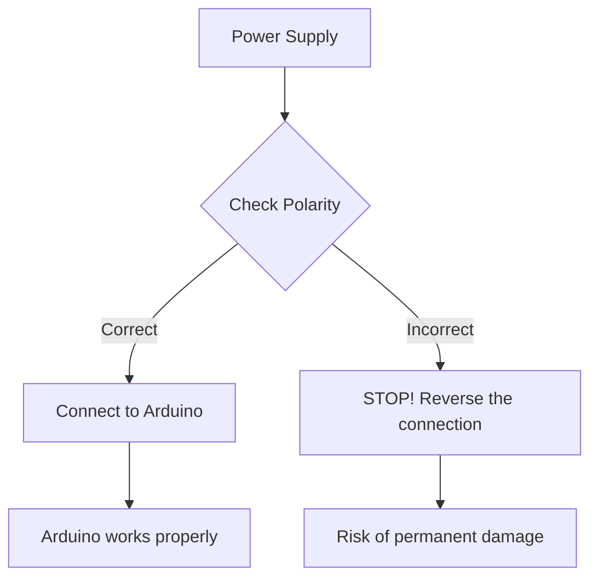

# Arduino Common Mistakes

## Introduction

When starting your journey with Arduino, it's common to encounter frustrating issues that can slow down your progress and learning. This guide identifies the most common mistakes beginners make when working with Arduino boards and provides practical solutions to help you avoid them. By understanding these pitfalls from the start, you'll save valuable time and build more reliable projects.

## Power Supply Issues

### Insufficient Power

One of the most common mistakes is not providing enough power to your Arduino and connected components.

#### Symptoms
- Arduino resets randomly
- Erratic behavior when motors or multiple components are active
- Serial communication fails intermittently

#### Solution

```cpp
// DON'T power multiple servos or motors directly from Arduino
Servo myservo1;
Servo myservo2;
Servo myservo3;
// This might cause power issues when all servos move at once

// DO use an external power supply for power-hungry components
// Connect the external power supply's ground to Arduino's ground
// In your setup:
void setup() {
  // Keep using the Arduino pins for control signals only
  myservo1.attach(9);
  // Power comes from external supply
}
```

Always use an appropriate external power supply when your project includes:
- Multiple servos or motors
- High-power LEDs or LED strips
- Components that require more than 500mA in total

### Reverse Polarity

Connecting power with reversed polarity can damage or destroy your Arduino.



## Circuit Connection Mistakes

### Incorrect Pin Modes

Not setting the correct pin modes is a frequent source of confusion.

```cpp
// INCORRECT: Using a pin without defining its mode
void setup() {
  // Missing pinMode statement
}

void loop() {
  digitalWrite(13, HIGH); // Pin mode not defined!
  delay(1000);
  digitalWrite(13, LOW);
  delay(1000);
}

// CORRECT: Always define pin modes in setup()
void setup() {
  pinMode(13, OUTPUT); // Explicitly set pin mode
}

void loop() {
  digitalWrite(13, HIGH);
  delay(1000);
  digitalWrite(13, LOW);
  delay(1000);
}
```

### Missing Pull-Up/Pull-Down Resistors

Floating inputs can cause unpredictable behavior.

```cpp
// PROBLEMATIC: Button without pull-up resistor
const int buttonPin = 2;
int buttonState = 0;

void setup() {
  pinMode(buttonPin, INPUT); // No pull-up resistor
  Serial.begin(9600);
}

void loop() {
  buttonState = digitalRead(buttonPin);
  // May read random values when button is not pressed
  Serial.println(buttonState);
  delay(100);
}

// CORRECT: Using internal pull-up resistor
void setup() {
  pinMode(buttonPin, INPUT_PULLUP); // Internal pull-up enabled
  Serial.begin(9600);
}

// CORRECT ALTERNATIVE: External pull-up resistor
// Connect a 10K resistor between buttonPin and 5V
```

### Short Circuits

Accidental short circuits can damage your Arduino or components.

#### Common short circuit scenarios:
- Direct connection between 5V and GND
- Multiple wires connected to the same breadboard row
- Stray wire strands creating unwanted connections
- Conductive materials touching the Arduino board

#### Prevention:
- Double-check all connections before powering on
- Use appropriate wire lengths
- Insert components fully into breadboard
- Use insulation where needed

## Software and Programming Mistakes

### Incorrect Library Usage

Using libraries incorrectly or forgetting to include them is a common issue.

```cpp
// INCORRECT: Using a library without including it
void setup() {
  Serial.begin(9600);
  Wire.begin(); // Error! Wire library not included
}

// CORRECT: Include all required libraries
#include <Wire.h>

void setup() {
  Serial.begin(9600);
  Wire.begin(); // Now it works
}
```

### Serial Communication Issues

Problems with serial communication can make debugging difficult.

```cpp
// INCORRECT: Missing Serial.begin() or wrong baud rate
void setup() {
  // Missing Serial.begin()
}

void loop() {
  Serial.println("Hello"); // Won't work without Serial.begin()
}

// CORRECT: Initialize Serial with matching baud rate
void setup() {
  Serial.begin(9600); // Must match Serial Monitor setting
}

void loop() {
  Serial.println("Hello"); // Works correctly
}
```

### Variable Scope Issues

Incorrect variable scope can lead to unexpected behavior.

```cpp
// PROBLEMATIC: Local variable that should be global
void setup() {
  int sensorValue = 0; // Local to setup, not accessible in loop
  Serial.begin(9600);
}

void loop() {
  sensorValue = analogRead(A0); // Error! Variable not in scope
  Serial.println(sensorValue);
  delay(100);
}

// CORRECT: Proper variable scope
int sensorValue = 0; // Global variable

void setup() {
  Serial.begin(9600);
}

void loop() {
  sensorValue = analogRead(A0); // Works correctly
  Serial.println(sensorValue);
  delay(100);
}
```

### Blocking Code

Using delays without understanding their blocking nature is a common mistake.

```cpp
// PROBLEMATIC: Blocking code with delay()
void loop() {
  digitalWrite(ledPin, HIGH);
  delay(1000); // Blocks for 1 second
  digitalWrite(ledPin, LOW);
  delay(1000); // Blocks for 1 second
  
  // During the delays, Arduino cannot do anything else!
  if (digitalRead(buttonPin) == HIGH) {
    // This might be missed during the delay periods
    performAction();
  }
}

// BETTER: Non-blocking approach using millis()
unsigned long previousMillis = 0;
const long interval = 1000;
int ledState = LOW;

void loop() {
  unsigned long currentMillis = millis();
  
  // Check if it's time to blink without blocking
  if (currentMillis - previousMillis >= interval) {
    previousMillis = currentMillis;
    ledState = (ledState == LOW) ? HIGH : LOW;
    digitalWrite(ledPin, ledState);
  }
  
  // Code here runs continuously without being blocked
  if (digitalRead(buttonPin) == HIGH) {
    // This check happens constantly, not just between delays
    performAction();
  }
}
```

## Hardware Handling Mistakes

### Static Electricity Damage

Improper handling can damage sensitive components through static discharge.

**Prevention:**
- Touch a grounded metal object before handling Arduino
- Work on anti-static mats or surfaces
- Avoid working in very dry environments or on carpets
- Store components in anti-static bags

### Incorrect Component Connection

Connecting components the wrong way can damage them permanently.


Common polarity-sensitive components:
- LEDs (longer leg is positive/anode)
- Electrolytic capacitors (marked with a stripe for negative)
- Diodes (band indicates cathode)
- Integrated circuits (look for notch or dot)

## Communication Issues

### I2C Address Conflicts

When multiple I2C devices share the same address, communication fails.

```cpp
// PROBLEMATIC: Two devices with the same I2C address
// First OLED display at 0x3C
// Second OLED display also at 0x3C - CONFLICT!

// SOLUTION: Use I2C scanner to identify addresses
#include <Wire.h>

void setup() {
  Wire.begin();
  Serial.begin(9600);
  Serial.println("I2C Scanner");
}

void loop() {
  byte error, address;
  int deviceCount = 0;
  
  Serial.println("Scanning...");
  
  for(address = 1; address < 127; address++) {
    Wire.beginTransmission(address);
    error = Wire.endTransmission();
    
    if (error == 0) {
      Serial.print("I2C device found at address 0x");
      if (address < 16) {
        Serial.print("0");
      }
      Serial.println(address, HEX);
      deviceCount++;
    }
  }
  
  Serial.println("Done.");
  Serial.print("Found ");
  Serial.print(deviceCount);
  Serial.println(" device(s).");
  delay(5000);
}
```

### Baud Rate Mismatch

When serial devices use different baud rates, communication becomes garbled.

```cpp
// INCORRECT: Different baud rates
// In Arduino code:
void setup() {
  Serial.begin(9600);
}

// But Serial Monitor set to 115200 - communication will fail!

// CORRECT: Matching baud rates
void setup() {
  Serial.begin(9600); // Must match Serial Monitor setting
}
```

## Debugging Mistakes

### Insufficient Serial Debugging

Not using Serial output for debugging slows down problem-solving.

```cpp
// BETTER: Adding debug messages
void loop() {
  int sensorValue = analogRead(A0);
  Serial.print("Sensor reading: ");
  Serial.println(sensorValue);
  
  if (sensorValue > threshold) {
    Serial.println("Threshold exceeded!");
    activateRelay();
  } else {
    Serial.println("Below threshold, relay inactive");
  }
  delay(1000);
}
```

### Not Checking Return Values

Failing to check if functions succeeded is a common oversight.

```cpp
// PROBLEMATIC: Not checking if SD card initialized
#include <SD.h>

void setup() {
  Serial.begin(9600);
  
  // Doesn't check if SD card initialized successfully
  SD.begin(4);
  
  // Attempts to open file without checking card status
  File dataFile = SD.open("data.txt", FILE_WRITE);
  dataFile.println("Data point");
  dataFile.close();
}

// CORRECT: Checking return values
void setup() {
  Serial.begin(9600);
  
  if (!SD.begin(4)) {
    Serial.println("SD card initialization failed!");
    return; // Prevents executing the rest of setup()
  }
  
  Serial.println("SD card initialized successfully.");
  
  File dataFile = SD.open("data.txt", FILE_WRITE);
  if (dataFile) {
    dataFile.println("Data point");
    dataFile.close();
    Serial.println("Data written successfully.");
  } else {
    Serial.println("Error opening data.txt!");
  }
}
```

## Advanced Issues

### Memory Management

Arduino has limited memory, which can lead to stability issues.

```cpp
// PROBLEMATIC: Memory leaks from String concatenation
void loop() {
  String message = "";
  
  // Each iteration adds to the string, potentially fragmenting memory
  for (int i = 0; i < 100; i++) {
    message += String(i) + " ";
    // String creates temporary objects that fragment memory
  }
  
  Serial.println(message);
}

// BETTER: Using character arrays or String reserve()
void loop() {
  // Option 1: Using character array
  char message[500]; // Fixed size buffer
  int pos = 0;
  
  for (int i = 0; i < 100; i++) {
    pos += sprintf(&message[pos], "%d ", i);
  }
  
  Serial.println(message);
  
  // Option 2: Using String reserve()
  String betterMessage;
  betterMessage.reserve(500); // Pre-allocate memory
  
  for (int i = 0; i < 100; i++) {
    betterMessage += String(i) + " ";
  }
}
```

### Race Conditions

Improper interrupt handling can cause race conditions.

```cpp
// PROBLEMATIC: Race condition with interrupts
volatile int counter = 0;

void setup() {
  Serial.begin(9600);
  attachInterrupt(digitalPinToInterrupt(2), buttonPressed, RISING);
}

void loop() {
  Serial.println(counter); // May read inconsistent values
  counter = 0; // Might reset while interrupt is incrementing
  delay(1000);
}

void buttonPressed() {
  counter++; // Might happen while loop() is reading or resetting
}

// BETTER: Using atomic operations
volatile int counter = 0;
volatile boolean shouldReset = false;

void setup() {
  Serial.begin(9600);
  attachInterrupt(digitalPinToInterrupt(2), buttonPressed, RISING);
}

void loop() {
  noInterrupts(); // Disable interrupts temporarily
  int safeCount = counter;
  if (shouldReset) {
    counter = 0;
    shouldReset = false;
  }
  interrupts(); // Re-enable interrupts
  
  Serial.println(safeCount);
  shouldReset = true; // Flag for reset, will be handled safely
  delay(1000);
}

void buttonPressed() {
  counter++; // Still volatile, but access is now coordinated
}
```

## Summary

Avoiding these common Arduino mistakes will save you time and frustration:

1. **Power Issues**: Use appropriate power supplies and check polarity
2. **Circuit Connections**: Set pin modes correctly and use pull-up/pull-down resistors
3. **Programming**: Include necessary libraries and pay attention to variable scope
4. **Hardware Handling**: Protect components from static and connect them correctly
5. **Communication**: Ensure devices have unique addresses and matching baud rates
6. **Debugging**: Use Serial debugging extensively and check function return values
7. **Advanced Issues**: Manage memory carefully and handle interrupts properly

By keeping these common pitfalls in mind, you'll create more reliable Arduino projects and enjoy a smoother learning experience.

## Practice Exercises

1. Debug a sketch with a missing library and incorrect pin mode
2. Create a non-blocking version of a sketch that uses multiple delay() calls
3. Design a circuit that properly includes pull-up resistors for multiple buttons
4. Write a sketch that properly checks return values and provides useful debugging information
5. Implement a memory-efficient program that handles strings without causing fragmentation

## Additional Resources

- Arduino's official troubleshooting guide
- Nick Gammon's debugging techniques
- Adafruit's guide to power supplies
- Paul Stoffregen's (Teensy creator) articles on efficient Arduino programming