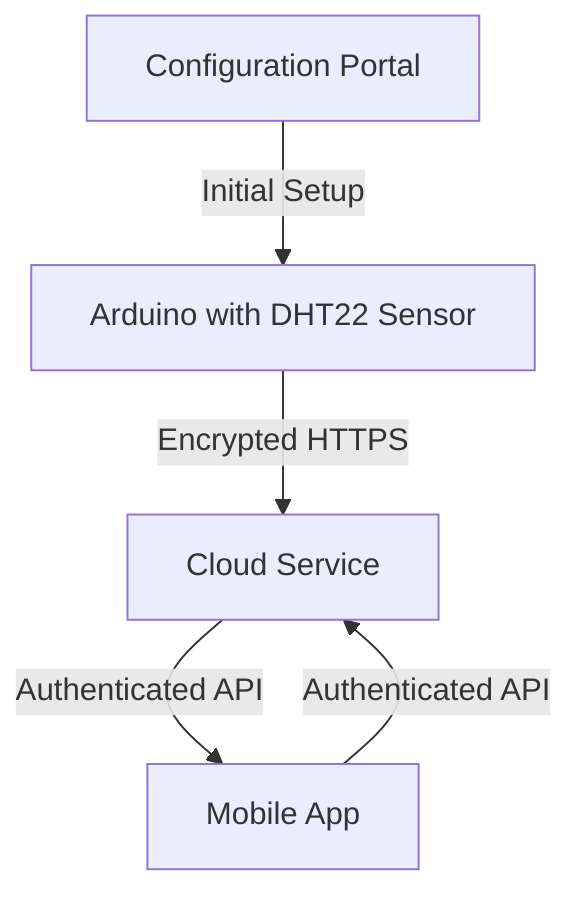

# Arduino Security

## Introduction

Security is often overlooked in Arduino projects, especially by beginners who are focused on getting their creations to work. However, as Internet of Things (IoT) devices become more prevalent, understanding how to secure your Arduino projects is increasingly important. Insecure devices can be compromised, leading to privacy breaches, device manipulation, or even becoming part of larger attack networks.

This guide covers essential security practices for Arduino development, helping you build projects that are not only functional but also resistant to common security threats.

## Why Arduino Security Matters

Arduino boards are frequently used in home automation, environmental monitoring, and other connected applications that may:

- Control physical devices in your environment
- Collect sensitive data
- Connect to your home network
- Communicate with cloud services

An insecure Arduino project could allow attackers to:

- Access your private network
- Monitor or manipulate sensor data
- Take control of connected actuators (motors, relays, etc.)
- Use your device as an entry point for broader attacks

## Common Arduino Security Vulnerabilities

### 1. Hardcoded Credentials

One of the most common mistakes in Arduino projects is embedding sensitive information directly in the code.

```cpp
// INSECURE: Hardcoded credentials in sketch
const char* ssid = "MyHomeWiFi";
const char* password = "SuperSecretPassword123";
const char* apiKey = "a1b2c3d4e5f6g7h8i9j0";

void setup() {
  // Connect to WiFi using hardcoded credentials
  WiFi.begin(ssid, password);
  // ...
}
```

### 2. Unencrypted Communication

Sending data without encryption allows anyone monitoring network traffic to intercept information.

```cpp
// INSECURE: Sending data without encryption
void sendSensorData(float temperature) {
  if (client.connect(server, 80)) {
    client.print("GET /update?temp=");
    client.print(temperature);
    client.print("&key=");
    client.print(apiKey);
    client.println(" HTTP/1.1");
    client.println("Host: example.com");
    client.println("Connection: close");
    client.println();
  }
}
```

### 3. Lack of Input Validation

Accepting and processing external input without validation can lead to buffer overflows or unexpected behavior.

```cpp
// INSECURE: No input validation
void processCommand() {
  char buffer[10];
  int bytesReceived = Serial.readBytesUntil('
', buffer, 100); // Buffer overflow risk!
  executeCommand(buffer);
}
```

### 4. Missing Authentication

Many Arduino projects allow anyone to connect and control the device without verifying identity.

### 5. Debug Information Exposure

Leaving debug information enabled in production can reveal sensitive details about your system.

## Security Best Practices for Arduino

### 1. Secure Storage of Credentials

Instead of hardcoding credentials, consider these approaches:

#### Using External Storage (EEPROM/SD)

```cpp
// BETTER: Store credentials in EEPROM
#include <EEPROM.h>

struct {
  char ssid[32];
  char password[64];
  char apiKey[32];
} credentials;

void loadCredentials() {
  EEPROM.get(0, credentials);
}

void setup() {
  loadCredentials();
  WiFi.begin(credentials.ssid, credentials.password);
  // ...
}
```

#### Using a Configuration Portal

```cpp
// BEST: WiFiManager for secure credential management
#include <WiFiManager.h>

void setup() {
  WiFiManager wifiManager;
  
  // On first boot or reset, creates an access point "ArduinoSetup"
  // User connects to this AP and configures credentials through a web portal
  wifiManager.autoConnect("ArduinoSetup");
  
  Serial.println("Connected to WiFi");
}
```

### 2. Implementing Encrypted Communication

Use secure protocols whenever possible:

```cpp
// SECURE: Using HTTPS for communication
#include <WiFiClientSecure.h>
#include <ArduinoHttpClient.h>

WiFiClientSecure secureClient;
HttpClient client(secureClient, "api.example.com", 443);

void sendSecureData(float temperature) {
  // Set the server's SSL certificate fingerprint for verification
  secureClient.setFingerprint(serverFingerprint);
  
  String path = "/update?temp=" + String(temperature) + "&key=" + apiKey;
  client.get(path);
}
```

### 3. Proper Input Validation

Always validate input before processing:

```cpp
// SECURE: With input validation
void processCommand() {
  char buffer[10];
  int bytesReceived = Serial.readBytesUntil('
', buffer, 9); // Leave room for null terminator
  buffer[bytesReceived] = '\0'; // Ensure null termination
  
  // Validate input before use
  if (isValidCommand(buffer)) {
    executeCommand(buffer);
  } else {
    Serial.println("Invalid command");
  }
}

bool isValidCommand(const char* cmd) {
  // Check if command is within expected set
  if (strcmp(cmd, "ON") == 0 || strcmp(cmd, "OFF") == 0 || strcmp(cmd, "STATUS") == 0) {
    return true;
  }
  return false;
}
```

### 4. Implementing Authentication

Add authentication to prevent unauthorized access:

```cpp
// SECURE: With simple authentication
const char* validTokens[] = {"t1_abc123", "t2_def456", "t3_ghi789"};
const int numTokens = 3;

bool authenticateRequest(String token) {
  for (int i = 0; i < numTokens; i++) {
    if (token.equals(validTokens[i])) {
      return true;
    }
  }
  return false;
}

void handleRequest() {
  String token = server.arg("token");
  
  if (authenticateRequest(token)) {
    // Process authenticated request
    String command = server.arg("cmd");
    executeCommand(command);
  } else {
    server.send(401, "text/plain", "Unauthorized");
  }
}
```

### 5. Secure Bootloader and Firmware Updates

Protect against unauthorized firmware modification:

```cpp
// SECURE: OTA updates with verification
#include <ArduinoOTA.h>

void setupSecureOTA() {
  // Set password for OTA updates
  ArduinoOTA.setPassword("secure-ota-password");
  
  // Optional: Set hostname
  ArduinoOTA.setHostname("arduino-security-demo");
  
  // Optional: Add additional verification
  ArduinoOTA.onStart([]() {
    Serial.println("OTA update starting");
  });
  
  ArduinoOTA.onEnd([]() {
    Serial.println("OTA update complete");
  });
  
  ArduinoOTA.onError([](ota_error_t error) {
    Serial.print("OTA Error: ");
    Serial.println(error);
  });
  
  ArduinoOTA.begin();
}

void loop() {
  // Handle OTA updates in the main loop
  ArduinoOTA.handle();
  
  // Rest of your code
}
```

### 6. Disabling Debug Information in Production

Remove unnecessary debug information when deploying:

```cpp
// Development version with debug info
#define DEBUG_MODE

void setup() {
  Serial.begin(9600);
  
  #ifdef DEBUG_MODE
  Serial.println("Connecting to WiFi...");
  Serial.print("SSID: ");
  Serial.println(credentials.ssid);
  #endif
  
  WiFi.begin(credentials.ssid, credentials.password);
  
  #ifdef DEBUG_MODE
  Serial.println("Connected!");
  Serial.print("IP address: ");
  Serial.println(WiFi.localIP());
  #endif
}
```

For production, simply comment out or remove the `DEBUG_MODE` definition.

## Real-World Example: Secure Weather Station

Let's build a secure IoT weather station that reports temperature and humidity to a cloud service.



### Project Implementation

```cpp
#include <WiFiManager.h>          // For secure WiFi configuration
#include <WiFiClientSecure.h>      // For HTTPS connections
#include <ArduinoHttpClient.h>     // For simplified HTTP requests
#include <ArduinoJson.h>           // For JSON parsing/creation
#include <DHT.h>                   // For the DHT22 sensor
#include <EEPROM.h>                // For storing API key

#define DHTPIN 2                   // DHT22 connected to pin 2
#define DHTTYPE DHT22
#define API_KEY_ADDR 0             // EEPROM address for API key storage
#define API_KEY_SIZE 33            // Size including null terminator

DHT dht(DHTPIN, DHTTYPE);
WiFiClientSecure secureClient;
char apiKey[API_KEY_SIZE] = {0};   // Will store our API key

// Server certificate fingerprint (example)
const char fingerprint[] PROGMEM = "DE AD BE EF DE AD BE EF DE AD BE EF DE AD BE EF DE AD BE EF";

void setup() {
  Serial.begin(9600);
  dht.begin();
  
  // Setup WiFi using WiFiManager
  WiFiManager wifiManager;
  
  // Custom parameter for API key
  WiFiManagerParameter apiKeyParam("apikey", "API Key", apiKey, 32);
  wifiManager.addParameter(&apiKeyParam);
  
  // Auto-connect using saved credentials or start config portal
  if (!wifiManager.autoConnect("WeatherStation")) {
    Serial.println("Failed to connect and timeout occurred");
    ESP.restart();
  }
  
  // Save the API key from the configuration portal
  strncpy(apiKey, apiKeyParam.getValue(), API_KEY_SIZE - 1);
  apiKey[API_KEY_SIZE - 1] = '\0';  // Ensure null termination
  
  // Store API key in EEPROM
  EEPROM.begin(API_KEY_SIZE);
  EEPROM.put(API_KEY_ADDR, apiKey);
  EEPROM.commit();
  
  Serial.println("Connected to WiFi");
}

void loop() {
  // Read sensor data
  float humidity = dht.readHumidity();
  float temperature = dht.readTemperature();
  
  // Check if readings are valid
  if (isnan(humidity) || isnan(temperature)) {
    Serial.println("Failed to read from DHT sensor!");
    delay(5000);
    return;
  }
  
  // Send data securely
  if (sendSecureData(temperature, humidity)) {
    Serial.println("Data sent successfully");
  } else {
    Serial.println("Failed to send data");
  }
  
  // Wait 15 minutes before next reading
  delay(15 * 60 * 1000);
}

bool sendSecureData(float temperature, float humidity) {
  // Set server certificate fingerprint
  secureClient.setFingerprint(fingerprint);
  
  // Create HTTPS client
  HttpClient client(secureClient, "api.weatherexample.com", 443);
  
  // Prepare JSON data
  StaticJsonDocument<200> doc;
  doc["temperature"] = temperature;
  doc["humidity"] = humidity;
  doc["api_key"] = apiKey;
  
  String jsonData;
  serializeJson(doc, jsonData);
  
  // Send POST request
  client.beginRequest();
  client.post("/api/v1/weather");
  client.sendHeader("Content-Type", "application/json");
  client.sendHeader("Content-Length", jsonData.length());
  client.beginBody();
  client.print(jsonData);
  client.endRequest();
  
  // Get response
  int statusCode = client.responseStatusCode();
  
  return (statusCode >= 200 && statusCode < 300);
}
```

This example demonstrates several security best practices:
- Using WiFiManager for secure credential management
- Storing the API key in EEPROM
- Using HTTPS for encrypted communication
- Validating sensor data before transmission
- Using certificate verification with fingerprints
- Implementing proper error handling

## Security Testing for Arduino Projects

Before deploying your Arduino projects, consider these security tests:

1. **Network Security Testing**
   - Use Wireshark to analyze network traffic
   - Check if sensitive data is properly encrypted
   - Verify that authentication is working

2. **Input Validation Testing**
   - Try sending malformed commands or oversized data
   - Test boundary conditions and edge cases
   - Attempt buffer overflow attacks

3. **Firmware Security**
   - Verify that OTA updates require authentication
   - Check if debug ports (UART, JTAG) are properly secured
   - Ensure sensitive data is not exposed in firmware

## Summary

Securing Arduino projects requires attention to several key areas:

1. **Credential Management** - Avoid hardcoding sensitive information
2. **Encrypted Communication** - Use HTTPS or other encrypted protocols
3. **Input Validation** - Always validate and sanitize external input
4. **Authentication** - Implement proper access controls
5. **Secure Updates** - Ensure firmware updates are authenticated
6. **Minimal Exposure** - Disable debug information in production

By incorporating these security practices into your Arduino projects, you can build IoT devices that are not only functional but also resistant to common security threats.

## Additional Resources

- [Arduino Cryptography Library](https://www.arduino.cc/reference/en/libraries/crypto/)
- [ESP8266/ESP32 Security Documentation](https://arduino-esp8266.readthedocs.io/en/latest/esp8266wifi/readme.html)
- [OWASP IoT Security Guidance](https://owasp.org/www-project-internet-of-things/)

## Exercises

1. Modify the Weather Station example to use a different authentication method, such as JWT tokens.
2. Implement a secure data logging system that stores sensor data locally with encryption.
3. Create a secure communication protocol between two Arduino devices using AES encryption.
4. Design a system that detects and responds to potential security breaches, such as multiple failed authentication attempts.
5. Implement a secure firmware update mechanism that verifies the integrity of updates before installation.