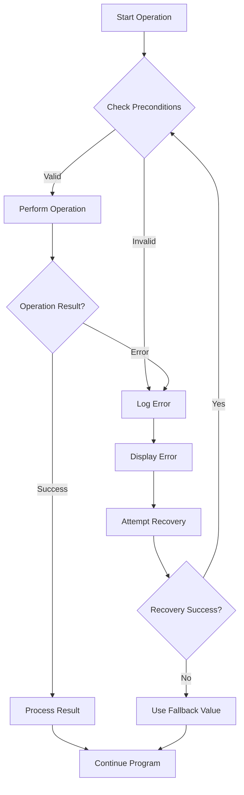

# Arduino Error Handling

## Introduction

When developing Arduino applications, things don't always go as planned. Sensors might fail to respond, memory could become corrupted, or user input might be invalid. Effective error handling is crucial to building robust Arduino applications that can gracefully manage unexpected situations.

In this guide, we'll explore various error handling techniques specifically tailored for Arduino development. You'll learn how to identify, manage, and recover from errors in your Arduino projects, making your applications more reliable and user-friendly.

## Why Error Handling Matters

Without proper error handling, your Arduino projects might:

- Crash unexpectedly
- Produce incorrect results
- Get stuck in infinite loops
- Fail silently without any indication of what went wrong
- Behave unpredictably when encountering edge cases

Let's explore the techniques to prevent these issues.

## Basic Error Handling Techniques

### Using Return Values

One of the simplest error handling approaches is using return values to indicate success or failure.

```cpp
int readSensor() {
  int value = analogRead(A0);
  
  // Check if the reading is within expected range
  if (value < 100 || value > 900) {
    return -1; // Error code indicating out-of-range value
  }
  
  return value; // Valid reading
}

void setup() {
  Serial.begin(9600);
}

void loop() {
  int sensorValue = readSensor();
  
  if (sensorValue == -1) {
    Serial.println("Error: Sensor reading out of expected range!");
  } else {
    Serial.print("Sensor value: ");
    Serial.println(sensorValue);
  }
  
  delay(1000);
}
```

In this example:
- The `readSensor()` function returns `-1` if the reading is outside the expected range
- The calling code checks for this error condition and responds accordingly

### Using Error Codes

For more complex error handling, you can define specific error codes:

```cpp
// Define error codes
#define ERROR_NONE 0
#define ERROR_SENSOR_DISCONNECTED 1
#define ERROR_READING_OUT_OF_RANGE 2
#define ERROR_COMMUNICATION_FAILED 3

int lastError = ERROR_NONE;

int readSensorWithErrorCode() {
  int value = analogRead(A0);
  
  // No reading usually means disconnected sensor
  if (value == 0) {
    lastError = ERROR_SENSOR_DISCONNECTED;
    return -1;
  }
  
  // Check if the reading is within expected range
  if (value < 100 || value > 900) {
    lastError = ERROR_READING_OUT_OF_RANGE;
    return -1;
  }
  
  lastError = ERROR_NONE;
  return value;
}

void reportError() {
  switch (lastError) {
    case ERROR_NONE:
      // No action needed
      break;
    case ERROR_SENSOR_DISCONNECTED:
      Serial.println("ERROR: Sensor appears to be disconnected");
      break;
    case ERROR_READING_OUT_OF_RANGE:
      Serial.println("ERROR: Sensor reading outside expected range");
      break;
    case ERROR_COMMUNICATION_FAILED:
      Serial.println("ERROR: Communication with peripheral failed");
      break;
    default:
      Serial.println("ERROR: Unknown error occurred");
  }
}
```

This approach lets you track different types of errors and respond to each appropriately.

## Error Handling with Status Objects

For more complex applications, you can create a dedicated error handling structure:

```cpp
struct ErrorStatus {
  bool hasError;
  int errorCode;
  const char* errorMessage;
};

ErrorStatus readTemperature() {
  ErrorStatus status = {false, 0, ""};
  float reading = analogRead(A0) * 0.48876;
  
  if (reading < -20 || reading > 125) {
    status.hasError = true;
    status.errorCode = 1;
    status.errorMessage = "Temperature out of sensor range";
  }
  
  return status;
}

void loop() {
  ErrorStatus tempStatus = readTemperature();
  
  if (tempStatus.hasError) {
    Serial.print("Error: ");
    Serial.println(tempStatus.errorMessage);
    // Take corrective action
  } else {
    // Process valid reading
  }
  
  delay(1000);
}
```

This pattern provides rich error information that can help with debugging and recovery.

## Visual Error Indication

On Arduino projects with LEDs or displays, it's helpful to provide visual feedback:

```cpp
// Define pins
const int errorLedPin = 13;  // Built-in LED
const int sensorPin = A0;

void indicateError(int errorCode) {
  // Blink the LED according to error code
  // Error code 1: blink once, Error code 2: blink twice, etc.
  for (int i = 0; i < errorCode; i++) {
    digitalWrite(errorLedPin, HIGH);
    delay(200);
    digitalWrite(errorLedPin, LOW);
    delay(200);
  }
  delay(1000);  // Pause between repetitions
}

void setup() {
  pinMode(errorLedPin, OUTPUT);
  Serial.begin(9600);
}

void loop() {
  int sensorValue = analogRead(sensorPin);
  
  // Example error conditions
  if (sensorValue < 100) {
    Serial.println("Error: Low sensor value");
    indicateError(1);
  } else if (sensorValue > 900) {
    Serial.println("Error: High sensor value");
    indicateError(2);
  } else {
    // Normal operation
    digitalWrite(errorLedPin, LOW);
    Serial.println(sensorValue);
  }
  
  delay(500);
}
```

This technique is particularly useful for projects that operate without a serial connection to a computer.

## Handling I2C and SPI Communication Errors

Communication with sensors and modules often uses I2C or SPI protocols, which can fail:

```cpp
#include <Wire.h>

bool readI2CDevice(int address, byte* data, int length) {
  Wire.beginTransmission(address);
  byte error = Wire.endTransmission();
  
  if (error != 0) {
    Serial.print("I2C Error: ");
    switch (error) {
      case 1:
        Serial.println("Data too long for buffer");
        break;
      case 2:
        Serial.println("Received NACK on address transmission");
        break;
      case 3:
        Serial.println("Received NACK on data transmission");
        break;
      case 4:
        Serial.println("Other error");
        break;
    }
    return false;
  }
  
  Wire.requestFrom(address, length);
  if (Wire.available() < length) {
    Serial.println("Error: Not enough data received");
    return false;
  }
  
  for (int i = 0; i < length; i++) {
    data[i] = Wire.read();
  }
  
  return true;
}

void setup() {
  Wire.begin();
  Serial.begin(9600);
}

void loop() {
  byte data[2];
  
  if (readI2CDevice(0x48, data, 2)) {
    // Process valid data
    int value = (data[0] << 8) | data[1];
    Serial.print("Sensor reading: ");
    Serial.println(value);
  } else {
    // Handle the error - already printed by readI2CDevice
    // Perhaps try again or take alternative action
  }
  
  delay(1000);
}
```

## Timeout Mechanisms

Arduino code often interacts with external devices that might not respond. Implementing timeouts prevents your code from getting stuck:

```cpp
bool waitForSensorData(unsigned long timeout) {
  unsigned long startTime = millis();
  
  while (digitalRead(sensorDataReadyPin) == LOW) {
    if (millis() - startTime > timeout) {
      Serial.println("Error: Sensor data timeout");
      return false;
    }
    // Optional: small delay to prevent CPU hogging
    delay(1);
  }
  
  return true;
}

void loop() {
  if (waitForSensorData(1000)) {  // 1 second timeout
    // Read and process sensor data
    int value = analogRead(sensorPin);
    Serial.println(value);
  } else {
    // Handle timeout error
    // Perhaps retry or use fallback data
  }
}
```

This pattern works for any operation that might take an unpredictable amount of time.

## Watchdog Timer

Arduino's built-in watchdog timer can reset the system if your code gets stuck in an infinite loop:

```cpp
#include <avr/wdt.h>

volatile bool operationComplete = false;

void setup() {
  Serial.begin(9600);
  Serial.println("System starting...");
  
  // Enable the watchdog timer with a 2-second timeout
  wdt_enable(WDTO_2S);
}

void loop() {
  // Reset the watchdog timer at the beginning of each loop
  wdt_reset();
  
  Serial.println("Starting long operation...");
  
  // Simulate an operation that might hang
  longOperation();
  
  if (operationComplete) {
    Serial.println("Operation completed successfully");
  } else {
    Serial.println("Operation failed");
  }
  
  delay(1000);
}

void longOperation() {
  // If this function gets stuck, the watchdog will eventually
  // reset the Arduino after the timeout period
  
  // Simulating an operation that takes time
  for (int i = 0; i < 10; i++) {
    // Remember to reset the watchdog during long operations
    wdt_reset();
    delay(100);
  }
  
  operationComplete = true;
}
```

The watchdog timer provides a safety net for your application, ensuring it can recover from lockups.

## Error Logging

For debugging complex systems, logging errors to external storage can be invaluable:

```cpp
#include <SD.h>

const int chipSelect = 4;  // SD card CS pin

void logError(const char* errorMessage) {
  // Open the log file
  File logFile = SD.open("error_log.txt", FILE_WRITE);
  
  if (logFile) {
    // Get current uptime for timestamp
    unsigned long uptime = millis();
    
    // Write the error with a timestamp
    logFile.print(uptime);
    logFile.print(": ");
    logFile.println(errorMessage);
    
    // Close the file
    logFile.close();
    
    // Also output to serial for immediate feedback
    Serial.print("ERROR LOGGED [");
    Serial.print(uptime);
    Serial.print("]: ");
    Serial.println(errorMessage);
  } else {
    // If we couldn't open the log file, report to serial
    Serial.println("Error: Could not open log file");
  }
}

void setup() {
  Serial.begin(9600);
  
  // Initialize SD card
  if (!SD.begin(chipSelect)) {
    Serial.println("Error: SD card initialization failed");
    return;
  }
  
  Serial.println("SD card initialized. Error logging available.");
}

void loop() {
  int sensorValue = analogRead(A0);
  
  if (sensorValue < 100) {
    logError("Sensor value too low");
    // Handle error condition
  }
  
  delay(1000);
}
```

This approach is especially useful for projects that run unattended or have intermittent issues.

## Error Recovery Strategies

Sometimes, it's not enough to just detect errors - you need recovery strategies:

```cpp
#define MAX_RETRY_ATTEMPTS 3

bool communicateWithSensor(int* result) {
  int retryCount = 0;
  
  while (retryCount < MAX_RETRY_ATTEMPTS) {
    // Attempt to read from sensor
    *result = analogRead(A0);
    
    // Check if reading is valid
    if (*result > 100 && *result < 900) {
      return true;  // Valid reading
    }
    
    // If we get here, reading was invalid
    Serial.print("Retry #");
    Serial.print(retryCount + 1);
    Serial.println(" for sensor reading");
    
    retryCount++;
    delay(100);  // Wait before retry
  }
  
  return false;  // Failed after all retry attempts
}

void loop() {
  int sensorValue;
  
  if (communicateWithSensor(&sensorValue)) {
    Serial.print("Valid sensor reading: ");
    Serial.println(sensorValue);
  } else {
    Serial.println("Failed to get valid reading after max retries");
    // Fall back to default value or alternate data source
    sensorValue = 500;  // Default fallback value
  }
  
  // Continue with operation using sensorValue
  
  delay(1000);
}
```

The retry pattern can help overcome transient errors in sensors or communications.

## Visual Error Flow Chart

Here's a flowchart showing a typical error handling process in Arduino applications:



## Memory Considerations

Arduino has limited memory, so error handling should be efficient:

```cpp
// Instead of storing full error messages in RAM
const char* getErrorMessage(int errorCode) {
  // These strings are stored in program memory, not RAM
  switch (errorCode) {
    case 1: return F("Sensor disconnected");
    case 2: return F("Reading out of range");
    case 3: return F("Communication timeout");
    case 4: return F("Calibration failed");
    default: return F("Unknown error");
  }
}

void reportError(int code) {
  Serial.print(F("ERROR #"));
  Serial.print(code);
  Serial.print(F(": "));
  Serial.println(getErrorMessage(code));
}
```

Using the `F()` macro stores strings in flash memory instead of RAM, which is especially important for error messages that might not be used often.

## Real-World Example: Weather Station

Let's look at a more complete example for a weather station with error handling:

```cpp
#include <DHT.h>
#include <Wire.h>
#include <SPI.h>
#include <SD.h>

// Pin definitions
#define DHT_PIN 2
#define DHT_TYPE DHT22
#define WIND_SPEED_PIN 3
#define ERROR_LED_PIN 13
#define SD_CS_PIN 10

// Error codes
#define ERROR_NONE 0
#define ERROR_TEMP_SENSOR 1
#define ERROR_WIND_SENSOR 2
#define ERROR_SD_CARD 3

// Global variables
DHT dht(DHT_PIN, DHT_TYPE);
int currentErrorCode = ERROR_NONE;
unsigned long lastErrorBlinkTime = 0;
bool errorLedState = false;

void setup() {
  Serial.begin(9600);
  pinMode(ERROR_LED_PIN, OUTPUT);
  pinMode(WIND_SPEED_PIN, INPUT_PULLUP);
  
  dht.begin();
  Serial.println(F("Weather station starting..."));
  
  if (!SD.begin(SD_CS_PIN)) {
    handleError(ERROR_SD_CARD, F("SD card initialization failed"));
  }
}

void loop() {
  // Process any active errors (blink LED according to error code)
  processErrorIndicator();
  
  // Read temperature and humidity
  float humidity = dht.readHumidity();
  float temperature = dht.readTemperature();
  
  // Check if temperature reading failed
  if (isnan(temperature) || isnan(humidity)) {
    handleError(ERROR_TEMP_SENSOR, F("Failed to read from DHT sensor"));
  } else {
    // Valid reading, clear any temperature sensor error
    if (currentErrorCode == ERROR_TEMP_SENSOR) {
      clearError();
    }
    
    // Log and display temperature
    Serial.print(F("Temperature: "));
    Serial.print(temperature);
    Serial.println(F("°C"));
    
    Serial.print(F("Humidity: "));
    Serial.print(humidity);
    Serial.println(F("%"));
    
    // Log to SD card
    logWeatherData(temperature, humidity);
  }
  
  // Read wind speed (simplified)
  int windReading = analogRead(WIND_SPEED_PIN);
  if (windReading < 10) {
    handleError(ERROR_WIND_SENSOR, F("Wind sensor may be disconnected"));
  } else {
    // Convert reading to speed and display
    float windSpeed = windReading * 0.1;  // simplified conversion
    Serial.print(F("Wind: "));
    Serial.print(windSpeed);
    Serial.println(F(" m/s"));
  }
  
  delay(2000);
}

void handleError(int errorCode, const char* message) {
  // Set the current error
  currentErrorCode = errorCode;
  
  // Log the error
  Serial.print(F("ERROR #"));
  Serial.print(errorCode);
  Serial.print(F(": "));
  Serial.println(message);
  
  // Also log to SD if it's not an SD card error
  if (errorCode != ERROR_SD_CARD && SD.begin(SD_CS_PIN)) {
    File logFile = SD.open("error.log", FILE_WRITE);
    if (logFile) {
      logFile.print(millis());
      logFile.print(F(", "));
      logFile.print(errorCode);
      logFile.print(F(", "));
      logFile.println(message);
      logFile.close();
    }
  }
}

void processErrorIndicator() {
  if (currentErrorCode != ERROR_NONE) {
    // Blink the LED according to error code
    unsigned long currentTime = millis();
    
    // Blink pattern: quick blinks equal to error code, then pause
    unsigned long blinkCycleTime = currentTime % 3000;  // 3-second cycle
    
    if (blinkCycleTime < (currentErrorCode * 400)) {  // 400ms per blink
      // We're in the blinking phase of the cycle
      if (currentTime - lastErrorBlinkTime > 200) {
        errorLedState = !errorLedState;
        digitalWrite(ERROR_LED_PIN, errorLedState);
        lastErrorBlinkTime = currentTime;
      }
    } else {
      // We're in the pause phase of the cycle
      digitalWrite(ERROR_LED_PIN, LOW);
    }
  } else {
    // No error, ensure LED is off
    digitalWrite(ERROR_LED_PIN, LOW);
  }
}

void clearError() {
  currentErrorCode = ERROR_NONE;
  digitalWrite(ERROR_LED_PIN, LOW);
  Serial.println(F("Error condition cleared"));
}

void logWeatherData(float temp, float humidity) {
  // Only attempt to log if SD card was working
  if (currentErrorCode != ERROR_SD_CARD) {
    if (SD.begin(SD_CS_PIN)) {
      File dataFile = SD.open("weather.csv", FILE_WRITE);
      
      if (dataFile) {
        // Log timestamp, temperature, humidity
        dataFile.print(millis());
        dataFile.print(F(","));
        dataFile.print(temp);
        dataFile.print(F(","));
        dataFile.println(humidity);
        dataFile.close();
      } else {
        handleError(ERROR_SD_CARD, F("Could not open data file for writing"));
      }
    }
  }
}
```

This example demonstrates:
- Error detection for multiple subsystems
- Visual error indication with different blink patterns
- Error logging to SD card
- Error recovery attempts
- Clear and well-documented error handling flow

## Best Practices Summary

1. **Be Specific**: Use clear error codes and messages that identify the exact issue
2. **Provide Feedback**: Always indicate errors to the user through LEDs, display, or serial output
3. **Implement Timeouts**: Never let your code wait indefinitely for an operation to complete
4. **Use Watchdog Timers**: For mission-critical applications, implement watchdog resets
5. **Consider Memory**: Use flash memory (`F()` macro) for error strings to save RAM
6. **Add Logging**: For complex systems, log errors to help with debugging
7. **Plan for Recovery**: Include retry mechanisms and fallback options
8. **Test Edge Cases**: Deliberately test your error handling by creating error conditions
9. **Graceful Degradation**: Design your system to continue with limited functionality when parts fail
10. **Document Errors**: Maintain a list of error codes and their meanings for troubleshooting

## Exercises

1. Add error handling to an existing Arduino project you've built.
2. Create a system that monitors multiple sensors and reports specific errors for each.
3. Implement a watchdog timer in a project that needs to run unattended.
4. Design an error logging system that stores the last 10 errors to EEPROM.
5. Build a project with degraded functionality modes that activate when specific components fail.

## Additional Resources

- The [Arduino Reference](https://www.arduino.cc/reference/en/) provides documentation on core functions
- Look into the `<avr/wdt.h>` library for more watchdog timer options
- For advanced projects, consider state machine designs that include error states
- The `ArduinoJSON` library offers robust error handling for parsing JSON data
- The `ErriezSerialTerminal` library provides a framework for error reporting via serial

With these error handling techniques, your Arduino projects will be more robust, easier to debug, and more reliable in real-world conditions. Remember that good error handling is often the difference between a project that works occasionally and one that works consistently.