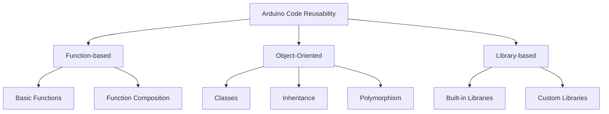

# Arduino Code Reusability

## Introduction

When working with Arduino, beginners often write code that works for a specific project but becomes difficult to reuse in future projects. Code reusability is a fundamental concept in programming that allows you to save time, reduce errors, and maintain consistency across projects. This guide will explore techniques to make your Arduino code more reusable, modular, and maintainable.

## Why Code Reusability Matters

Writing reusable code offers several benefits:

- **Save time**: Write code once, use it many times
- **Reduce errors**: Well-tested reusable code is more reliable
- **Easier maintenance**: Fix bugs or make improvements in one place
- **Streamlined development**: Build new projects faster with existing code components
- **Better organization**: Create more logical, structured projects

## Techniques for Arduino Code Reusability

### 1. Using Functions

Functions are the building blocks of reusable code. They allow you to encapsulate specific tasks into named blocks that can be called whenever needed.

#### Basic Function Structure

```cpp
// Function declaration
returnType functionName(parameterType parameterName) {
  // Function body
  // Code that performs a specific task
  
  return value; // Optional, depending on returnType
}
```

#### Example: LED Blinking Function

Instead of writing the same blinking code repeatedly, create a function:

```cpp
void blinkLED(int pin, int duration, int repeats) {
  for (int i = 0; i < repeats; i++) {
    digitalWrite(pin, HIGH);
    delay(duration);
    digitalWrite(pin, LOW);
    delay(duration);
  }
}

void setup() {
  pinMode(13, OUTPUT);
}

void loop() {
  blinkLED(13, 500, 3); // Blink pin 13 LED three times with 500ms intervals
  delay(1000);          // Wait 1 second
}
```

### 2. Creating Header Files

For more complex projects, separating your code into multiple files makes it easier to reuse and maintain.

#### Project Structure with Header Files

```
MyProject/
  ├── MyProject.ino     (Main sketch file)
  ├── LEDPatterns.h     (Header file with LED pattern declarations)
  └── LEDPatterns.cpp   (Implementation file with function definitions)
```

#### Example: LED Patterns in Header Files

**LEDPatterns.h**
```cpp
#ifndef LED_PATTERNS_H
#define LED_PATTERNS_H

void blinkLED(int pin, int duration, int repeats);
void fadeInOut(int pin, int fadeTime);
void chasePattern(int pins[], int pinCount, int speed);

#endif
```

**LEDPatterns.cpp**
```cpp
#include "Arduino.h"
#include "LEDPatterns.h"

void blinkLED(int pin, int duration, int repeats) {
  for (int i = 0; i < repeats; i++) {
    digitalWrite(pin, HIGH);
    delay(duration);
    digitalWrite(pin, LOW);
    delay(duration);
  }
}

void fadeInOut(int pin, int fadeTime) {
  // Fade in
  for (int brightness = 0; brightness <= 255; brightness++) {
    analogWrite(pin, brightness);
    delay(fadeTime / 255);
  }
  
  // Fade out
  for (int brightness = 255; brightness >= 0; brightness--) {
    analogWrite(pin, brightness);
    delay(fadeTime / 255);
  }
}

void chasePattern(int pins[], int pinCount, int speed) {
  for (int i = 0; i < pinCount; i++) {
    digitalWrite(pins[i], HIGH);
    delay(speed);
    digitalWrite(pins[i], LOW);
  }
}
```

**MyProject.ino**
```cpp
#include "LEDPatterns.h"

const int ledPins[] = {9, 10, 11};

void setup() {
  for (int i = 0; i < 3; i++) {
    pinMode(ledPins[i], OUTPUT);
  }
}

void loop() {
  blinkLED(ledPins[0], 300, 2);
  fadeInOut(ledPins[1], 1000);
  chasePattern(ledPins, 3, 200);
}
```

### 3. Creating Libraries

For code you want to reuse across multiple projects, creating a custom library is the ideal approach.

#### Custom Library Structure

```
Arduino/
  ├── libraries/
  │   └── LEDPatterns/
  │       ├── LEDPatterns.h
  │       ├── LEDPatterns.cpp
  │       └── keywords.txt
  └── MyProject/
      └── MyProject.ino
```

#### Steps to Create a Library:

1. Create a folder with your library name in the Arduino libraries folder
2. Add .h and .cpp files with your code
3. Create a keywords.txt file for syntax highlighting (optional)
4. Include the library in your sketches with `#include <LibraryName.h>`

#### Example: Using Your Custom Library

After setting up the library as shown above, your sketch becomes very clean:

```cpp
#include <LEDPatterns.h>

const int ledPins[] = {9, 10, 11};

void setup() {
  for (int i = 0; i < 3; i++) {
    pinMode(ledPins[i], OUTPUT);
  }
}

void loop() {
  blinkLED(ledPins[0], 300, 2);
  fadeInOut(ledPins[1], 1000);
  chasePattern(ledPins, 3, 200);
}
```

### 4. Using Classes

Object-oriented programming with classes allows for bundling related functionality and data together.

#### Example: LED Controller Class

```cpp
class LEDController {
  private:
    int _pin;
    int _state;
    unsigned long _lastToggleTime;
    unsigned long _interval;
  
  public:
    // Constructor
    LEDController(int pin, long interval) {
      _pin = pin;
      _interval = interval;
      _state = LOW;
      _lastToggleTime = 0;
      pinMode(_pin, OUTPUT);
    }
    
    // Methods
    void update() {
      unsigned long currentTime = millis();
      if (currentTime - _lastToggleTime >= _interval) {
        _lastToggleTime = currentTime;
        _state = !_state;
        digitalWrite(_pin, _state);
      }
    }
    
    void setInterval(unsigned long interval) {
      _interval = interval;
    }
};

// Using the class
LEDController led1(9, 1000);  // LED on pin 9, 1 second interval
LEDController led2(10, 500);  // LED on pin 10, 0.5 second interval

void setup() {
  // No need to set pinMode, it's handled in the constructor
}

void loop() {
  led1.update();
  led2.update();
}
```

## Practical Project: Multi-Sensor Data Logger

Let's apply these concepts in a practical project that demonstrates code reusability:

```cpp
#include <DHT.h>

// Sensor module
class SensorModule {
  private:
    String _name;
    int _pin;
    unsigned long _readInterval;
    unsigned long _lastReadTime;
  
  public:
    SensorModule(String name, int pin, unsigned long readInterval) {
      _name = name;
      _pin = pin;
      _readInterval = readInterval;
      _lastReadTime = 0;
    }
    
    virtual void setup() {
      // Setup code for the sensor
    }
    
    virtual float readSensor() {
      // Override this in derived classes
      return 0;
    }
    
    bool shouldRead() {
      unsigned long currentTime = millis();
      if (currentTime - _lastReadTime >= _readInterval) {
        _lastReadTime = currentTime;
        return true;
      }
      return false;
    }
    
    String getName() {
      return _name;
    }
    
    int getPin() {
      return _pin;
    }
};

// Temperature sensor class
class TemperatureSensor : public SensorModule {
  private:
    DHT* _dhtSensor;
  
  public:
    TemperatureSensor(String name, int pin, unsigned long readInterval) 
      : SensorModule(name, pin, readInterval) {
      _dhtSensor = new DHT(pin, DHT11);
    }
    
    void setup() override {
      _dhtSensor->begin();
    }
    
    float readSensor() override {
      return _dhtSensor->readTemperature();
    }
};

// Light sensor class
class LightSensor : public SensorModule {
  public:
    LightSensor(String name, int pin, unsigned long readInterval) 
      : SensorModule(name, pin, readInterval) {
    }
    
    void setup() override {
      pinMode(getPin(), INPUT);
    }
    
    float readSensor() override {
      return analogRead(getPin());
    }
};

// Data logger application
class DataLogger {
  private:
    SensorModule** _sensors;
    int _sensorCount;
    
  public:
    DataLogger(int maxSensors) {
      _sensors = new SensorModule*[maxSensors];
      _sensorCount = 0;
    }
    
    void addSensor(SensorModule* sensor) {
      _sensors[_sensorCount++] = sensor;
    }
    
    void setupSensors() {
      for (int i = 0; i < _sensorCount; i++) {
        _sensors[i]->setup();
      }
      
      Serial.begin(9600);
      Serial.println("Data Logger Ready");
    }
    
    void logData() {
      for (int i = 0; i < _sensorCount; i++) {
        if (_sensors[i]->shouldRead()) {
          float value = _sensors[i]->readSensor();
          Serial.print(_sensors[i]->getName());
          Serial.print(": ");
          Serial.println(value);
        }
      }
    }
};

// Main program
TemperatureSensor tempSensor("Temperature", 2, 5000);  // Read every 5 seconds
LightSensor lightSensor("Light", A0, 2000);           // Read every 2 seconds
DataLogger logger(2);

void setup() {
  logger.addSensor(&tempSensor);
  logger.addSensor(&lightSensor);
  logger.setupSensors();
}

void loop() {
  logger.logData();
}
```

This project demonstrates several reusability concepts:
- Base and derived classes for different sensor types
- Encapsulation of sensor functionality
- Polymorphism via virtual methods
- Generic data logging functionality that works with any sensor type

## Design Patterns for Reusability

Let's look at some common design patterns useful in Arduino programming:



### Singleton Pattern

Useful for resources that should only exist once, like a display or communication interface:

```cpp
class DisplayManager {
  private:
    static DisplayManager* _instance;
    // Private constructor so it can't be created externally
    DisplayManager() {
      // Initialize display
    }
  
  public:
    // Static method to get the instance
    static DisplayManager* getInstance() {
      if (_instance == nullptr) {
        _instance = new DisplayManager();
      }
      return _instance;
    }
    
    void display(String message, int line) {
      // Display message
    }
};

// Initialize static member
DisplayManager* DisplayManager::_instance = nullptr;

// Using the singleton
void setup() {
  DisplayManager::getInstance()->display("Hello", 0);
}

void loop() {
  DisplayManager::getInstance()->display("Time: " + String(millis()), 1);
  delay(1000);
}
```

## Best Practices for Reusable Code

1. **Use meaningful names**: Functions, variables, and classes should have clear, descriptive names
2. **Follow consistent formatting**: Use consistent indentation and brace placement
3. **Add comments**: Explain complex logic and document function parameters
4. **Keep functions small**: Each function should do one thing well
5. **Avoid hardcoding values**: Use constants or configuration variables
6. **Test thoroughly**: Ensure your reusable components work in different contexts

## Exercise: Refactor for Reusability

Take the following non-reusable code and refactor it using the principles we've discussed:

**Before:**
```cpp
void setup() {
  pinMode(13, OUTPUT);
  pinMode(12, OUTPUT);
  pinMode(11, OUTPUT);
  Serial.begin(9600);
}

void loop() {
  // Read temperature
  int tempPin = A0;
  int tempReading = analogRead(tempPin);
  float voltage = tempReading * 5.0 / 1024.0;
  float tempC = (voltage - 0.5) * 100;
  
  Serial.print("Temperature: ");
  Serial.print(tempC);
  Serial.println(" C");
  
  // Control LEDs based on temperature
  if (tempC < 20) {
    digitalWrite(13, HIGH);
    digitalWrite(12, LOW);
    digitalWrite(11, LOW);
  } else if (tempC >= 20 && tempC < 25) {
    digitalWrite(13, LOW);
    digitalWrite(12, HIGH);
    digitalWrite(11, LOW);
  } else {
    digitalWrite(13, LOW);
    digitalWrite(12, LOW);
    digitalWrite(11, HIGH);
  }
  
  delay(1000);
}
```

**After (Refactored for Reusability):**
```cpp
// Constants
const int TEMP_PIN = A0;
const int LED_COLD = 13;
const int LED_NORMAL = 12;
const int LED_HOT = 11;
const float TEMP_THRESHOLD_COLD = 20.0;
const float TEMP_THRESHOLD_HOT = 25.0;
const int READING_INTERVAL = 1000;

// Function to read temperature from sensor
float readTemperature(int pin) {
  int tempReading = analogRead(pin);
  float voltage = tempReading * 5.0 / 1024.0;
  float tempC = (voltage - 0.5) * 100;
  return tempC;
}

// Function to display temperature
void displayTemperature(float temperature) {
  Serial.print("Temperature: ");
  Serial.print(temperature);
  Serial.println(" C");
}

// Function to update LED indicators
void updateLEDs(float temperature) {
  // Turn all LEDs off first
  digitalWrite(LED_COLD, LOW);
  digitalWrite(LED_NORMAL, LOW);
  digitalWrite(LED_HOT, LOW);
  
  // Turn on appropriate LED based on temperature
  if (temperature < TEMP_THRESHOLD_COLD) {
    digitalWrite(LED_COLD, HIGH);
  } else if (temperature < TEMP_THRESHOLD_HOT) {
    digitalWrite(LED_NORMAL, HIGH);
  } else {
    digitalWrite(LED_HOT, HIGH);
  }
}

void setup() {
  pinMode(LED_COLD, OUTPUT);
  pinMode(LED_NORMAL, OUTPUT);
  pinMode(LED_HOT, OUTPUT);
  Serial.begin(9600);
}

void loop() {
  float temperature = readTemperature(TEMP_PIN);
  displayTemperature(temperature);
  updateLEDs(temperature);
  delay(READING_INTERVAL);
}
```

## Summary

Reusable code is essential for efficient Arduino development. By implementing functions, classes, and libraries, you can create modular, maintainable code that saves time and reduces errors.

Key takeaways:
- Break down code into small, focused functions
- Use header files to organize related code
- Create libraries for code you'll use across projects
- Implement classes for complex functionality
- Apply design patterns to solve common problems
- Follow consistent naming and formatting conventions

## Additional Resources

- [Arduino Reference](https://www.arduino.cc/reference/en/) - Official Arduino language reference
- [Arduino Libraries](https://www.arduino.cc/reference/en/libraries/) - How to use and create libraries
- [Object-Oriented Programming with Arduino](https://www.arduino.cc/en/Hacking/LibraryTutorial) - Creating classes for Arduino
- [Code Complete](https://www.amazon.com/Code-Complete-Practical-Handbook-Construction/dp/0735619670) - A comprehensive guide to software construction