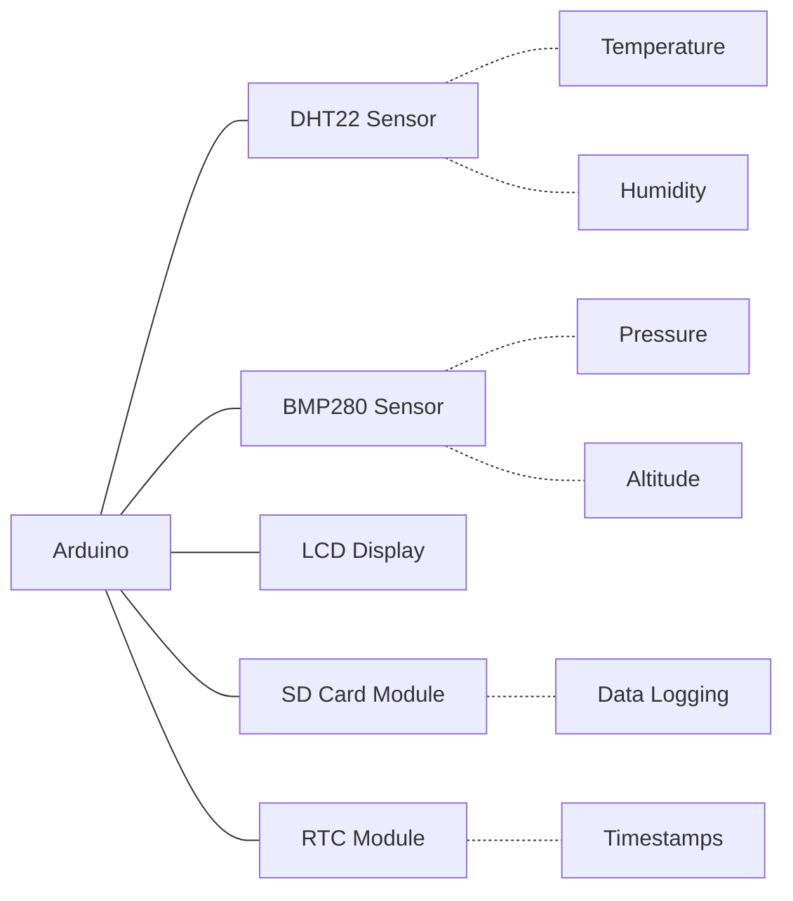

# Arduino Weather Station

## Introduction

Building a weather station is an excellent Arduino project that combines hardware integration with practical data collection. This project will teach you how to use various sensors to measure environmental conditions like temperature, humidity, barometric pressure, and more. You'll learn about sensor interfaces, data processing, and how to display the collected information.

A weather station is particularly rewarding because it creates something useful that you can actually use in your daily life while learning core electronics and programming concepts.

## Required Components

To build a basic Arduino weather station, you'll need:

- Arduino Uno or Nano board
- DHT11 or DHT22 temperature and humidity sensor
- BMP280 or BME280 barometric pressure sensor (BME280 also includes humidity)
- 16x2 LCD display with I2C interface
- Breadboard and jumper wires
- Optional: Rain sensor, anemometer (wind speed), wind vane (direction)
- Optional: SD card module (for data logging)
- Optional: RTC (Real Time Clock) module (for timestamping)

## Project Overview

Here's a diagram of what we're building:



## Step 1: Setting Up the Temperature and Humidity Sensor

We'll start with the DHT22 sensor, which is common, inexpensive, and easy to use. It provides both temperature and humidity readings.

### Wiring the DHT22 Sensor

Connect your DHT22 as follows:
- VCC pin to Arduino 5V
- GND pin to Arduino GND
- DATA pin to Arduino digital pin 2

### Installing Required Libraries

You'll need the DHT library to interface with the sensor. In the Arduino IDE, go to:
`Sketch > Include Library > Manage Libraries...`

Search for "DHT" and install the "DHT sensor library" by Adafruit.

### Basic DHT22 Code

```cpp
#include <DHT.h>

#define DHTPIN 2     // Digital pin connected to the DHT sensor
#define DHTTYPE DHT22   // DHT 22 (AM2302)

DHT dht(DHTPIN, DHTTYPE);

void setup() {
  Serial.begin(9600);
  Serial.println("DHT22 Test!");

  dht.begin();
}

void loop() {
  // Wait a few seconds between measurements
  delay(2000);

  // Reading temperature or humidity takes about 250 milliseconds!
  float humidity = dht.readHumidity();
  float temperature = dht.readTemperature();

  // Check if any reads failed and exit early (to try again)
  if (isnan(humidity) || isnan(temperature)) {
    Serial.println("Failed to read from DHT sensor!");
    return;
  }

  Serial.print("Humidity: ");
  Serial.print(humidity);
  Serial.print("%  Temperature: ");
  Serial.print(temperature);
  Serial.println("°C");
}
```

### Expected Output

When running this code, you should see output in the Serial Monitor similar to:

```
DHT22 Test!
Humidity: 45.20%  Temperature: 22.70°C
Humidity: 45.10%  Temperature: 22.80°C
```

## Step 2: Adding the Barometric Pressure Sensor

The BMP280 or BME280 sensor will allow us to measure atmospheric pressure and estimate altitude.

### Wiring the BMP280 Sensor

The BMP280 uses I2C communication, so connect it as follows:
- VCC to Arduino 5V
- GND to Arduino GND
- SCL to Arduino A5 (SCL)
- SDA to Arduino A4 (SDA)

### Installing Required Libraries

In the Arduino IDE, install the Adafruit BMP280 library:
`Sketch > Include Library > Manage Libraries...`

Search for "BMP280" and install the "Adafruit BMP280 Library".

Also install the Adafruit Unified Sensor library if prompted.

### Basic BMP280 Code

```cpp
#include <Wire.h>
#include <Adafruit_BMP280.h>

Adafruit_BMP280 bmp; // I2C Interface

void setup() {
  Serial.begin(9600);
  Serial.println("BMP280 Test!");

  if (!bmp.begin()) {
    Serial.println("Could not find a valid BMP280 sensor, check wiring!");
    while (1);
  }
}

void loop() {
  Serial.print("Temperature = ");
  Serial.print(bmp.readTemperature());
  Serial.println(" °C");
  
  Serial.print("Pressure = ");
  Serial.print(bmp.readPressure() / 100.0F); // Convert Pa to hPa (millibar)
  Serial.println(" hPa");
  
  Serial.print("Approx. Altitude = ");
  Serial.print(bmp.readAltitude(1013.25)); // Standard pressure level
  Serial.println(" m");
  
  Serial.println();
  delay(2000);
}
```

### Expected Output

```
BMP280 Test!
Temperature = 22.15 °C
Pressure = 1013.24 hPa
Approx. Altitude = 0.00 m

Temperature = 22.16 °C
Pressure = 1013.23 hPa
Approx. Altitude = 0.02 m
```

## Step 3: Integrating the LCD Display

Now let's add an LCD display to show the readings without needing a computer connection.

### Wiring the I2C LCD Display

The I2C LCD display requires just 4 connections:
- VCC to Arduino 5V
- GND to Arduino GND
- SDA to Arduino A4 (SDA)
- SCL to Arduino A5 (SCL)

### Installing Required Libraries

In the Arduino IDE, install the LiquidCrystal I2C library:
`Sketch > Include Library > Manage Libraries...`

Search for "LiquidCrystal I2C" and install it.

### Basic LCD Code

```cpp
#include <Wire.h>
#include <LiquidCrystal_I2C.h>

// Set the LCD address to 0x27 for a 16 chars and 2 line display
// (Your address might be different, common addresses are 0x27 and 0x3F)
LiquidCrystal_I2C lcd(0x27, 16, 2);

void setup() {
  lcd.init();       // Initialize the LCD
  lcd.backlight();  // Turn on the backlight
  
  lcd.setCursor(0, 0);
  lcd.print("Weather Station");
  lcd.setCursor(0, 1);
  lcd.print("Initializing...");
  delay(2000);
}

void loop() {
  lcd.clear();
  lcd.setCursor(0, 0);
  lcd.print("Temp: 22.5C");
  lcd.setCursor(0, 1);
  lcd.print("Humidity: 45%");
  delay(2000);
  
  lcd.clear();
  lcd.setCursor(0, 0);
  lcd.print("Pressure:");
  lcd.setCursor(0, 1);
  lcd.print("1013.25 hPa");
  delay(2000);
}
```

## Step 4: Putting It All Together

Now, let's combine all three components into a complete weather station:

```cpp
#include <Wire.h>
#include <DHT.h>
#include <Adafruit_BMP280.h>
#include <LiquidCrystal_I2C.h>

// Define sensor pins and types
#define DHTPIN 2
#define DHTTYPE DHT22

// Initialize sensors
DHT dht(DHTPIN, DHTTYPE);
Adafruit_BMP280 bmp;
LiquidCrystal_I2C lcd(0x27, 16, 2);

// Variables to store sensor readings
float temperature, humidity, pressure, altitude;

void setup() {
  // Initialize Serial Monitor
  Serial.begin(9600);
  Serial.println("Arduino Weather Station");

  // Initialize LCD
  lcd.init();
  lcd.backlight();
  lcd.setCursor(0, 0);
  lcd.print("Weather Station");
  lcd.setCursor(0, 1);
  lcd.print("Initializing...");

  // Initialize DHT sensor
  dht.begin();
  
  // Initialize BMP sensor
  if (!bmp.begin()) {
    Serial.println("Could not find BMP280 sensor!");
    lcd.clear();
    lcd.setCursor(0, 0);
    lcd.print("BMP280 Error!");
    while (1);
  }
  
  delay(2000);
}

void loop() {
  // Read sensors
  readSensors();
  
  // Display on Serial Monitor
  displaySerial();
  
  // Display on LCD (cycling between different readings)
  displayLCD();
  
  delay(5000);
}

void readSensors() {
  // Read DHT22 sensor
  humidity = dht.readHumidity();
  temperature = dht.readTemperature();
  
  // Read BMP280 sensor
  pressure = bmp.readPressure() / 100.0F; // Convert Pa to hPa
  altitude = bmp.readAltitude(1013.25);   // Standard pressure level
}

void displaySerial() {
  Serial.println("------------------");
  Serial.print("Temperature: ");
  Serial.print(temperature);
  Serial.println(" °C");
  
  Serial.print("Humidity: ");
  Serial.print(humidity);
  Serial.println(" %");
  
  Serial.print("Pressure: ");
  Serial.print(pressure);
  Serial.println(" hPa");
  
  Serial.print("Approx. Altitude: ");
  Serial.print(altitude);
  Serial.println(" m");
  Serial.println("------------------");
  Serial.println();
}

void displayLCD() {
  // First screen: Temperature and Humidity
  lcd.clear();
  lcd.setCursor(0, 0);
  lcd.print("Temp: ");
  lcd.print(temperature);
  lcd.print(" C");
  lcd.setCursor(0, 1);
  lcd.print("Humidity: ");
  lcd.print(humidity);
  lcd.print("%");
  delay(3000);
  
  // Second screen: Pressure and Altitude
  lcd.clear();
  lcd.setCursor(0, 0);
  lcd.print("Press: ");
  lcd.print(pressure);
  lcd.setCursor(0, 1);
  lcd.print("Alt: ");
  lcd.print(altitude);
  lcd.print("m");
  delay(3000);
}
```

## Optional Enhancements

### Adding Data Logging with SD Card

If you want to log weather data over time, you can add an SD card module:

```cpp
#include <SPI.h>
#include <SD.h>

// SD card pin (usually pin 10 on most Arduino boards)
const int chipSelect = 10;

// In setup()
if (!SD.begin(chipSelect)) {
  Serial.println("SD card initialization failed!");
  return;
}
Serial.println("SD card initialized successfully.");

// In loop() or in a separate function
void logData() {
  // Open or create file
  File dataFile = SD.open("weather.csv", FILE_WRITE);
  
  // If the file is available, write to it
  if (dataFile) {
    dataFile.print(millis()/1000); // time in seconds since start
    dataFile.print(",");
    dataFile.print(temperature);
    dataFile.print(",");
    dataFile.print(humidity);
    dataFile.print(",");
    dataFile.println(pressure);
    dataFile.close();
  } else {
    Serial.println("Error opening weather.csv");
  }
}
```

### Adding Timestamps with RTC Module

For accurate timestamps, add a Real Time Clock module:

```cpp
#include <RTClib.h>

RTC_DS3231 rtc;

// In setup()
if (!rtc.begin()) {
  Serial.println("Couldn't find RTC");
  return;
}

// Set the RTC to the date & time on computer this sketch was compiled
// Only run this once, then comment it out
rtc.adjust(DateTime(F(__DATE__), F(__TIME__)));

// In loop() or a function
void getTimeStamp(char* buffer) {
  DateTime now = rtc.now();
  
  sprintf(buffer, "%04d-%02d-%02d %02d:%02d:%02d",
    now.year(), now.month(), now.day(), 
    now.hour(), now.minute(), now.second());
}
```

## Real-World Applications

This weather station has several practical applications:

1. **Home Weather Monitoring**: Track indoor or outdoor conditions in your home.
2. **Plant Care**: Monitor conditions for houseplants or a small greenhouse.
3. **Weather Prediction**: With barometric pressure readings, you can forecast basic weather changes.
4. **Data Collection for Science Projects**: Gather environmental data for school projects or citizen science initiatives.
5. **Remote Monitoring**: Add wireless capabilities (WiFi or Bluetooth) to monitor conditions from a distance.

## Advanced Project: Web Server Weather Station

For a more advanced project, you can add an Ethernet or WiFi shield to create a web server that displays your weather data:

```cpp
#include <SPI.h>
#include <Ethernet.h>

// MAC address for your Ethernet shield
byte mac[] = { 0xDE, 0xAD, 0xBE, 0xEF, 0xFE, 0xED };

// Initialize the Ethernet server library
EthernetServer server(80);

// In setup()
if (Ethernet.begin(mac) == 0) {
  Serial.println("Failed to configure Ethernet using DHCP");
  // Try to configure with a static IP address
  Ethernet.begin(mac, IPAddress(192, 168, 0, 177));
}
server.begin();
Serial.print("Server is at ");
Serial.println(Ethernet.localIP());

// In loop()
void checkForClient() {
  // Listen for incoming clients
  EthernetClient client = server.available();
  if (client) {
    Serial.println("New client");
    boolean currentLineIsBlank = true;
    
    while (client.connected()) {
      if (client.available()) {
        char c = client.read();
        
        // If you've gotten to the end of the line (received a newline
        // character) and the line is blank, the HTTP request has ended,
        // so you can send a reply
        if (c == '
' && currentLineIsBlank) {
          // Send a standard HTTP response header
          client.println("HTTP/1.1 200 OK");
          client.println("Content-Type: text/html");
          client.println("Connection: close");
          client.println();
          
          // Web page content
          client.println("<!DOCTYPE HTML>");
          client.println("<html>");
          client.println("<head><title>Arduino Weather Station</title></head>");
          client.println("<body>");
          client.println("<h1>Current Weather Conditions</h1>");
          client.print("<p>Temperature: ");
          client.print(temperature);
          client.println(" &deg;C</p>");
          client.print("<p>Humidity: ");
          client.print(humidity);
          client.println(" %</p>");
          client.print("<p>Pressure: ");
          client.print(pressure);
          client.println(" hPa</p>");
          client.println("</body>");
          client.println("</html>");
          break;
        }
        
        if (c == '
') {
          currentLineIsBlank = true;
        } else if (c != '\r') {
          currentLineIsBlank = false;
        }
      }
    }
    
    // Give the web browser time to receive the data
    delay(1);
    client.stop();
    Serial.println("Client disconnected");
  }
}
```

## Troubleshooting Common Issues

1. **Inaccurate Readings**: Make sure sensors are not near heat sources or in direct sunlight.
2. **LCD Not Displaying**: Check the I2C address of your LCD. Common addresses are 0x27 and 0x3F.
3. **Sensor Not Found Errors**: Double-check wiring connections and make sure your libraries are installed correctly.
4. **Unstable Readings**: Add capacitors between VCC and GND near sensors to stabilize power.
5. **Altitude Variations**: Barometric pressure changes with weather, affecting altitude calculations. Set the sea level reference pressure regularly for more accurate readings.

## Summary

In this project, you've built a complete Arduino weather station that can:
- Measure temperature, humidity, and barometric pressure
- Calculate approximate altitude
- Display readings on an LCD screen
- Optionally log data to an SD card with timestamps
- Optionally serve the data over a network

This project combines multiple sensors and interfaces, teaching you about:
- Digital and analog sensors
- I2C communication
- Data processing and display
- Optional data logging and network communication

## Further Exercises

1. **Add more sensors**: Try adding a rain sensor, light sensor, or wind speed sensor.
2. **Create a weather forecast algorithm**: Use pressure trends to predict basic weather patterns.
3. **Build a weather-resistant enclosure**: Design and build a case suitable for outdoor use.
4. **Add cloud connectivity**: Send data to services like ThingSpeak or Adafruit IO to monitor your weather station from anywhere.
5. **Create data visualizations**: Build graphs of your weather data over time.
6. **Add alerts**: Program the Arduino to alert you when certain weather conditions are detected, like freezing temperatures or high humidity.

## Next Steps

As you become more comfortable with this project, consider expanding it with wireless capabilities such as WiFi or LoRa for remote monitoring, or adding a solar panel for off-grid operation. You could also connect multiple weather stations to map conditions across different locations.

Happy building!