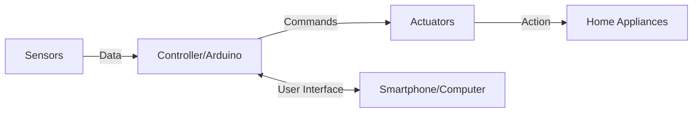

# Arduino Home Automation

## Introduction

Home automation is the process of controlling home appliances and devices automatically using various control techniques. Arduino, being an open-source electronics platform, provides an excellent foundation for DIY home automation projects. In this tutorial, we'll explore how to use Arduino to create your own smart home systems that can monitor and control various aspects of your living environment.

Home automation with Arduino offers several advantages:

- **Affordability**: Much cheaper than commercial smart home solutions
- **Customizability**: Tailor the system to your specific needs
- **Learning opportunity**: Great way to learn electronics, programming, and IoT concepts
- **Expandability**: Start small and add more features as you learn

## Prerequisites

Before starting this project, you should have:

- Basic knowledge of Arduino programming
- An Arduino board (UNO or Nano recommended for beginners)
- Breadboard and jumper wires
- Basic electronic components (resistors, LEDs)

## Basic Home Automation Concepts

Home automation systems typically consist of three main components:

1. **Sensors**: Devices that collect data from the environment (temperature, light, motion, etc.)
2. **Controllers**: The brain of the system (Arduino) that processes the sensor data and makes decisions
3. **Actuators**: Devices that perform actions based on the controller's decisions (relays, motors, LEDs)



## Project 1: Automated Lighting System

Let's start with a simple project: an automated lighting system that turns on LEDs when the room gets dark.

### Components Needed

- Arduino UNO
- Breadboard
- Jumper wires
- LDR (Light Dependent Resistor)
- 10kΩ resistor
- LED
- 220Ω resistor

### Circuit Diagram

Connect the components as follows:
- LDR and 10kΩ resistor as voltage divider to analog pin A0
- LED with 220Ω resistor to digital pin 9

### Code

```cpp
// Automated Lighting System
// Turns on LED when the environment gets dark

// Define pins
const int ldrPin = A0;  // LDR sensor connected to A0
const int ledPin = 9;   // LED connected to pin 9

// Threshold value to determine when it's dark
const int threshold = 500;

void setup() {
  pinMode(ledPin, OUTPUT);  // Set LED pin as output
  Serial.begin(9600);       // Start serial communication for debugging
}

void loop() {
  // Read light level from LDR
  int lightLevel = analogRead(ldrPin);
  
  // Print light level to serial monitor for debugging
  Serial.print("Light level: ");
  Serial.println(lightLevel);
  
  // Check if it's dark and control the LED
  if (lightLevel < threshold) {
    digitalWrite(ledPin, HIGH);  // Turn LED on
    Serial.println("LED ON - It's dark");
  } else {
    digitalWrite(ledPin, LOW);   // Turn LED off
    Serial.println("LED OFF - It's bright");
  }
  
  delay(1000);  // Small delay for stability
}
```

### How It Works

1. The LDR acts as a light sensor - its resistance decreases in bright light and increases in darkness
2. We create a voltage divider with the LDR and a 10kΩ resistor to read the light level
3. The Arduino reads the analog value from the LDR (0-1023 range)
4. When the light level falls below the threshold (indicating darkness), the LED turns on
5. When the light level is above the threshold (indicating brightness), the LED turns off

### Calibrating the System

The threshold value (500) might need adjustment based on your specific LDR and lighting conditions. Monitor the serial output to see the light level readings in your environment and adjust the threshold accordingly.

## Project 2: Temperature-Controlled Fan

In this project, we'll create a system that turns on a fan when the temperature exceeds a certain threshold.

### Components Needed

- Arduino UNO
- Breadboard
- Jumper wires
- DHT11 or DHT22 temperature and humidity sensor
- 5V relay module
- DC fan (or you can substitute an LED for demonstration)
- 1N4007 diode (for protection)

### Library Installation

Before proceeding, install the DHT library:
1. In Arduino IDE, go to Sketch > Include Library > Manage Libraries
2. Search for "DHT"
3. Install the "DHT sensor library" by Adafruit

### Circuit Connections

- Connect the DHT11/DHT22 data pin to digital pin 2
- Connect the relay control pin to digital pin 3
- Connect the fan to the relay (normally open terminals)

### Code

```cpp
// Temperature-Controlled Fan System
// Turns on a fan when temperature exceeds a threshold

#include <DHT.h>

// Define pins and sensor type
#define DHTPIN 2        // DHT sensor connected to pin 2
#define DHTTYPE DHT11   // DHT 11 sensor type (change to DHT22 if using that)
#define RELAY_PIN 3     // Relay connected to pin 3

// Temperature threshold in Celsius
const float TEMP_THRESHOLD = 25.0;

// Initialize DHT sensor
DHT dht(DHTPIN, DHTTYPE);

void setup() {
  pinMode(RELAY_PIN, OUTPUT);
  digitalWrite(RELAY_PIN, LOW);  // Ensure fan is off at startup
  
  Serial.begin(9600);
  Serial.println("Temperature-Controlled Fan System");
  
  dht.begin();  // Initialize DHT sensor
}

void loop() {
  // Wait a few seconds between measurements
  delay(2000);
  
  // Read temperature and humidity
  float humidity = dht.readHumidity();
  float temperature = dht.readTemperature();
  
  // Check if any readings failed
  if (isnan(humidity) || isnan(temperature)) {
    Serial.println("Failed to read from DHT sensor!");
    return;
  }
  
  // Print temperature and humidity to serial monitor
  Serial.print("Temperature: ");
  Serial.print(temperature);
  Serial.print(" °C, Humidity: ");
  Serial.print(humidity);
  Serial.println(" %");
  
  // Control fan based on temperature
  if (temperature > TEMP_THRESHOLD) {
    digitalWrite(RELAY_PIN, HIGH);  // Turn fan on
    Serial.println("Fan ON");
  } else {
    digitalWrite(RELAY_PIN, LOW);   // Turn fan off
    Serial.println("Fan OFF");
  }
}
```

### How It Works

1. The DHT sensor measures the current temperature and humidity
2. The Arduino compares the measured temperature with the predefined threshold
3. If the temperature exceeds the threshold, the relay is activated, turning on the fan
4. When the temperature drops below the threshold, the relay deactivates, turning off the fan
5. Temperature and humidity readings are displayed on the serial monitor for monitoring

## Project 3: Motion-Activated Security Light

This project demonstrates how to create a security light that turns on automatically when motion is detected.

### Components Needed

- Arduino UNO
- Breadboard
- Jumper wires
- PIR motion sensor
- LED (or multiple LEDs for brighter light)
- 220Ω resistor

### Circuit Connections

- Connect the PIR sensor output pin to digital pin 2
- Connect the LED with a 220Ω resistor to digital pin 9

### Code

```cpp
// Motion-Activated Security Light
// Turns on LED when motion is detected

// Define pins
const int pirPin = 2;    // PIR sensor output connected to pin 2
const int ledPin = 9;    // LED connected to pin 9

// Variables
int motionState = LOW;   // Initialize with no motion detected
int ledState = LOW;      // LED initially off

// Timer variables
unsigned long currentTime = 0;
unsigned long previousTime = 0;
const unsigned long lightDuration = 10000;  // Light stays on for 10 seconds after motion

void setup() {
  pinMode(pirPin, INPUT);   // Set PIR pin as input
  pinMode(ledPin, OUTPUT);  // Set LED pin as output
  
  Serial.begin(9600);
  Serial.println("Motion-Activated Security Light");
  
  // Give the sensor time to stabilize (important for PIR sensors)
  Serial.println("Calibrating sensor...");
  delay(30000);  // 30 seconds calibration time
  Serial.println("Sensor active");
}

void loop() {
  // Read motion state
  motionState = digitalRead(pirPin);
  currentTime = millis();
  
  // If motion is detected
  if (motionState == HIGH) {
    digitalWrite(ledPin, HIGH);  // Turn on LED
    previousTime = currentTime;  // Reset timer
    
    if (ledState == LOW) {
      Serial.println("Motion detected! Light ON");
      ledState = HIGH;
    }
  } 
  // If no motion and timer expired
  else if ((motionState == LOW) && (ledState == HIGH) && (currentTime - previousTime >= lightDuration)) {
    digitalWrite(ledPin, LOW);   // Turn off LED
    ledState = LOW;
    Serial.println("No motion, Light OFF");
  }
  
  delay(100);  // Small delay for stability
}
```

### How It Works

1. The PIR sensor detects changes in infrared radiation (heat) when a person moves in its field of view
2. When motion is detected, the PIR output goes HIGH
3. The Arduino turns on the LED and starts a timer
4. The LED stays on for a predefined duration (10 seconds in this example)
5. If no further motion is detected after the duration expires, the LED turns off
6. If motion is detected again while the LED is on, the timer resets

## Advanced Project: Integrated Home Automation System

Now, let's combine our previous projects into a more comprehensive home automation system that includes:
- Light automation based on ambient light level
- Temperature-controlled fan
- Motion detection for security
- Remote control via serial communication

### Components Needed

All components from the previous projects plus:
- HC-05/HC-06 Bluetooth module (optional for remote control)

### Code

```cpp
// Integrated Home Automation System
// Combines light control, temperature monitoring, and motion detection

#include <DHT.h>

// Define pins
const int ldrPin = A0;      // LDR sensor
const int pirPin = 2;       // PIR motion sensor
const int dhtPin = 3;       // DHT temperature sensor
const int lightPin = 9;     // Automated light
const int fanPin = 10;      // Temperature-controlled fan
const int motionLightPin = 11;  // Security light

// Sensor parameters
#define DHTTYPE DHT11       // DHT sensor type
const int lightThreshold = 500;    // Light threshold
const float tempThreshold = 25.0;  // Temperature threshold in Celsius
const unsigned long motionLightDuration = 10000;  // 10 seconds

// Variables
int lightLevel, motionState = LOW;
float temperature, humidity;
unsigned long currentTime = 0, previousTime = 0;
bool motionLightState = false;

// Initialize DHT sensor
DHT dht(dhtPin, DHTTYPE);

// Function prototypes
void checkLightLevel();
void checkTemperature();
void checkMotion();
void serialControl();

void setup() {
  // Initialize pins
  pinMode(pirPin, INPUT);
  pinMode(lightPin, OUTPUT);
  pinMode(fanPin, OUTPUT);
  pinMode(motionLightPin, OUTPUT);
  
  // Turn off all outputs initially
  digitalWrite(lightPin, LOW);
  digitalWrite(fanPin, LOW);
  digitalWrite(motionLightPin, LOW);
  
  // Initialize serial and DHT sensor
  Serial.begin(9600);
  dht.begin();
  
  Serial.println("Integrated Home Automation System");
  Serial.println("Commands: 'light on', 'light off', 'fan on', 'fan off'");
  
  // Calibrate PIR sensor
  Serial.println("Calibrating motion sensor...");
  delay(10000);  // Reduced to 10 seconds for demo purposes
  Serial.println("System ready!");
}

void loop() {
  currentTime = millis();
  
  // Check all sensors
  checkLightLevel();
  checkTemperature();
  checkMotion();
  
  // Check for serial commands
  if (Serial.available() > 0) {
    serialControl();
  }
  
  delay(500);  // Small delay for stability
}

// Function to check ambient light and control lights
void checkLightLevel() {
  lightLevel = analogRead(ldrPin);
  
  if (lightLevel < lightThreshold) {
    digitalWrite(lightPin, HIGH);  // Turn on light in darkness
  } else {
    digitalWrite(lightPin, LOW);   // Turn off light in brightness
  }
}

// Function to check temperature and control fan
void checkTemperature() {
  // Read temperature and humidity
  humidity = dht.readHumidity();
  temperature = dht.readTemperature();
  
  // Check if readings are valid
  if (!isnan(humidity) && !isnan(temperature)) {
    // Print values every 5 seconds (approx)
    if (currentTime % 5000 < 500) {
      Serial.print("Temperature: ");
      Serial.print(temperature);
      Serial.print(" °C, Humidity: ");
      Serial.print(humidity);
      Serial.println(" %");
    }
    
    // Control fan based on temperature
    if (temperature > tempThreshold) {
      digitalWrite(fanPin, HIGH);  // Turn fan on
    } else {
      digitalWrite(fanPin, LOW);   // Turn fan off
    }
  }
}

// Function to check motion and control security light
void checkMotion() {
  motionState = digitalRead(pirPin);
  
  if (motionState == HIGH) {
    digitalWrite(motionLightPin, HIGH);  // Turn on security light
    previousTime = currentTime;          // Reset timer
    
    if (!motionLightState) {
      Serial.println("Motion detected!");
      motionLightState = true;
    }
  } 
  else if (motionLightState && (currentTime - previousTime >= motionLightDuration)) {
    digitalWrite(motionLightPin, LOW);   // Turn off security light
    motionLightState = false;
    Serial.println("No motion detected for 10 seconds");
  }
}

// Function to handle serial commands
void serialControl() {
  String command = Serial.readStringUntil('
');
  command.trim();
  
  if (command == "light on") {
    digitalWrite(lightPin, HIGH);
    Serial.println("Light turned ON manually");
  } 
  else if (command == "light off") {
    digitalWrite(lightPin, LOW);
    Serial.println("Light turned OFF manually");
  } 
  else if (command == "fan on") {
    digitalWrite(fanPin, HIGH);
    Serial.println("Fan turned ON manually");
  } 
  else if (command == "fan off") {
    digitalWrite(fanPin, LOW);
    Serial.println("Fan turned OFF manually");
  } 
  else if (command == "status") {
    // Print system status
    Serial.println("System Status:");
    Serial.print("Light level: ");
    Serial.print(lightLevel);
    Serial.print(", Light: ");
    Serial.println(digitalRead(lightPin) ? "ON" : "OFF");
    
    Serial.print("Temperature: ");
    Serial.print(temperature);
    Serial.print("°C, Fan: ");
    Serial.println(digitalRead(fanPin) ? "ON" : "OFF");
    
    Serial.print("Motion detected: ");
    Serial.println(motionState ? "YES" : "NO");
  }
  else {
    Serial.println("Unknown command");
  }
}
```

### System Features

1. **Automated Lighting**: Turns on lights when ambient light falls below threshold
2. **Temperature Control**: Activates fan when temperature rises above threshold
3. **Security Light**: Turns on when motion is detected and stays on for a preset duration
4. **Manual Override**: Receive commands via serial communication to override automatic functions
5. **Status Reporting**: Monitor system status and sensor readings

## Expanding Your Home Automation System

Once you've mastered the basics, you can expand your system with additional features:

### Additional Sensors
- **Door/Window Sensors**: Reed switches to detect if doors or windows are open
- **Gas/Smoke Detectors**: For safety monitoring
- **Water Level Sensors**: For leak detection or automatic plant watering

### Additional Actuators
- **Servo Motors**: For controlling blinds or curtains
- **Water Pumps**: For automated plant watering systems
- **Smart Locks**: For door security

### Connectivity Options
- **Bluetooth**: Using HC-05/HC-06 modules for short-range control
- **WiFi**: Using ESP8266 or ESP32 for Internet connectivity
- **MQTT**: A lightweight messaging protocol for IoT communication

## Best Practices for Arduino Home Automation

1. **Power Management**: Consider using external power supplies for projects that run continuously
2. **Code Optimization**: Keep your code efficient to avoid Arduino freezing or erratic behavior
3. **Safety First**: Be extremely careful when working with mains electricity (110V/220V)
4. **Proper Calibration**: Always calibrate sensors for your specific environment
5. **Backup**: Always keep a backup of your code and document your circuit connections
6. **Modular Design**: Design your system in modules that can work independently

## Troubleshooting Tips

### Common Issues and Solutions

1. **Sensor Reading Inconsistencies**
   - Check wiring connections
   - Add small delays between readings
   - Use averaging techniques for more stable readings

2. **Relay Chatter or Rapid Switching**
   - Implement hysteresis (different ON/OFF thresholds)
   - Add delays between state changes

3. **Arduino Resets Unexpectedly**
   - Check power supply capacity
   - Add decoupling capacitors
   - Ensure relay coils have protective diodes

## Summary

In this tutorial, we've learned how to create a basic home automation system using Arduino. We've covered:

- How to read various sensors (light, temperature, motion)
- How to control actuators based on sensor readings
- How to integrate multiple components into a comprehensive system
- Best practices for Arduino home automation

These projects serve as a foundation that you can build upon to create a custom smart home system tailored to your specific needs.

## Exercises and Challenges

1. **Bathroom Fan Controller**: Create a humidity-triggered fan controller for your bathroom
2. **Smart Blinds**: Design a system that automatically adjusts blinds based on time of day and light levels
3. **Energy Monitor**: Build a system to monitor and log your home's energy usage
4. **Voice Control**: Integrate your system with a voice assistant using ESP32 and cloud services
5. **Mobile App Control**: Create a mobile app to control your Arduino home automation system

## Additional Resources

- Arduino Official Documentation
- Arduino Forum for community support
- Online communities like r/arduino on Reddit
- Online course platforms for more advanced Arduino topics

Remember that home automation is an iterative process. Start with simple projects, learn from them, and gradually build more complex systems as your skills improve.