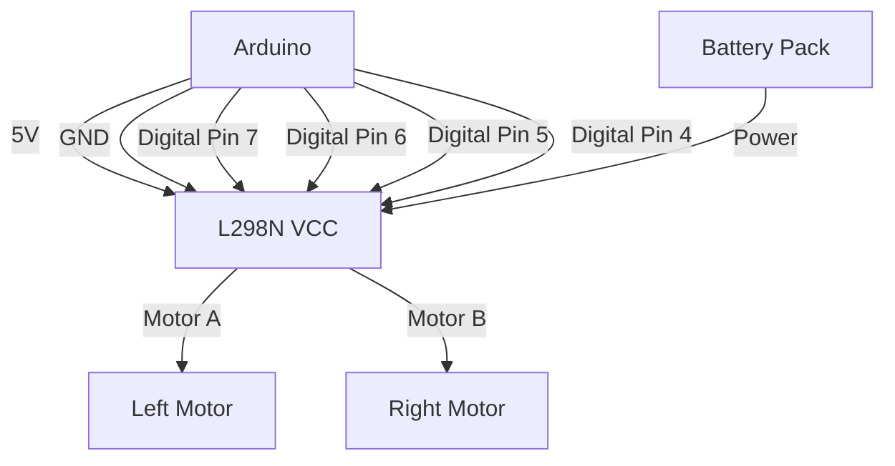

# Arduino Robot Control

## Introduction

Building a robot with Arduino is an exciting way to apply programming concepts and learn about electronics. In this tutorial, we'll explore how to create a simple but functional robot using an Arduino board. You'll learn how to connect motors, sensors, and write code to make your robot navigate its environment.

Arduino is perfect for robotics because it's:
- Affordable and accessible
- Supported by a large community
- Compatible with many sensors and actuators
- Programmable using a simple C/C++ variant

By the end of this guide, you'll understand the fundamentals of robot control and be ready to build your own Arduino-powered robot.

## Components Needed

To follow along with this tutorial, you'll need:

- Arduino Uno or compatible board
- Robot chassis with two DC motors
- L298N motor driver module
- Ultrasonic sensor (HC-SR04)
- Battery pack (6-12V)
- Jumper wires
- Small breadboard
- Optional: Line following sensors

## Setting Up the Robot Hardware

### Step 1: Assemble the Robot Chassis

Most beginner robot kits come with a chassis, wheels, and motors. Follow the assembly instructions provided with your chassis to attach the motors and wheels.

### Step 2: Connect the Motor Driver

The L298N motor driver acts as an interface between the Arduino and the motors. Connect it as follows:



Here's the wiring breakdown:

1. **Power connections:**
   - Connect L298N VCC to Arduino 5V
   - Connect L298N GND to Arduino GND
   - Connect battery positive to L298N power input
   - Connect battery negative to L298N ground

2. **Motor control connections:**
   - Connect Arduino pin 7 to L298N IN1
   - Connect Arduino pin 6 to L298N IN2
   - Connect Arduino pin 5 to L298N IN3
   - Connect Arduino pin 4 to L298N IN4
   - Connect Arduino pin 9 to L298N ENA (optional for speed control)
   - Connect Arduino pin 10 to L298N ENB (optional for speed control)

### Step 3: Add the Ultrasonic Sensor

The HC-SR04 ultrasonic sensor will help your robot detect obstacles:

- Connect VCC to Arduino 5V
- Connect GND to Arduino GND
- Connect Trig to Arduino digital pin 12
- Connect Echo to Arduino digital pin 11

## Programming the Robot

Let's start with the basic code to control our robot. We'll build it step by step.

### Basic Movement Control

First, let's define the pins and create functions for basic movements:

```cpp
// Motor A connections
const int enA = 9;
const int in1 = 7;
const int in2 = 6;
// Motor B connections
const int enB = 10;
const int in3 = 5;
const int in4 = 4;

void setup() {
  // Set all motor control pins as outputs
  pinMode(enA, OUTPUT);
  pinMode(enB, OUTPUT);
  pinMode(in1, OUTPUT);
  pinMode(in2, OUTPUT);
  pinMode(in3, OUTPUT);
  pinMode(in4, OUTPUT);
  
  // Turn off motors - Initial state
  digitalWrite(in1, LOW);
  digitalWrite(in2, LOW);
  digitalWrite(in3, LOW);
  digitalWrite(in4, LOW);
  
  // Set the motor speed (optional)
  analogWrite(enA, 200); // Value from 0 to 255
  analogWrite(enB, 200); // Value from 0 to 255
}

void loop() {
  // Example movement sequence
  moveForward();
  delay(2000);
  stopMotors();
  delay(1000);
  turnRight();
  delay(1000);
  stopMotors();
  delay(1000);
  turnLeft();
  delay(1000);
  stopMotors();
  delay(1000);
  moveBackward();
  delay(2000);
  stopMotors();
  delay(5000);
}

// Movement functions
void moveForward() {
  digitalWrite(in1, HIGH);
  digitalWrite(in2, LOW);
  digitalWrite(in3, HIGH);
  digitalWrite(in4, LOW);
}

void moveBackward() {
  digitalWrite(in1, LOW);
  digitalWrite(in2, HIGH);
  digitalWrite(in3, LOW);
  digitalWrite(in4, HIGH);
}

void turnRight() {
  digitalWrite(in1, HIGH);
  digitalWrite(in2, LOW);
  digitalWrite(in3, LOW);
  digitalWrite(in4, HIGH);
}

void turnLeft() {
  digitalWrite(in1, LOW);
  digitalWrite(in2, HIGH);
  digitalWrite(in3, HIGH);
  digitalWrite(in4, LOW);
}

void stopMotors() {
  digitalWrite(in1, LOW);
  digitalWrite(in2, LOW);
  digitalWrite(in3, LOW);
  digitalWrite(in4, LOW);
}
```

This code defines the basic movements your robot can make. Let's analyze it:

- We define pins for both motors (A and B)
- We set up all pins as outputs in the `setup()` function
- We create five basic movement functions:
  - `moveForward()` - Both motors rotate forward
  - `moveBackward()` - Both motors rotate backward
  - `turnRight()` - Left motor forward, right motor backward
  - `turnLeft()` - Left motor backward, right motor forward
  - `stopMotors()` - All motors stop

### Adding Obstacle Detection

Now, let's add the ultrasonic sensor to detect obstacles and make the robot navigate autonomously:

```cpp
// Motor pins (same as before)
const int enA = 9;
const int in1 = 7;
const int in2 = 6;
const int enB = 10;
const int in3 = 5;
const int in4 = 4;

// Ultrasonic sensor pins
const int trigPin = 12;
const int echoPin = 11;

// Variables for distance calculation
long duration;
int distance;

void setup() {
  // Serial for debugging
  Serial.begin(9600);
  
  // Motor pins setup (same as before)
  pinMode(enA, OUTPUT);
  pinMode(enB, OUTPUT);
  pinMode(in1, OUTPUT);
  pinMode(in2, OUTPUT);
  pinMode(in3, OUTPUT);
  pinMode(in4, OUTPUT);
  
  // Set the motor speed
  analogWrite(enA, 180);
  analogWrite(enB, 180);
  
  // Ultrasonic sensor pins
  pinMode(trigPin, OUTPUT);
  pinMode(echoPin, INPUT);
}

void loop() {
  // Check distance to obstacles
  distance = measureDistance();
  Serial.print("Distance: ");
  Serial.println(distance);
  
  // Navigate based on distance
  if (distance > 20) {
    // Path is clear, move forward
    moveForward();
  } else {
    // Obstacle detected, stop and turn
    stopMotors();
    delay(500);
    moveBackward();
    delay(800);
    turnRight();
    delay(1000);
  }
  
  delay(100); // Small delay to stabilize readings
}

// Measure distance using ultrasonic sensor
int measureDistance() {
  // Clear the trigPin
  digitalWrite(trigPin, LOW);
  delayMicroseconds(2);
  
  // Set the trigPin on HIGH state for 10 micro seconds
  digitalWrite(trigPin, HIGH);
  delayMicroseconds(10);
  digitalWrite(trigPin, LOW);
  
  // Read the echoPin, return the sound wave travel time in microseconds
  duration = pulseIn(echoPin, HIGH);
  
  // Calculate the distance
  int calculatedDistance = duration * 0.034 / 2; // Speed of sound wave divided by 2 (go and back)
  
  return calculatedDistance;
}

// Movement functions (same as before)
void moveForward() {
  digitalWrite(in1, HIGH);
  digitalWrite(in2, LOW);
  digitalWrite(in3, HIGH);
  digitalWrite(in4, LOW);
}

void moveBackward() {
  digitalWrite(in1, LOW);
  digitalWrite(in2, HIGH);
  digitalWrite(in3, LOW);
  digitalWrite(in4, HIGH);
}

void turnRight() {
  digitalWrite(in1, HIGH);
  digitalWrite(in2, LOW);
  digitalWrite(in3, LOW);
  digitalWrite(in4, HIGH);
}

void turnLeft() {
  digitalWrite(in1, LOW);
  digitalWrite(in2, HIGH);
  digitalWrite(in3, HIGH);
  digitalWrite(in4, LOW);
}

void stopMotors() {
  digitalWrite(in1, LOW);
  digitalWrite(in2, LOW);
  digitalWrite(in3, LOW);
  digitalWrite(in4, LOW);
}
```

This code adds obstacle detection using the ultrasonic sensor:

1. We measure the distance using the HC-SR04 sensor in the `measureDistance()` function
2. In the `loop()` function, we check if there's an obstacle within 20cm
3. If the path is clear, the robot moves forward
4. If an obstacle is detected, the robot stops, backs up, and turns right to find a new path

## Advanced Project: Line Following Robot

Let's make our robot smarter by adding line-following capability. We'll need to add two or more infrared (IR) sensors to the bottom of the robot that can detect a black line on a white surface (or vice versa).

### Hardware Additions

Add two IR line sensors to the front bottom of your robot:
- Left sensor connected to Arduino digital pin 2
- Right sensor connected to Arduino digital pin 3

### Line Following Code

```cpp
// Motor pins (same as before)
const int enA = 9;
const int in1 = 7;
const int in2 = 6;
const int enB = 10;
const int in3 = 5;
const int in4 = 4;

// IR sensor pins
const int leftSensor = 2;
const int rightSensor = 3;

// Sensor readings
int leftValue;
int rightValue;

void setup() {
  // Serial for debugging
  Serial.begin(9600);
  
  // Motor pins setup
  pinMode(enA, OUTPUT);
  pinMode(enB, OUTPUT);
  pinMode(in1, OUTPUT);
  pinMode(in2, OUTPUT);
  pinMode(in3, OUTPUT);
  pinMode(in4, OUTPUT);
  
  // Set the motor speed
  analogWrite(enA, 150); // Lower speed for more accurate line following
  analogWrite(enB, 150);
  
  // Line sensor pins
  pinMode(leftSensor, INPUT);
  pinMode(rightSensor, INPUT);
}

void loop() {
  // Read line sensors
  // LOW means line detected (black line on white surface)
  // HIGH means no line detected
  leftValue = digitalRead(leftSensor);
  rightValue = digitalRead(rightSensor);
  
  // Debug sensor readings
  Serial.print("Left: ");
  Serial.print(leftValue);
  Serial.print(" | Right: ");
  Serial.println(rightValue);
  
  // Line following logic
  if (leftValue == LOW && rightValue == LOW) {
    // Both sensors on the line - move forward
    moveForward();
  }
  else if (leftValue == LOW && rightValue == HIGH) {
    // Line is under left sensor - turn left
    turnLeft();
  }
  else if (leftValue == HIGH && rightValue == LOW) {
    // Line is under right sensor - turn right
    turnRight();
  }
  else {
    // Both sensors off the line - search for the line
    // This could be a more complex algorithm, but for simplicity:
    searchForLine();
  }
  
  delay(50); // Small delay to stabilize readings
}

// Function to search for the line when lost
void searchForLine() {
  // Stop briefly
  stopMotors();
  delay(100);
  
  // Move backward slightly
  moveBackward();
  delay(200);
  
  // Try turning to find the line again
  turnLeft();
  delay(300);
}

// Movement functions (same as before)
void moveForward() {
  digitalWrite(in1, HIGH);
  digitalWrite(in2, LOW);
  digitalWrite(in3, HIGH);
  digitalWrite(in4, LOW);
}

void moveBackward() {
  digitalWrite(in1, LOW);
  digitalWrite(in2, HIGH);
  digitalWrite(in3, LOW);
  digitalWrite(in4, HIGH);
}

void turnRight() {
  digitalWrite(in1, HIGH);
  digitalWrite(in2, LOW);
  digitalWrite(in3, LOW);
  digitalWrite(in4, HIGH);
}

void turnLeft() {
  digitalWrite(in1, LOW);
  digitalWrite(in2, HIGH);
  digitalWrite(in3, HIGH);
  digitalWrite(in4, LOW);
}

void stopMotors() {
  digitalWrite(in1, LOW);
  digitalWrite(in2, LOW);
  digitalWrite(in3, LOW);
  digitalWrite(in4, LOW);
}
```

This line-following algorithm:
1. Reads both IR sensors
2. If both sensors detect the line, the robot moves forward
3. If only the left sensor detects the line, the robot turns left
4. If only the right sensor detects the line, the robot turns right
5. If neither sensor detects the line, the robot executes a search pattern to find the line again

## Project Example: Obstacle-Avoiding and Line-Following Robot

For the final project, let's combine both capabilities to create a robot that can follow a line but also avoid obstacles in its path. This represents a more realistic robot navigation scenario.

```cpp
// Motor pins
const int enA = 9;
const int in1 = 7;
const int in2 = 6;
const int enB = 10;
const int in3 = 5;
const int in4 = 4;

// Ultrasonic sensor pins
const int trigPin = 12;
const int echoPin = 11;

// IR sensor pins
const int leftSensor = 2;
const int rightSensor = 3;

// Variables
long duration;
int distance;
int leftValue;
int rightValue;
bool avoidingObstacle = false;

void setup() {
  Serial.begin(9600);
  
  // Motor pins setup
  pinMode(enA, OUTPUT);
  pinMode(enB, OUTPUT);
  pinMode(in1, OUTPUT);
  pinMode(in2, OUTPUT);
  pinMode(in3, OUTPUT);
  pinMode(in4, OUTPUT);
  
  // Set the motor speed
  analogWrite(enA, 160);
  analogWrite(enB, 160);
  
  // Ultrasonic sensor pins
  pinMode(trigPin, OUTPUT);
  pinMode(echoPin, INPUT);
  
  // Line sensor pins
  pinMode(leftSensor, INPUT);
  pinMode(rightSensor, INPUT);
}

void loop() {
  // Check for obstacles
  distance = measureDistance();
  Serial.print("Distance: ");
  Serial.print(distance);
  
  // Read line sensors
  leftValue = digitalRead(leftSensor);
  rightValue = digitalRead(rightSensor);
  Serial.print(" | Left: ");
  Serial.print(leftValue);
  Serial.print(" | Right: ");
  Serial.println(rightValue);
  
  // Navigation priority: obstacles first, then line following
  if (distance < 15) {
    // Obstacle detected - avoid it
    avoidingObstacle = true;
    avoidObstacle();
  } 
  else if (avoidingObstacle) {
    // Continue avoiding obstacle until back on the line
    if (leftValue == LOW || rightValue == LOW) {
      avoidingObstacle = false;  // Back on the line
    } else {
      // Keep searching for line
      turnRight();
    }
  }
  else {
    // No obstacle - follow the line
    followLine();
  }
  
  delay(50); // Small delay to stabilize readings
}

// Follow the line using IR sensors
void followLine() {
  if (leftValue == LOW && rightValue == LOW) {
    // Both sensors on the line - move forward
    moveForward();
  }
  else if (leftValue == LOW && rightValue == HIGH) {
    // Line is under left sensor - turn left
    turnLeft();
  }
  else if (leftValue == HIGH && rightValue == LOW) {
    // Line is under right sensor - turn right
    turnRight();
  }
  else {
    // Both sensors off the line - search
    searchForLine();
  }
}

// Avoid obstacle function
void avoidObstacle() {
  // Stop and back up
  stopMotors();
  delay(200);
  moveBackward();
  delay(500);
  
  // Turn right to go around obstacle
  turnRight();
  delay(700);
  
  // Move forward to clear the obstacle
  moveForward();
  delay(1000);
  
  // Try to find the line again
  turnLeft();
  delay(500);
}

// Function to search for the line when lost
void searchForLine() {
  // Simplified search pattern
  turnLeft();
  delay(100);
}

// Measure distance using ultrasonic sensor
int measureDistance() {
  digitalWrite(trigPin, LOW);
  delayMicroseconds(2);
  digitalWrite(trigPin, HIGH);
  delayMicroseconds(10);
  digitalWrite(trigPin, LOW);
  
  duration = pulseIn(echoPin, HIGH);
  int calculatedDistance = duration * 0.034 / 2;
  
  return calculatedDistance;
}

// Movement functions
void moveForward() {
  digitalWrite(in1, HIGH);
  digitalWrite(in2, LOW);
  digitalWrite(in3, HIGH);
  digitalWrite(in4, LOW);
}

void moveBackward() {
  digitalWrite(in1, LOW);
  digitalWrite(in2, HIGH);
  digitalWrite(in3, LOW);
  digitalWrite(in4, HIGH);
}

void turnRight() {
  digitalWrite(in1, HIGH);
  digitalWrite(in2, LOW);
  digitalWrite(in3, LOW);
  digitalWrite(in4, HIGH);
}

void turnLeft() {
  digitalWrite(in1, LOW);
  digitalWrite(in2, HIGH);
  digitalWrite(in3, HIGH);
  digitalWrite(in4, LOW);
}

void stopMotors() {
  digitalWrite(in1, LOW);
  digitalWrite(in2, LOW);
  digitalWrite(in3, LOW);
  digitalWrite(in4, LOW);
}
```

This combined robot control program:

1. First checks for obstacles using the ultrasonic sensor
2. If an obstacle is detected, it executes an avoidance maneuver
3. If no obstacle is present, it runs the line-following algorithm
4. When avoiding an obstacle, it attempts to return to the line after clearing the obstacle

## Improving Robot Performance

Here are some tips to enhance your robot's performance:

### 1. Better Motor Control with PID

For smoother and more precise movement, you can implement a PID (Proportional-Integral-Derivative) controller. This is especially useful for line following:

```cpp
// PID constants
float Kp = 2.0;    // Proportional gain
float Ki = 0.1;    // Integral gain
float Kd = 1.0;    // Derivative gain

// PID variables
float error = 0;
float lastError = 0;
float integral = 0;
float derivative = 0;
float PIDvalue = 0;

// Calculate PID for line following
float calculatePID() {
  // Calculate error (position relative to line center)
  // Negative error means robot is to the right of the line
  // Positive error means robot is to the left of the line
  if (leftValue == LOW && rightValue == HIGH) {
    error = -1;
  } else if (leftValue == HIGH && rightValue == LOW) {
    error = 1;
  } else if (leftValue == LOW && rightValue == LOW) {
    error = 0;
  } else {
    // Both sensors off line, use previous error
  }
  
  // Calculate PID components
  integral = integral + error;
  derivative = error - lastError;
  
  // Calculate total PID value
  PIDvalue = (Kp * error) + (Ki * integral) + (Kd * derivative);
  
  // Update last error
  lastError = error;
  
  return PIDvalue;
}

// Use PID to adjust motor speeds for line following
void followLineWithPID() {
  float pidValue = calculatePID();
  
  // Base motor speed
  int baseSpeed = 150;
  
  // Adjust motor speeds based on PID value
  int leftMotorSpeed = baseSpeed - pidValue;
  int rightMotorSpeed = baseSpeed + pidValue;
  
  // Constrain speeds to valid range
  leftMotorSpeed = constrain(leftMotorSpeed, 0, 255);
  rightMotorSpeed = constrain(rightMotorSpeed, 0, 255);
  
  // Set motor speeds
  analogWrite(enA, leftMotorSpeed);
  analogWrite(enB, rightMotorSpeed);
  
  // Move forward with adjusted speeds
  moveForward();
}
```

### 2. Smoother Turning with Speed Control

Instead of full on/off movements, you can make more gradual turns:

```cpp
void smoothTurnRight() {
  // Right turn with different speeds for each motor
  analogWrite(enA, 180);  // Left motor faster
  analogWrite(enB, 80);   // Right motor slower
  moveForward();
}

void smoothTurnLeft() {
  // Left turn with different speeds for each motor
  analogWrite(enA, 80);   // Left motor slower
  analogWrite(enB, 180);  // Right motor faster
  moveForward();
}
```

## Troubleshooting Common Issues

### Robot Doesn't Move

1. **Check power supply**: Ensure your batteries are charged and properly connected.
2. **Check wiring**: Verify all connections between Arduino, motor driver, and motors.
3. **Test motors individually**: Run a simple sketch that activates one motor at a time.
4. **Check motor driver**: Some L298N modules have jumpers that need to be set.

### Robot Moves Unpredictably

1. **Motor polarity**: You might need to swap motor wires if the robot moves in the opposite direction.
2. **Sensor calibration**: IR sensors might need adjustment for different lighting conditions.
3. **Uneven wheels**: Check if both wheels are making proper contact with the ground.

### Sensor Issues

1. **Ultrasonic readings are inconsistent**: Ensure there are no loose connections and try adding a small delay between readings.
2. **IR sensors don't detect the line**: Adjust the height of sensors from the ground (usually 5-10mm is optimal).

## Summary

In this tutorial, you've learned:

1. How to build a basic Arduino robot with DC motors and a motor driver
2. How to program basic movement functions for your robot
3. How to implement obstacle detection using an ultrasonic sensor
4. How to create a line-following robot using IR sensors
5. How to combine multiple navigation capabilities
6. Advanced techniques for smoother robot control

Your robot can now navigate autonomously, following lines and avoiding obstacles. This foundation can be expanded with additional sensors, more complex algorithms, or even wireless control.

## Next Steps and Exercises

1. **Add a Bluetooth module** to control your robot remotely from a smartphone app
2. **Implement more sensors** like a gyroscope or accelerometer for better orientation
3. **Create a maze-solving algorithm** that combines line following and wall following
4. **Add LED indicators** to show the robot's current state or intended direction
5. **Challenge**: Program your robot to map its environment and remember obstacles

## Exercise: Improve the Line Detection

Try to enhance the line-following capability by adding a third center sensor. Modify the code to handle three sensors for more precise line tracking.

Remember that robotics is an iterative process - start simple, test thoroughly, and gradually add complexity. Happy building!