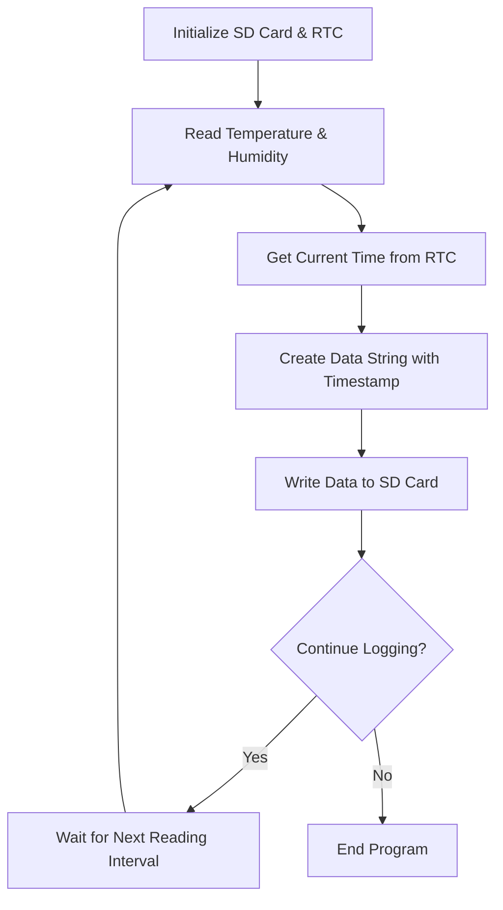

# Arduino Data Logger

## Introduction

A data logger is a device that collects and records data from sensors over time. Arduino makes an excellent platform for building custom data loggers due to its flexibility, low cost, and ability to interface with various sensors and storage media.

In this tutorial, you'll learn how to create a basic Arduino data logger that:
- Reads data from sensors
- Timestamps the readings
- Stores the information on an SD card
- Allows you to retrieve and analyze the collected data

This project is perfect for monitoring environmental conditions, tracking experiments, or creating your own weather station.

## What You'll Need

For this project, you'll need:

- Arduino board (Uno, Nano, or similar)
- SD card module
- SD card (formatted as FAT16 or FAT32)
- Real-Time Clock (RTC) module (DS3231 or DS1307)
- Sensors (we'll use a DHT22 temperature/humidity sensor)
- Breadboard and jumper wires
- USB cable for Arduino programming

## Understanding the Components

### SD Card Module

The SD card module allows your Arduino to write data to an SD card, which can store gigabytes of sensor readings.

### Real-Time Clock (RTC)

The RTC module keeps track of the current time, even when the Arduino loses power. This allows you to timestamp your data properly.

### DHT22 Sensor

The DHT22 sensor measures temperature and humidity, providing us with sample data to log.

## Circuit Connections

Connect the components as follows:

### SD Card Module to Arduino:
- MOSI → Pin 11
- MISO → Pin 12
- CLK → Pin 13
- CS → Pin 4
- VCC → 5V
- GND → GND

### RTC Module to Arduino:
- SDA → A4
- SCL → A5
- VCC → 5V
- GND → GND

### DHT22 Sensor to Arduino:
- DATA → Pin 2
- VCC → 5V
- GND → GND

## Project Workflow

Let's understand how our data logger will work:



## Required Libraries

We'll use these Arduino libraries:

- `SD.h` - For working with the SD card
- `SPI.h` - For communication with the SD card module
- `RTClib.h` - For working with the real-time clock
- `DHT.h` - For reading the DHT22 sensor

Install these libraries through the Arduino IDE by going to `Sketch > Include Library > Manage Libraries...` and searching for each one.

## Complete Code

Here's the complete code for our Arduino data logger:

```cpp
#include <SD.h>
#include <SPI.h>
#include <RTClib.h>
#include <DHT.h>

// Define pins and constants
#define DHTPIN 2          // DHT sensor pin
#define DHTTYPE DHT22     // DHT sensor type
#define SD_CS_PIN 4       // SD card CS pin
#define LOG_INTERVAL 60000 // Log data every 60 seconds (in milliseconds)

// Initialize components
RTC_DS3231 rtc;
DHT dht(DHTPIN, DHTTYPE);
File dataFile;

// File name to store data
const char filename[] = "datalog.csv";

void setup() {
  // Start serial communication
  Serial.begin(9600);
  
  // Initialize DHT sensor
  dht.begin();
  Serial.println("DHT sensor initialized");
  
  // Initialize RTC
  if (!rtc.begin()) {
    Serial.println("Couldn't find RTC");
    while (1);
  }
  
  // Set RTC time if it was reset (uncomment to set time)
  // rtc.adjust(DateTime(F(__DATE__), F(__TIME__)));
  
  Serial.println("RTC initialized");
  
  // Initialize SD card
  Serial.print("Initializing SD card...");
  if (!SD.begin(SD_CS_PIN)) {
    Serial.println("Card failed or not present");
    while (1);
  }
  Serial.println("Card initialized");
  
  // Create or open the data file
  if (!SD.exists(filename)) {
    dataFile = SD.open(filename, FILE_WRITE);
    if (dataFile) {
      // Write headers to new file
      dataFile.println("Date,Time,Temperature (C),Humidity (%)");
      dataFile.close();
      Serial.println("Created new data file with headers");
    } else {
      Serial.println("Error creating data file");
      while (1);
    }
  } else {
    Serial.println("Data file exists");
  }
  
  Serial.println("Setup complete! Data logging will begin shortly.");
}

void loop() {
  DateTime now = rtc.now();
  
  // Read sensor data
  float humidity = dht.readHumidity();
  float temperature = dht.readTemperature();
  
  // Check if readings are valid
  if (isnan(humidity) || isnan(temperature)) {
    Serial.println("Failed to read from DHT sensor!");
  } else {
    // Create data string with timestamp
    String dataString = "";
    
    // Format date: YYYY-MM-DD
    dataString += String(now.year(), DEC) + "-";
    dataString += (now.month() < 10 ? "0" : "") + String(now.month(), DEC) + "-";
    dataString += (now.day() < 10 ? "0" : "") + String(now.day(), DEC);
    dataString += ",";
    
    // Format time: HH:MM:SS
    dataString += (now.hour() < 10 ? "0" : "") + String(now.hour(), DEC) + ":";
    dataString += (now.minute() < 10 ? "0" : "") + String(now.minute(), DEC) + ":";
    dataString += (now.second() < 10 ? "0" : "") + String(now.second(), DEC);
    
    // Add sensor data
    dataString += "," + String(temperature, 1);
    dataString += "," + String(humidity, 1);
    
    // Log data to SD card
    dataFile = SD.open(filename, FILE_WRITE);
    if (dataFile) {
      dataFile.println(dataString);
      dataFile.close();
      
      // Output to serial for debugging
      Serial.print("Logged: ");
      Serial.println(dataString);
    } else {
      Serial.println("Error opening data file!");
    }
  }
  
  // Wait for the next logging interval
  delay(LOG_INTERVAL);
}
```

## Code Explanation

### Setup Function

1. **Initialize Components**: We start the serial communication, DHT sensor, RTC module, and SD card.
2. **Check File Existence**: We check if our data file exists. If not, we create it with appropriate headers.

### Loop Function

1. **Read Current Time**: We get the current time from the RTC module.
2. **Read Sensor Data**: We collect temperature and humidity readings from the DHT22 sensor.
3. **Format Data String**: We create a formatted string with the timestamp and sensor readings.
4. **Write to SD Card**: We open the data file, write the data string, and close the file.
5. **Wait**: We pause until the next logging interval.

## Customizing Your Data Logger

### Adding More Sensors

You can expand this data logger by adding more sensors. For each sensor:

1. Include the necessary library
2. Initialize the sensor in `setup()`
3. Read the sensor in `loop()`
4. Add the reading to your data string

Example for adding a light sensor on analog pin A0:

```cpp
// At the top with other global variables
const int lightPin = A0;

// In setup()
pinMode(lightPin, INPUT);

// In loop(), before creating the data string
int lightLevel = analogRead(lightPin);

// And add to your data string
dataString += "," + String(lightLevel);
```

Don't forget to update your CSV header to include the new sensor.

### Adjusting Logging Interval

You can change how often data is logged by modifying the `LOG_INTERVAL` constant. For example:

```cpp
// Log every 5 minutes
#define LOG_INTERVAL 300000  // 5 minutes in milliseconds

// Log every hour
#define LOG_INTERVAL 3600000  // 1 hour in milliseconds
```

### Power Optimization

For long-term logging, you may want to optimize power consumption:

```cpp
#include <LowPower.h>

// Instead of delay() in the loop
LowPower.powerDown(SLEEP_8S, ADC_OFF, BOD_OFF);
```

This requires the `LowPower` library and will put the Arduino into a low-power sleep mode between readings.

## Retrieving and Analyzing Your Data

When you want to access your collected data:

1. Power off your Arduino
2. Remove the SD card
3. Insert the SD card into your computer
4. Open the CSV file in a spreadsheet program like Excel or Google Sheets

From there, you can:
- Create graphs to visualize trends
- Calculate averages, minimums, and maximums
- Export the data for further analysis

## Real-World Applications

### Weather Station

Expand your data logger with additional sensors to create a complete weather station:
- Add a barometric pressure sensor (BMP280)
- Add a light sensor to measure sunlight intensity
- Add a rain gauge or anemometer for precipitation and wind speed

### Plant Monitoring System

Monitor the growing conditions for your plants:
- Track soil moisture with a soil moisture sensor
- Monitor light levels throughout the day
- Record temperature and humidity fluctuations

### Home Environment Monitoring

Track conditions in your home:
- Monitor temperature and humidity in different rooms
- Track CO2 levels with an MQ135 sensor
- Log when doors/windows are opened with magnetic reed switches

## Troubleshooting

### SD Card Issues

If you're having problems with the SD card:
- Make sure it's formatted as FAT16 or FAT32
- Try a different SD card
- Check all wiring connections
- Verify the SD card module is receiving 5V power

### Sensor Reading Errors

If sensor readings aren't working:
- Double-check your wiring
- Verify the sensor is properly powered
- Try different pins on the Arduino
- Check if you need pull-up resistors for your sensors

### Time Synchronization

If the RTC isn't keeping proper time:
- Make sure the RTC has a battery installed
- Set the correct time using the `rtc.adjust()` function
- Consider upgrading to a more accurate RTC module

## Summary

In this tutorial, you've learned how to:
- Build a basic Arduino data logger
- Configure an SD card module to store data
- Use an RTC module for accurate timestamping
- Read sensors and format data for logging
- Customize your data logger for specific applications

Data logging is a powerful technique with countless applications across science, engineering, and everyday projects. With the foundation you've built here, you can create custom data logging solutions for any need.

## Exercises

1. **Basic**: Add an LED that blinks when data is being written to the SD card.
2. **Intermediate**: Modify the code to log data at different intervals during day and night.
3. **Advanced**: Add a button that, when pressed, creates a new log file with a unique filename.

## Additional Resources

- [Arduino SD Library Reference](https://www.arduino.cc/reference/en/libraries/sd/)
- [RTClib Documentation](https://adafruit.github.io/RTClib/html/index.html)
- [DHT Sensor Library](https://github.com/adafruit/DHT-sensor-library)
- [Data Visualization with Google Sheets](https://support.google.com/docs/answer/190718)