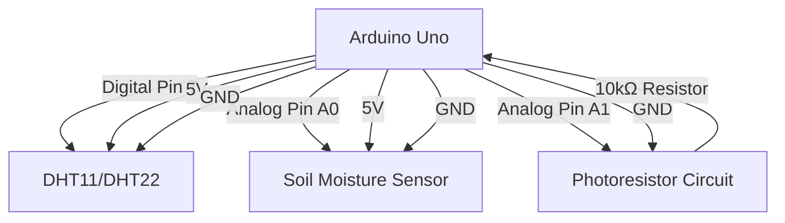

# Arduino Plant Monitor

## Introduction

Have you ever forgotten to water your plants, or wondered if they're getting enough light? In this project, we'll build an automated plant monitoring system using Arduino that helps you keep your green friends happy and healthy.

The Arduino Plant Monitor measures three critical environmental factors:
- Soil moisture
- Light levels
- Temperature

By the end of this tutorial, you'll have created a device that can alert you when your plant needs attention, and you'll have learned fundamental concepts about sensors, analog inputs, and conditional logic.

## What You'll Need

- Arduino Uno board
- Soil moisture sensor
- Photoresistor (LDR - Light Dependent Resistor)
- Temperature sensor (DHT11 or DHT22)
- Breadboard
- Jumper wires
- 10kΩ resistor (for the photoresistor)
- Optional: LED indicators or a small LCD display

## Understanding the Sensors

### Soil Moisture Sensor

The soil moisture sensor works by measuring the electrical conductivity of the soil. Wet soil conducts electricity better than dry soil, allowing us to determine if the plant needs water.

### Photoresistor (LDR)

A photoresistor changes its resistance based on the amount of light it receives. In bright conditions, its resistance decreases; in dark conditions, its resistance increases. We'll use a voltage divider circuit to measure these changes.

### Temperature Sensor (DHT11/DHT22)

The DHT sensors can measure both temperature and humidity, giving us information about the plant's environment.

## Circuit Diagram

Let's visualize how all components connect together:



## Wiring It Up

1. Connect the soil moisture sensor:
   - VCC pin to Arduino 5V
   - GND pin to Arduino GND
   - Signal pin to Arduino Analog Pin A0

2. Connect the photoresistor circuit:
   - Connect one leg of the photoresistor to Arduino 5V
   - Connect the other leg to Arduino Analog Pin A1
   - Connect a 10kΩ resistor between Analog Pin A1 and GND

3. Connect the DHT11/DHT22 sensor:
   - VCC pin to Arduino 5V
   - GND pin to Arduino GND
   - Data pin to Arduino Digital Pin 7

## Required Libraries

Before we write our code, we need to install the DHT library for our temperature sensor.

In the Arduino IDE, go to **Sketch > Include Library > Manage Libraries** and search for "DHT". Install the "DHT sensor library" by Adafruit.

## The Code

Let's write our Arduino sketch for the plant monitor:

```cpp
#include <DHT.h>

// Pin definitions
#define DHTPIN 7
#define DHTTYPE DHT11  // Change to DHT22 if you're using that sensor
#define SOIL_MOISTURE_PIN A0
#define LIGHT_SENSOR_PIN A1

// Threshold values
#define DRY_SOIL_THRESHOLD 500  // Adjust based on your sensor and soil
#define LOW_LIGHT_THRESHOLD 300  // Adjust based on your environment
#define TEMP_LOW_THRESHOLD 15
#define TEMP_HIGH_THRESHOLD 30

// Initialize DHT sensor
DHT dht(DHTPIN, DHTTYPE);

void setup() {
  // Initialize serial communication
  Serial.begin(9600);
  Serial.println("Arduino Plant Monitor");
  
  // Initialize the DHT sensor
  dht.begin();
  
  // Wait a moment for sensors to stabilize
  delay(2000);
}

void loop() {
  // Read soil moisture
  int soilMoistureValue = analogRead(SOIL_MOISTURE_PIN);
  
  // Read light level
  int lightLevel = analogRead(LIGHT_SENSOR_PIN);
  
  // Read temperature and humidity
  float humidity = dht.readHumidity();
  float temperature = dht.readTemperature();
  
  // Check if any reads failed
  if (isnan(humidity) || isnan(temperature)) {
    Serial.println("Failed to read from DHT sensor!");
    return;
  }
  
  // Print all sensor values
  Serial.println("------ Plant Monitor Reading ------");
  
  // Print soil moisture
  Serial.print("Soil Moisture: ");
  Serial.print(soilMoistureValue);
  if (soilMoistureValue > DRY_SOIL_THRESHOLD) {
    Serial.println(" - Soil is DRY, time to water!");
  } else {
    Serial.println(" - Soil moisture is good");
  }
  
  // Print light level
  Serial.print("Light Level: ");
  Serial.print(lightLevel);
  if (lightLevel < LOW_LIGHT_THRESHOLD) {
    Serial.println(" - Light level is LOW");
  } else {
    Serial.println(" - Light level is good");
  }
  
  // Print temperature
  Serial.print("Temperature: ");
  Serial.print(temperature);
  Serial.print("°C");
  if (temperature < TEMP_LOW_THRESHOLD) {
    Serial.println(" - Too cold for most plants!");
  } else if (temperature > TEMP_HIGH_THRESHOLD) {
    Serial.println(" - Too hot for most plants!");
  } else {
    Serial.println(" - Temperature is ideal");
  }
  
  // Print humidity
  Serial.print("Humidity: ");
  Serial.print(humidity);
  Serial.println("%");
  
  Serial.println("-----------------------------------");
  
  // Wait 30 seconds before next reading
  delay(30000);
}
```

## Code Explanation

### Setup Phase

In the `setup()` function, we:
1. Initialize Serial communication to send data to the computer
2. Initialize the DHT temperature sensor
3. Add a brief delay to allow sensors to stabilize

### Main Loop

In the `loop()` function, we:
1. Read values from all sensors
2. Compare readings against predefined thresholds
3. Print results with helpful messages
4. Wait for 30 seconds before taking the next reading

### Threshold Values

The code includes thresholds for each environmental factor:
- `DRY_SOIL_THRESHOLD`: When soil moisture readings exceed this value, the soil is considered dry
- `LOW_LIGHT_THRESHOLD`: When light readings fall below this value, the light level is considered too low
- `TEMP_LOW_THRESHOLD` and `TEMP_HIGH_THRESHOLD`: Define the ideal temperature range

**Important:** You'll need to calibrate these thresholds based on your specific sensors and the needs of your plants.

## Calibrating Your Sensors

### Soil Moisture Sensor Calibration

1. Insert your sensor into completely dry soil and note the reading
2. Insert your sensor into well-watered soil and note the reading
3. Set your `DRY_SOIL_THRESHOLD` somewhere between these values

### Light Sensor Calibration

1. Check readings in a well-lit area suitable for your plant
2. Check readings in a darker area
3. Set the `LOW_LIGHT_THRESHOLD` based on these readings

## Sample Output

When running, your Serial Monitor should display something like this:

```
------ Plant Monitor Reading ------
Soil Moisture: 620 - Soil is DRY, time to water!
Light Level: 450 - Light level is good
Temperature: 22.50°C - Temperature is ideal
Humidity: 45.00%
-----------------------------------
```

## Taking It Further - Adding Visual Indicators

You can enhance your plant monitor by adding LEDs to provide visual alerts:

```cpp
// Add these with the other pin definitions
#define WATER_ALERT_LED 4
#define LIGHT_ALERT_LED 5
#define TEMP_ALERT_LED 6

// Add this to your setup() function
void setup() {
  // ... existing code ...
  
  pinMode(WATER_ALERT_LED, OUTPUT);
  pinMode(LIGHT_ALERT_LED, OUTPUT);
  pinMode(TEMP_ALERT_LED, OUTPUT);
}

// Add this to your loop() function where appropriate
// For soil moisture
if (soilMoistureValue > DRY_SOIL_THRESHOLD) {
  digitalWrite(WATER_ALERT_LED, HIGH);
} else {
  digitalWrite(WATER_ALERT_LED, LOW);
}

// For light
if (lightLevel < LOW_LIGHT_THRESHOLD) {
  digitalWrite(LIGHT_ALERT_LED, HIGH);
} else {
  digitalWrite(LIGHT_ALERT_LED, LOW);
}

// For temperature
if (temperature < TEMP_LOW_THRESHOLD || temperature > TEMP_HIGH_THRESHOLD) {
  digitalWrite(TEMP_ALERT_LED, HIGH);
} else {
  digitalWrite(TEMP_ALERT_LED, LOW);
}
```

## Real-World Applications

This plant monitoring system can be expanded for various applications:

1. **Home Gardening**: Monitor individual houseplants that require specific care
2. **Small-Scale Agriculture**: Set up multiple monitors for different plant varieties
3. **Educational Tool**: Learn about plant needs and environmental factors
4. **Water Conservation**: Only water plants when truly necessary, saving water

## Adapting for Different Plants

Different plants have different needs. Here are some general guidelines for adjusting your thresholds:

| Plant Type | Soil Moisture | Light Level | Temperature Range |
|------------|---------------|-------------|-------------------|
| Cacti/Succulents | Drier (higher threshold) | High | 18-32°C |
| Tropical Plants | Moist (lower threshold) | Medium to High | 20-30°C |
| Ferns | Very moist (low threshold) | Low to Medium | 18-24°C |
| Herbs | Medium (mid threshold) | High | 15-26°C |

## Troubleshooting Common Issues

### Sensor Readings Are Inconsistent

- Ensure your soil moisture sensor isn't touching the side of the pot
- Clean the soil moisture sensor contacts if they've become dirty
- Check for loose wiring connections

### DHT Sensor Not Reading

- Verify you've selected the correct sensor type in code (DHT11 vs DHT22)
- Ensure the DHT library is properly installed
- Try adding a 10kΩ pull-up resistor between the data pin and VCC

### Analog Readings Out of Range

- Make sure your voltage divider circuit is correctly set up for the photoresistor
- Check that sensors are receiving proper power (5V)

## Summary

In this project, we've built an Arduino-based plant monitoring system that measures soil moisture, light levels, and temperature. By interpreting these readings, we can determine when our plants need water, more light, or different temperature conditions.

We learned about:
- Working with analog sensors
- Interpreting sensor data using thresholds
- Using the DHT temperature & humidity sensor
- Creating a complete monitoring system

## Next Steps and Exercises

1. **Add Data Logging**: Modify the code to save readings to an SD card to track plant conditions over time
2. **Add Wi-Fi Connectivity**: Connect an ESP8266 or ESP32 to send alerts to your phone
3. **Create a Multi-Plant System**: Expand to monitor multiple plants with different needs
4. **Add Automatic Watering**: Connect a small water pump to automatically water the plant when soil moisture is low
5. **Build a Custom Enclosure**: Design a weather-resistant case for outdoor plant monitoring

## Challenge Problem

Can you modify the code to have different thresholds for day and night? (Hint: You could use the light sensor reading to determine if it's day or night, and adjust temperature and moisture thresholds accordingly.)

Happy growing! 🌱